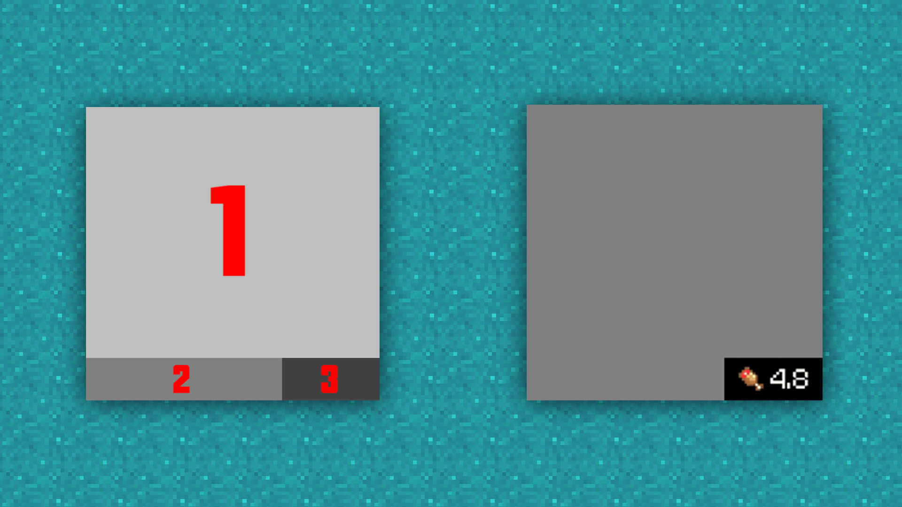
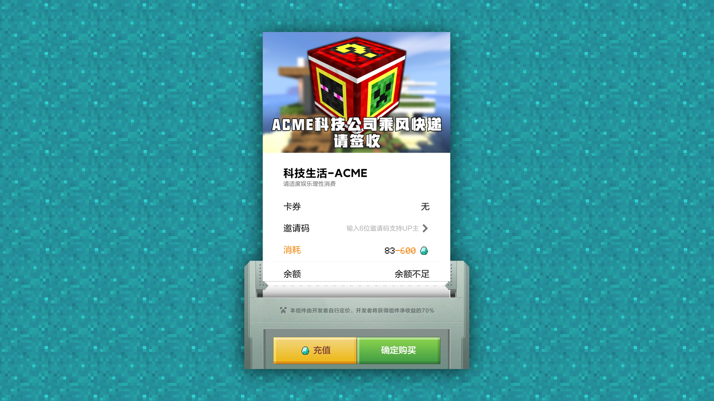
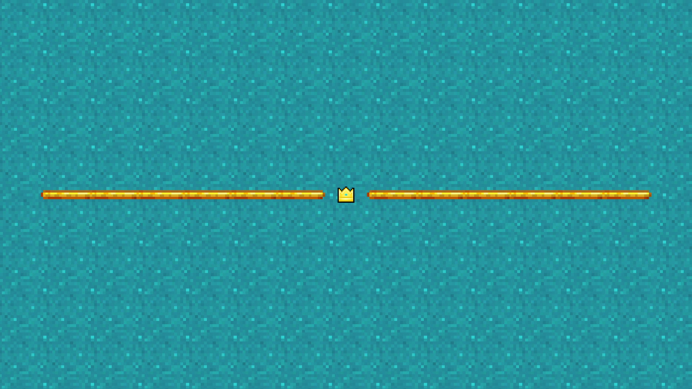

# 组件上架图片的制作建议

#### Tag：上架图 制作

Hello各位好，我是来自ACME团队的 Spcoo（小欧），借在秋冬开发培训营担任指导的机会，为大家整理了一份《上架图片的制作建议》，也算是自己这两年多来的一些小心得。希望能帮助到各位开发者们，创作出更加美观、更有吸引力的宣传图片。”

### 关于MC中的上架&宣传图片（以PE为例）：

#### 要点简述：

大家在上传作品时，会发现上传页面的最下方，会有需要提交图片内容的部分。这部分内容，也就是我们常说的作品上架&宣传图。

以MC中国版PE为例，目前已知需要提交图片的种类及尺寸如下，接下来就与大家详细说明每类图片的具体用处。

### icon图片：

#### 要点简述：

icon图是目前版本的PE启动器中，资源中心区域组件展示给玩家的第一张图，但由于尺寸较小的原因，当下它的主要功能在于给玩家传递一种感知，即看到icon能够大概判断，这是什么风格及类型模组的感知。

对于icon图，我们需要做到的是：不堆叠过多元素的前提下，能在资源中心一众icon展示图中脱颖而出，成功吸引到玩家。

以下为资源中心icon图简单一览：

（图片内容不针对任何组件及相关工作室，只是本人随手截图）

#### 制作建议：

首先icon图片可以被划分为多个区域，这里我建议是划分为3个区域来看：

首先区域1会被评分内容遮挡，所以尽量不要在右下角放置关键元素，也注意组件文字不要被评分遮挡到，哪怕只遮到某个字的一部分，也会影响到整体美观。

因为评分（区域3）的设定，区域2部分是比较突兀的，所以建议的处理方式是在底部拉一个小横条出来，将评分完美融合进整个icon图里。

小横条的位置可以加上团队/工作室名字，也可以写组件名称或玩法类型。

小横条与文字的配色选定后，建议不要随意修改。在以后的icon中都保持一致，它将作为工作室作品的特征标识存在，方便玩家认知。

区域1的作为icon展示的重点，就大家根据自己组件的特点随意发挥了，简洁美观，整体带一些色彩倾向。

### banner图片：

#### 要点简述：

banner图，玩法的核心展示图片。

虽然当前版本的资源中心内没有banner图的展示位，但考虑到banner图常作为参与官方推广或活动的重要评判标准，所以准备一张好看的banner图也是大家必要的工作。

总体而言，会推荐大家制作突出玩法主题、美观、且具有一定视觉冲击效果的banner图。好的图片素材对大家在玩家论坛、社区、新鲜事内发布自己的玩法宣传内容是非常重要的，可以简单的理解为：banner的美观度和表现出的内容质量将决定玩家引流的效果。

（简单排版模式参考，具体排版方式需要大家按照自己的需要调整，但要遵循信息清晰的原则）

#### 一般banner图内需要包含以下元素：

1.模组的展示内容：可以是渲染图也可以是一些玩法元素的展示；

2.玩法组件的名称（+玩法类型的简短描述）；

3.团队/工作室logo；

#### 制作建议：

banner图的类型大概可以分为两种，美术可以根据不同的模组内容，来选择不同的banner展示方式。

#### 核心道具类：

适用于组件内容较简单，主要玩法围绕某个物品或某个生物展开的；

这类banner的展示以简洁为主，主要突出重点的物品道具元素，所以一般构成也很简单，基本可以将核心元素居中排列，选用简洁不花哨的背景，然后在合适的位置放上组件名称，工作室logo等。

#### 系统玩法类：

对于组件内容复杂，有较多生物、物品的情况下，单纯的将模组内容进行堆叠效果是较差的，会显得杂乱没有重点，也缺乏美感。所以一般会采用渲染图的方式来展示，将模组中的内容集中放置在一个场景中，这是非常考验美术功底的操作。

渲染图banner的内容一般是相当满的，所以文字尽量找画面留白的地方放，不要遮挡住画面内的关键元素，可以适当调小文字和logo，以展示画面为主。对于这类banner来说，画面的冲击感是最重要的。

#### 字体/颜色选择：

字体建议尽量使用粗体的字体，一般我们建议大家选择可商用的开源字体。

可以尝试与官方logo接近的字体样式，这样看起来会很舒服，没有违和感。

在不使用立体字体设计的前提上，我们一般建议大家选择渐变色来做平面字体，同时渐变也尽量选择纯色渐变，如能掌握好色彩搭配原理的话，当然也建议大家多多尝试其他色彩跨度大的渐变。

### POS图片：

#### 要点简述：

这是出现在购买页面的图片，一般能看到这个图片的玩家，他就有成为你客户的可能性。

所以POS图里我们需要传递的信息很简单：
1、感谢冒险家的支持，希望冒险家能关注工作室后续作品，或加入工作室讨论组

2、预防冒险家余额不足，告诉他可以去广告主那看广告获取钻石

#### 制作建议：

POS图的内容可以不用与组件内容相关，但需要具有一定的通用性，所以按照上面的要点完成制作，再放上工作室的logo，差不多就可以完成了。

### 轮播图：

#### 要点简述：

轮播图可以被称作组件页内的banner，非常适合在这里适当地堆叠内容，尽量把你觉得组件里最有吸引力的地方，都放在这里展示。

不要在轮播图里放大段的使用说明，寸土寸金的地方就要好好利用起来，把模组里最炫酷的东西放上去，引起特定部分玩家的兴趣，就是轮播图最大的作用。

注：不论你觉得玩法里某个亮点有多么闪耀，也不要三张轮播图都用同一张……

#### 制作建议：

挑选出玩法的核心元素，比如玩法中的某某系统，尽量用图片的形式来表现内容，减少文字的出现。 

挑选出最炫酷的美术材质/模型，直接堆叠展示出来。 为了突出主体，请避免使用复杂花哨的背景。

### 视频封面图：

#### 要点简述：

视频封面图，是详情页里玩家能看到的第一张图片，但是它的重心不在图片中，而是这张图片点开的视频里。视频封面一定程度上算是一个组件的门面，所以它承担的功能和banner有异曲同工之处。

#### 制作建议：

前面说了视频封面图与banner图的需求高度重合，所以这里可以沿用banner图来制作视频封面，但两张图的尺寸比例是不同的， 强行拉伸会发生一定程度的变形。可以采用以下方法来快速制作视频封面图——将banner等比缩放后，留白的位置加上模组展示视频的字样。

### 介绍长图：

#### 要点简述：

介绍长图作为所有上传图里最复杂，最耗时间的图片，也是宣传图中最关键点额要素之一。但长图并不是越长越好，也不是越详细越好。

经过在资源中心这两年的摸爬滚打，简单给大家总结一下，中国版的玩家们对于介绍长图是怎么看的，以及我的一些小小建议：

1.大部分玩家在图与字的选择中，会更倾向于选择看图，在图里写很多小字的效果还不如直接在介绍里打字。但并不是说不在长图里放字，而是要放就放大字，必要的文字对于玩法的引导和图片内容的补充是十分重要的，只是要尽量避免密集的小字在长图前半部分出现；

2.只有很少的玩家会仔细看完整个长图，也就是说长图的主要作用并不是“产品说明书”，它依然充当着“宣传单”的角色；

3.部分玩家下载后遇到问题，会回来重看长图，希望在图中找到解决办法，但这不是长图的第一使命，长图的优先功能是吸引玩家下载，所以关于组件详细说明的部分可以有，但应该放在长图的后半部分；

4.对于系统复杂的模组，非线性的介绍并非是缺点。长图的内容并非一定要按照游戏流程来进行介绍，对于内容庞大的模组，需要前期写好文案，才能在长图中完整地按顺序展示出模组内容，这样看起来长图的结构非常清晰规整，但其实对于玩家的吸引力仍旧有待考量。而选择碎片化地将模组中有趣的部分优先展示给玩家，有助于玩家自己揣摩出玩法流程，虽然内容可能和原内容大相径庭，但此时玩家对玩法已经产生了一定的兴趣，所以这样的做法是有一定好处的。

5.游戏内的引导＞展示视频的引导＞介绍长图的引导。不要期望玩家看完长图就能玩懂模组，如果长图里不想做过多的说明内容，那就将它放到视频里，放到游戏里去。

6.推荐的做法是：介绍长图从上至下，应是图片集中在上半部分，文字集中在下半部分。

#### 要点简述：

目前开发者平台对于长图的尺寸要求有了修改，宽度不能超过1000px，单图大小依然不高于2MB。宽度建议是控制在720px-1000px，低于这个范围的话，长图效果就会比较糊了，小字的话边缘也会模糊，观感不佳。

一般长图格式选择jpg，图片的体积相对于png要小很多，同样体积下可以制作更长的介绍图片，输出时图像品质最好不要低于10，不然图片会有明显的jpg颗粒感，就像一张表情包在论坛里来回发，最后就变得非常糊。如果体积过大，不要降低图像品质，可以选择高品质先输出图像，再二次裁切成多张长图上传。

### 其他注意事项：

#### 低像素图片的缩放：

有许多开发者在制作图片的初期，遇到过像素图放大后糊掉的情况：

解决这个问题只需要在Photoshop中改变图片尺寸时，选择采样类型为“邻近（硬边缘）”即可。

同理，在图像中使用Ctrl+T直接对图片进行拉伸时，也可在顶部选择插值为“邻近”，一般这个方法用的比较多，也更方便一些，但要注意，你的像素图必须为非智能对象。

图层有这个标识时，说明它是智能对象， 直接拉伸会糊，可以先右键直接栅格化图层，再进行拉伸。

#### 像素字的制作：

许多基础字体其实都是带有点阵字体的，不过触发的条件会稍微复杂一点，首先在PS中调出字符窗口，然后选择宋体（不一定是宋体，这里是示例），字号调整至12点，aa抗锯齿选择无。

右键将文字图层栅格化，再按上面的方法放大图层，就能获得像素字了。像素字体一般来说过于细，不太适合用来做醒目的标注，一般就是用来当小字说明，或者用来制作游戏内的UI文字，非常自然没有违和感，也省去了排版和分辨率适配的麻烦。

#### 关于图片素材的获取：

要说制作材质最好的教材是什么，依然是游戏的原版材质包。要获取原版材质包，首先得获取PC开发包（电脑测试端），这个在MCstudio里就能下到当前最新版本的Mod PC开发包。

下载后找到PC开发包的根目录，里面包含了整个游戏本体，也包括了行为包与材质包，不出意外的话，材质包的默认路径如下：

C:/MCStudioDownload/game/MinecraftPE_Netease/PCLauncher/data/resource_packs/vanilla

具体各文件夹里包含的内容如下图所示：

现在无论是设计UI，还是画物品材质等，我都一定会去材质包里寻找类似的素材，从中获取灵感。里面的一些图标、方块材质等，也可以选择邻近（硬边缘）放大后作为图片素材在长图中使用。

例如这个使用小皇冠和烈焰棒制作的分割线，非常具有原版风格的味道；

例如这个仿制原版UI制作的物品展示框等等……

以上为关于组件上架图片的一些制作心得，希望大家看完后，能够多多练习，找到属于自己的风格。