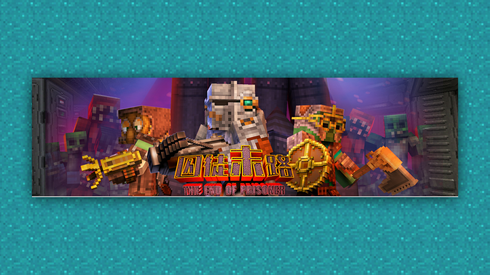
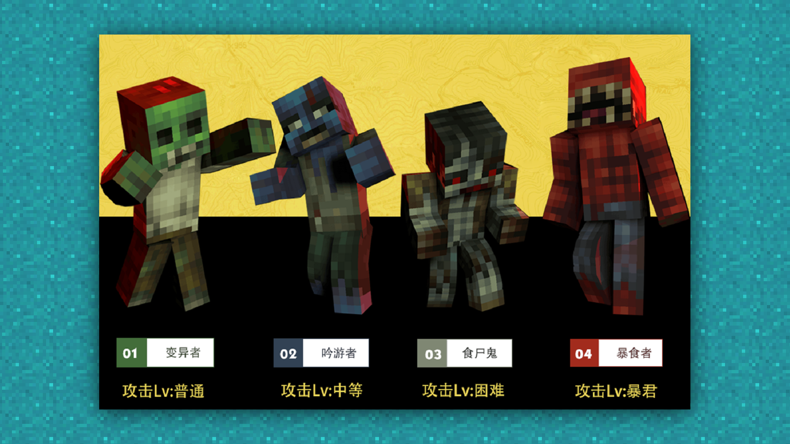
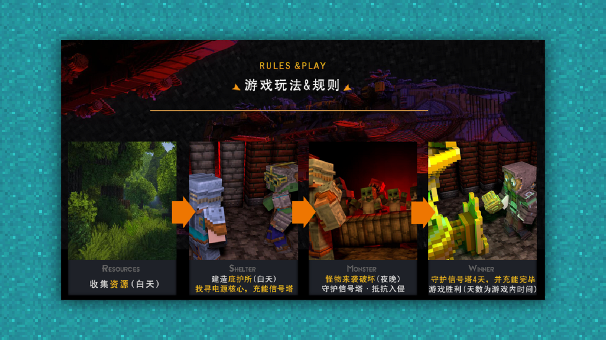

# 宣传视频：构思和制作

#### 作者：上古之石

#### Tag：视频 构思 制作

#### 宣传视频：构思和制作

有了好的宣传图，当然还需要一个简单的宣传视频。但因为视频的制作难度比较大，所以我们一般都会望而却步。然而实际上只要有了合理的构思，就算是手机也可以制作出比较好的宣传视频噢~

首先，我们需要先确定好自身作品的特色。

比如：是否拥有特殊的人设、特殊的地理环境还有特殊的武器装备。确定好特色后，我们就要想想游戏内的场景是否足够拍摄一些小短片？

各类特色的怪物足够我们视频展示。

有趣的玩法也足够进行构思。

如果这些类别我们都有，并且内容也足够，那么恭喜你，视频已经基本可以开始制作了。

如果我们内容不够，并且还缺少很多特色的话，那么就需要在好好审视一下自己的作品，看看有没有可以优化的地方，或者是增加特色的地方，来让自己的视频变得富有吸引力。

 

前期的构思是素材组成的一个部分，好的素材组成，就能让我们事半功倍。