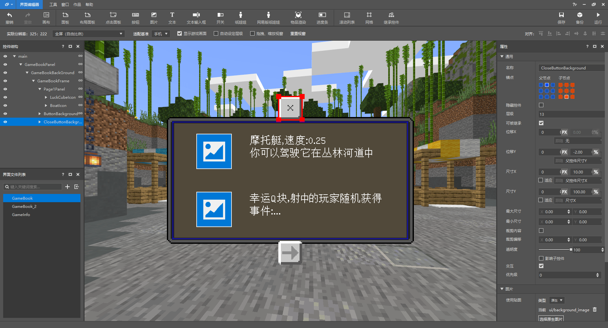

# 为小游戏地图添加引导

我们来制作一个小游戏玩法地图DEMO，并且为这个地图的大厅中添加一些引导。

点击[链接](https://g79.gdl.netease.com/Jungle_Demo.zip)可下载本章地图Demo。

## 在大厅添加NPC

先简单制作一个大厅场景，地图名为《丛林激流》，是一个轻松的“水上竞速”玩法地图；而游戏场景设定是游乐园风格，所以在大厅添加了多个游乐园会出现的小摊，引导NPC将放置于此。


在大厅内添加多个小动物形态的NPC：熊猫、鹦鹉、狼。

> 有游戏背景或世界观的玩法地图，将所有的游戏元素风格统一化也是很重要的；


## 制作UI添加引导手册

引导手册可以有很多方式体现，最简单的方法就是将引导文字写在【书与笔】上并放在游戏比较“显眼”的位置即可。不过这次我们放置了NPC，所以需要制作UI，在玩家与NPC交互的时候，显示UI。


打开我的世界开发工作台的界面编辑器，制作引导手册界面和欢迎界面； 


欢迎界面主要填充一些对于地图的基本介绍和简单引导；当然，实际需要什么内容，还是根据引导设计和开发者习惯来决定。

引导手册则需要多页，将玩法内容罗列在此供玩家翻阅、学习。大部分情况下，小游戏地图不怎么需要引导手册，因为无论是场景还是玩法都是有局限性的，玩家在游玩的过程中必定会发现和体验到，全部的内容被玩家了解后，在真正游玩的时候可能会丧失一定的新鲜感。




**制作好UI后，我们需要将UI与NPC“连接”起来：**

创建UI的脚本文件FlumeRideInfoUI.py，并继承ScreenNode类

```python
# -*- coding: utf-8 -*-
import mod.client.extraClientApi as clientApi
ViewBinder = clientApi.GetViewBinderCls()
ViewRequest = clientApi.GetViewViewRequestCls()
ScreenNode = clientApi.GetScreenNodeCls()

class FlumeRideInfoUI(ScreenNode):
	def __init__(self, namespace, name, param):
		ScreenNode.__init__(self, namespace, name, param)
```

创建FlumeRideServerSystem.py、FlumeRideClientSystem.py

```python
# -*- coding: utf-8 -*-

import mod.server.extraServerApi as serverApi
ServerSystem = serverApi.GetServerSystemCls()

class FlumeRideServerSystem(ServerSystem):
    def __init__(self, namespace, systemName):
        ServerSystem.__init__(self, namespace, systemName)
        # 提前将放在大厅的NPC生物ID获取到并保存在这里，用于判断玩家交互的NPC
        self.npcIdList = {"panda": "-85899345885", "panda2": "-158913789845", "parrot": "-158913789915", "wolf": "-158913789911"}
		
        nameSpace, systemName = serverApi.GetEngineNamespace(), serverApi.GetEngineSystemName()
        # 监听PlayerAttackEntityEvent事件
        self.ListenForEvent(nameSpace, systemName, "PlayerAttackEntityEvent", self, self.PlayerAttackEntityEvent)
        
	# 玩家攻击生物时触发
    def PlayerAttackEntityEvent(self, args):
        
        # 由事件获取到的玩家攻击的生物ID
        playerId = args['playerId']
        entityId = args['victimId']
		
        # 判断不同的NPC生物
        if entityId == self.npcIdList["panda"]:
            # 发送事件到客户端，打开UI，传输字典参数UIType用来判断玩家交互的生物以打开不同UI
             self.NotifyToClient(playerId, "OpenGameInfoUI", {"UIType": "panda"})

        elif entityId == self.npcIdList["panda2"]:
            pass

        elif entityId == self.npcIdList["parrot"]:
            pass

        elif entityId == self.npcIdList["wolf"]:
            self.NotifyToClient(playerId, "OpenGameInfoUI", {"UIType": "wolf"})

```

在服务端脚本添加玩家攻击生物的事件并判断，如果是大厅的NPC，就传输事件到客户端创建UI。

```python
# -*- coding: utf-8 -*-

import mod.client.extraClientApi as clientApi
ClientSystem = clientApi.GetClientSystemCls()

class FlumeRideClientSystem(ClientSystem):
    def __init__(self, namespace, systemName):
        ClientSystem.__init__(self, namespace, systemName)
        print "Client初始化"
        nameSpace, systemName = clientApi.GetEngineNamespace(), clientApi.GetEngineSystemName()
        # 监听UiInitFinished事件
        self.ListenForEvent(nameSpace, systemName, "UiInitFinished", self, self.UiInitFinished)
        # 监听由FlumeRideServerSystem传过来的OpenGameInfoUI事件
        self.ListenForEvent("FlumeRide", "FlumeRideServerSystem", "OpenGameInfoUI", self, self.OpenUI)

	# 由FlumeRideServerSystem传过来的OpenGameInfoUI事件
    # 当玩家与NPC交互时，判断交互的NPC类型并打开对应的UI
    def OpenUI(self, args):
        UIType = args['UIType']
        if UIType == "panda":
            clientApi.PushScreen("FlumeRide", "FlumeRideGameInfo")
        elif UIType == "wolf":
            clientApi.PushScreen("FlumeRide", "FlumeRideGameBook_1")
	
    # UI初始化完成，将UI注册
    def UiInitFinished(self, args):
        clientApi.RegisterUI("FlumeRide", "FlumeRideGameInfo", "Script_FlumeRide.uiScript.FlumeRideInfoUI.FlumeRideInfoUI", "GameInfo.main")
        clientApi.RegisterUI("FlumeRide", "FlumeRideGameBook_1", "Script_FlumeRide.uiScript.FlumeRideInfoUI.FlumeRideInfoUI", "GameBook.main")
        clientApi.RegisterUI("FlumeRide", "FlumeRideGameBook_2", "Script_FlumeRide.uiScript.FlumeRideInfoUI.FlumeRideInfoUI", "GameBook_2.main")

```

现在，我们攻击大厅的生物，就可以打开UI界面了。


简单修改UI文件，将关闭按钮和引导手册的翻页按钮与FlumeRideInfoUI.py脚本文件中的某个函数绑定。

```json
// ...
// UI文件
// 关闭按钮控件
"GameInfoButton@common.button" : {
	// ···
    // 绑定按钮按下时触发的函数 %ScreenNode脚本.函数名
    "$pressed_button_name" : "%FlumeRideInfoUI.ClickedCloseButton",
    // 需要删除
    "button_mappings" : [],
	// ...
},
// 翻页按钮同理
```

```python
# -*- coding: utf-8 -*-
# ...
class FlumeRideInfoUI(ScreenNode):
	def __init__(self, namespace, name, param):
		ScreenNode.__init__(self, namespace, name, param)

    # 绑定关闭按钮
	@ViewBinder.binding(ViewBinder.BF_ButtonClickUp)
	def ClickedCloseButton(self, args):
		clientApi.PopScreen()

    # 绑定翻页按钮
	@ViewBinder.binding(ViewBinder.BF_ButtonClickUp)
	def ClickedPageTurnButton(self, args):
		GameBook1UI = clientApi.GetUI("FlumeRide", "FlumeRideGameBook_1")
		GameBook2UI = clientApi.GetUI("FlumeRide", "FlumeRideGameBook_2")
		if GameBook1UI:
			clientApi.PopScreen()
			clientApi.PushScreen("FlumeRide", "FlumeRideGameBook_2")
		elif GameBook2UI:
			clientApi.PopScreen()
			clientApi.PushScreen("FlumeRide", "FlumeRideGameBook_1")

```


## 添加NPC对话

接下来为另一位NPC添加对话，简单描述一下地图背景和引导即可。

```python
# -*- coding: utf-8 -*-

import mod.server.extraServerApi as serverApi
ServerSystem = serverApi.GetServerSystemCls()
commandComp = serverApi.GetEngineCompFactory().CreateCommand(serverApi.GetLevelId())

class FlumeRideServerSystem(ServerSystem):
    def __init__(self, namespace, systemName):
        ServerSystem.__init__(self, namespace, systemName)
        # ...
        # 监听PlayerAttackEntityEvent事件
        self.ListenForEvent(nameSpace, systemName, "PlayerAttackEntityEvent", self, self.PlayerAttackEntityEvent)
        # 监听ClientLoadAddonsFinishServerEvent事件
        self.ListenForEvent(nameSpace, systemName, "ClientLoadAddonsFinishServerEvent", self, self.DataInit)
	
    # 玩家客户端加载完毕时触发，创建玩家数据
    def DataInit(self, args):
        # 由事件获取的玩家ID
        playerId = args['playerId']
        # 获取玩家的数据
        playerDataComp = serverApi.GetEngineCompFactory().CreateExtraData(playerId)
        pandaMsgData = playerDataComp.GetExtraData("pandaMsg")
        # 如果这个玩家没有数据，就设置一个
        if not pandaMsgData:
            playerDataComp.SetExtraData("pandaMsg", 0) # 用来判断玩家的对话阶段

    # 玩家攻击生物时触发
    def PlayerAttackEntityEvent(self, args):
        
        def Panda2Guide():
            # 获取玩家的名称
            playerNameComp = serverApi.GetEngineCompFactory().CreateName(playerId)
            playerName = playerNameComp.GetName()
            # 获取玩家的pandaMsg数据
            playerDataComp = serverApi.GetEngineCompFactory().CreateExtraData(playerId)
            pandaMsg = playerDataComp.GetExtraData("pandaMsg")
            commandComp.SetCommand("playsound random.orb " + playerName + " ~ ~ ~ 3 1 1")
            # 根据玩家当前的对话阶段，触发不同的对话分支
            if pandaMsg == 0:
                # 使用指令接口生成对话
                commandComp.SetCommand('tellraw ' + playerName + ' {"rawtext":[{"text":"熊猫 §a§l| §r§f《丛林激流》欢迎你！ §a(1/6)"}]}')
            elif pandaMsg == 1:
                commandComp.SetCommand('tellraw ' + playerName + ' {"rawtext":[{"text":"熊猫 §a§l| §r§f丛林的小动物们和人类一起建造了这里！ §a(2/6)"}]}')
            elif pandaMsg == 2:
                commandComp.SetCommand('tellraw ' + playerName + ' {"rawtext":[{"text":"熊猫 §a§l| §r§f今天是激流游乐园开业的第一天； §a(3/6)"}]}')
            elif pandaMsg == 3:
                commandComp.SetCommand('tellraw ' + playerName + ' {"rawtext":[{"text":"熊猫 §a§l| §r§f鹦鹉小姐会教你如何在水赛道上更加灵活 §a(4/6)"}]}')
            elif pandaMsg == 4:
                commandComp.SetCommand('tellraw ' + playerName + ' {"rawtext":[{"text":"熊猫 §a§l| §r§f关于丛林激流的一切还可以问问狼先生,他什么都知道 §a(5/6)"}]}')
            elif pandaMsg == 5:
                commandComp.SetCommand('tellraw ' + playerName + ' {"rawtext":[{"text":"熊猫 §a§l| §r§f当然,不要忘了叫上小伙伴一起享受这快乐的游戏时光！ §a(6/6)"}]}')
                # 到最后一条对话就重置数据并且return
                playerDataComp.SetExtraData("pandaMsg", 0)
                return
            # 更新当前数据+1
            pandaMsg += 1
            playerDataComp.SetExtraData("pandaMsg", pandaMsg)

        playerId = args['playerId']
        entityId = args['victimId']

        if entityId == self.npcIdList["panda"]:
            # ...
        elif entityId == self.npcIdList["panda2"]:
            Panda2Guide()
        elif entityId == self.npcIdList["parrot"]:
            # ...
        elif entityId == self.npcIdList["wolf"]:
            # ...

```


使用【指令】实现这种对话效果，表现力较为薄弱，如果用UI代替会更好；但是实现起来会非常简单，如果对UI不熟练，可以使用这种方法。

## 控制镜头介绍内容

还剩最后一位NPC：鹦鹉；它将带领玩家观赏和讲解游戏中的场景和内容。


```python
# -*- coding: utf-8 -*-

import mod.server.extraServerApi as serverApi
ServerSystem = serverApi.GetServerSystemCls()
timerComp = serverApi.GetEngineCompFactory().CreateGame(serverApi.GetLevelId())
commandComp = serverApi.GetEngineCompFactory().CreateCommand(serverApi.GetLevelId())

class FlumeRideServerSystem(ServerSystem):
    def __init__(self, namespace, systemName):
        ServerSystem.__init__(self, namespace, systemName)
        # ...
        
    def DataInit(self, args):
        # ...
        if not pandaMsgData:
            playerDataComp.SetExtraData("pandaMsg", 0)
            # 添加新的数据用于判断鹦鹉讲解的阶段
            playerDataComp.SetExtraData("parrotMsg", 0)

	def PlayerAttackEntityEvent(self, args):
        
        def ParrotGuide():
            # 获取玩家的名称
            playerNameComp = serverApi.GetEngineCompFactory().CreateName(playerId)
            playerName = playerNameComp.GetName()  
            # 获取玩家的parrotMsg数据
            playerDataComp = serverApi.GetEngineCompFactory().CreateExtraData(playerId)
            parrotMsg = playerDataComp.GetExtraData("parrotMsg")
            # 根据玩家当前的讲解阶段，触发不同的讲解分支
            if parrotMsg == 0:
                # 传送玩家
                commandComp.SetCommand("tp " + playerName + " 29.5 80 -242.5 -20.4 31.4")
                # 发送事件到客户端用于锁定玩家的控制
                self.NotifyToClient(playerId, "PlayerCamera", {"Camera": "Lock"})
                # 使用指令接口生成对话
                commandComp.SetCommand('tellraw ' + playerName + ' {"rawtext":[{"text":"鹦鹉 §e§l| §r§f这是摩托艇,你需要驾驶它驰骋在丛林河道上 §a(1/3)"}]}')
            elif parrotMsg == 1:
                commandComp.SetCommand("tp " + playerName + " 23.6 79 -252.5 54.1 16.4")
                commandComp.SetCommand('tellraw ' + playerName + ' {"rawtext":[{"text":"鹦鹉 §e§l| §r§f在丛林中,你会看到幸运Q块,用弩射击它将会发生随机的事件 §a(2/3)"}]}')
            elif parrotMsg == 2:
                commandComp.SetCommand("tp " + playerName + " 33.4 112 -136.4 -162.6 -7.8")
                commandComp.SetCommand('tellraw ' + playerName + ' {"rawtext":[{"text":"鹦鹉 §e§l| §r§f熟练操控摩托艇,精准射击幸运Q块,在丛林中激流吧！ §a(3/3)"}]}')
            elif parrotMsg == 3:
                commandComp.SetCommand("tp " + playerName + " 22 68 -254 -114.8 0.9")
                # 讲解结束后，解锁玩家的控制
                self.NotifyToClient(playerId, "PlayerCamera", {"Camera": "UnLock"})
                # 重置阶段数据并return
                playerDataComp.SetExtraData("parrotMsg", 0)
                return
            commandComp.SetCommand("playsound random.orb " + playerName + " ~ ~ ~ 3 1 1")
            # 更新当前数据+1
            parrotMsg += 1
            playerDataComp.SetExtraData("parrotMsg", parrotMsg)
            
        playerId = args['playerId']
        entityId = args['victimId']

        if entityId == self.npcIdList["panda"]:
            # ...
        elif entityId == self.npcIdList["panda2"]:
            # ...
        elif entityId == self.npcIdList["parrot"]:
            # 触发四次ParrotGuide，利用定时器接口，实现延迟触发
            ParrotGuide()
            timerComp.AddTimer(10, ParrotGuide)
            timerComp.AddTimer(20, ParrotGuide)
            timerComp.AddTimer(30, ParrotGuide)
        elif entityId == self.npcIdList["wolf"]:
            # ...
```

```python
# -*- coding: utf-8 -*-

import mod.client.extraClientApi as clientApi
ClientSystem = clientApi.GetClientSystemCls()

class FlumeRideClientSystem(ClientSystem):
    def __init__(self, namespace, systemName):
        ClientSystem.__init__(self, namespace, systemName)
        # 监听由FlumeRideServerSystem传过来的PlayerCamera事件
        self.ListenForEvent("FlumeRide", "FlumeRideServerSystem", "PlayerCamera", self, self.PlayerCamera)

    # 用于锁定和解锁玩家控制
    def PlayerCamera(self, args):
        # 获取玩家控制接口
        controlComp = clientApi.GetEngineCompFactory().CreateOperation(clientApi.GetLevelId())
        if args["Camera"] == "Lock":
            controlComp.SetCanAll(False)
        elif args["Camera"] == "UnLock":
            controlComp.SetCanAll(True)
```

这种形式非常直观、生动；镜头可以是静态的，也可以制作成动态；镜头内的方块、生物等内容也可以通过动画加强表现力。非常适合用来设计引导！

## 其它

在一些可交互或者有玩法内容的实体、方块上添加标识，会更加直观：


