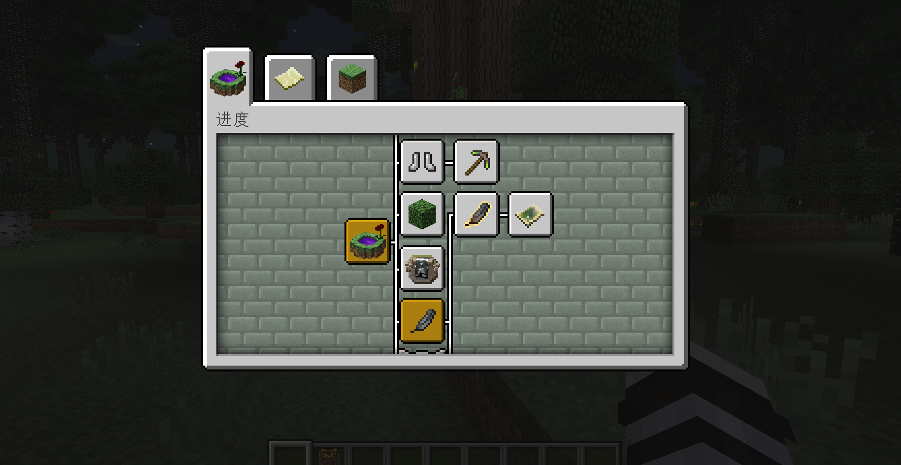
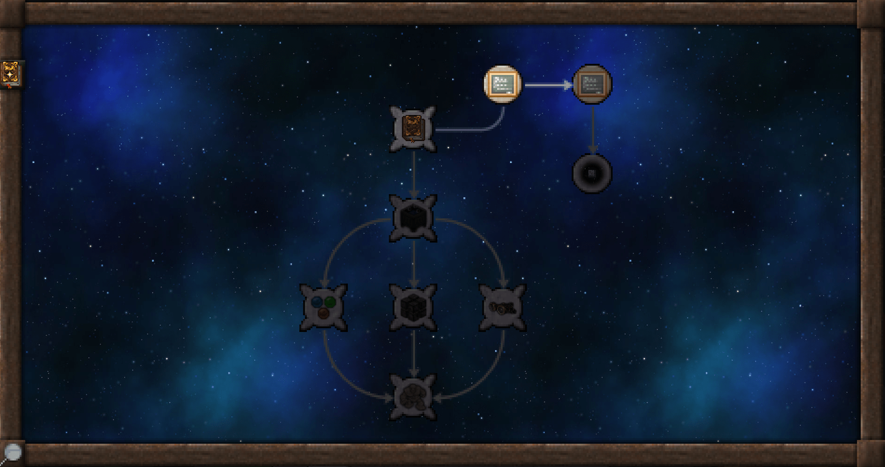
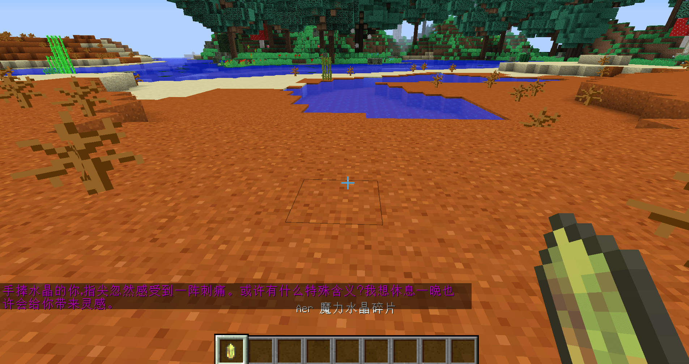

# 大型玩法的引导核心

分别介绍完了小型和中型的玩法标准及其可能的引导方式；大型玩法因为内容较多，需要注意的引导设计也较复杂。

## 大型玩法标准：

- 带有较为较为清晰的世界观
- 玩法不断扩展、堆叠，形成多条以上的玩法循环
- 游戏流程存在交叉、跳转
- 可以根据玩家的要求自由灵活地调整玩法达成的目的
- 大量运用自创的游戏体系

“暮色森林”是一个老牌的大型玩法模组，以独特、清晰的世界观一直被我的世界玩家们称赞和反复体验。所以，一个大型玩法是否带有较为清晰的世界观还是比较重要的。

玩法循环、玩法流程在前面的小型和中型玩法中已经详细介绍过，这里不多赘述；

创新的游戏体系也是非常重要的评判标准，玩法过于平淡或“低创”，也很难被归并到大型玩法中。

**神秘时代模组中的特殊收集方式*

## 大型玩法的引导

大型玩法需要解释的设定非常多，有一定的内容深度。全部直白地交给玩家吸收不一定能达到最好的效果，所以核心玩法应被作为优先引导的部分。在体验后续的玩法中，更多依赖设计上的反馈，引导不一定总会在线。

“暮色森林”中，较为直观的引导就是【进度】的成就系统，将每个游戏的关键节点归列成一个个的成就。

“神秘时代”模组在前期，任务手册中只会有一些针对核心玩法的任务，随着玩家熟悉核心玩法后，后面的多个阶段利用游戏设计让玩家记住机制。

**神秘时代模组中获得特定物品时出现的引导提示*

------

在游戏内容越多的情况下，游戏引导过多容易适得其反；提供必要的核心玩法引导以外，学习适应游戏和改变规则的方法应在实际游戏中潜移默化地影响玩家，这是引导设计相对理想的状态。

如何设计好新手引导，需要开发者不断地研究、尝试。

