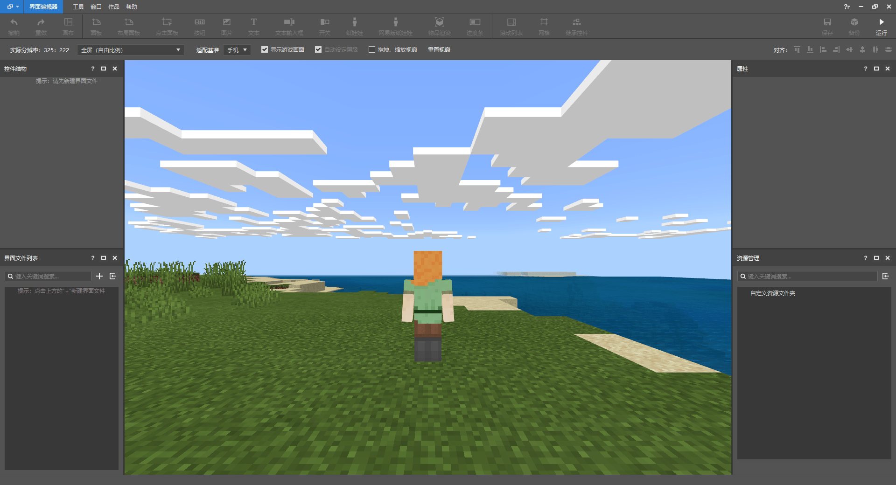
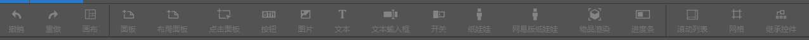
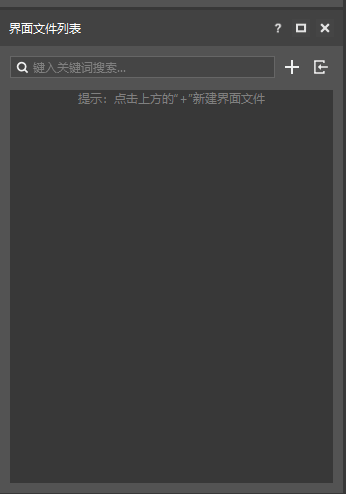
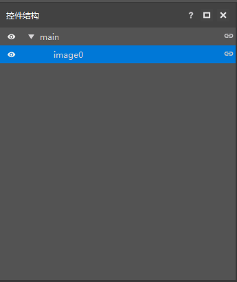
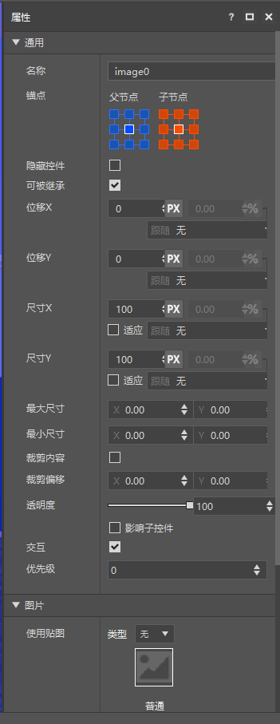
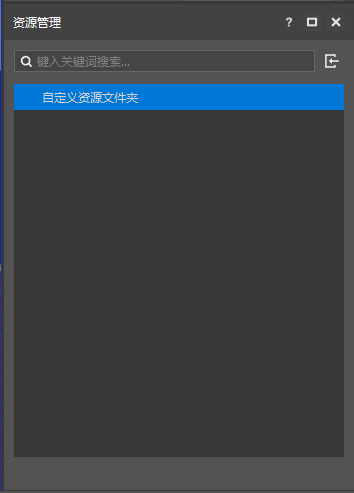

# 制作UI需要准备的内容

## 准备工具

### 我的世界开发工作台（MC Studio）

**【官方下载地址为：[https://mc.163.com/dev/](https://mc.163.com/dev/)】**

这是一款可以帮助我们可视化编辑游戏界面的辅助软件，它能实时导入我们绘制的素材在软件内编辑，把很多以前只能在代码或者其他软件里面调整的界面直接显示在游戏界面内，方便创作者更加直观的看到自己绘制的界面效果。

        

- **我的世界开发工作台（MC Studio）界面编辑器的主界面。**

#### 工具栏

        

综合了各种界面控件类型的工具，我们只需要根据自己需要的功能，点击上面的图标就会自动添加一个相应的功能按钮到界面中。

#### 界面文件列表

想要在界面编辑器内操作，必须要有一个界面文件，可以是新创建，也可以导入json格式的界面文件进来编辑。

### **控件结构**

这个功能主要是为了让我们创建出来的东西更加直观，也方便查找和修改。控件的结构排列会影响游戏内的使用，需要创作者认真排列。

### **界面属性**

详细调整每个界面的属性，创作者既可以选择直接用鼠标直接拖动对应控件进行位置调整，也可以选中控件后在右边的属性栏进行详细数值的调整。

### **界面属性**

主要用于存储玩家自己创建的界面图片，方便玩家更快的选择到需要的图片进行修改和使用。

## 图片编辑软件

这里主要推荐电脑上两款比较常用的软件，其他图片处理软件，只要是自己习惯用的，即使在手机也可以使用类似的软件达到想要的效果。

### PhotoShop 

目前主流的图片处理软件， 不止是绘制像素图案，更多的是图片的处理相对其他软件来说更加的方便。

### Aseprite

专门用于绘制像素贴图的一款软件，主打就是像素图片的绘制，相对PS更加容易上手，且更适合图形的绘制。