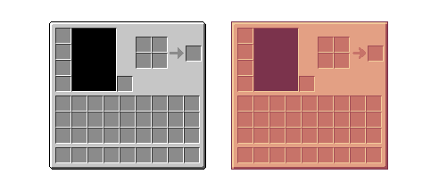
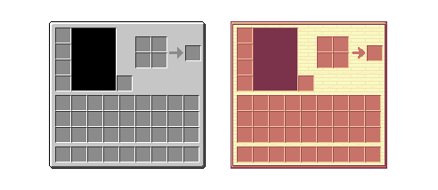
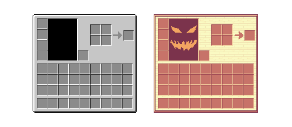
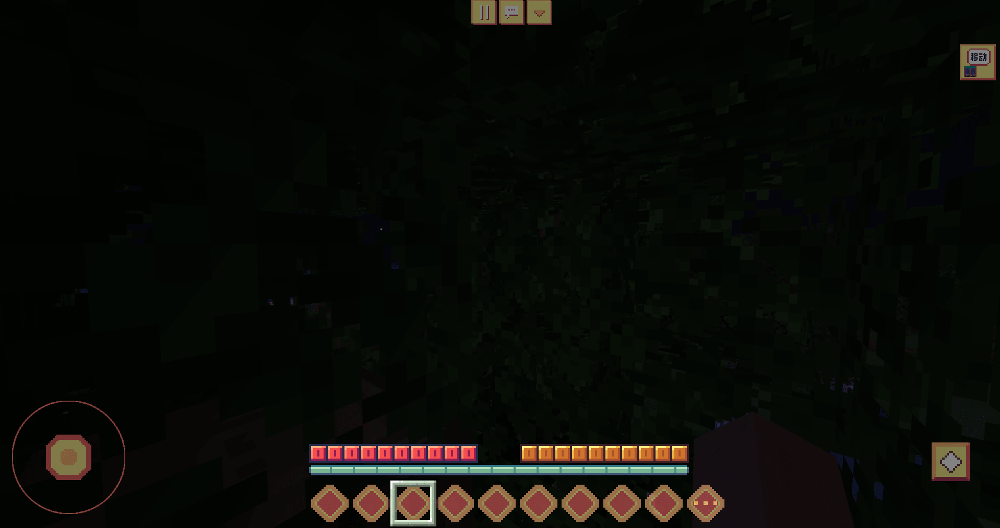

# UI设计跟主题元素的结合

## 卡通休闲风格

在第七章的时候讨论过，卡通休闲风格要怎么去表现，卡通风格其实就是饱和度提高，然后纹理尽量简约，不要有过多的复杂纹路。

### UI设计风格

我们这里拿原版的背包栏做一个例子

我们并没有对这个UI进行修改，仅仅只是换了一个颜色，而右边改成暖色饱和度相对灰色来说较高的一种橙红色，给人的感觉就会比原版的物品栏框更加的卡通。

如果想要更加进一步的区别原版的UI，可以做更大的一些调整，比如修改一下边框，在空白处添加一些木头纹理

当然，如果想要强调个人风格，你甚至可以在放人物纸娃娃的区域，画上一些主观性很强的像素画来添加一些气氛

以上只是原版的材质绘制的一些小技巧，在自定义UI里面我们设计时可以更加的大胆，做一些看起来不是那么方方正正的东西在上面

上面是根据材质的风格制作的一款偏卡通简约风格的材质包，通过绘制一些简单的图案修改了整个材质的质感