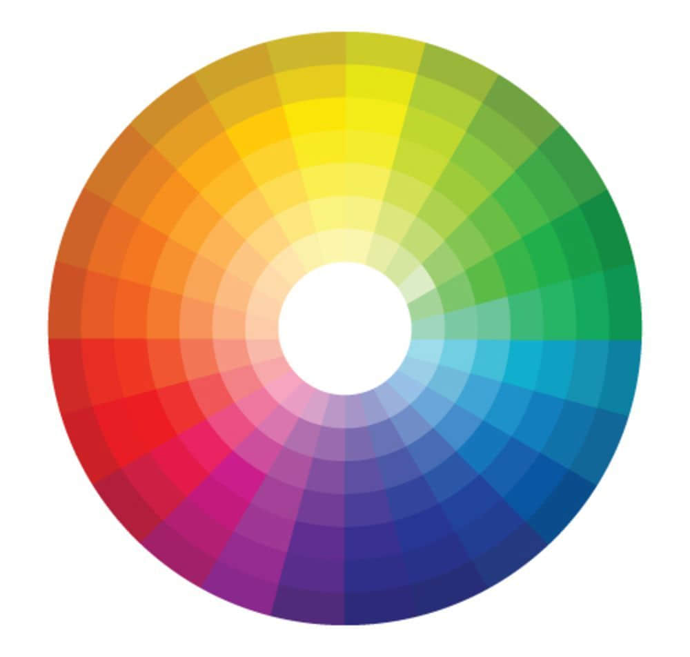
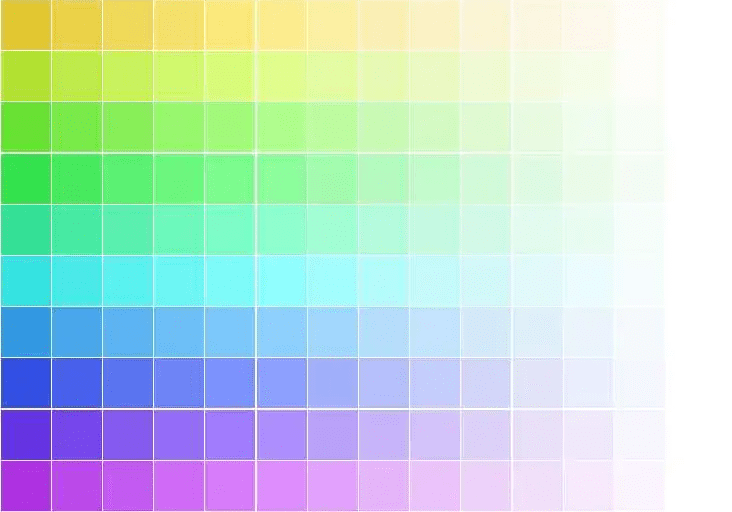
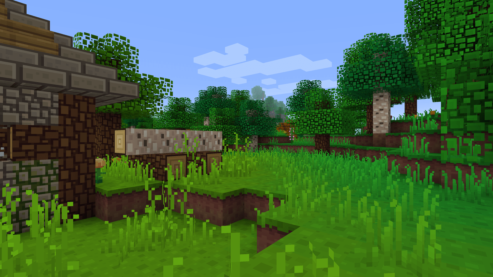
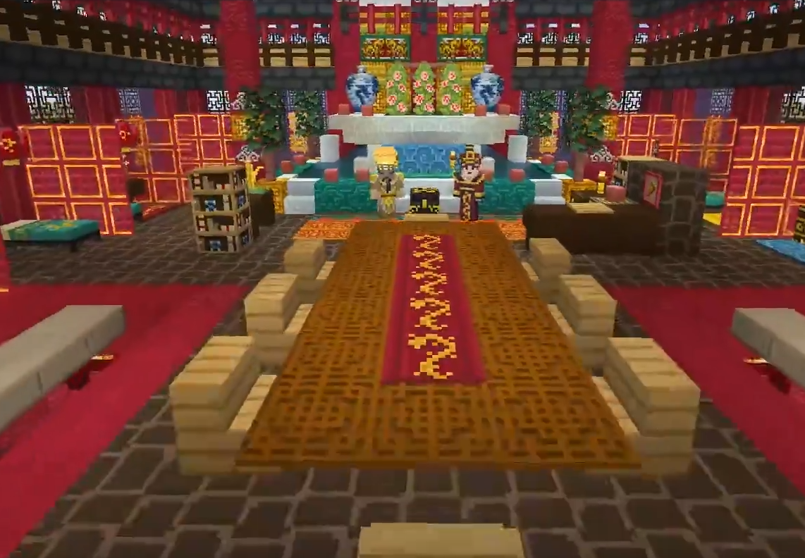
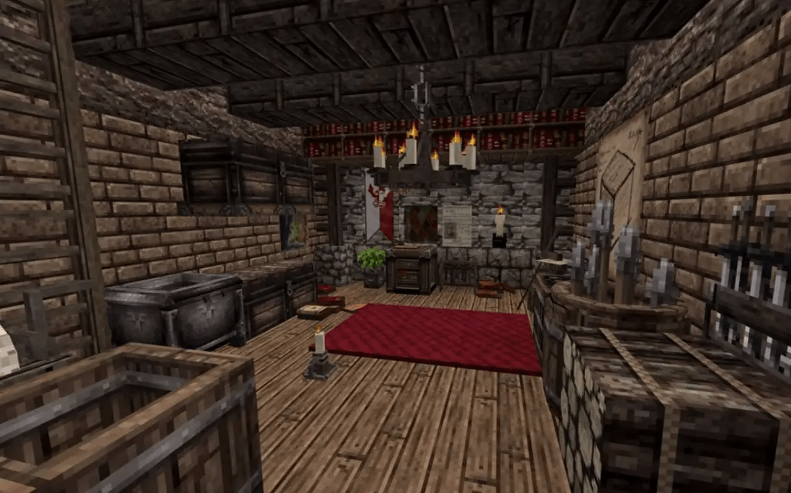

# 美术概念介绍

## 美术概念

这章会大概介绍一下绘制像素时会碰到的一些内容，此章较为偏美术方面的，对于如何绘制一个原创的精美UI是非常重要的。

### 色相

色相简单概况就是我们平常说的颜色，用户看到的颜色是什么样的取决于颜色的色相，除了黑白灰以外的颜色都是具有色相属性的。

而要讲色相主要是想和大家拓展一下冷色和暖色概念，比如色相中蓝色、紫色之类的我们一般称之为冷色，这类颜色用户看到会感觉到比较凉爽。而相对的黄色、红色这类颜色我们称之为暖色，这类颜色用户看到会觉得比较温暖。

我们需要注意绘制UI时，尽量保证不要冷暖色混搭，而是保持一个整体的颜色风格，这样可以让你的画面看起来更加的整体。

### 饱和度

饱和度也就是常说的颜色的鲜艳程度，饱和度越高颜色看起来就越鲜艳，饱和度为零颜色就是黑白灰三种颜色。

饱和度越高的作品也就越鲜艳，也越容易被人被注意到。

但是初学时期在绘制UI时饱和度建议尽量取较低饱和度的颜色，这样就算颜色使用的比较杂，绘制技巧和颜色的使用也没掌握很好，最少在饱和度不高的情况下画面看起来不会过于杂乱。

### 颜色明度

明度这个也很好理解，就是亮度，一个颜色的明度越高这个颜色看起来就越亮，一个颜色明度越低看起来就越暗，任何颜色亮度最高时都是白色，亮度最低时都是黑色。

绘制UI时也要把握明度之间的对比，根据风格决定明度之间的对比，像素因为需要有一定的衔接性，所以明度对比不会过大，但是之间的明度对比也是肉眼可见有变化的，而不是几乎不可见的明度变化。

### 纹理复杂度

我们通常称之为分辨率，一个面分辨率越高，那么这个面可以绘制的内容就x越复杂，原版是一个面16x16个像素，一些绘制比较写实的材质可以达到64x64像素，甚至一些让玩家完全看不出来像素感的纹理可以达到1024x1024分辨率。

材质的纹理复杂程度主要是由两个元素影响的，一是颜色数量，颜色越多纹理看起来就越发的复杂。还有就是绘制的结构，只需要数种不同的颜色，通过一些绘制的技巧就能绘制出来非常复杂的材质纹理。

根据自己的材质风格来确定复杂程度，越写实的材质就越复杂，越卡通的复杂度就尽量的简化。

Jakob.z的方块概念材质材质，材质饱和度较高，但是纹理复杂度较低，看着就非常卡通风。

Yuushya绘制的16x材质包，相对复杂程度就高很多。

## 常见风格

### 卡通风格

通常会是饱和度较高，明度也较高，纹理的复杂程度较低，这样组合起来给人看起来就会非常的卡通。

### 古风风格

我们说的古风通常指中国风风格的材质，中国风材质可选的范围非常大，你可以选择饱和度高纹理复杂的纹样。也可以选择饱和度低纹理复杂度较低的水墨风格。

古风风格主要取决于你的绘制形式，以及元素的展示。

### 科技风格

科技风格主要是偏冷色，一般是高对比度，材质的纹理也较为复杂，科技主要是黑色、蓝色。冷色可以给人一种冰冷的感觉，同时大量的黑色作为底色，加上一些蓝色作为点缀，就会给人一种非常科技的感觉。

### 中世纪风格

中世纪风格一般情况下都是以欧洲为背景，中世纪材质我们想要表现就需要较为复杂的纹理，通过绘制较为复杂的结构让玩家感觉到真实感。同时这个风格我们会尽力降低饱和度，较低的饱和度会让玩家更有真实感。

