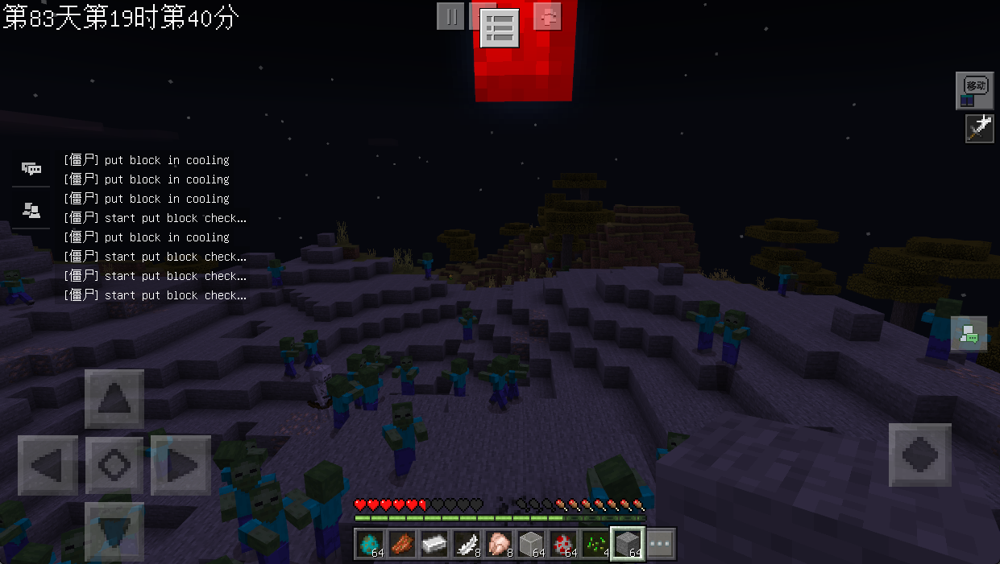
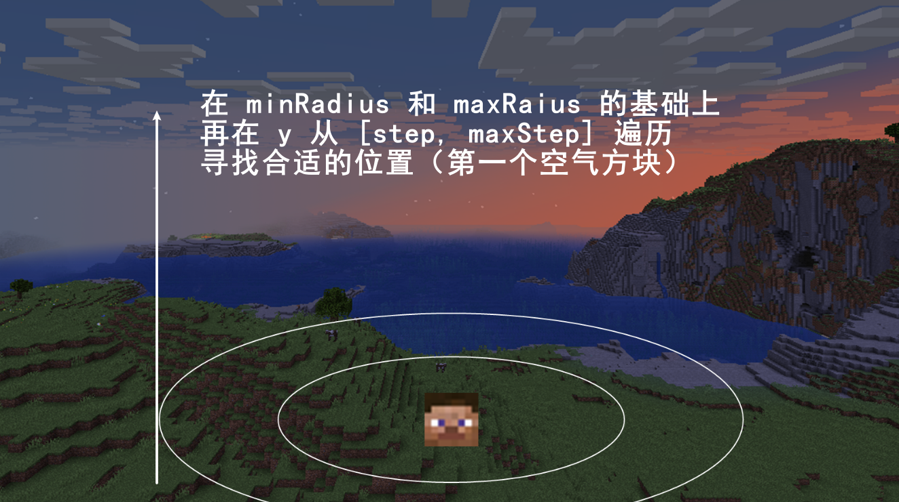

# 怪物生成

> 温馨提示：开始阅读这篇指南之前，我们希望你对《我的世界》基岩版附加包有一定了解，有能力撰写 JSON 数据格式，对 Python 进行模组开发有了解，并能够独立阅读《我的世界》开发者官网-开发指南或其他技术引用文档。

本文将带你了解生物生成的规则。

在本教程中，您将学习以下内容。

- ✅实体生成规则；
- ✅如何使用代码生成自定义实体；

## 实体生成规则

在原版行为包下的 `spawn_rules` 目录下，定义了许多实体的生成规则，也就是如何生成实体在世界中。当你希望自定义实体自然生成时，你就需要使用生成规则。不同的组件允许可以定义实体不同的生成时间、位置和方式。

一般来说，我们都会选择与原版实体非常相似的方式来生成。比如，像牛一样生成在牛群中、像僵尸一样出生在晚上，或者像鱼一样只出生在水里。

### 基础结构

当你要使用原版的生成规则时，首先，需要在行为包的 `spawn_rules` 目录下新建一个 `identifier.json` （这里的 `identifier` 代指生物标识符）的新文件。该文件的内容应该如下所示：

```json
{
    "format_version": "1.8.0",
    "minecraft:spawn_rules": {
        "description": {
            "identifier": "tutiroal:identifier",
            "population_control": "animal"
        },
        "conditions": []
    }
}
```

在 `minecraft:spawn_rules` 内部，我们需要考虑两件事：**人口控制**和**条件**。

`description` description 定义文件的基本属性。 `identifier` identifier 应该匹配我们实体的标识符。 `population_control` population_control 定义游戏如何知道要生成多少生物，并且稍微复杂一些。

### 人口控制

我的世界有不同的实体池。当此处定义的池被认为已满时，游戏将不再生成该池中的生物。 共有以下几种不同的选择（一般我们使用前面三种即可）：

- **"animal"**：被动生物，如牛和猪
- **"water_animal"**：热带鱼、海豚等水生生物
- **"monster"**：敌对生物，如骷髅和僵尸
- **"villager"**：村民专属。
- **"ambient"**：蝙蝠专属。
- **"cat"**：猫专属。
- **"pillager"**：掠夺者专属。

### 条件

`conditions` 是一系列允许生物在世界中生成的可能条件。 每个条件分别尝试在世界中生成生物。 每个条件都由一组组件组成，这些组件定义何时生产或不生成生物。

比如，我们可以查看**原版僵尸**的生成条件：

```json
{
    "format_version": "1.8.0",
    "minecraft:spawn_rules": {
        "description": {
            "identifier": "minecraft:zombie",
            "population_control": "monster"
        },
        "conditions": [
            {
                "minecraft:spawns_on_surface": {},
                "minecraft:spawns_underground": {},
                "minecraft:brightness_filter": {
                    "min": 0,
                    "max": 7,
                    "adjust_for_weather": true
                },
                "minecraft:difficulty_filter": {
                    "min": "easy",
                    "max": "hard"
                },
                "minecraft:weight": {
                    "default": 100
                },
                "minecraft:herd": {
                    "min_size": 2,
                    "max_size": 4
                },
                "minecraft:permute_type": [
                    {
                        "weight": 95
                    },
                    {
                        "weight": 5,
                        "entity_type": "minecraft:zombie_villager"
                    }
                ],
                "minecraft:biome_filter": {
                    "test": "has_biome_tag", "operator": "==", "value": "monster"
                }
            }
        ]
    }
}
```

| 组件名称                          | 描述                                                         |
| :-------------------------------- | :----------------------------------------------------------- |
| `minecraft:spawns_on_surface`     | 生物在地表生成                                               |
| `minecraft:spawns_on_underground` | 生物在地底生成                                               |
| `minecraft:brightness_filter`     | 仅以特定亮度生成实体。 接受三个选项，`min`、`max` 和 `adjust_for_weather`。 亮度级别范围从 0 到 15。 如果 `adjust_for_weather` 设置为 `true`，则将考虑由于下雨和雷暴导致的亮度降低。 |
| `minecraft:difficulty_filter`     | 难度选择器，`min`、`max` 定义了最低和最高难度。实体仅会在定义的难度内生成。 |
| `minecraft:weight`                | 实体生成时的权重。 数字越大，生物生成的频率越高。            |
| `minecraft:herd`                  | 设置在同一生成规则上一起生成的实体数。也可以理解为群体生成。 |
| `minecraft:permute_type`          | 给生成的实体一定概率变异为其他实体。                         |
| `minecraft:biome_filter`          | 群系选择器。仅会在通过条件的群系生成。                       |

### 所有已知组件

下列是所有已知的用于控制实体生成的条件组件：

```text
minecraft:weight
minecraft:density_limit
minecraft:spawns_on_block_filter
minecraft:spawns_on_block_prevented_filter
minecraft:spawns_above_block_filter
minecraft:herd
minecraft:permute_type
minecraft:brightness_filter
minecraft:height_filter
minecraft:spawns_on_surface
minecraft:spawns_underground
minecraft:spawns_underwater
minecraft:disallow_spawns_in_bubble
minecraft:spawns_lava
minecraft:biome_filter
minecraft:difficulty_filter
minecraft:distance_filter
minecraft:is_experimental
minecraft:world_age_filter
minecraft:delay_filter
minecraft:mob_event_filter
minecraft:is_persistent
minecraft:player_in_village_filter
```

我们仅需要对上述组件有一个大概印象就可以，除了一些比较特殊的 `minecraft:is_persistent` 之类的，我们在原版中看不到例子之外，其他的都可以在原版行为包中搜索到相关的应用。我们只对下面两个比较特殊常用的来做一些说明。

#### spawns_above_block_filter

```JSON
"minecraft:spawns_above_block_filter": {
    "blocks": "minecraft:stone",
    "distance": 10
}
```

这个组件会垂直检测设定距离内的方块，如果条件满足，则实体生成。生成在指定的方块上。

#### spawns_on_block_prevented_filter

```json
"minecraft:spawns_on_block_prevented_filter": [
    "minecraft:nether_wart_block",
    "minecraft:shroomlight"
]
```

正好与上面一个组件相反，该组件的作用是让实体永远不会在列表内的方块上生成。

## 代码生成

虽然原版的生成规则已经能够满足大部分的需求，但有时我们也会想要自己生成一些怪物以应对特殊情况。比如，在惊变中，血月会导致怪物的生成速度和数量大幅增加：



这可能就需要我们代码来执行额外的生成逻辑了。

### 一切的基础

生成怪物，目前官方只有一个 [API](https://mc.163.com/dev/mcmanual/mc-dev/mcdocs/1-ModAPI/%E6%8E%A5%E5%8F%A3/%E4%B8%96%E7%95%8C/%E5%AE%9E%E4%BD%93%E7%AE%A1%E7%90%86.html#createengineentitybytypestr)：`CreateEngineEntityByTypeStr`，用法也很简单：

```python
import mod.server.extraServerApi as serverApi
ServerSystem = serverApi.GetServerSystemCls()
class MyServerSystem(ServerSystem):
    def createMob(self):
        # 在主世界(0，5，0)的位置创建一个朝向为(0, 0)的尸壳
        entityId = self.CreateEngineEntityByTypeStr('minecraft:husk', (0, 5, 0), (0, 0), 0)
```

### 示例：在玩家周围生成指定实体

API 很简单，最重要的就是对于坐标的选择了。我们想要实体生成在目标周围，但也要考虑一些特殊情况，比如当玩家在水中、空中、或者洞穴中能否支持生成。如果考虑得更加复杂一点，当前的控件是否支持实体的碰撞箱、光照强度等.....

这里提供一个简化之后的示例代码：

```python
def SpawnEntityAround(self, targetId, spawnEntityIdentifier, num=1, minRadius=6, maxRadius=12):
    """
    生成实体在目标周围
    :param targetId:
    :param spawnEntityIdentifier:
    :param num:
    :param minRadius:
    :param maxRadius:
    :return:
    """
    entityList = []

    targetX, targetY, targetZ = CompFactory.CreatePos(targetId).GetFootPos()
    dimensionId = CompFactory.CreateDimension(targetId).GetEntityDimensionId()

    for _num in xrange(num):
        _randomPos = (
            targetX + random.randint(minRadius, maxRadius) * math.sin(random.uniform(0, 2 * math.pi)),
            targetY,
            targetZ + random.randint(minRadius, maxRadius) * math.cos(random.uniform(0, 2 * math.pi))
        )
        # 上面的 _randomPos 只是平面上的一个坐标，我们为了合理生成在地面上，需要 y 在 [-20, 20] 之间有一个合适的坐标
        _firstAirPos = self._RetFirstAirBlockPos(_randomPos, dimensionId, -20, 20)
        if _firstAirPos:
            entityId = self.CreateEngineEntityByTypeStr(spawnEntityIdentifier, _firstAirPos, (0, random.randint(-180, 180)),
                                                        dimensionId)
            entityList.append(entityId)
    return entityList

# 范围内的第一个空气方块
def _RetFirstAirBlockPos(self, basePos, dimensionId, step, maxStep):
    blockInfoComp = CompFactory.CreateBlockInfo(serverApi.GetLevelId())
    while step < maxStep:
        finalPos = (basePos[0], basePos[1] + step, basePos[2])
        blockDict = blockInfoComp.GetBlockNew(finalPos, dimensionId)
        step += 1
        if blockDict and blockDict['name'] == 'minecraft:air':
            return finalPos
    return None
```

整体逻辑也很简单，画个图来解释一下：



先在平面上选择一个随机坐标，然后再从 y 方向上下手，寻找第一个空气方块，这个就是适合实体（简化）的坐标。

## 课后作业

本次课后作业，内容如下：

- 使用自定义的生成规则生成僵尸；
- 使用自己的代码来自定义生成指定的生物；
