# 制作3D盔甲

> 温馨提示：开始阅读这篇指南之前，我们希望你对《我的世界》基岩版附加包有一定了解，有能力撰写 JSON 数据格式，并能够独立阅读《我的世界》开发者官网-开发指南或其他技术引用文档。

本文将帮助你添加一套拥有独立骨骼的 3D 盔甲，并且帮助你修改原版盔甲。（强烈建议阅读之前先阅读第一节课的内容，因为思路一样）

本文假定你熟悉 Molang、渲染控制器、动画和实体定义有基本的了解。本文不涉及美术资源的相关教程，如果对此感兴趣的同学可以自行学习和了解。

在本教程中，您将学习以下内容。

- ✅3D 盔甲的制作原理；
- ✅如何修改原版盔甲；

## 成果展示

这节课我们将添加一套自定义骨骼的 3D 盔甲：

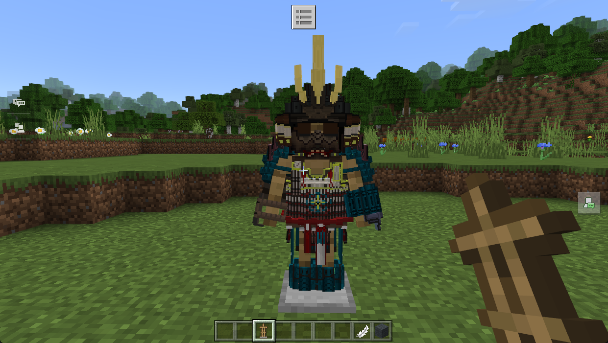

以及我们在尝试修改原版的盔甲之后，所有的原版盔甲都改变了造型（以钻石甲为例）：

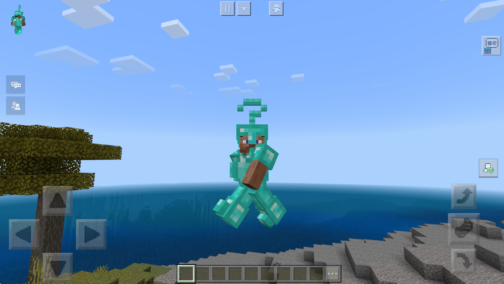

可以看到头盔上多了一个问号，肚子也鼓起来了，然后鞋子上多了一个骨骼。（别喷.. 我也觉得丑..）

## 3D 盔甲的制作方法

跟我们的 3D 武器是一个思路，还是存在两种方法。一种是作为额外的骨骼，用渲染控制器来条件渲染，这需要代码配合。由于盔甲一般比较简单，所以我们这里不介绍了。

重点还是介绍第二种 attachable 的方法。

### 3D 盔甲模型原理

我们这里先在内容库「偷」一套 3D 盔甲的模型：

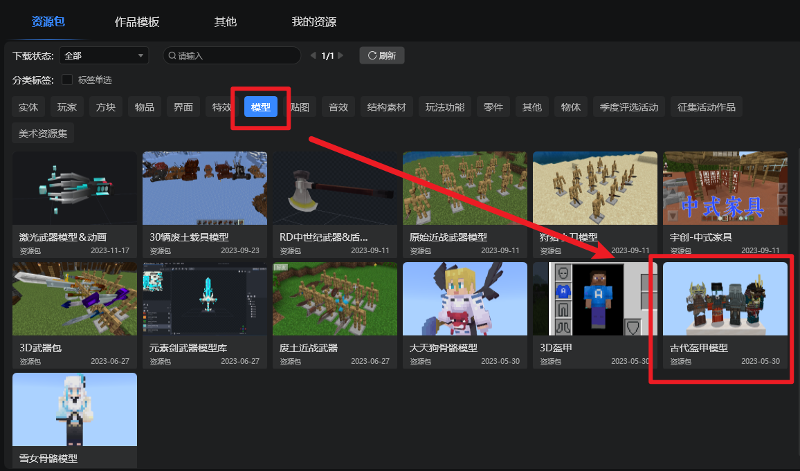

这里先随便选择一套盔甲模型，打开：

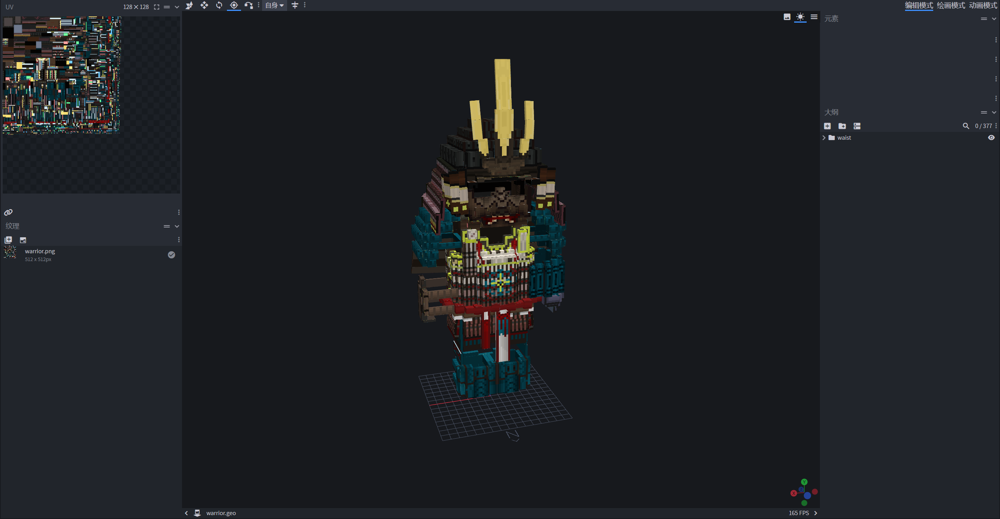

我们在第一节课中介绍过，这里 3D 盔甲的关键就是**对齐原版的玩家骨骼**，如果你不熟悉的话，可以打开原版的玩家骨骼进行检查（下列是玩家模型骨骼树状图，锚点即模型格式内的 pivot）：

```text
-root（锚点：[0, 0, 0]）
--waist（锚点：[0, 12, 0]）
---jacket（用于persona）
---cape（披风）
---body（锚点：[0, 24, 0]）
----leftArm（锚点：[5, 22, 0]）
-----leftSleeve（用于persona）
-----leftItem（锚点：[6, 15, 1]）
----rightArm（锚点：[-5, 22, 0]）
-----rightSleeve（用于persona）
-----rightItem（锚点：[-6, 15, 1]）
--leftLeg（锚点：[1.9, 12, 0]）
---leftPants（用于persona）
--rightLeg（锚点：[-1.9, 12, 0]）
---rightPants（用于persona）
```

只要骨骼在对应的骨骼组下方，且锚点对应的，那么 3D 盔甲就可以完美继承玩家的骨骼。所以我们在一番检查之后发现这个骨骼存在以下问题：

- 首先是少了根骨骼组 `root`，我们给加上；
- 其次是左右腿的继承关系错了，原版是继承在 `waist` 下，而这个模型是继承在了 `body` 下面；
- 再然后就是左右腿的 `pivot` 反了，原版左腿（`leftLeg`）是 `1.9`，而该模型左腿是 `-1.9`，右腿也是同理。

一番检查之后，我们就可以按照一般装备的划分，把骨骼拆成对应的四个部分就行了：

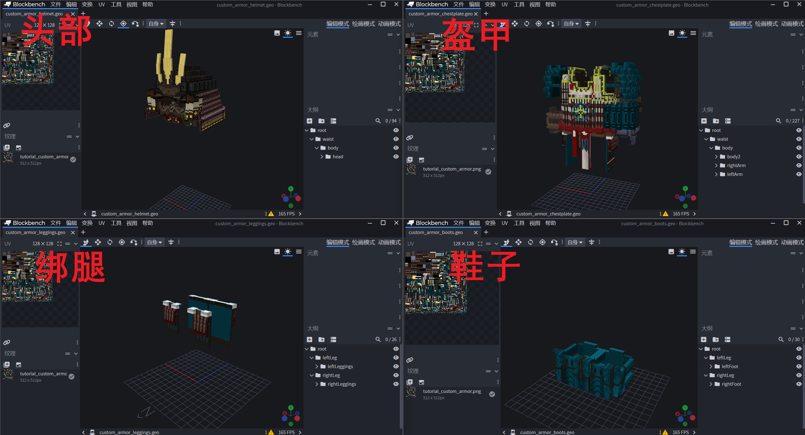

注意上图中的骨骼对应关系。然后导出模型到资源包的 `modles\entity\` 目录下即可。

### attachable 文件

接下来新增 `attachable` 文件让物品与骨骼对应就可以，下面列举一下四个文件。除了骨骼和 `scripts` 中的内容不一样外，其余都是相同的。

头部 helmet：

```json
{
    "format_version": "1.10",
    "minecraft:attachable": {
        "description": {
            "identifier": "tutorial:custom_armor_helmet",
            "materials": {
                "default": "armor",
                "enchanted": "armor_enchanted"
            },
            "textures": {
                "default": "textures/models/tutorial_custom_armor",
                "enchanted": "textures/misc/enchanted_item_glint"
            },
            "geometry": {
                "default": "geometry.custom_armor_helmet"
            },
            "scripts": {
                "parent_setup": "variable.helmet_layer_visible = 0.0;"
            },
            "render_controllers": [
                "controller.render.armor"
            ]
        }
    }
}
```

盔甲 chestplate：

```json
{
    "format_version": "1.10",
    "minecraft:attachable": {
        "description": {
            "identifier": "tutorial:custom_armor_chestplate",
            "materials": {
                "default": "armor",
                "enchanted": "armor_enchanted"
            },
            "textures": {
                "default": "textures/models/tutorial_custom_armor",
                "enchanted": "textures/misc/enchanted_item_glint"
            },
            "geometry": {
                "default": "geometry.custom_armor_chestplate"
            },
            "scripts": {
                "parent_setup": "variable.helmet_layer_visible = 0.0;"
            },
            "render_controllers": [
                "controller.render.armor"
            ]
        }
    }
}
```

绑腿 leggings：

```json
{
    "format_version": "1.10",
    "minecraft:attachable": {
        "description": {
            "identifier": "tutorial:custom_armor_leggings",
            "materials": {
                "default": "armor",
                "enchanted": "armor_enchanted"
            },
            "textures": {
                "default": "textures/models/tutorial_custom_armor",
                "enchanted": "textures/misc/enchanted_item_glint"
            },
            "geometry": {
                "default": "geometry.custom_armor_leggings"
            },
            "scripts": {
                "parent_setup": "variable.helmet_layer_visible = 0.0;"
            },
            "render_controllers": [
                "controller.render.armor"
            ]
        }
    }
}
```

鞋子 boots：

```json
{
    "format_version": "1.10",
    "minecraft:attachable": {
        "description": {
            "identifier": "tutorial:custom_armor_boots",
            "materials": {
                "default": "armor",
                "enchanted": "armor_enchanted"
            },
            "textures": {
                "default": "textures/models/tutorial_custom_armor",
                "enchanted": "textures/misc/enchanted_item_glint"
            },
            "geometry": {
                "default": "geometry.custom_armor_boots"
            },
            "scripts": {
                "parent_setup": "variable.helmet_layer_visible = 0.0;"
            },
            "render_controllers": [
                "controller.render.armor"
            ]
        }
    }
}
```

### 进入游戏测试

不出意外的话，进入游戏穿戴好装备，就可以看到实际的效果了：

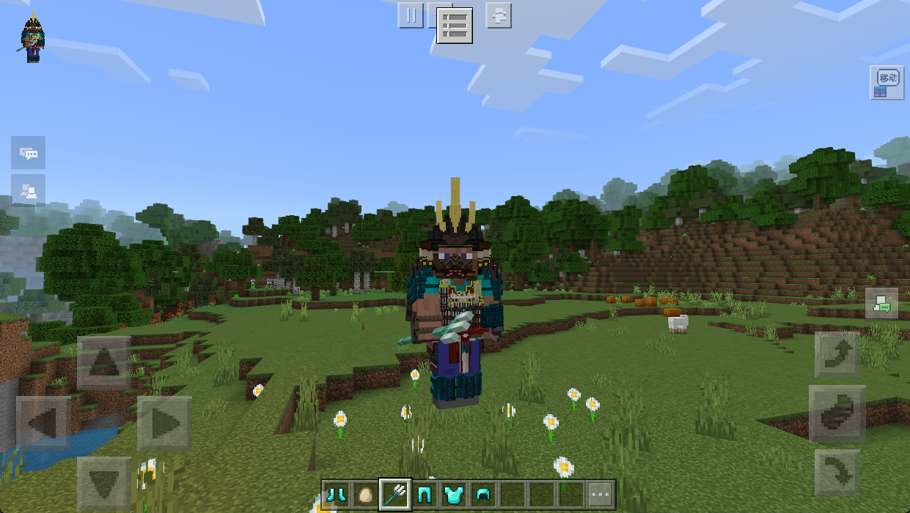

并且因为骨骼组跟玩家完美适配的情况下，玩家原版的动画也完美适配（比如游泳）：

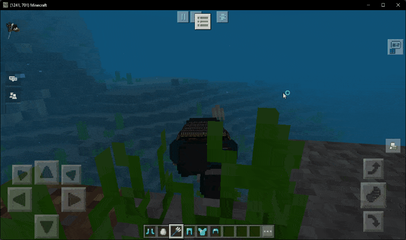

## 原版盔甲的修改方法

其实原版的盔甲模型，我们也是可以修改的。原版玩家的盔甲模型位于原版资源包 `models\entity\player_armor.json`：

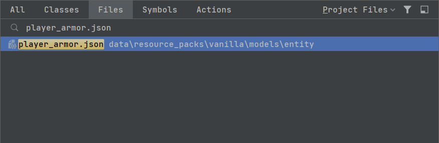

我们复制一份到我们的项目对应目录中，然后使用 BlockBench 打开，发现这文件中有很多骨骼：

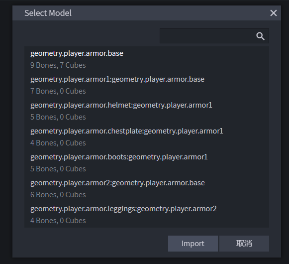

我们只需要处理第一个就可以了，打开：

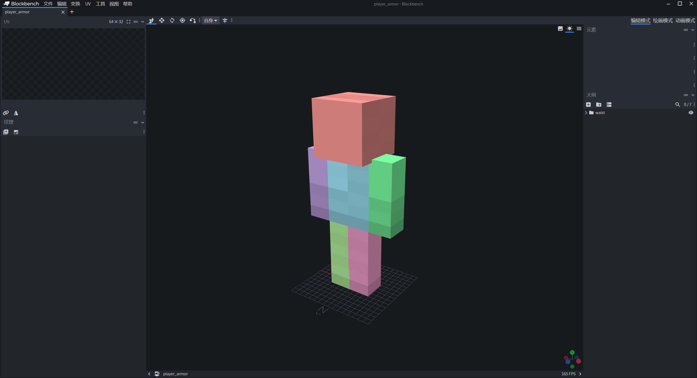

这个就是原版盔甲的骨骼了，由于需要适配原版的贴图，所以我们先来导入一下原版的纹理，下面是目录：

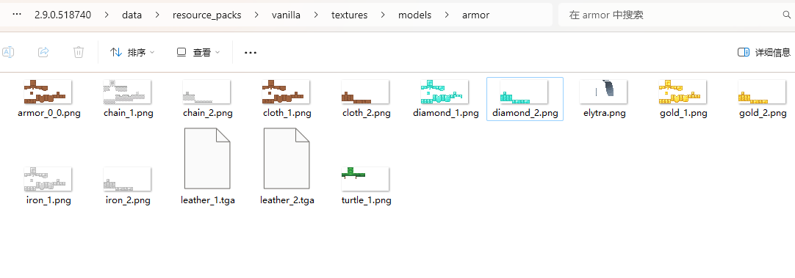

这里需要导入两个，`_1` 结尾的是不包含绑腿的贴图，`_2` 结尾的是包含绑腿的贴图：

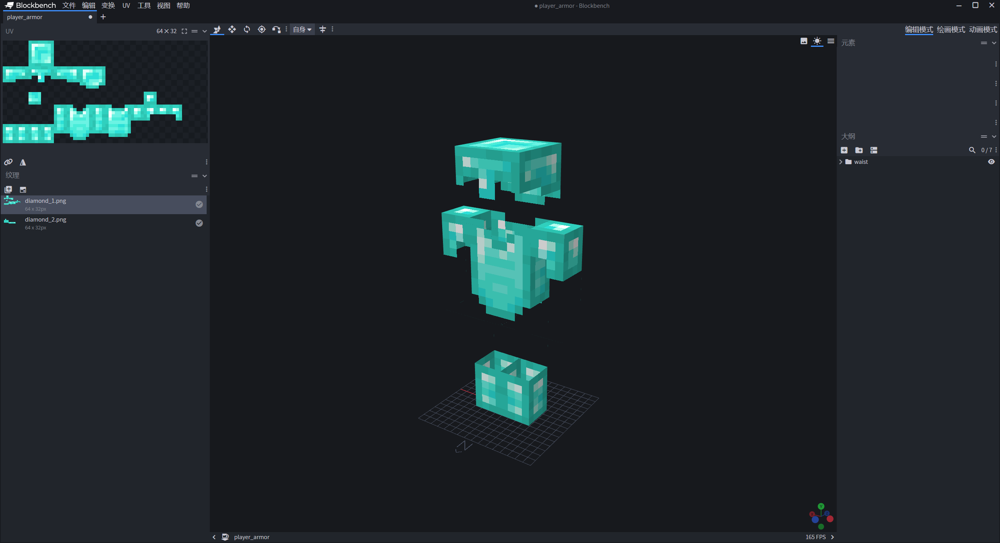

然后我们就可以在这个框架内任意的增加骨骼了，只需要注意适配原版的贴图就可以，比如我们就胡乱改成了这样：

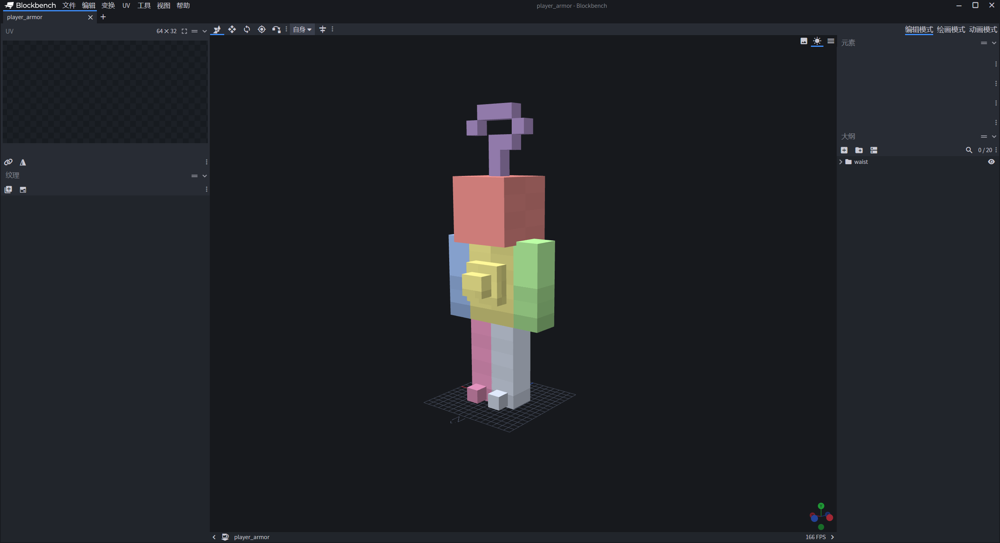

进入游戏查看效果：


## 小结

不管是自定义的 3D 盔甲模型还是修改原版的模型，我们发现都是需要在原版的骨骼架构内完成。

所以只需要注意这一点就行了。

修改原版骨骼这一点，是给大家留了一点可以想象的空间，可以自由发挥一下。

## 课后作业

本次课后作业，内容如下：

- 制作一套属于自己的 3D 盔甲；
- 修改原版的盔甲模型文件，在游戏中查看效果；
