# 作品在外部推广的方式

《我的世界》为了帮助广大开发者的作品宣传和发展，推出了多种多样的活动及推广，提升作品曝光、销量等。作品除了在《我的世界》中宣传推广，开发者也需要利用外部平台扩大作品知名度，从而让作品被更多冒险家喜爱。

#### 在本章课程，您将学到

- 外部独立账号的建设、管理与宣传。

- 玩家社群的管理与推广。

## 外部独立账号的建设、管理与宣传

借助社交平台实现量和质的转变是对作品宣传的 **重要保障** 。开发者可以通过建立团队/个人的外部平台账号，将原创作品通过各平台进行宣传推广。常见的视频推广平台有抖音、快手、B站等。以下将分别对各平台的建设、管理与宣传给出一些建议，开发者可以参考建议选择适合的平台及内容进行组件推广。

### 账号搭建

在成功注册外部平台账号后，可以考虑对账号进行一定优化，账号昵称、头像、账号定位。其中，账号昵称可以带有鲜明个人特色，或者沿用其他平台账号，搭建一个属于团队/个人的账号矩阵，也利于玩家定位查找，例如《我的世界》开发者在QQ频道、哔哩哔哩平台用的都是同一个头像；吸引人的头像也是账号搭建的比不可少的部分，特色的头像可以让用户对你形成记忆点，也能与其他团队/开发者进行有效区隔；每个账号都有固定的定位和分区，因此需要制定相应的人设让观众形成一个标签，减少被其他同质视频淹没。以《我的世界》开发者账号为例，账号昵称、头像、定位（开发者聚集地）就可以很好的与《我的世界》官号进行区隔，吸引开发者的关注。

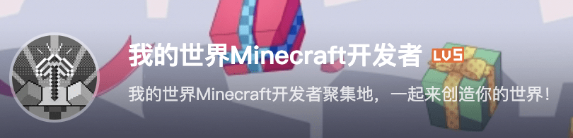

## 管理与宣传

开发者搭建完平台账号后，就可以考虑发布内容了，视频平台（抖音、快手、B站）可以通过图文或者视频两种不同形式进行发布。

**标题** 对于图文跟视频来说，尤为重要，适当的标题党是可以充分激发用户的好奇心。可以多用疑问、对比、感叹等技巧吸引用户。另外，标题需要吸引人，并且尽量简短，以下是《我的世界》开发者账号发布的视频标题参考。

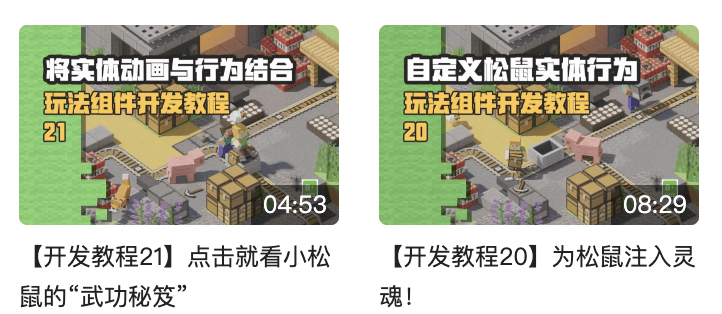

或者发布时，可以将所有相关的话题都要带上，可以最大限度地在用户搜索时进行露出曝光。

**发布时间** 也很重要，午饭前、入睡前及周末是吸引用户观看的黄金时间。哔哩哔哩还可以看到用户观看留存状况分析，（是否需要配图）通过这个就可以及时了解到用户的兴趣取向，并对后续视频适时地进行优化，以便覆盖更多的受众。

**发布排期** 同样也需要开发者考虑。在作品上架前，可以提前对作品进行预热，发布内容可以是玩法内容的部分图片、15秒-30秒的视频预告等吸引玩家关注；正式上架后，开发者可以邀请玩家、KOL对组件试玩，并且发布游戏体验视频，以此转化更多用户引流至游戏内，从而提升组件销量。

与**圈存用户互动** ，对于账号运营也是不可缺少的。开发者可以通过发起活动，并提供相应的奖励机制，鼓励用户参与活动。例如《我的世界》开发者账号曾开启幸运抽奖互动活动，在提高用户粘性的同时还能增加视频或动态内容的观看量及互动率，账号粉丝数量也有所增加。

以上就是外部视频平台的一些相关推广建议，更多的账号及视频内容运营攻略以及平台涨粉变现玩法可以参考以下链接；

**抖音** ：[https://creator.douyin.com/creator-micro/creator/help/intro](https://creator.douyin.com/creator-micro/creator/help/intro)

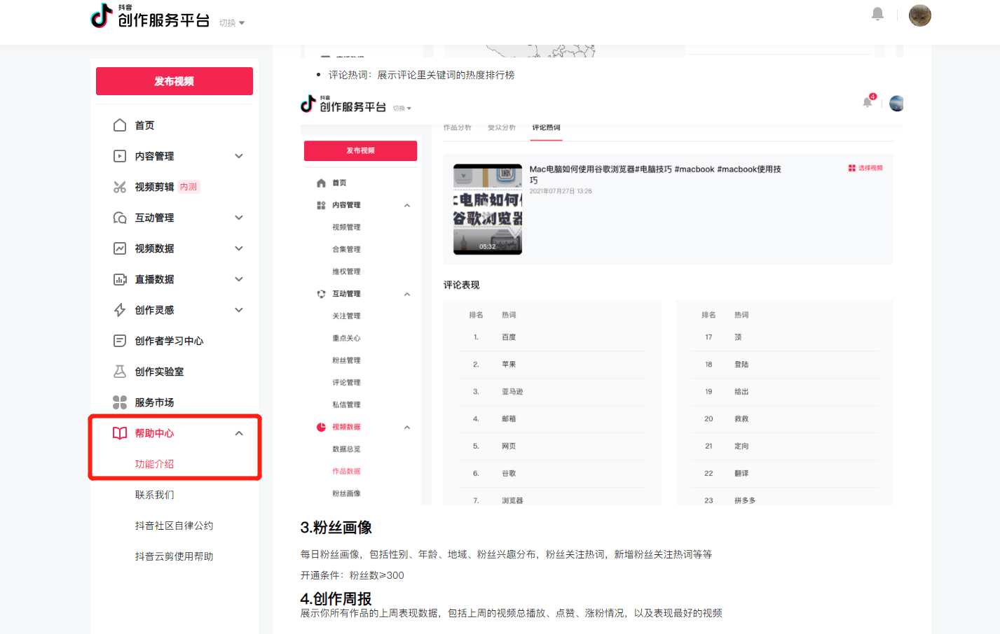

**快手** ：打开快手-点击右上角-进入创作者中心-点击全部服务-打开创作者学院。

| ① 进入创作者中心                             | ② 点击全部服务                               | ③ 打开创作者学院                             | ④ 了解内容创作                               |
| -------------------------------------------- | -------------------------------------------- | -------------------------------------------- | -------------------------------------------- |
| 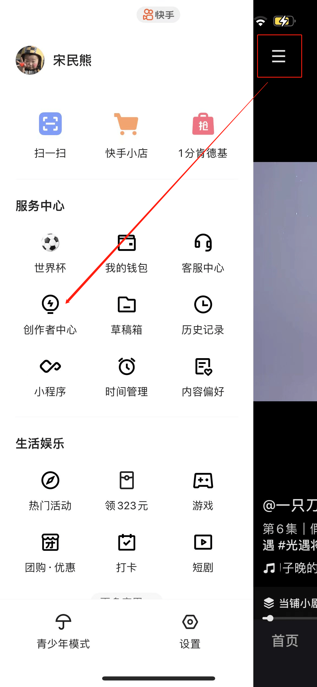 | 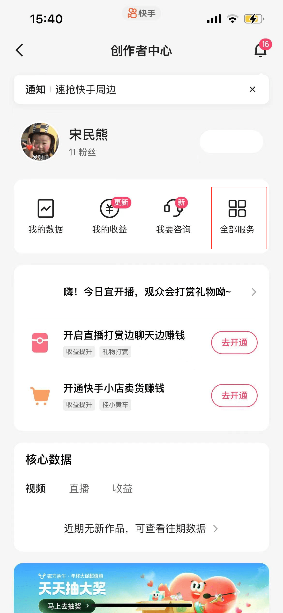 | 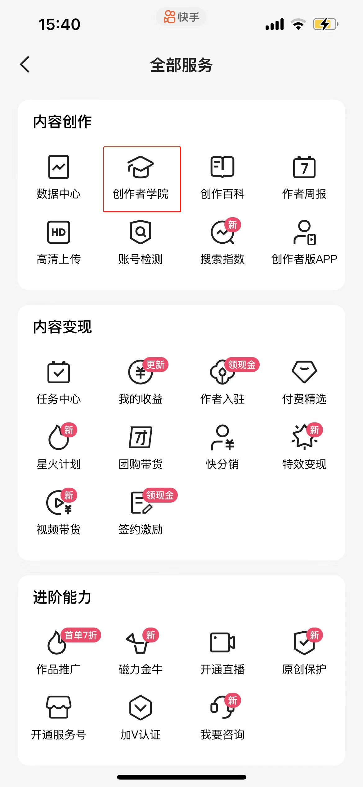 | 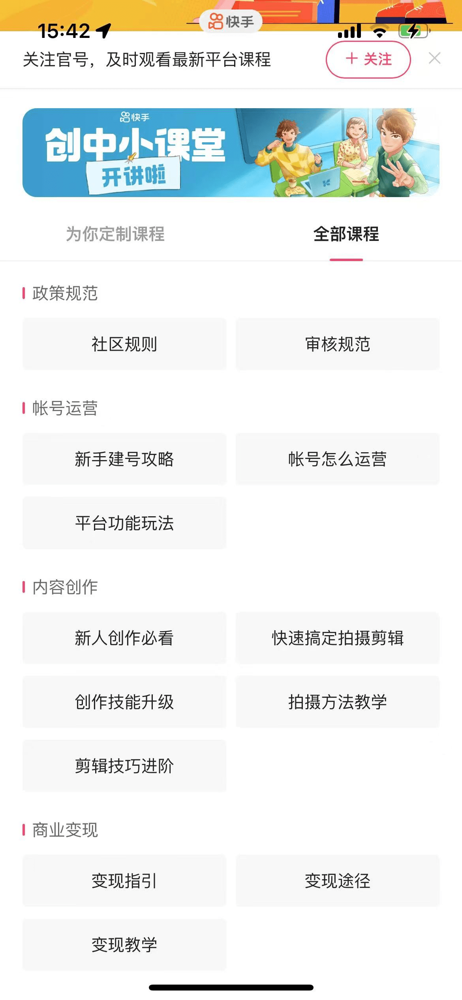 |

**B站** ：[https://member.bilibili.com/platform/home?spm_id_from=333.999.0.0](https://member.bilibili.com/platform/home?spm_id_from=333.999.0.0)

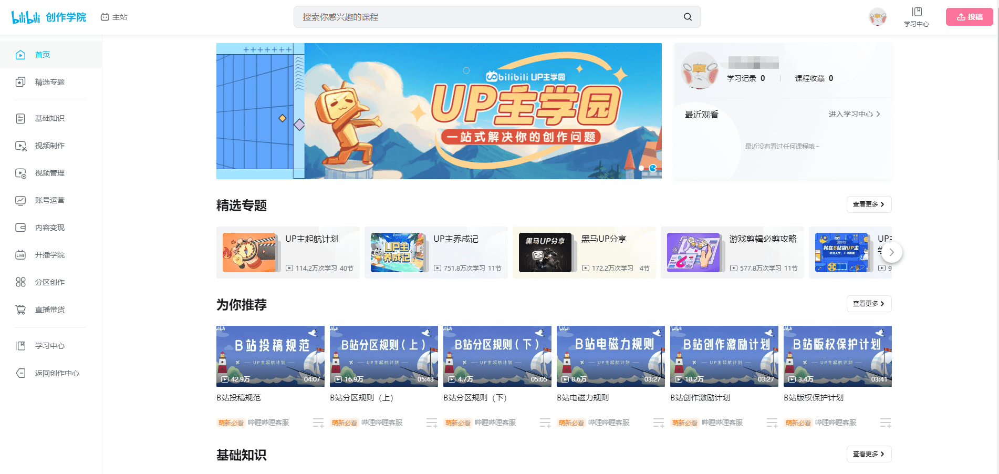

## 玩家社群的管理与推广

从组件上架前到上架后，玩家可能会有各种问题，社群运营就是为搭建一个玩家与开发者快速沟通的桥梁，让玩家的反馈能够及时传递给开发者，从而开发者能够及时处理问题，有效提高双方的粘性程度，对组件宣传起到更好的效果。想要了解如何快速上手社群运营吗？可以参考以下一些建议。

### 社群如何拉新

如何吸引用户是第一步，目的是需要找准核心用户活跃平台，锁定第一批核心种子用户，以此扩大社群数量。例如通过B站对核心玩家进行打捞，在视频社媒平台发布社群二维码，吸引用户加入。

或者在游戏测试阶段，对参与测试的玩家进行引流包括短信测试、邮箱、游戏内公告等，因为主动参与游戏测试的玩家都是核心玩家，而这批玩家也是二次传播的种子用户，可以帮助后续游戏宣传、下载等内容。

### 社群如何留存——触达圈存用户

游戏上线前，搭建符合用户需要的社群后，可以在社群中提前发布游戏上线公告等内容，吸引玩家在社群中参与讨论，并充分利用社群中的功能，打造用户喜欢的活动，多方位去唤醒触达用户，例如开启日常打卡、抽奖迎新等互动，提高用户参与，有效促进社群活跃度。

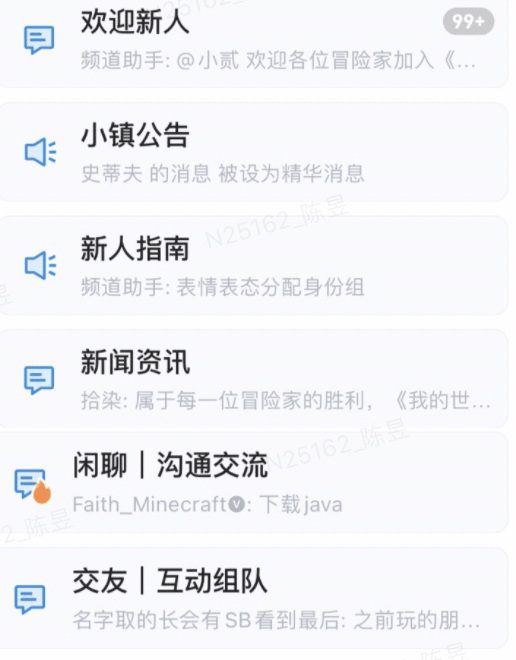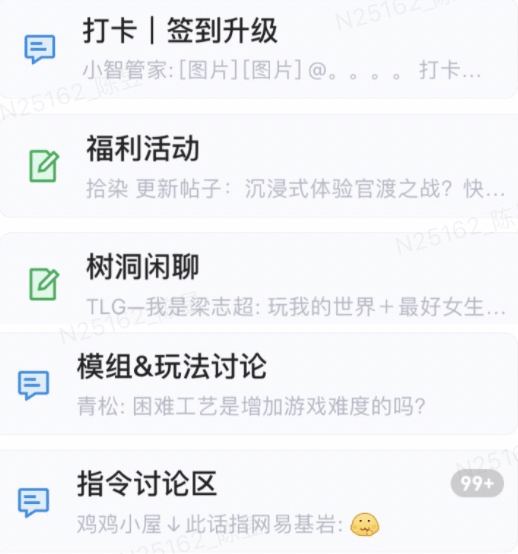

游戏上线后，可以为玩家提供游戏内的攻略指引、问题答疑等，这样开发者也可以对游戏热点、玩法评价、bug等问题进行快速定位，对玩法后续更新优化，提供有效信息参考。

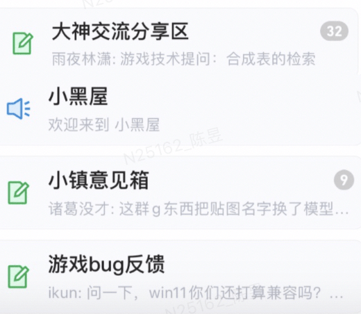

除此之外，还可以针对玩法本身开启社群活动，提高组件下载转化率，例如让玩家进入地图玩法某指定场景位置打卡截图并分享，并给予相关礼包等奖励，鼓励玩家下载体验。

### 社群如何管理——提升玩家满意度

当社群人数逐渐上升，群内用户讨论的信息量也会倍增，管理难度也会对应提升。首先，在社群运营初期，需要在社群内指定规则，例如对发言内容、图片等进行规定，并从玩家中挑选合适的人选，作为群内管理员，用于解决日常的基础性问题。

在社群中期，人数达到一定规模，需要对各部分内容进行分流，从而更加有利于管理，这里以QQ频道为例，可以用增加子频道的方式细化模块，例如问题反馈可以细分为游戏内问题反馈、账号问题反馈、充值问题反馈等，从而管理员能根据各个模块寻找对应的人员进行处理，降低了问题反馈整体时间，提高玩家满意度。

**以上就是有关社群运营方面的小建议，希望大家可以好好利用社群跟玩家互动交流，了解更多玩家的想法，为组件开发提供更多思路！**