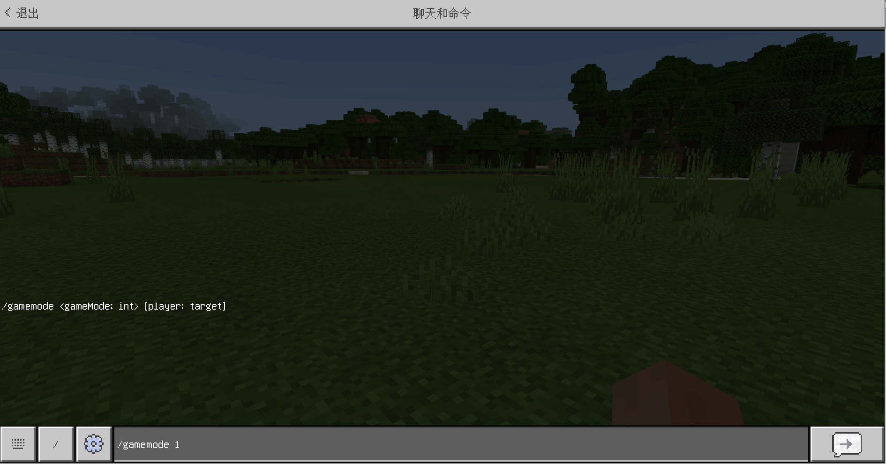
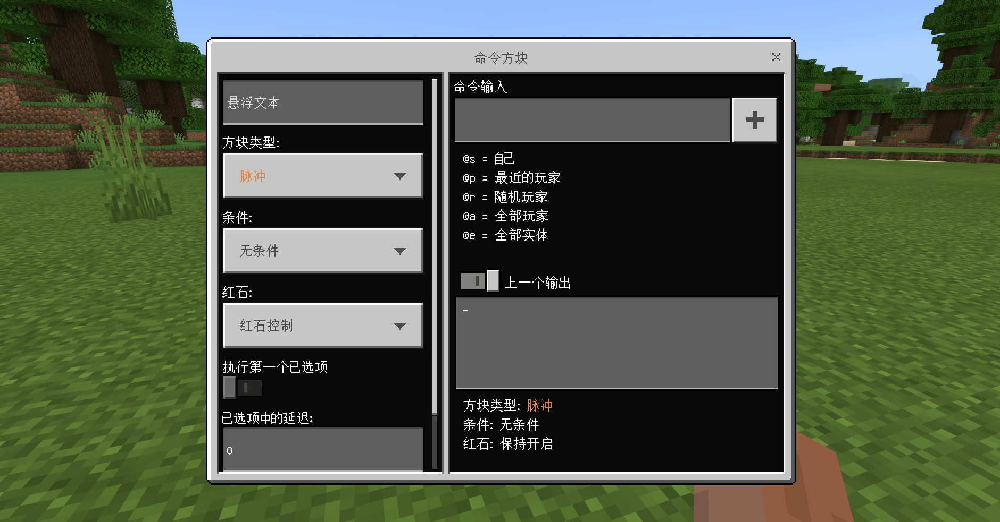
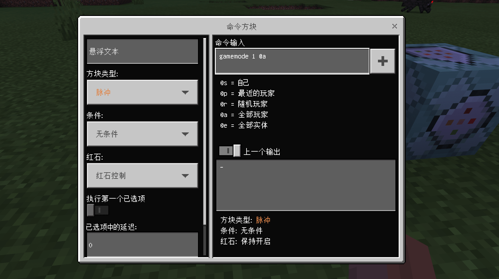
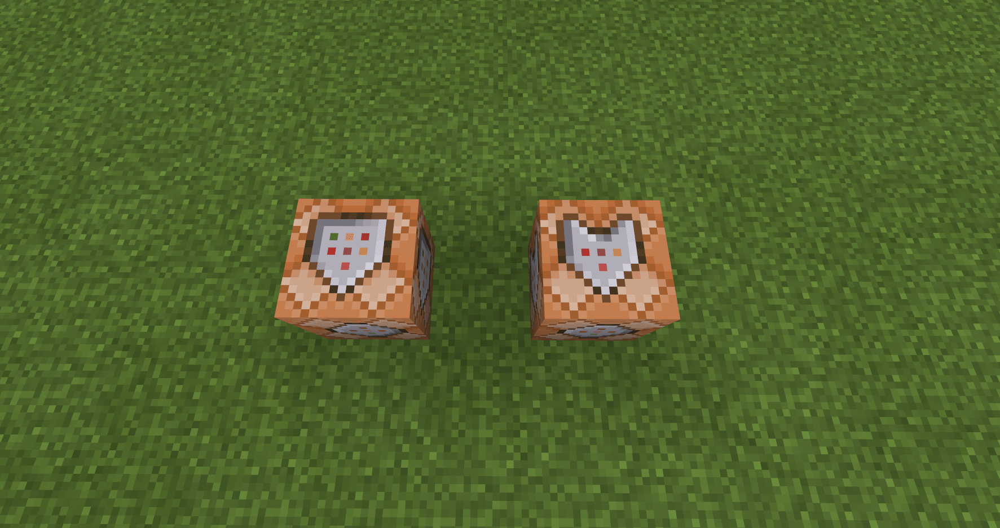
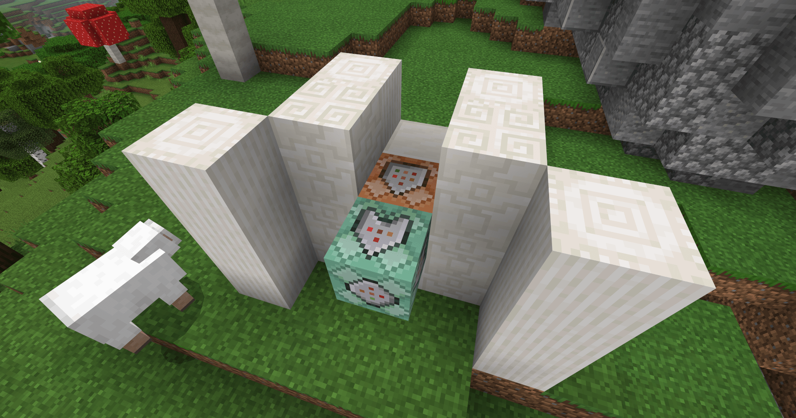
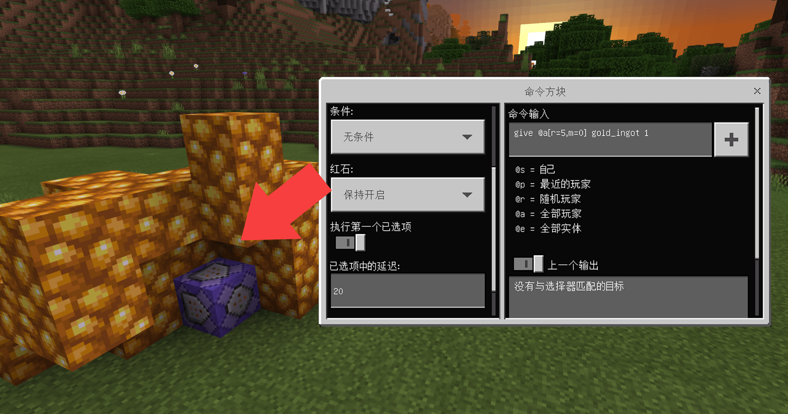
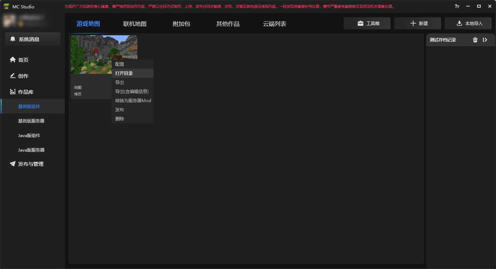
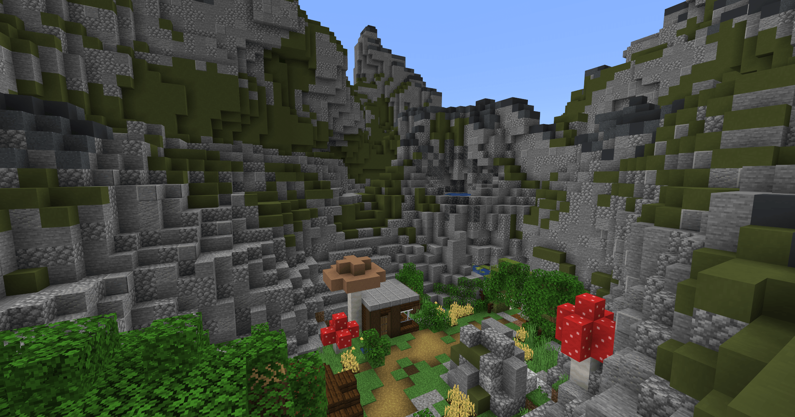

# 能改变世界的命令

<iframe src="https://cc.163.com/act/m/daily/iframeplayer/?id=624584b2b8a81f8fa083c0c5" width="800" height="600" allow="fullscreen"/>

如果玩过我的世界原版的生存的朋友，我们都知道，所有的物资都需要亲自收集获取，在创造前先破坏；不过想要打破这个规矩，我们可以在游戏中输入一段神秘的字母（/gamemode creative 或 /gamemode 1）让我们从生存模式切换到创造模式。



## 什么是命令？

简单来说，命令就是玩家可以输入特定的内容从而激活某个功能。

在游戏中，命令可以通过聊天窗口输入，一般格式为：/ + 命令体； **最开始斜杠（/）是必需的。** 一些常用的命令如：

- gamemode：切换玩家的游戏模式
- gamerule：设定游戏世界规则
- setblock：在世界中生成方块
- give：给予物品

除此之外，还有非常多的命令，充分发挥它们的功能并结合，就可以创造出独特的玩法。

[命令方块表（WIKI百科）](https://zh.minecraft.wiki/w/%E5%91%BD%E4%BB%A4)

## 命令的好伙伴：命令方块

除了玩家在聊天栏中输入外，使用命令/give @s command_block，可以获得一个命令方块，常规状态下这个方块可以 **利用红石信号激活命令** ，无论玩家在何处。


右键打开命令方块的菜单，接下来逐个介绍命令方块的功能（基岩版）



命令方块一共有三种：脉冲、连锁、循环，这三种命令方块执行命令的过程不太一样。

- 脉冲：外观为橙色，命令方块激活每激活一次就执行一次命令
- 连锁：外观为绿色，当指向它的命令方块激活时，此命令方块才会执行
- 循环：外观为紫色，每激活一次都将循环执行命令数次（1游戏刻执行1次命令）

切换命令方块并保存将会改变它的外观：


*从左至右依次是脉冲、连锁、循环；命令方块顶部贴图的剪头则是指向，这将影响触发的连锁方块*

右侧命令输入框，则是输入命令的地方，在命令方块中不需要在命令前加斜杠（/），当然加了也不会有什么影响。在命令方块中使用命令需要注意分辨 **目标选择器** ，拿/gamemode 1（切换为创造模式）命令举例，在命令方块中执行时没有意义的，因为命令方块不知道要修改谁的游戏模式（反正不是命令方块本身，因为它只是个方块...），所以在命令的特定位置，我们需要添加目标选择器，来让命令方块找到执行对象。



在切换游戏模式命令后加一个 **@a** ，命令方块就会让游戏内的所有玩家都切换为创造模式。

在命令方块触发后，下方的输出窗口会提供一些提示：


*图中命令的目标选择器不完整，输出窗口内反馈了错误并且指出具体的位置*

### 条件

条件分为两种： **无条件** 和 **有条件的** 。这个选项主要针对连锁命令方块。

默认状态下是无条件的，也就是说无论指向它的命令方块是否执行成功，连锁方块自身都要执行。而有条件的则是需要指向它的命令方块成功执行连锁方块本身才会执行。

条件制约其实有很大的作用，比如我们需要实现一个功能：清除玩家的金锭给予他钻石（以物换物），若是选择无条件，那无论有没有成功清理玩家的金锭都会直接给玩家钻石。这里就必须要用有条件来确保玩家有金锭并清除掉了。

通过 **外观可以判断** 命令方块为有条件或无条件的：



*无条件（左）有条件的（右）*

### 条件

常规状态下，命令方块需要 **红石信号** 才可以触发执行；如果切换它的触发条件，改为 **保持开启** ，三种不同类型的命令方块，其效果也不相同。

普通命令方块只会执行一次，连锁命令方块仍然会等待指向它的命令方块执行，循环命令方块则会以每1游戏刻执行一次的频率无限执行 **（1秒=20游戏刻）** 。

大量的循环命令方块在保持开启状态下会造成明显的卡顿，所以还是尽量避免大量使用。

### 已选项中的延迟

主要体现在循环命令方块上，如设置20，循环命令方块每20游戏刻（1秒）执行一次。

若是在脉冲命令方块或是连锁命令方块上使用，在命令方块激活后，会先延时设定的时间再执行命令。


*未设置延迟且保持开启的循环命令方块*

### **执行第一个已选项**

该选项仅在循环命令方块上产生效果，若开启，命令方块在执行命令前会 **先等待延迟再执行命令** ；反之则 **先执行命令再进行延迟** 。

## 制作简单的小功能

命令的种类有很多，每个命令的使用方法又都不一样，所以不能在教程中面面俱到；接下来将以几个常用的命令举例制作一些小功能。

### 玩家传送点

先在设置中打开坐标显示，在左上角会显示玩家当前的坐标，在想要传送的位置处记录坐标，待会要用。


然后找到一个区域（如：游戏大厅）放置命令方块，让玩家在点击按钮或踩踏压力板（能够激活红石信号）时可以传送。


在命令方块中输入命令/tp <目标选择器> <坐标xyz>，并放置按钮让玩家可以使用。


在地上放一个命令方块和一个按钮，光秃秃的非常不好看，可以制作一个简单的建筑将命令方块围起来，使其更像一个传送站点：


光是传送的功能很突兀，应该增加其它细节和效果使传送更加“有魅力”。使用/particle命令在传送的位置生成粒子效果；在传送的命令方块后放一个有条件的连锁方块，玩家若传送成功则会生成粒子。

```命令
/particle minecraft:totem_particle <坐标xyz>
```

注意图中，使用连锁命令方块确保上一个命令方块指向连锁命令方块。




所以，命令方块运用起来是很灵活的，简单的传送功能也可以组合出非常不一样的效果，比如给传送加个延迟，或是玩家无需任何操作进入范围就会被传送等等。（所有命令及使用方法都可以在本章开头的命令表网址中找到）

### 给予玩家物品

很多玩法都需要让玩家获得道具、装备等物品，所以给予玩家装备的功能就显得很重要了。我们需要让玩家在靠近金矿堆的时候可以持续获得金锭，利用1条give指令就可以做到。

在金矿堆的较中心位置放置一个保持开启的循环命令方块，设置20游戏刻（1秒）的延迟，命令如下：

```命令
/give @a[r=5,m=0] gold_ingot 0 1
```



指令体give + 目标选择器@a(所有玩家)，而目标选择器后面中括号的内容则是对目标选择器进行筛选或者说是添加条件：r=5代表以命令方块为中心的5格范围；m=0是游戏模式为生存模式的玩家。所以对 **目标选择器添加条件** ，就实现了检测玩家的功能。所以当命令方块为中心的五格范围内没有玩家时，命令方块就无事发生。


让我们继续为其添加功能，实现 **“以物换物”** 的功能；让玩家有经验的情况下在金矿堆附近可以获得金锭但经验会-1级。

同样在金矿堆较中间的位置放置一个保持开启的20刻延迟循环命令方块，并指向一个保持开启且有条件的连锁命令方块，分别设置如下指令：

```命令
循环命令方块：/xp -1l @a[r=5,m=0,lm=1]
连锁命令方块：/give @a[r=7,m=0,lm=1] gold_ingot 1
```


循环命令方块实现的功能是每1秒减去范围内大于1级玩家的经验，当命令方块执行成功时会让连锁方块给达成条件的玩家一个金锭。 **lm=N** 为判断玩家等级是否大于N。


命令不仅种类繁多，各种用法和变化更是五花八门，光是了解有关命令的所有功能都需要蛮长的时间，所以在本章教程中无法详细展开介绍，若想深入学习可以前往[WIKI百科](https://zh.minecraft.wiki/w/%E5%91%BD%E4%BB%A4)详细学习。

## 进一步改变世界

是否对原版的草方块感到“厌烦”了呢？或是想让自己养的猫猫狗狗变成自己喜欢的样子，也或是把绿宝石变成红宝石的样子。通过修改材质，以上的“幻想”都可以实现！



右键编辑器内的作品，打开该作品的目录，在地图文件内可以看到 **resource_packs（资源包）** ，修改里面的文件可以实现 **改变世界** 的效果！不过你打开以后会发现里面除了一些文件夹没有任何东西。

所以我们需要找到一个 **原版的资源包** ，对其修改再放到地图的resource_packs内。找到编辑器在磁盘中的位置然后根据示例路径找到原版资源包：

D:\MCStudioDownload\game\MinecraftPE_Netease\PCLauncher\data\resource_packs\vanilla

原版资源包中有很多的文件，分别放置不同类型的图片文件，如： **textures** 是存放贴图的文件夹，方块、物品等贴图都可以在这里找到；


打开原版资源包内的textures，方块在Blocks文件夹内，对文件夹的命名翻译成中文就可以了解大致存放的贴图类型。下面举例一些常用类型的文件夹名：

- textures -> items：物品贴图
- textures -> blocks：方块贴图
- textures -> models：实体模型贴图
- textures -> particle：粒子效果贴图
- textures -> ui：UI界面贴图

我们把青色陶瓦的文件名改为绿色陶瓦，进入到游戏就可以看到，我们上一章节制作的山体颜色发生了变化，地形的整体效果也有了变化：



所以材质包对玩法地图非常重要，甚至让我的世界变得更像独立的游戏也不是不可能的。

**课后作业：** 任意修改材质包达成不一样的效果；利用指令和命令方块制作更多功能或是在教程的基础上改进。


