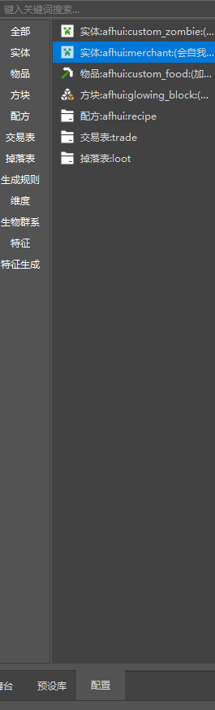
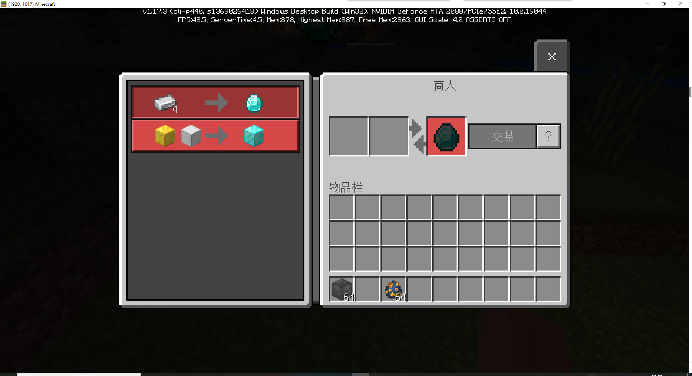
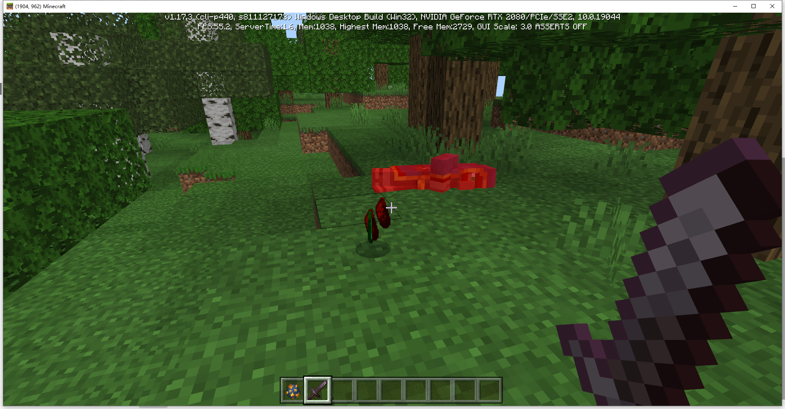

## 经济功能课后作业

刚刚学习完如何配置交易表和掉落表，现在我们尝试把它们加到我们的自定义流浪商人上吧！

在左侧的配置栏中，找到之前配置的会自我保护的商人。

选中后右侧属性面板就会显示这个商人的属性。

在右侧行为包组件中，添加一个`经济交易表`属性，来让这个实体可以交易。

并按照下方方式，配置这个交易。

表选择我们之前创建的交易表，显示名称可以自己发挥。

随后我们配置掉落物。新建一个`掉落物`属性，并添加一个表的属性，选择之前创建的掉落表。

完成配置后，点击保存，进入游戏测试。

右键点击商人，可以看到交易正常工作。

击杀商人，可以看到必掉绿宝石，红石和萤石是随机的。

这时候就是两次随机都抽到了红石的情况。