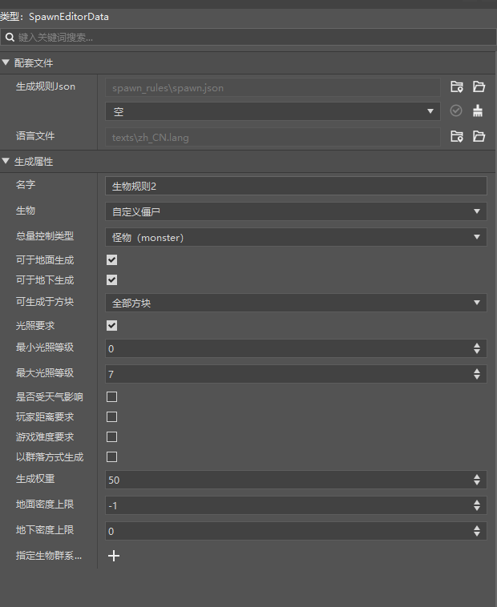
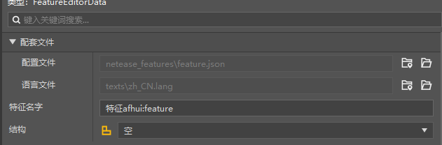
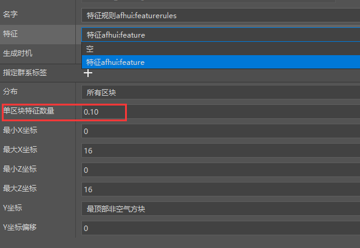

# 开始配置群系功能

在本节中会主要介绍生成规则、特征、特征规则的配置和使用。

<iframe src="https://cc.163.com/act/m/daily/iframeplayer/?id=632863afe6c041f2578ca7ea" width="800" height="600" allow="fullscreen"/>

## 生成规则

生成规则主要用来配置实体的刷新规则。在原版中，僵尸等生物的自然刷新就是利用生成规则来实现的。

我们打开编辑器，新建一个生成规则，创建一个自定义僵尸的生成规则。还是在新建->配置->生成规则中进行创建，并命名。并按照下图配置。

> 一些配置的解释：
>
> 名字：没有特殊要求，仅用来区分不同的规则文件
>
> 生物：要生成的生物
>
> 光照要求：限制生物在什么光照要求下生成，例如我们这里设置僵尸在0-7的亮度下可以生成
>
> 总量控制类型：按照我们的实体的定位进行选择，游戏中有相关对各种类型实体总量的控制
>
> 生成权重：用来控制生物的生成概率，数字越大，生成概率越大
>
> 其他配置可以根据需要，自己移动鼠标到标题上查看具体解释。

## 特征

特征又称地物。表示一系列方块在地图生成时的单个的产生规则。与其一起使用的还有特征规则。

我们举一个钻石矿石在游戏中的生成规则，来说明特征和特征规则之间的联系。

钻石矿石，大家都知道，是在地下13层以下开始刷新的。并且通常以1-8个之间的矿簇进行生成。

那么我们就可以使用特征来表示1-8个钻石矿石的矿簇，使用特征规则来表示钻石矿石生成在地下13层以下。

那么建筑的生成也是如此，我们使用编辑器，点击新建，配置，特征，命名并创建。

可以看到有一个选择框，可以选择要生成的结构，即一个方块建筑。

此处的结构我们会留到课后作业中，制作一个流浪商人小屋，再进行配置。

## 特征规则

特征规则用来设置特征将在什么地方，什么时候进行生成。

编辑器中，新建，配置，特征生成，命名并创建，**注意文件名必须全部小写**。

我们在属性窗口中点击特征的选择框，选择之前创建的特征，随后调整一下单区块特征数量，防止生成数量过多。

其他配置保持默认，感兴趣的同学可以将鼠标移动到它们的名字上查看对应解释，并自由进行配置。

