# 制作流浪商人小屋预设

在开始本节的课程之前，我们有一个概念需要明确。

在我们前几节课创建项目的时候，我们一定都注意到了，大家选择的都是空白附加包，而不是空白地图。

空白附加包和空白地图，打开编辑器基本都是一样的，它们之间有什么区别呢？

空白附加包，打开关卡编辑器，虽然能看到舞台中的游戏地形、建筑等，但是这些地图在游戏启动后都会消失，即使在地图中做了修改，都不会保存。

而空白地图，不仅可以像空白附加包一样增添各种配方、方块、物品，还可以将编辑器中的地图，场景，一起保存，在下次启动的时候依旧保持原样。

总而言之，空白地图=空白附加包+固定的地图。

那么本节的内容，就是带领大家制作一个流浪商人小屋的预设，来学习预设的使用方法。

<iframe src="https://cc.163.com/act/m/daily/iframeplayer/?id=660a29bd42810643550cee8c" width="800" height="600" allow="fullscreen"/>

## 导出资源

在创建地图之前，我们首先将上一章中制作的自定义流浪商人导出，再次利用，避免重复劳动。

打开编辑器，在关卡编辑器的资源管理中，选择**导出**。

勾选行为包下的`实体`、`掉落`、`交易`，资源包下的，`实体资源`、`文本`，点击导出。并保存到一个目录中，可以看到是个.mep结尾的文件。

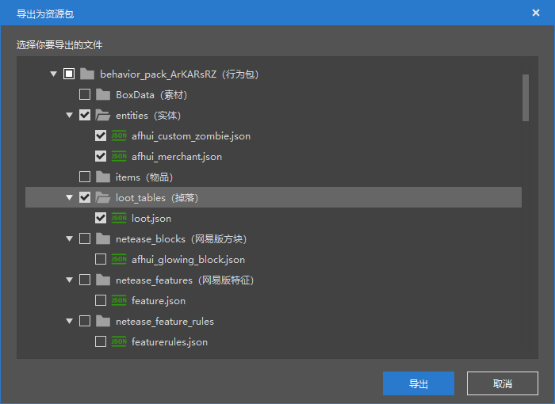

## 开始制作小屋预设

然后我们创建一个空白地图，名字可以自由发挥，点击启动编辑，进入编辑器后，我们打开关卡编辑器，将刚刚导出的资源进行导入。

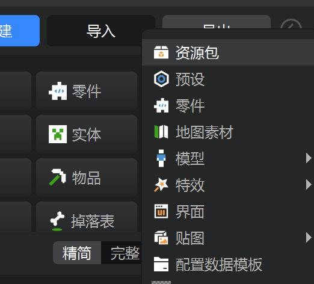

选择导入自定义资源包，然后选择刚刚保存下来的文件，全选导入。

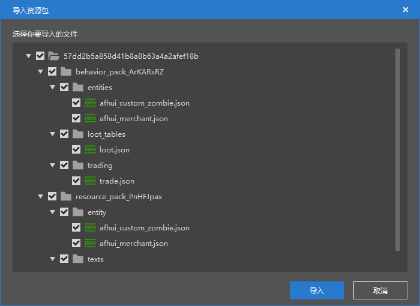

然后就可以看到我们在上一章中创建的实体，掉落表，交易表，都成功导入到了地图这个项目中。

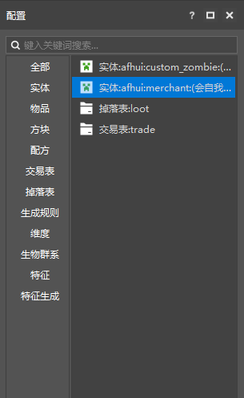

接下来我们创建一个空预设，还是在资源管理中点击新建，常用，空预设。

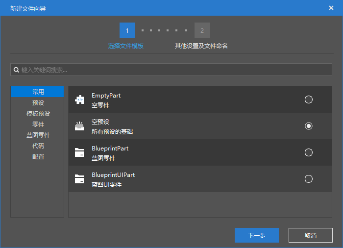

名字我们可以任意起，我们这里叫他`House`，点击创建。

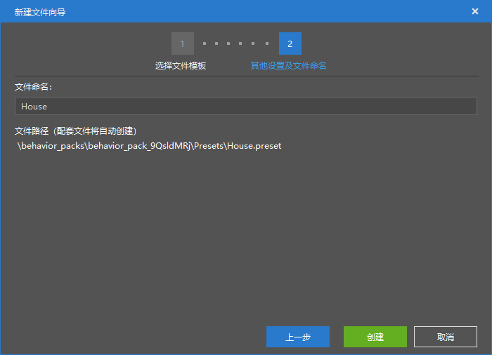

创建完成后，可以看到已经自动打开了预设编辑器，我们在资源管理中找到`素材`文件夹，点击右侧的导入按钮。在文件选择窗口中，选择`hall.mdl`这个素材作为我们的小屋。

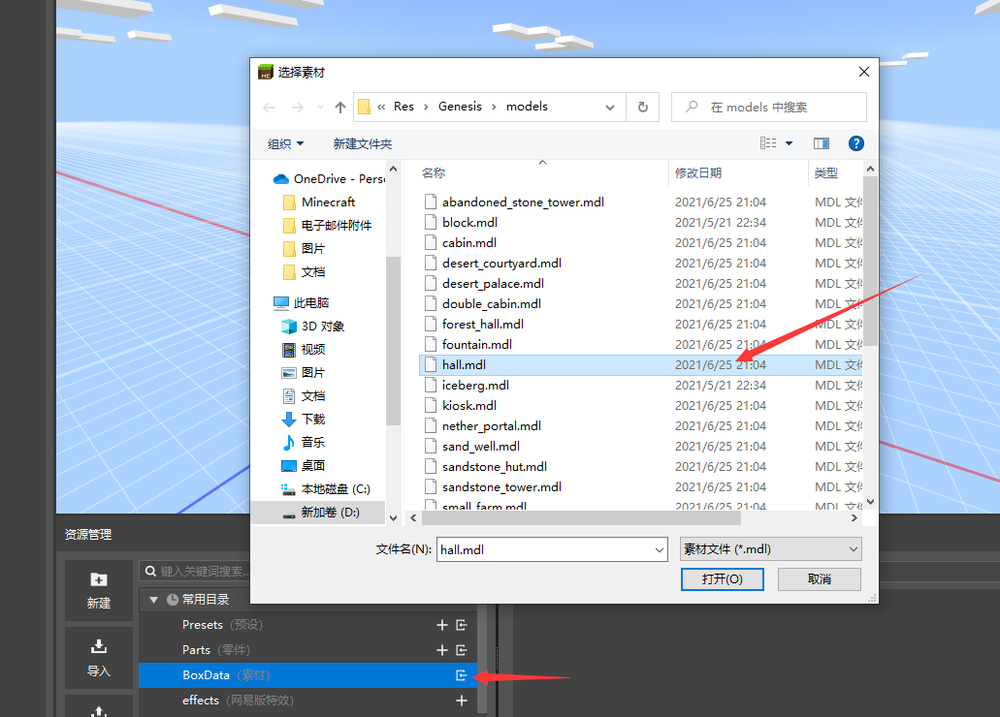

然后在上方工具栏中的添加素材处，选择刚刚导入的`hall.mdl`。就可以看到这个小屋素材出现在了预设编辑器中。

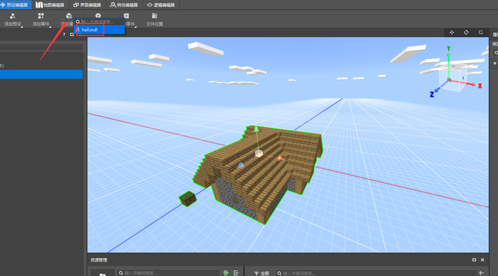

然后我们继续添加，将自定义流浪商人，作为一个实体零件，加入到这个House预设中。

点击添加零件，选择`EntityBasePart`，在对应的右侧属性窗口，将实体类型改为我们之前编辑的`会自我保护的流浪商人`。

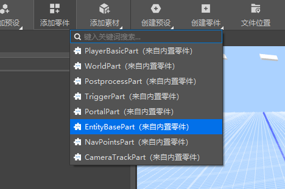

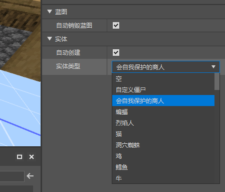

如果实体类型中找不到我们自定义编辑的实体，可能是编辑器的BUG，大家可以尝试**保存项目并重启编辑器**，一般都会可以找到。

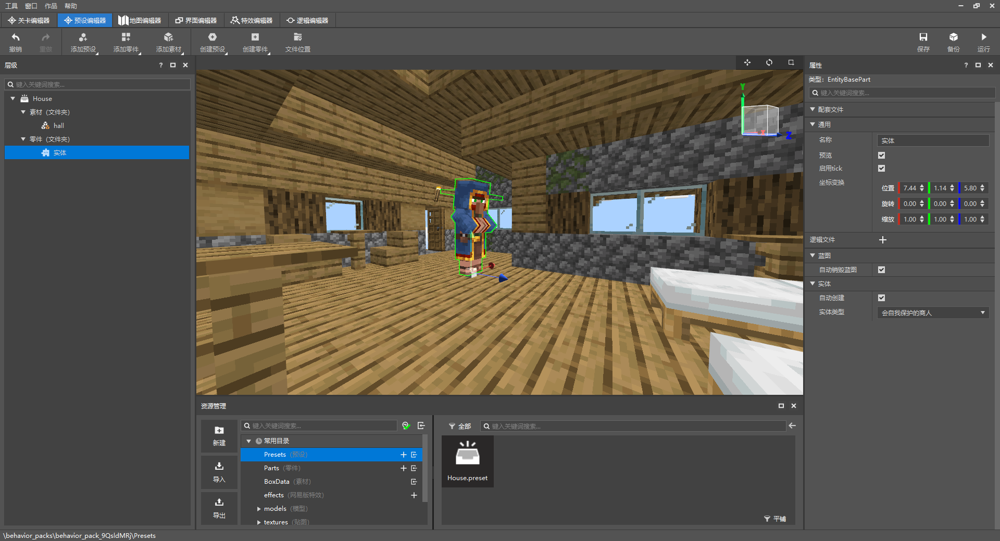

可以看到选中这个左侧`实体`后，游戏中所对应的流浪商人实体也被高亮显示了，同时有3个箭头，我们可以将其拖动到房子内，来定义的它的生成位置。

调整完成后其实我们的流浪商人小屋预设已经做好了，但是我们为了它变得更有趣味一些，可以给流浪商人再添加一个床的组件，让它会在晚上在床上休息。

回到关卡编辑器，找到这个会自我保护的商人，编辑它的行为包组件。搜索床，并给它添加。

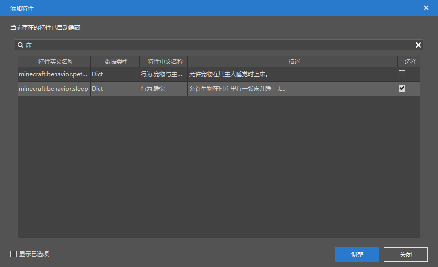

配置完成后，就可以在资源管理器中，找到`预设`文件夹，点击，将其中的`House.preset`，也就是我们刚刚编辑完的小屋预设，拖入到游戏中。

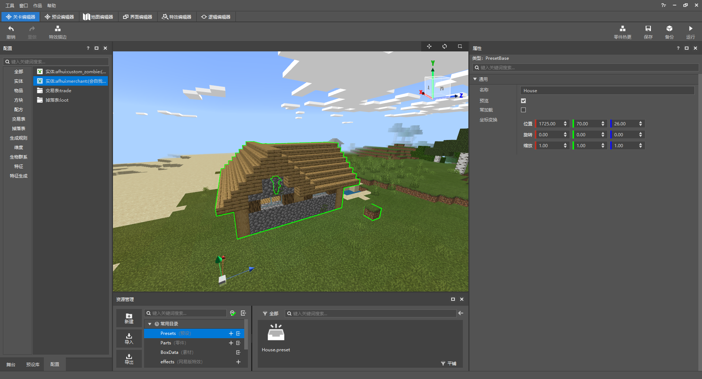

做到这样，我们的流浪商人小屋的预设就已经配置完毕，并且成功地放置在了游戏中。