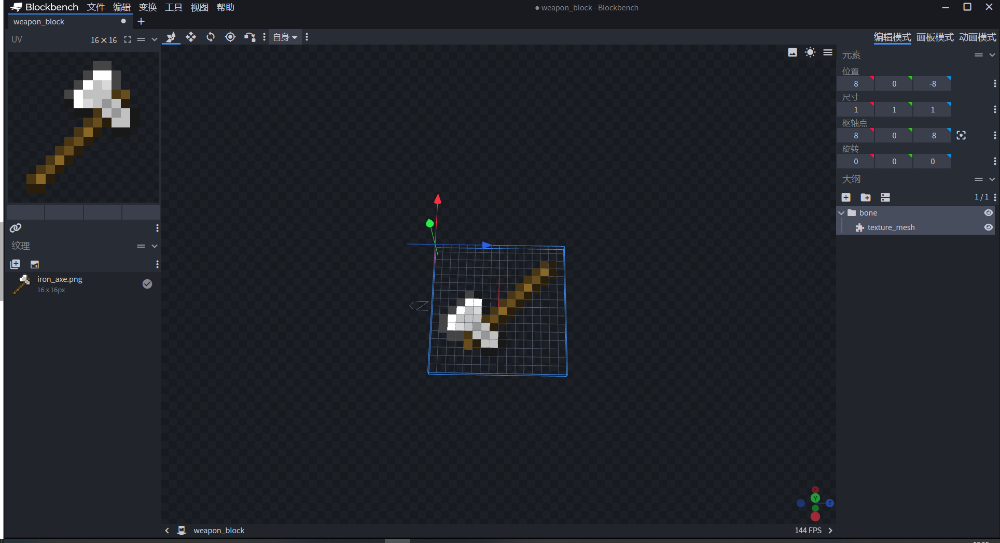

# 制作物品方块预设

本节将会使用blockbench制作新的武器方块模型，来增强表现力，并将模型添加到一个新方块中，放置到我们之前的小屋里。

<iframe src="https://cc.163.com/act/m/daily/iframeplayer/?id=660a2ab942810643550cefc5" width="800" height="600" allow="fullscreen"/>

## BlockBench

在基础版教程就已经提到过这个软件，BlockBench，可以用来制作我的世界中的模型。

下载地址：[点我](https://www.blockbench.net/downloads)


根据自己的系统来选择安装包，Windows系统可以按照图片指示选择，下载完成后点击安装。


安装完成后打开，点击文件，新建，基岩版模型。文件名，模型id都填写`weapon_block`，这就是将来我们需要用到的模型id。其他的按照图片填写。


创建完成之后，点击导入纹理，倒入一张铁斧头的纹理(可以根据自己喜好选择，也可以自己绘制)。


可以自行查找我的世界原版资源包，也可以直接将下图保存使用。


导入完成后，在右侧大纲下方的空白区域右键，先选择添加组，再选择添加纹理网格。将texture_mesh，拖入bone中。


添加完成后就可以看到中间的编辑区域，已经出现了我们的斧头纹理网格。然后同时选中bone和texture_mesh，进行移动。

可以看到左上角有很多个按钮，分别是**移动，尺寸，旋转，枢纽工具，顶点捕捉**。

我们这里调整模型的位置，使用旋转工具，移动工具等，根据自己的喜好调整。




根据自己的喜好调整完成后，我们还需要将整个模型向BlockBench中红线和蓝线的方向进行平移。如下图所示，模型的中心位置为BlockBench中底部灰色网格的的有红线和蓝线的那个角落。


为了更清楚地表示，平移前为下图红色框内的位置，平移后为下图中黄色框的位置。


编辑完模型，我们将它保存，应该保存为一个后缀为`.json`的文件

## 配置方块

和之前一样，在关卡编辑器中新建一个方块配置，叫他`weapon_block`，进行创建。

然后在资源管理中，点击导入按钮，选择`BlockBench模型-json模型(生物)`，选择我们刚刚保存的json文件，进行导入。


> 为什么要选择json模型（生物）
>
> 因为我们制作的纹理网格的模型，是基岩版模型独有的功能。
>
> 而BlockBench模型（方块），要求模型是自由模型，无法使用纹理网格。
>
> 所以我们这里使用方块实体的形式来添加这个模型，让这个方块的基岩版模型来使用纹理网格。

根据提示检查图片是否正确，不正确的可以进行更改。


导入完成后，我们还需要在找到`models/entity/weapon_block.geo.json`，双击打开


在如图所示的地方找到`texture_meshes`节点下，找到`texture`，将其改为`"texture": "default"`。


进行这样的配置是因为，我们使用了`texture_mesh`这个比较特殊的功能来制作模型，而BlockBench编辑的模型并不会正确的设置texture_mesh所用的纹理文件，所以我们需要手动打开文件，将它的纹理设置为`default`，也就是默认情况下实体的纹理。

接下来切回到方块的配置，在行为包组件中添加方块实体组件。可以不用勾选任何内容。


因为是方块实体的形式，所以接下来再新建一个实体，名字和我们的方块保持一致，这里都叫`weapon_block`。

然后添加资源包组件 材质、生物渲染控制器


按照下图配置资源包组件中的模型和纹理、材质、生物渲染控制器。

材质和生物渲染控制器需要手动输入 `default`,`entity_alphatest`,`controller.render.default`。使用默认的材质和渲染控制器进行渲染。


因为编辑器暂时不支持配置使用方块实体的模型，所以我们需要手动修改`blocks.json`文件，将实体套用到方块上。

在资源管理中，找到资源包文件夹，在右侧找到`blocks.json`，双击打开。


打开的文件中，应该有一个`命名空间:weapon_block`的字段，例如我这里的是`gever:weapon_block`，就是这个方块的标识符。

我们将其中的内容删除，替换为

```json
		"client_entity": {
            "identifier": "gever:weapon_block",
            "hand_model_use_client_entity": true
        }
```

这里的identifer就是你刚刚创建的实体的标识符，注意需要替换一下自己的命名空间。

配置完成后的`blocks.json`示例

```json
{
    "format_version": [
        1,
        1,
        0
    ],
    "gever:weapon_block": {
        "client_entity": {
            "identifier": "gever:weapon_block",
            "hand_model_use_client_entity": true
        }
    }
}
```

目前这样进入游戏，会发现模型虽然可见，但是会有报错。这主要是因为我们的模型使用了texture_mesh形式，目前这种形式的模型对于方块实体的方块还没有完全支持，所以报错我们暂时不管它。为了避免后续玩家的报错，我们后面可以使用逻辑编辑器，制作一个替代的物品，监听点击事件，来放置这个方块。

回到方块配置，在行为包组件中搜索`渲染材质`，添加。值选择全透明。


再添加吸光度属性，设置为0。否则方块在游戏中看起来是黑色的。


基础属性可以给它设置一下游戏内名字、声音。同时删除贴图属性。基础属性的所有内容如下图所示。


这样配置后，这个武器方块就配置完成。

## 商铺驿站和武器方块的摆放

接下来我们就可以使用地图编辑器，设计一个商铺驿站的素材，其中置入武器方块，将它和流浪商人小屋预设进行结合。

要获得武器方块，可以使用命令`/give @s gever:weapon_block`，注意将命名空间替换为自己的。如果没有该物品，可以尝试重启编辑器。

制作完成后，将其保存为素材，然后在地图中删除。并导入为预设素材。

随后到预设编辑器，打开House预设，将刚刚导入的预设素材，放到小屋前。


这样我们启动游戏之后，就可以看到小屋面前多了一个驿站的建筑。


至此我们的预设编辑完成。