# 逻辑编辑器的基础概念（1）

从本节开始，将会系统地介绍逻辑编辑器的使用方法。

这一节主要会介绍的内容如下：

- 服务端和客户端的接口调用
- 认识数据类型
- 学会节点与节点之间的连接

<iframe src="https://cc.163.com/act/m/daily/iframeplayer/?id=6328659bc6dfd1bb76f1d124" width="800" height="600" allow="fullscreen"/>

## 服务器和客户端的接口调用

在开始了解服务器和客户端的接口之前，我们首先需要明确客户端和服务器的概念。

在我的世界游戏中，游戏的运算部分主要分为服务器和客户端两个部分，它们各自拥有各自的职责，负责游戏的不同部分的运算，并且两者之间可以互相通信，来同步一些信息。下面列出了一部分服务器、客户端负责的部分

### 服务端

- 伤害

- 血量

- 位置

- 方块


### 客户端

- UI
- 特效
- 3D渲染

不难看出，服务端主要负责处理所有实体，玩家的数据。而客户端主要负责处理本地玩家，实体以及视觉上的数据。

因而，我们在逻辑编辑器的逻辑编辑时，所调用的接口，是因服务器和客户端的职责不同，而分开的。例如我们要做一个时装模组，我们服务端所需要处理的数据是每个玩家装备了什么时装，并将所有数据发送到客户端进行时装的渲染。

接下来我们进入逻辑编辑器来实际操作。

首先新建一个空白附加包，创建一个玩家预设，并创建蓝图零件，将其挂载在玩家预设中，操作步骤可以回顾[上一节](./0-制作第一个蓝图零件.html)。然后打开到逻辑编辑器。

我们创建一个`设置是否下雨`的节点

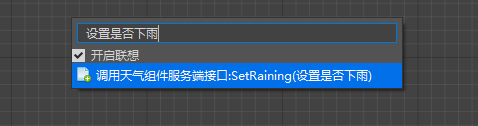

可以看到，在创建节点的搜索框中，开头的部分是`服务端接口`，代表这个接口只有在服务端的相关逻辑中能被调用。相对应的，如果前面显示是`客户端接口`，则只能在客户端的逻辑中被调用。

## 数据类型

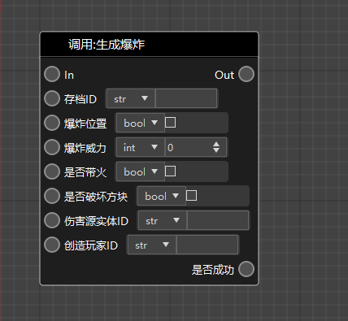

逻辑编辑器中涉及到一些数据的传递，就像上方图片中的节点所示。这些数据都有规定的类型，见下表。

|   数据类型    | 说明                                                         |
| :-----------: | :----------------------------------------------------------- |
| 布尔值(bool)  | 布尔值只有“真”“假”两种取值情况，关系判断、逻辑运算后产生的值都是布尔值。 |
|   整数(int)   | 如-2、0、100等都是整数。                                     |
| 浮点数(float) | 非整数均用浮点数来表示（这是通俗的理解方式），大部分时候开发者无需关心游戏中的数字是整数还是浮点数。 |
|  字符串(str)  | 游戏中玩家在聊天频道的发言、文字提示等都是字符串。           |
|  字典(dict)   | 一一对应的数据的映射，例如玩家和它们的所在坐标，就是可以用字典来表示，一个玩家对应一个坐标。 |
|  列表(list)   | 一个或多个数据的集合，可重复，例如玩家的xyz坐标就可以使用列表来表示。 |
| 对象(object)  | 所有类型的数据都是一个对象。                                 |

## 节点之间的连接

节点之间有两种连线方式，分别是**执行连线**（橙色）和**数据连线**（蓝色）。

**执行连线**必须从一个节点的Out端口连到下一个节点的In端口。代表了节点之间的执行顺序，从第一个节点开始，向连线的方向依次执行。

**数据连线**只代表数据的传递路径，不代表节点的执行顺序。连线的两端需要保证数据类型匹配，如果不匹配，需要在中间加上必要的类型转换。

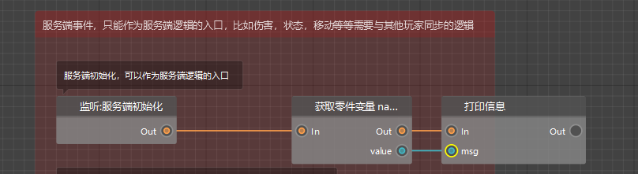

> **注：**
> 1. 不是所有的节点都需要执行连线。例如加法（+）节点，就只需要用数据连线传入两个值，然后右数据连线传出。它的加法逻辑在哪里被调用，就会在哪里被执行。
> 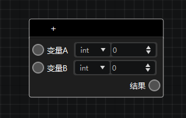
>
>2. 不是每一个Out端口都需要有执行连线相连。例如条件节点会判断输入的布尔值为真还是假，如果是真，则执行“真”这个Out端口的逻辑；如果是假，则执行“假”这个Out端口的逻辑。若你只希望当布尔值为真的时候执行逻辑，但为假的时候不进行任何操作，你就可以将“假”这个Out端口留空，不需要连任何连线。
> 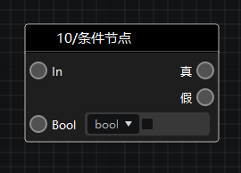

# 课后作业

尝试在服务端初始化事件中，设置世界规则的玩家立即重生规则为真。

## 操作步骤

首先，我们希望实现的效果是：在服务端初始化之后设置世界规则（GameRules）。

那么我们的节点连线，就应该从服务端初始化这里开始连接，并且只能调用服务器相关的接口。

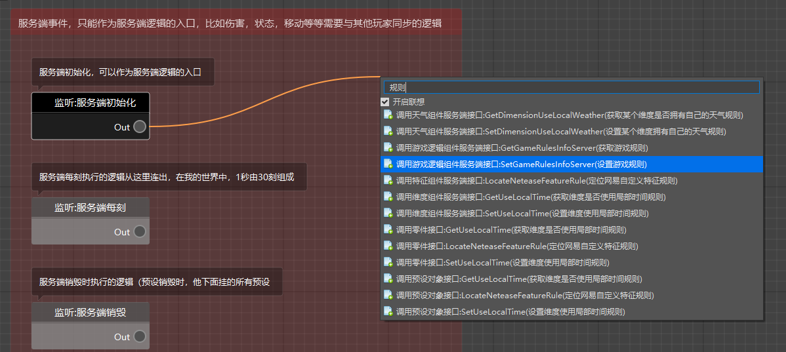

我们在服务端初始化节点后连出一个执行连线，在搜索框中搜索`规则`，选择`SetGameRulesInfoServer(设置游戏规则)`，可以注意到，这个接口注明了是服务端接口。

接下来我们去文档中查找这个节点中的详细参数解释。

文档的地址: [点我](https://mc.163.com/dev/apidocs.html)

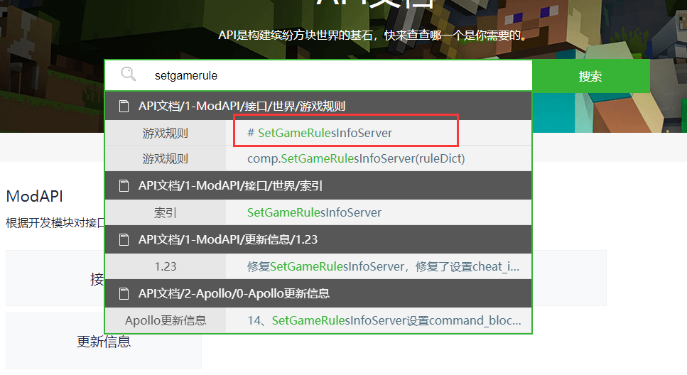

在文档中搜索这个接口相关的英文或者中文，找到对应的说明。

> 1. 如果你还不清楚自己想要的效果应该用哪个节点来实现，你可以先在文档搜索框中输入关键词，浏览相关节点。找到之后，可以复制该接口名，比如这里的`SetGameRulesInfoServer`，然后粘贴到逻辑编辑器的节点输入框中。
>
>2. 在逻辑编辑器的节点列表中，【内置游戏节点】这一分类下有非常庞杂的节点供你选择。如果你创建了一个内置游戏节点，但不清楚它的具体用法，可以将鼠标悬浮在这个节点名称上，稍等片刻就会弹出一个tip，里面有节点对应的文档链接，直接点击链接就可以跳转到该节点的在线文档。
>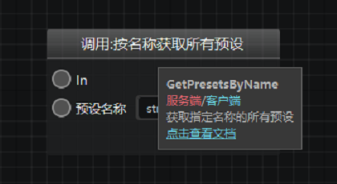


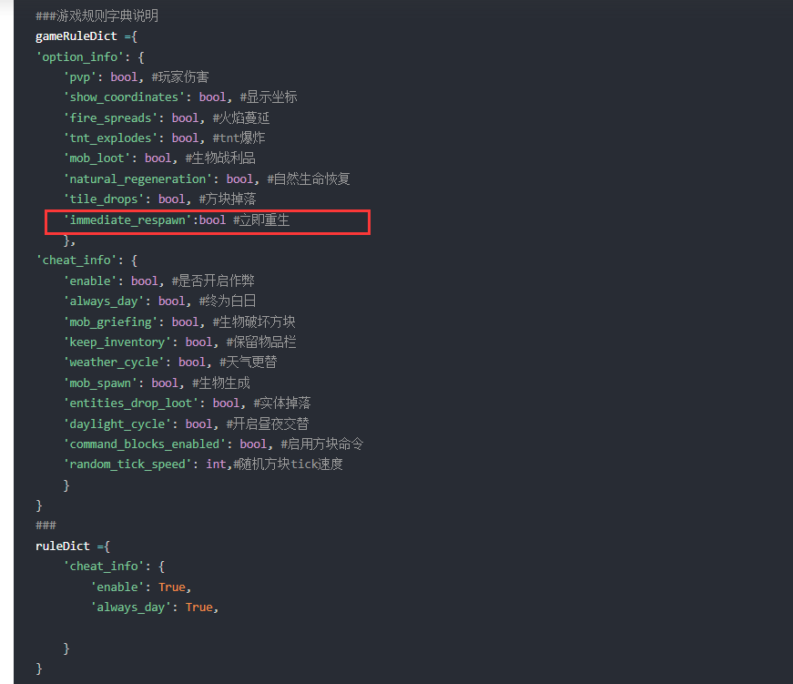

在文档中可以看到示例，也可以看到备注。

> 其中游戏规则字典中每一项都为可选参数,但是设置option_info或者cheat_info其中一项子项后，必须加上option_info或者cheat_info。

从示例中我们了解到如下信息：如果我们需要设置立即重生为真，首先需要构造一个**字典**，然后设置字典中的**值**，并将这个字典**传递给接口**。

查询到如何编写之后，我们就可以在逻辑编辑器中右键新建节点，构造一个字典。不难看出，游戏规则字典是一个两个字典嵌套而成的字典。所以我们先在搜索框中搜索`构造字典`，然后填写对应参数。

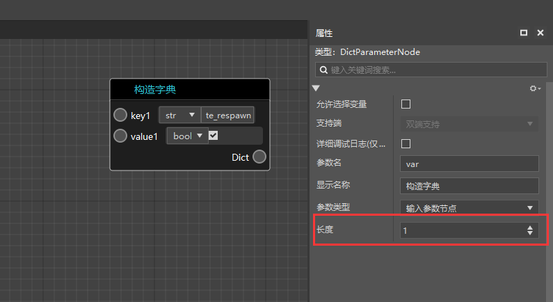

根据我们所学的数据类型的指示，字典的key应该为str类型，值应该为bool类型。我们在字典中key1处选择str，填写`immediate_respawn`，value1选择为bool，并勾选为true。

如果我们需要设置多个规则，就可以在右侧属性窗口中，修改这个字典的长度，让他产生多个一一对应的key和value。

接下来再构造一个字典，key1选择为str，填写`option_info`，并将上一个字典的Dict输出，拖动到新字典的value1处进行连接。

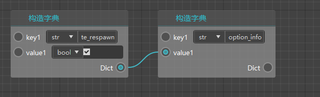

这样我们就得到了一个字典，它的内容是

```json
{
    "option_info": {
      "immediate_respawn": True
    }
}
```

这样我们就完成了游戏规则字典的构造，找到`设置游戏规则`这个节点，还有需要一个参数，是存档ID。存档ID可以通过下面的接口获取。

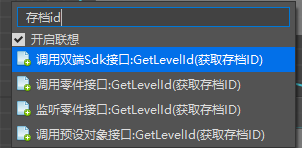

可以看到，这是双端接口，代表是服务端和客户端双端都可以使用的。

这样我们就得到了所有需要的参数，就可以按照下图方式进行连接。

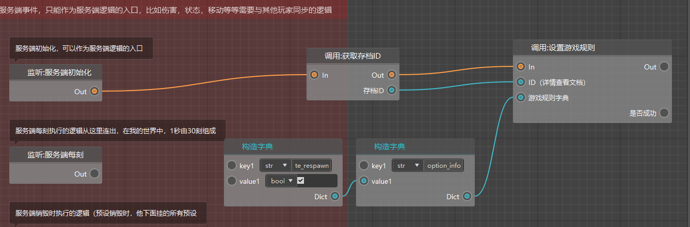

随后我们就可以点击“保存”后再点击“运行”，进入游戏测试，看看是否会立即重生。
