# 逻辑编辑器的基础概念（2）

在上一节的课后作业中，我们已经成功监听了服务器初始化这个事件，并且调用了设置游戏规则这个接口，构造了一个字典来为这个游戏规则提供具体的参数设置。

在本节课，将会继续深入介绍事件、接口、数据结构设置和获取的概念。

同时，我们也应该学会查阅开发文档，来了解具体的参数的含义。

文档的地址 [点我](https://mc.163.com/dev/apidocs.html) 在后续的教程和实际开发途中会经常用到，建议收藏。

<iframe src="https://cc.163.com/act/m/daily/iframeplayer/?id=632865d66b13db499d094787" width="800" height="600" allow="fullscreen"/>

## 事件

事件在计算机程序中，主要起到一个入口的作用。比如我们使用的软件，就拥有初始化事件、关闭事件、最小化事件等等。

利用事件的设计，可以轻松地对程序进行拓展，让第三方的程序来监听这些事件，从而做出对应的响应，并且有些事件是允许中途对事件参数进行修改的，并影响最终结果。

在我的世界中，也利用了这样的事件的设计，来对游戏内容进行二次开发。我们知道，程序是按照顺序执行下去的，那么事件就是一个程序段的运行起点，在某个事件被触发后，监听这个事件的程序就会相应的被执行。

在游戏中，玩家加入游戏就是一个事件，我们可以利用这个事件，开始执行对玩家数据载入相关的代码。同样，玩家放置/挖掘方块，也是一个事件，我们可以监听这种事件来实现类似幸运方块的玩法。在玩家挖掘某个方块后，判断方块是否是幸运方块，并进行后续的随机，并执行相关的效果的代码。

我的世界中有数量巨大的事件，这些事件都在文档中被详细的列出和介绍了，我们可以通过文档，查找对我们玩法开发有帮助的事件，并且学习如何使用它们。

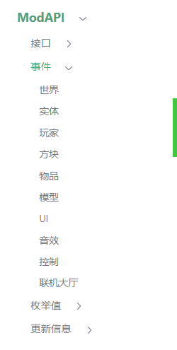

我们打开文档，在左侧导航栏中可以看到有事件的很多种分类，例如我们要制作幸运方块的玩法，需要用到方块被破坏的事件。根据这个逻辑我们可以推测，这个事件可能出现在`玩家`或者`方块`这一类中。我们可以依次进行查找。最终在`方块`分类中，找到`ServerPlayerTryDestroyBlockEvent`，这个事件符合我们的需求，可以让它作为幸运方块的程序的入口。

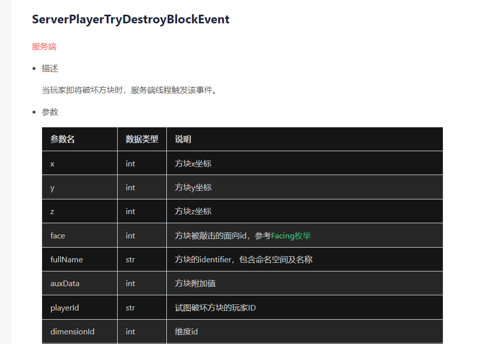

事件同样分为“服务端事件”和“客户端事件”。这里我们需要用到的`ServerPlayerTryDestroyBlockEvent`是服务端的事件，监听后，只能执行服务端逻辑。

查看它的参数列表，我们可以看到对应的参数名和数据类型，这些参数在我们后面的程序做判断时都有可能会用到，可以先进行了解。

找到需要使用的接口后，就可以到逻辑编辑器中创建节点，搜索`ServerPlayerTryDestroyBlockEvent`，创建监听。

搜索时我们会发现有两个即将破坏方块事件，一个是`服务端事件`，一个是`零件事件`。

这里我们简单理解成：零件事件会和这个蓝图零件所挂接的预设匹配，而服务端事件是可以在任意预设下使用的。

- **服务端事件**：如果你希望当前场景中的任何一个方块被任意玩家破坏的时候，都会从监听节点开始执行一些逻辑，那么你应该使用“监听服务端事件”。

- **零件事件**：零件事件只用于预设架构，如果你使用了实体预设/玩家预设，并且将你的蓝图零件挂接在了这个预设下，那么如果使用零件事件的话，只有这个破坏方块时，才会监听到这个事件并且执行后续的逻辑。

一般情况下，推荐使用零件事件。

## 接口

接口指程序预留出来的，给其他第三方调用的函数。通常我们只需要了解接口调用后会产生的效果和传入的参数，而不需要了解这个函数内部会做什么处理来达到这个效果。

就比如上一节中使用过的设置游戏规则的接口，我们只需要知道执行接口后，游戏规则会被改变，而不需要知道游戏内部是怎么让这个游戏规则生效的。

所有可以用的接口也都可以在文档中查到，我们可以通过大致分类，来定位接口的文档可能出现的位置，并深入进行查找。

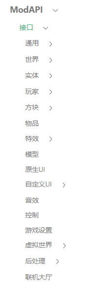

例如需要对玩家进行伤害，那么我们就是很容易看出来，这个接口是跟`玩家`、`实体`有关，我们就可以在这些分类中进行搜索。

或者我们也可以使用搜索框，来更加快速的查找我们需要使用的接口。

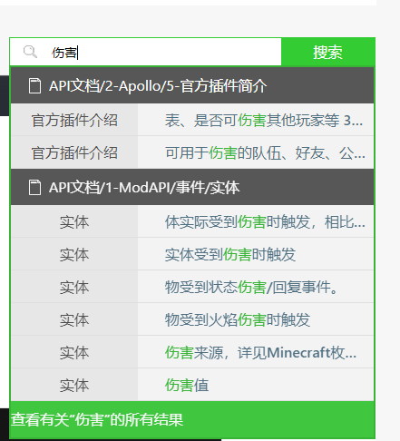

可以在所有结果中找到我们需要的接口。

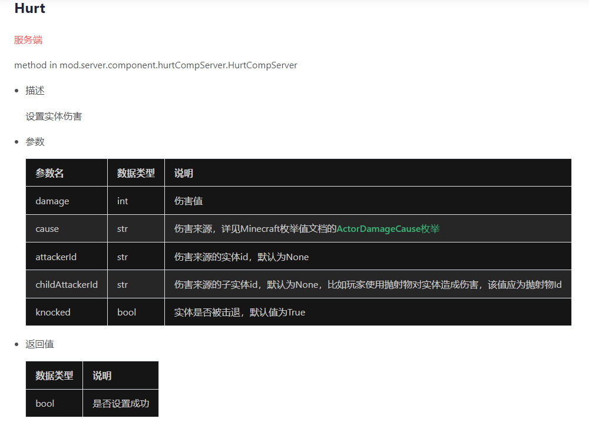

就可以很轻松的找到我们想要使用的接口，并且看到它的相关参数解释，以及返回值。

查找完成后，我们就可以回到编辑器，搜索`Hurt`，并找到这个接口，创建节点进行使用。

不过需要注意的是，像`玩家破坏方块`这样的操作，同时拥有事件和接口。

如果我们在`玩家破坏方块事件`中，调用了`玩家破坏方块接口`，就会再次触发`玩家破坏方块事件`，从而一直循环下去。

在开发中，我们应该对可能出现这样的死循环的情况进行考虑，并添加限制条件，例如设置一个列表，将玩家的实体ID加入列表，并在调用`玩家破坏方块接口`之前，判断玩家的实体ID在不在这个列表中，并且在完成破坏后，将玩家的实体ID从列表中移除，从而避免死循环。

那么这样，就涉及到数据结构的获取与设置。

## 数据结构的获取与设置

数据结构可以用来更加高效、有序地管理数据。在逻辑编辑器的开发中，可以使用的数据结构主要有两个，分别是列表和字典。

### 列表

列表即Python中的list，在逻辑编辑器中，可以找到`构造列表`，来生成一个空列表。

列表中的item代表它的元素，选中构造列表节点后，可以在右侧属性面板，修改它的长度。

每一个元素都有其对应的索引位置，索引位置从0开始，例如上图的列表，第0位的元素是"a"，第1位的元素是"b"。

那么如何获取列表中的某一个索引位置的元素呢？我们可以使用“获取属性”节点。

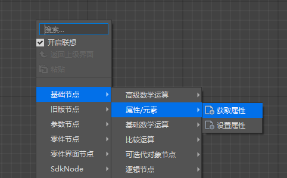

在对象端口，连接List端口，key处填写需要获取的索引值。例如下图，获取到的值就是"a"。

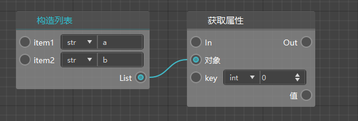

如果我们需要获取列表的所有元素，可以使用`循环遍历节点`。遍历节点有两种，分别是`条件循环遍历节点`和`顺序循环遍历节点`。在这里只简单举个例子，在下一节会详细介绍。

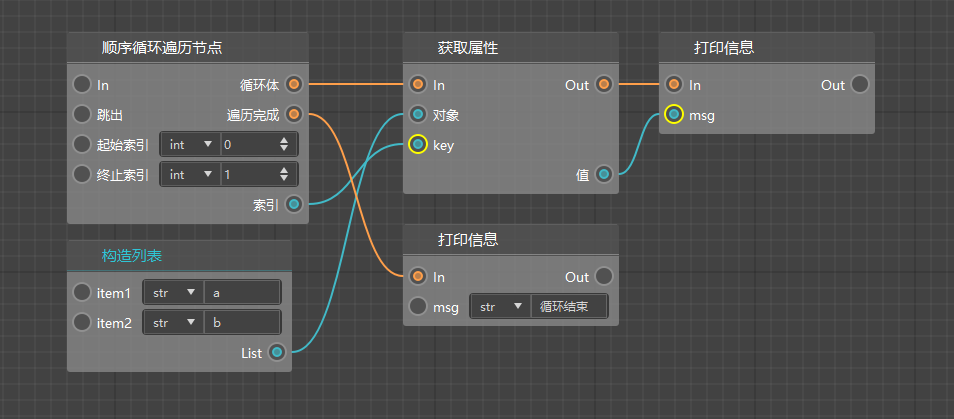

可以自行根据需求，来选择使用。

### 字典

字典是一个可以用来存储一一对应的数据的数据结构，字典中的每一对元素都有一个key和value，二者是一一对应的，可以通过key来查找对应的value，但是不能通过value来查找key。

例如需要存储所有玩家的经验值，那么字典的key就可以是玩家id，value就可以是玩家的经验值。

需要注意的是，一个字典中一个key只能对应一个值。

在编辑器中，使用`构造字典`来创建，同样可以在右侧属性窗口修改长度。当然也可以设置长度为0，来构造一个空字典。

字典中的值仍然可以像列表一样，通过设置/获取属性来获取和修改。

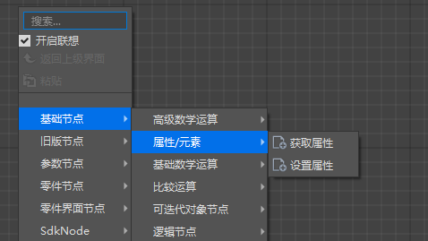

例如下方的操作，可以将"b"的值设置到2，并获取a的值。

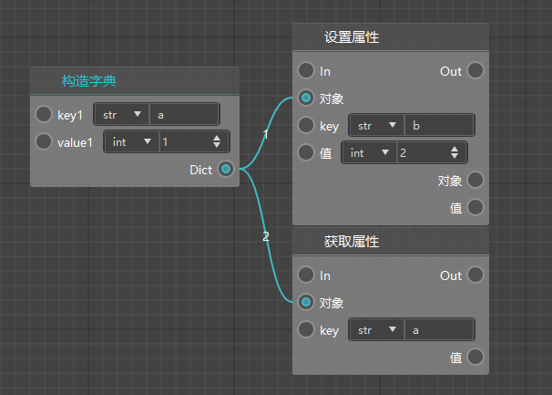

## 课后作业

在实体受到伤害事件中，将伤害返还给攻击者。

### 操作步骤

如果是跟着课程的步骤操作的，我们现在已经创建了一个蓝图零件，并将其挂接到玩家预设上。

那么我们就可以在这里，监听`实体受到伤害事件`这个零件事件。

然后再创建一个`设置实体伤害`的接口。我们可以通过观察文档，知道需要被伤害的实体、伤害值、伤害来源实体，是我们需要填写的参数。

先将节点进行下图的连接，来确定在受伤后，谁攻击谁。

接下来我们需要填写的就是伤害值，直接将伤害值传递到设置实体伤害接口。随后连接执行连线。

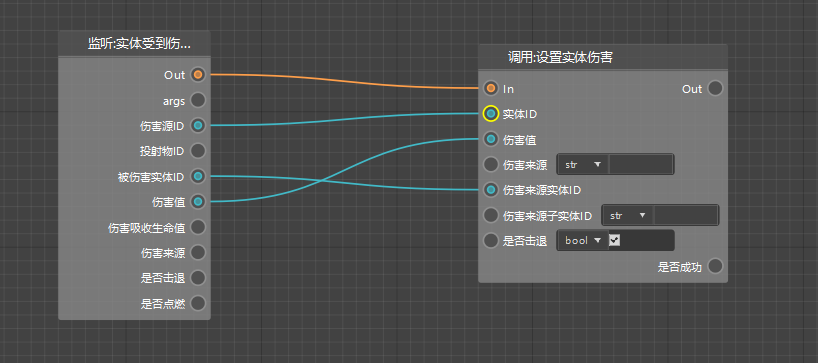

这样我们就制作完成了一个简单的返还攻击伤害的功能。但是这样的节点会在一些情况下产生报错，比如玩家受到摔落伤害时。

摔落伤害并没有伤害源ID，需要在返还伤害前进行判断，判断节点会在后面进行介绍。

