# 逻辑编辑器的基础概念（5）

目前为止，我们已经基本介绍完了所有逻辑编辑器的基础概念。本节将继续介绍一些综合性的知识。

<iframe src="https://cc.163.com/act/m/daily/iframeplayer/?id=63286681a240f794f8c5fbb7" width="800" height="600" allow="fullscreen"/>

## 零件节点和SDK节点

相信在之前的学习过程中，大家都已经注意到了，很多接口或者事件，都同时拥有零件节点和SDK节点。

如果属于只有零件节点或SDK的接口或者事件，我们可以直接使用这个SDK或零件节点。

那么在某个接口或者事件，同时拥有零件和SDK节点的情况下，该如何选择呢？

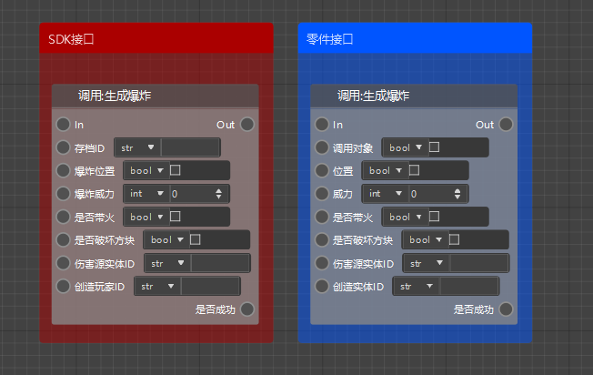

上面的图片同样都是生成爆炸接口，但是左侧是SDK接口，右侧是零件接口。

可以很清晰地发现，除了第一个参数外，其他所有参数都是一致的。SDK接口的第一个参数是存档ID，需要调用`GetLevelId`接口来获取，而零件接口第一个参数是调用对象，可以不填写。

那么就可以从接口的节点方面，就可以很轻松地看出来，SDK接口需要额外多传入一个存档ID的参数，而零件接口不需要。显而易见，零件接口更加的方便。

对于事件来说，SDK接口和零件接口基本是一致的，只不过零件事件的使用需要和它所挂接的预设的类型匹配，否则有可能无法正常工作。

## 非空预设和空预设

在本章之前的所有内容中，我们都是把蓝图零件挂接在一个具体的预设上的，即非空预设。例如我们之前制作的监听实体受伤的事件，就是在玩家预设上挂接了一个蓝图零件。

但是，其实在预设分类中，还有一个比较特殊的预设，那就是空预设。

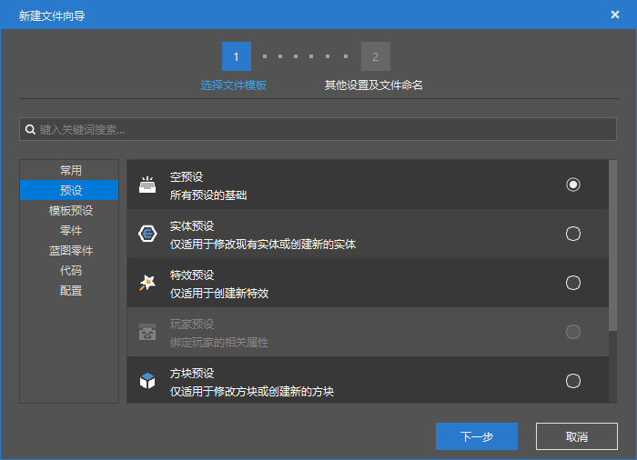

空预设不和任何实体、方块等游戏内元素挂钩，直接创建空预设并挂载蓝图零件会无法使用。

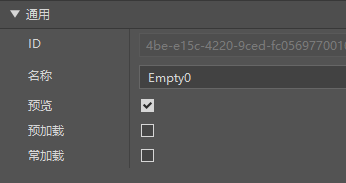

只有在空预设的属性处，勾选预加载，才会主动生效这个预设，在(0,100,0)的位置。具体说明可以把鼠标移动到预加载标签上进行查看。

如果勾选常加载，就不会随着区块卸载而取消加载这个预设。

一般来说，如果制作一些通用的蓝图零件，可以在空预设上挂接蓝图零件，并且勾选预加载和常加载，通过监听SDK事件来实现需要的功能。

## 课后作业

现在相信各位已经对于逻辑编辑器的基础用法基本上都了解了，那么现在尝试使用逻辑编辑器和预设功能，制作一个完整的玩法功能吧！

**作业要求：**

利用开发者工作台的编辑器，制作出一个幸运方块玩法

### 操作步骤

首先新建一个空白附加包。在关卡编辑器的菜单栏，找到作品，更改命名空间为`luckyblock`，这样我们的mod名就不再是随机的字符，同时如果玩家使用指令给予物品也更方便辨认。

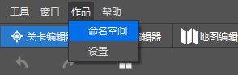

接下来我们新建一个方块配置，命名为`luckyblock`，数据模板选择发光的普通方块。

自己绘制一个幸运方块的贴图，或者将下放的贴图保存，然后复制到`textures/blocks`中。

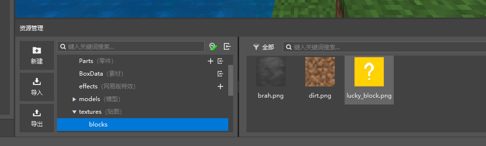

然后设置一些相关属性，设置后如图所示。

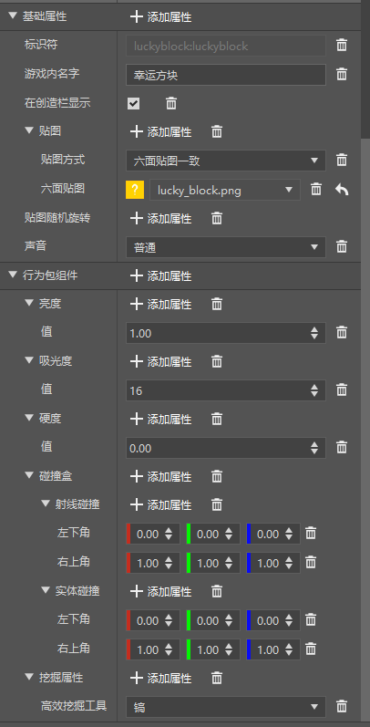

这样我们就得到了一个会发光的，挖掉可以正常掉落的幸运方块。但是它还没有任何的实际功能。

接下来我们创建一个玩家预设，并且新建并挂载一个名为`LuckyBlock`的蓝图零件。

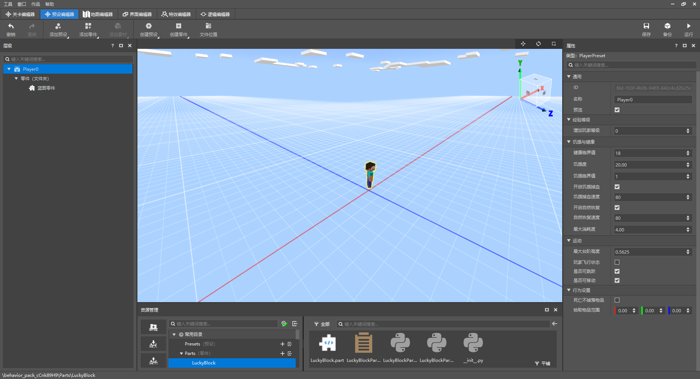

接下来打开`LuckyBlockPart`的蓝图逻辑，我们需要监听方块即将破坏的事件，判断是不是幸运方块，并且取消掉落物生成，再触发一个随机事件。

监听`ServerPlayerTryDestroyBlockEvent`零件事件，并将方块标识符和`luckyblock:luckyblock`进行字符串比较，如果`=`再进行下一步，将args中的`spawnResources`设置为False

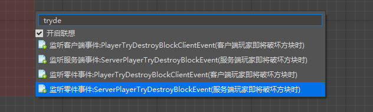

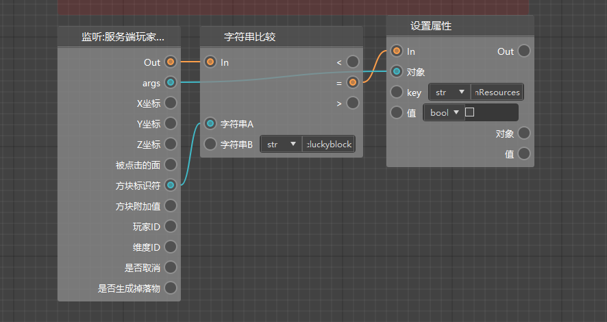

接下来就是事件的随机了，我们这里简单做一个随机生成生物。要随机生成生物，我们首先就应该有一个随机的生物identifier列表。

首先在左侧变量窗口，我们新建一个`randomList`变量，定义它为我们的生物随机列表。

并且在服务端初始化时，给其赋值。

列表中我们这里给3个值，`minecraft:zombie`,`minecraft:skeleton`,`minecraft:creeper`，代表3种怪物。

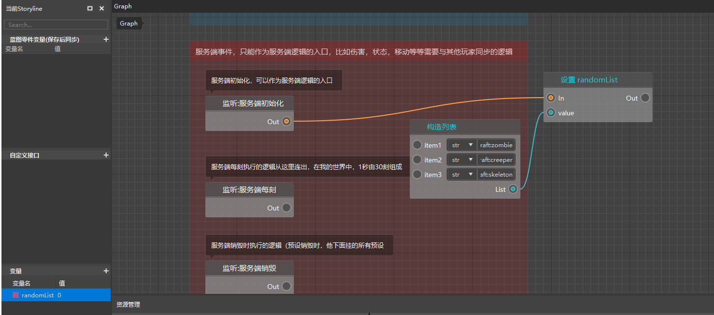

接下来获取变量randomList，然后根据它的最大长度，进行随机，取一个[0,数量)的整数值，获取randomList中的属性，这样就可以得到一个随机的实体id。

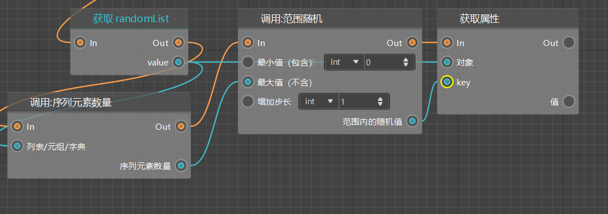

接下来通过类型创建实体，实体类型就是我们随机获得的值。

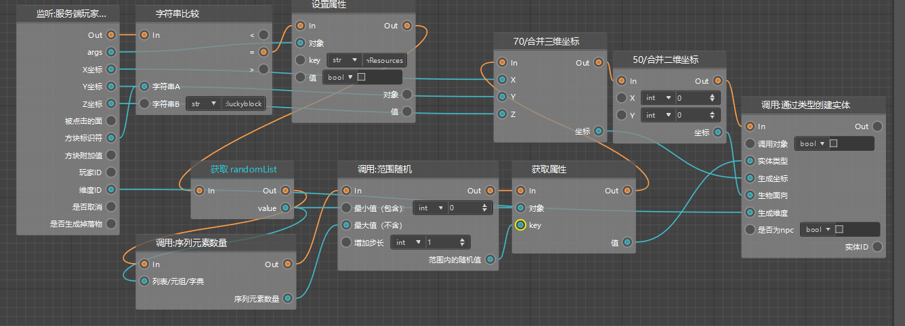

最后将数据进行传递，生成坐标、纬度ID通过事件的参数获得，生成面向为一个0 0的二维坐标。

这样我们就完成了一个可以随机刷新生物的随机方块，那么更多的随机事件就可以由大家自行去探索。

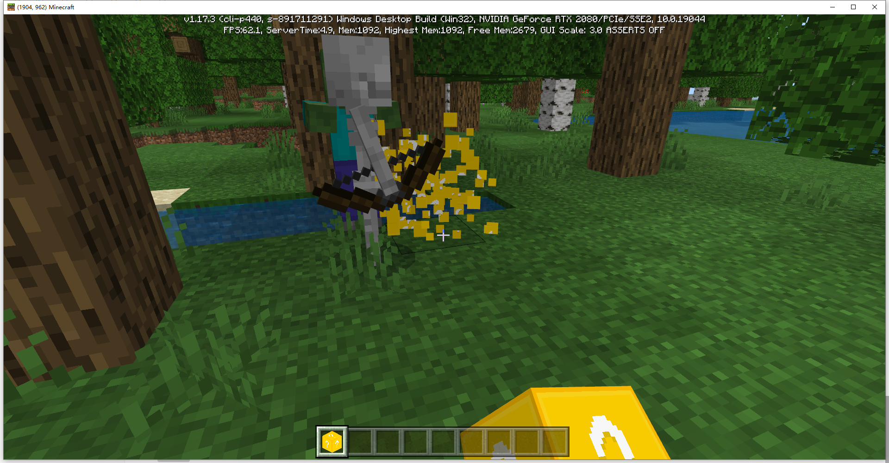