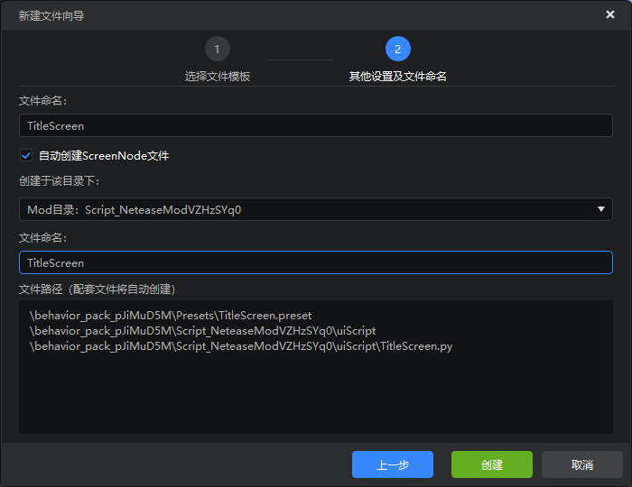

# 使用Python编写界面逻辑

在上一章，我们已经使用逻辑编辑器，制作了一个简单的弹出界面，用来发送title消息。

本节将会继续使用上次所制作的界面json文件，使用Python零件开发来重新实现一次功能。

<iframe src="https://cc.163.com/act/m/daily/iframeplayer/?id=6328682ee6c041f2578ca826" width="800" height="600" allow="fullscreen"/>

在开始编写之前，我们需要找到上一章使用逻辑编辑器制作界面逻辑的时候，所编辑的项目，然后选择导出资源，找到资源包，ui文件夹中，当时所编辑的文件。


导出并保存到一个能找得到的位置，再新建一个空白附加包，将刚刚导入的界面文件导入。

导入完成之后，可以自行修改命名空间。继续新建一个界面预设，给它命名为`TitleScreen`。创建完成后，勾选预加载，切换到PushScreen方式打开界面。



到这里的操作和之前使用逻辑编辑器是完全一致的。

接下来我们就可以打开PyCharm，打开这个项目的文件夹，进行代码编辑，第一次打开需要设置`Sources Root`，这里不再截图展示。


找到`脚本文件夹/uiScript/TitleScreen.py`，就是我们的ui逻辑文件。

默认第二行的代码是

```python
import client.extraClientApi as clientApi
```

我们这里可以将其修改为

```python
import mod.client.extraClientApi as clientApi
```

这样就可以正常的使用补全功能，解决自动提示的报错。

观察这个类，我们可以看到其实和逻辑编辑器中的蓝图零件，可以重写的函数基本一致，同样拥有4个函数。其中`OnActivate`和`OnDeactive`是只有PushScreen方式创建的界面才会被调用的函数。

使用Python代码创建的UI，有两种逻辑编写的方式。一种是像逻辑编辑器一样，在初始化时为按钮添加回调函数的绑定。还有一种是，使用数据绑定，在Json文件中提前定义好需要调用的Python文件，和代码中的函数和变量进行绑定。

## 方法一

我们首先先介绍第一种方法

那么现在我们就可以在`__init__`函数中，在初始化时将一些常量定义好。比如我们需要使用到的ui控件的路径。

```python
    def __init__(self, namespace, name, param):
        ScreenNode.__init__(self, namespace, name, param)
        self.mMainPanel = "/main_panel"
        self.mTitleText = self.mMainPanel + "/title_text"
        self.mConfirmButton = self.mMainPanel + "/confirm_button"
```

这样就定义好了所有我们可能要用到的控件的路径，方便后面的调用。

接下来重写`Create`函数，为按钮添加回调函数。

```python
    def Create(self):
        """
        @description UI创建成功时调用
        """
        buttonControl = self.GetBaseUIControl(self.mConfirmButton).asButton()
        buttonControl.AddTouchEventParams({"isSwallow": True})
        buttonControl.SetButtonTouchUpCallback(self.OnConfirmButtonClick)

    def OnConfirmButtonClick(self, args):
        pass
```

这样我们的在按钮点击后，就会触发`OnConfirmButtonClick`函数

接下来我们回到预设编辑器，新建一个空零件，命名为`UILogic`，并将其挂接到`TitleScreen`这个界面预设下。

我们在这个零件中，监听客户端发送过来的发送Title事件。首先需要给我们的这个零件改个好记的名字，这里叫做`界面服务端监听`，因为我们等会儿还需要在界面逻辑文件中，通过名字获取这个零件的示例，来给自己的服务端发送通知消息。同时在初始化服务器的时候，监听`TitleEvent`事件，并发送Title指令。

代码参考如下：

```python
@registerGenericClass("UILogicPart")
class UILogicPart(PartBase):
    def __init__(self):
        PartBase.__init__(self)
        self.name = "界面服务端监听"

    def OnRecvTitle(self, args):
        self.SetCommand("/title @a title {}".format(args["text"]))

    def InitServer(self):
        """
        @description 服务端的零件对象初始化入口
        """
        self.ListenSelfEvent("TitleEvent", self, self.OnRecvTitle)
```

编写完`界面服务端监听`这个零件后，我们就可以回到界面逻辑的代码文件中，修改按钮回调函数。

在py文件开头处，先引入预设API

```python
import Preset.Controller.PresetApi as presetApi
```

然后修改按钮回调函数，先获取`TitleScreen`这个预设，再获取它的零件`界面服务端监听`，随后调用`NotifyToServer`函数，发送我们的事件。

发送完成后关闭这个界面。

```python
    def OnConfirmButtonClick(self, args):
        text = self.GetBaseUIControl(self.mTitleText).asTextEditBox().GetEditText()
        presetApi.GetPresetByName("TitleScreen").GetPartByName("界面服务端监听").NotifyToServer("TitleEvent", {"text": text})
        clientApi.PopScreen()
```

完整代码如下：

```python
# -*- coding: utf-8 -*-
import Preset.Controller.PresetApi as presetApi
import mod.client.extraClientApi as clientApi

ViewBinder = clientApi.GetViewBinderCls()
ViewRequest = clientApi.GetViewViewRequestCls()
ScreenNode = clientApi.GetScreenNodeCls()


class TitleScreen(ScreenNode):
    def __init__(self, namespace, name, param):
        ScreenNode.__init__(self, namespace, name, param)
        self.mMainPanel = "/main_panel"
        self.mTitleText = self.mMainPanel + "/title_text"
        self.mConfirmButton = self.mMainPanel + "/confirm_button"

    def Create(self):
        """
        @description UI创建成功时调用
        """
        buttonControl = self.GetBaseUIControl(self.mConfirmButton).asButton()
        buttonControl.AddTouchEventParams({"isSwallow": True})
        buttonControl.SetButtonTouchUpCallback(self.OnConfirmButtonClick)

    def OnConfirmButtonClick(self, args):
        text = self.GetBaseUIControl(self.mTitleText).asTextEditBox().GetEditText()
        presetApi.GetPresetByName("TitleScreen").GetPartByName("界面服务端监听").NotifyToServer("TitleEvent", {"text": text})
        clientApi.PopScreen()
```

## 方法二

接下来介绍如何通过数据绑定的方式来获取文本框的数据，绑定按钮的回调函数。

在跟着方法一的步骤操作之后，方法二的区别就主要在`uiScript/TitleScreen.py`这个界面逻辑文件上。

数据绑定的官方说明文档 <a href="../../../../../mcguide/18-界面与交互/70-UI数据绑定.html">点我</a>，可以配合本教程食用。

我们查阅UI说明文档，找到我们所使用的界面控件，查看他的详细Json参数。

例如我们这里使用了<a href="../../../../../mcguide/18-界面与交互/30-UI说明文档.html#image-button">按钮</a>和<a href="../../../../../mcguide/18-界面与交互/30-UI说明文档.html#texteditbox">文本编辑框</a>。

### 按钮

我们主要看文档中的参数解释的最后几个。

可以看到`$pressed_button_name`这个参数，对应了python的类名和对应的函数。`button_mappings`代表了具体映射。

| $pressed_button_name        | fpsBattle代表编写UI逻辑的python类名，click代表按钮按下时会执行该python类的click函数。也可以使用API AddTouchEventHandler 动态注册按钮回调 |
| --------------------------- | ------------------------------------------------------------ |
| is_handle_button_move_event | 表示按钮是否可以响应按钮移动事件，需置true配合API AddTouchEventHandler使用 |
| button_mappings             | 表示按钮事件响应映射网，需置[]配合API AddTouchEventHandler使用 |

我们再打开`资源包/ui/soldier_title_screen.json`这个文件，搜索`common.button`，找到我们的按钮控件。


可以看到，按钮的json配置中已经存在这两个值，接下来我们按照要求修改，删除`button_mappings`这个项，并修改`$pressed_button_name`为`%文件名.函数名`。具体的来说，就是修改为

````json
"$pressed_button_name" : "%TitleScreen.OnConfirmButtonClick",
````

**编辑完这个文件之后，建议不要再次用界面编辑器打开这个界面。否则有可能会被自动覆盖，覆盖后需要再次将`button_mappings`删除**

接下来回到`TitleScreen.py`，为`OnConfirmButtonClick`添加绑定，在函数的上一行，添加`@ViewBinder.binding(ViewBinder.BF_ButtonClickUp)`。

同时删除按钮监听的相关函数。

```python
    def Create(self):
        """
        @description UI创建成功时调用
        """
        pass

    @ViewBinder.binding(ViewBinder.BF_ButtonClickUp)
    def OnConfirmButtonClick(self, args):
        text = self.GetBaseUIControl(self.mTitleText).asTextEditBox().GetEditText()
        presetApi.GetPresetByName("TitleScreen").GetPartByName("界面服务端监听").NotifyToServer("TitleEvent", {"text": text})
        clientApi.PopScreen()
```

### 文本编辑框

接下来继续看文本编辑框的绑定。

绑定的参数主要是`$text_edit_box_content_binding_name`和`$text_box_name`，

我们参考文档中的注1，定义一个变量，存储文本框中的实时内容。

然后定义2个函数，一个赋值，一个返回值，并且修改按钮的回调函数，让按钮从我们定义的这个变量获取文本内容。

```python
class TitleScreen(ScreenNode):
    def __init__(self, namespace, name, param):
        ScreenNode.__init__(self, namespace, name, param)
        self.mText = ""

    @ViewBinder.binding(ViewBinder.BF_EditChanged | ViewBinder.BF_EditFinished)
    def TextBox(self, args):
        self.mText = args["Text"]
        return ViewRequest.Refresh

    @ViewBinder.binding(ViewBinder.BF_BindString)
    def ReturnTextString(self):
        return self.mText

    @ViewBinder.binding(ViewBinder.BF_ButtonClickUp)
    def OnConfirmButtonClick(self, args):
        presetApi.GetPresetByName("TitleScreen").GetPartByName("界面服务端监听").NotifyToServer("TitleEvent", {"text": self.mText})
        clientApi.PopScreen()
```

那么不难发现，其实数据绑定，只是将一个函数，绑定一个对应的类型，并将其体现到json中。

例如`ReturnTextString`就返回了一个str类型的变量，并且binding中的类型也是`BF_BindString`，一个文本变量。

同样的，如果json中需要填写的是int类型的变量，我们也可以定义一个int变量，然后使用binding，绑定`BF_BindInt`，然后返回这个值，并在json文件中修改对应的函数。

接下来我们再修改Json，将对应的配置和我们的类与函数匹配。

```json
						"$text_box_name" : "%TitleScreen.TextBox",
                        "$text_edit_box_content_binding_name" : "#TitleScreen.ReturnTextString",
```

上方截取了部分重要的json配置，修改完成后就应该是这样的。

截至目前就修改完成。

界面的完整代码可以在这里[下载](https://g79.gdl.netease.com/Cpp_AddOn_PartUI.zip)，其中`行为包/uiScript/TitleScreen_V1.py`为方法一的代码，供大家参考。