# 界面编辑器的使用

使用我的世界开发者工作台的界面编辑器功能，可以轻松地对界面进行设计。在本节课程中，将会教你如何制作一个简易的计分板界面。

要使用界面编辑器，首先应该创建一个空白附加包项目。切换到基岩版组件分类，点击新建，选择空白附加包。

作品名称随意填写，仅用于区分不同的项目，修改完成后启动编辑。

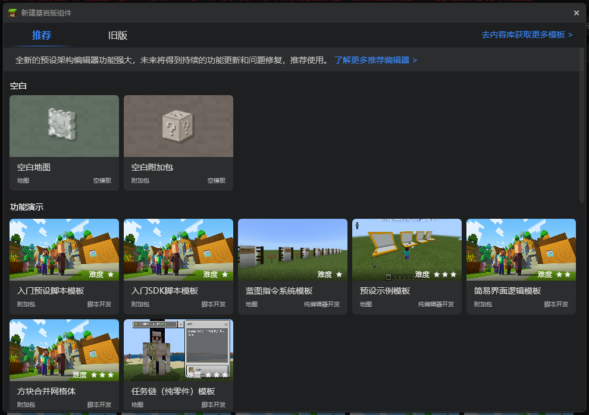

启动完成后，需要点击左上角的**界面**按钮，切换到界面编辑器。

随后点击左侧空间结构的新建，或者底部资源管理的新建按钮，创建一个界面文件。

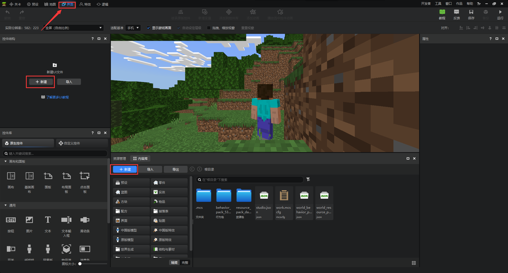

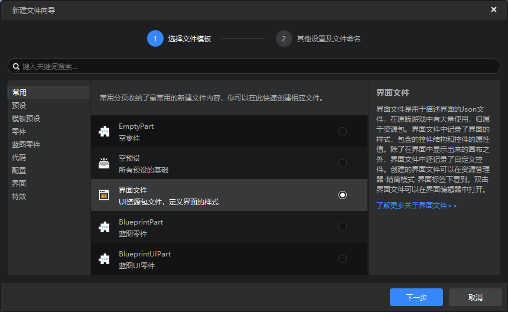

文件命名，没有特殊要求，推荐使用`团队名_界面名`，方便管理。

在这里，因为我们要尝试制作一个计分板模组，所以命名为`test_scoreboard`。

创建完成后，在默认窗口布局下：

- 左上角**控件结构**，即这个界面的树形展示区
- 左下角**控件库**，在这里可以使用原生的控件或自定义控件，对界面进行设计
- 中间为预览区域，可以实时展示正在编辑的界面
- 中下为资源管理，可以在需要时查找，使用资源
- 右侧为**属性**面板，在预览区域中选中某个控件，属性面板会显示其对应的属性并可以修改

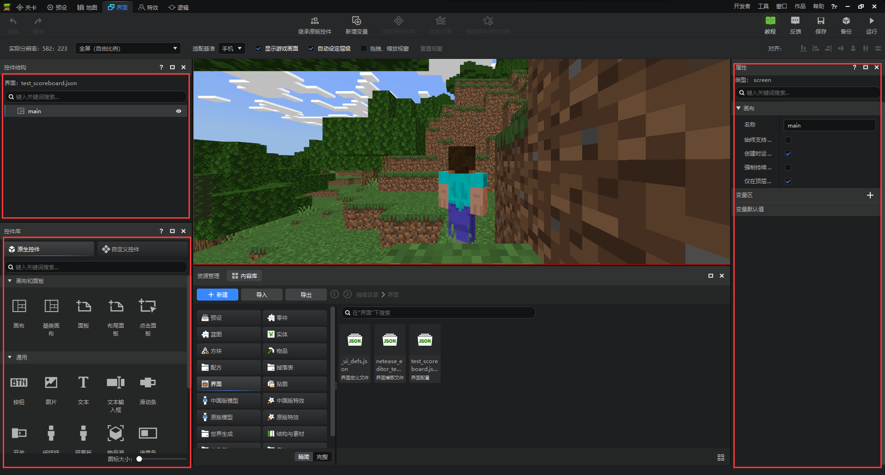

原版计分板：

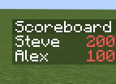

要制作一个计分板界面，首先我们可以对其组成进行分析，计分板可以由两个控件构成：

- 图片
- 文本

首先新建一个图片控件，设置其父子锚点到右边，修改名称为bottom。修改尺寸X为`最大子控件尺寸X`，尺寸Y为`最大子控件尺寸Y`。

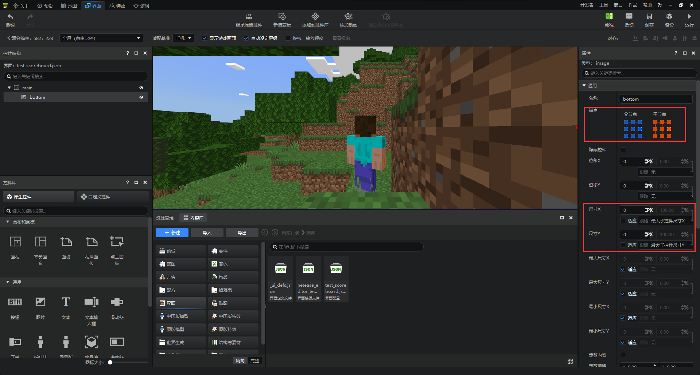

这个控件会作为计分板底部的颜色较浅的区域，可以设置其使用贴图为原生图片`textures/ui/white_background.png`，勾选填充，并修改颜色和透明度。具体参数可以自行根据喜好调整。

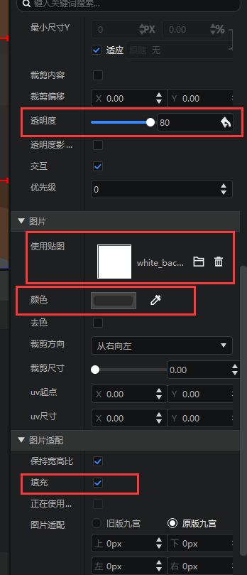

接下来，我们需要向这个名为bottom的图片控件内添加一个文本，用来显示计分板的文本内容。

`尺寸X`和`尺寸Y`修改为适应，这样尺寸大小就会根据文字内容动态调整。

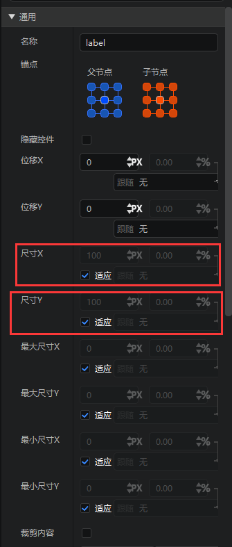

为了还原原版计分板，可以将`对齐`改为左，内容可以先随意填写几行文字，用来查看效果。

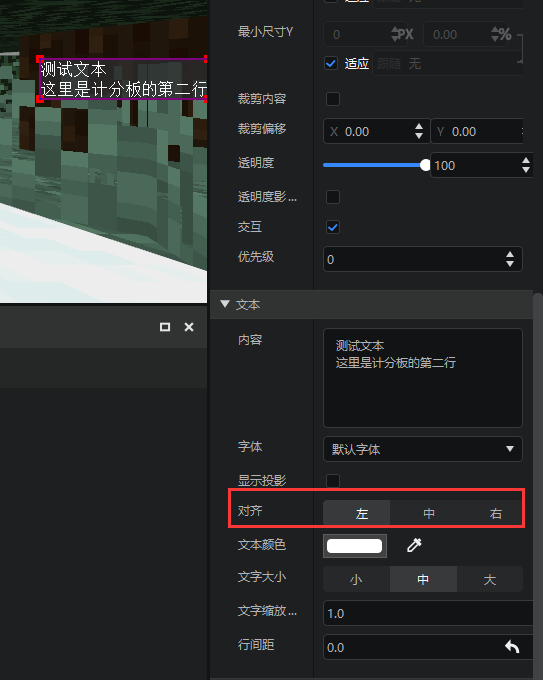

接下来开始制作计分板的标题，在`bottom`控件下，新增一个图片控件，命名为`title`。

父锚点设置为上，子锚点设置为下。这样这个图片控件就会显示在`bottom`控件的上方。

此外，标题的`尺寸X`应该和文本控件一样大，所以设置`尺寸X`为最大兄弟控件尺寸X，即文本控件的尺寸X。

`尺寸Y`设置为子控件尺寸Y的100%，根据标题高度动态调整大小。

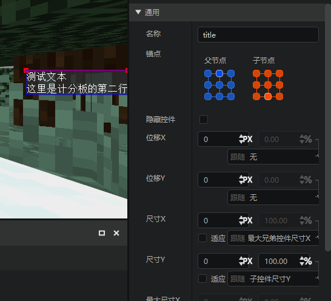

使用贴图同样适用纯色贴图`textures/ui/white_background.png`，同时标题应该颜色稍深一点，透明度和颜色可以根据自己的感觉调整。

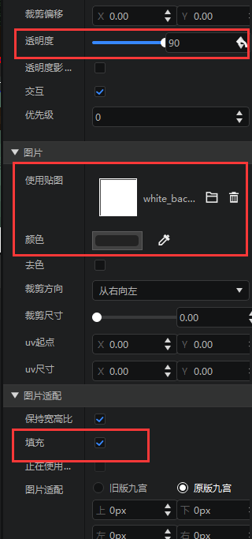

接下来，继续在`title`控件内添加一个文本控件，同样使用适应尺寸X，适应尺寸Y。

完成后，结构控件和效果如下图所示。

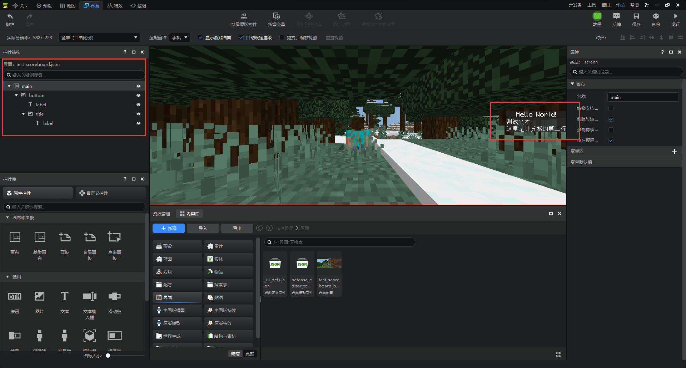

如果需要在界面上添加其它控件都是大同小异的。

**要更深入的了解界面编辑器的其他用法，可以参考[官方教程](https://mc.163.com/dev/mcmanual/mc-dev/mcguide/18-%E7%95%8C%E9%9D%A2%E4%B8%8E%E4%BA%A4%E4%BA%92/1-%E7%95%8C%E9%9D%A2%E7%BC%96%E8%BE%91%E5%99%A8%E4%BD%BF%E7%94%A8%E8%AF%B4%E6%98%8E.html?catalog=1)。**

