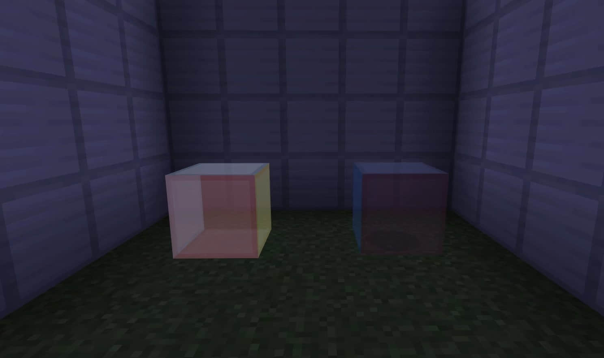
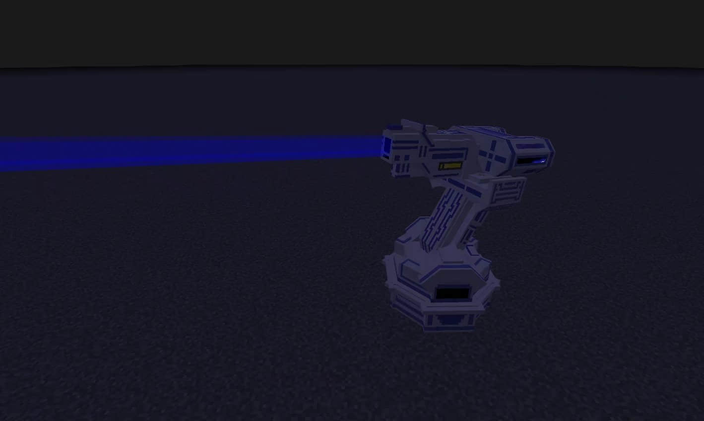
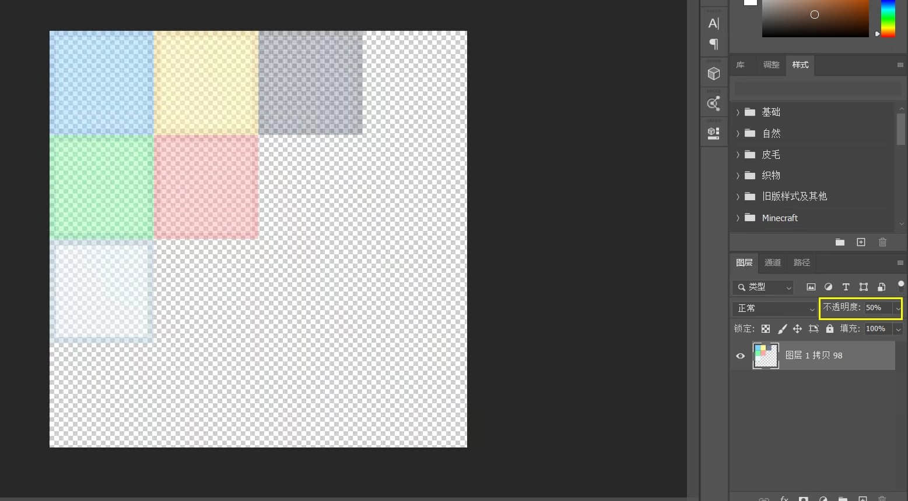
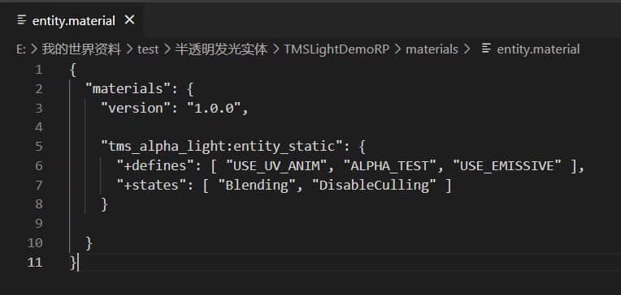
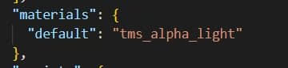

# 制作半透明发光体

>本篇教程获得第一期知识库必看教程奖。
>
>获奖作者：魔灵工作室-创造者MC。

⚠️警告：本教程默认您会自定义实体。

✅提示：本教程网易版和国际版通用。

先来看看最终效果。

（左：半透明发光，右：半透明不发光）

下图是我一个组件里的。

## 教程开始

首先我们把实体纹理图片处理成半透明，png格式即可。

然后在此路径下创建这个文件（或者从官方包里复制过来）`资源包/materials/entity.material` 。

打开文件，写成下图所示。

接下来直接使用这个material就行了。

以上就是本教程的内容，比较简单，所以我就不提供下载demo了。希望能帮到有需要的人。