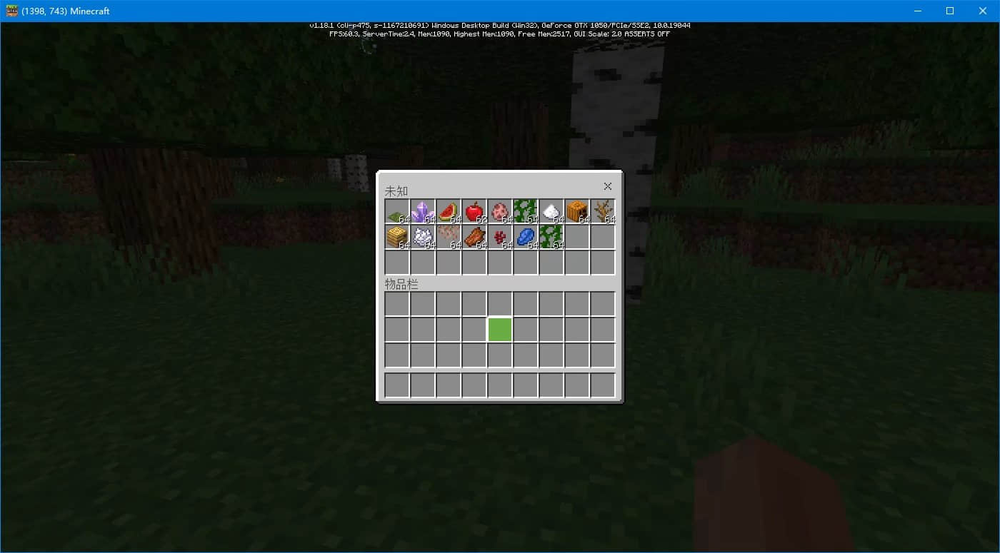
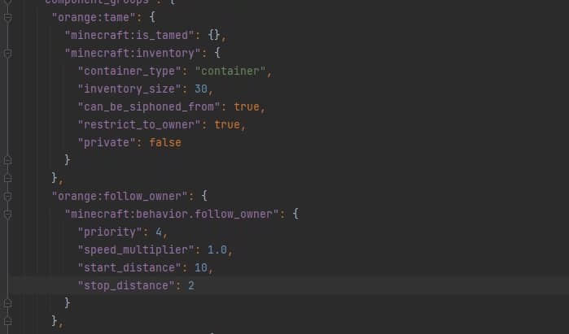

# 创建生物背包

> 本篇教程获得第一期知识库优秀教程奖。
>
> 获奖作者：橘子气泡水。

出门捡东西装不下了怎么办，让猪猪来帮你解决。

**效果图**

**效果视频**

<iframe frameborder="0" height="600" width="800" allowfullscreen="allowfullscreen" src="http://cc.163.com/v/core/externplayer/63e3906c308c57165bcfd40e/"/>

目标：让你的猪猪帮你背东西(移动猪包)。

需求：了解生物json。

原理：在猪猪身上添加背包组件。

过程：创建一个自定义生物然后在他身上添加背包组件。

然后驯服它，他就是你的移动猪包了。