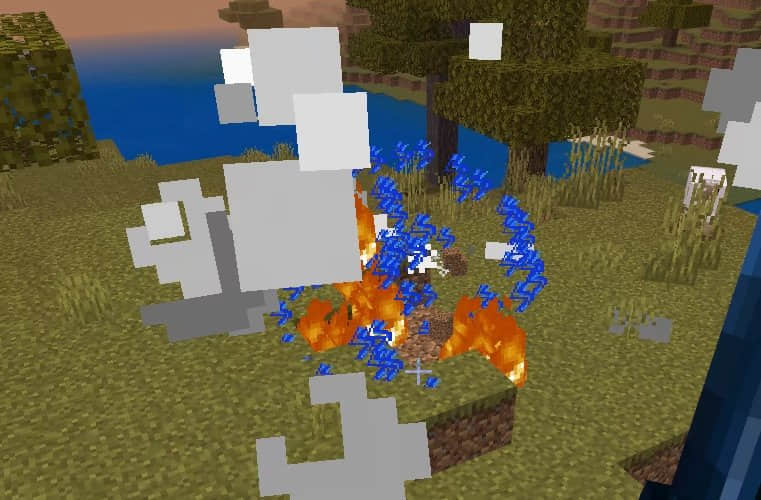
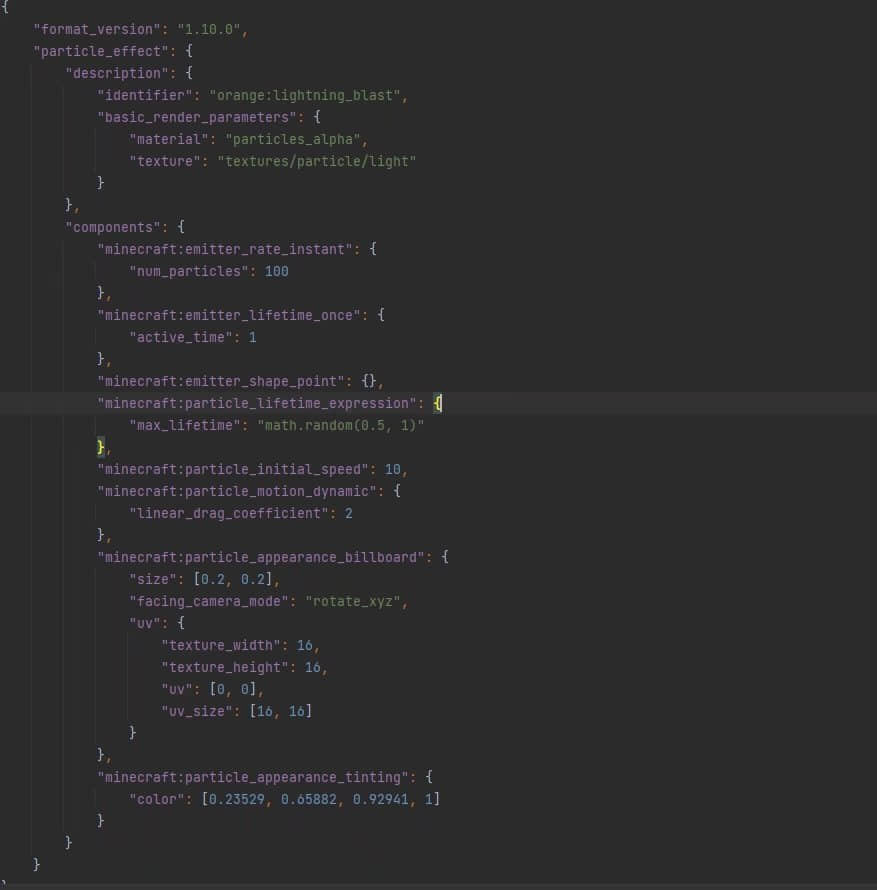
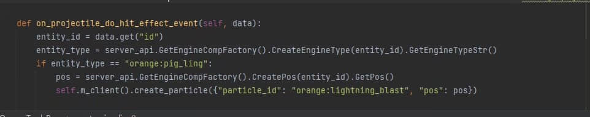
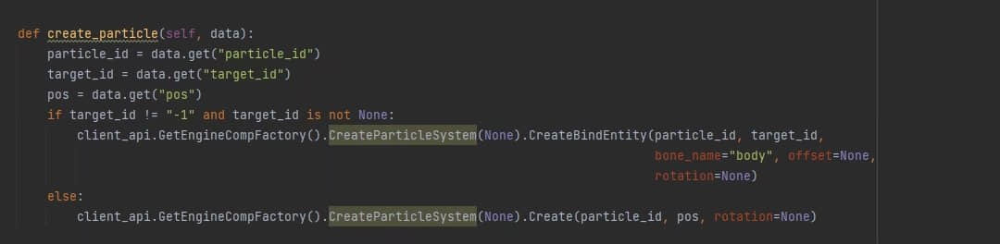

# 给予投掷物碰撞时的粒子效果

> 本篇教程获得第一期知识库优秀教程奖。
>
> 获奖作者：橘子气泡水。

**效果图**

**效果视频**

<iframe frameborder="0" height="600" width="800" allowfullscreen="allowfullscreen" src="http://cc.163.com/v/core/externplayer/63e39d9db6be4c86431f9090/"/>

目标：在子弹爆炸时添加粒子效果。

需求：粒子效果。

## 过程

首先通过打开Snowstorm，然后我们需要一个闪电炸开的效果。

接着在服务端监听投掷物碰撞事件。

最后在客户端创建原版粒子。

