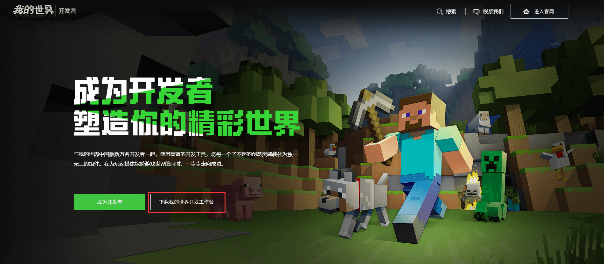
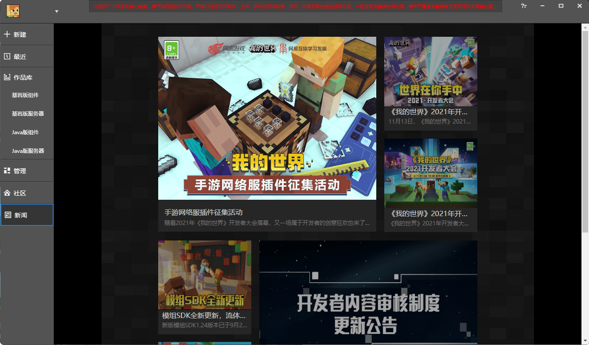
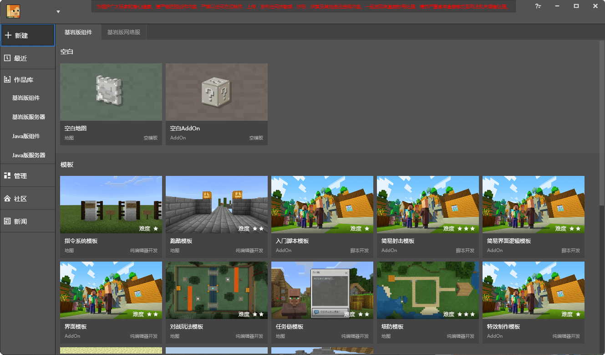
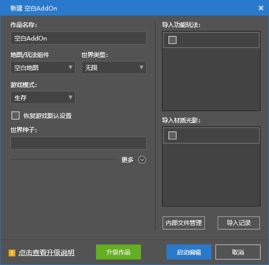

# 新建第一个空白基岩版组件作品

**我的世界开发工作台**（**MC Studio**）是一个集成了开发者启动器、地图编辑器、关卡编辑器、逻辑编辑器、特效编辑器、云端测试平台等功能的一体化开发工具。它极易上手的操作和简单易懂的可视化界面能够为我们的开发工作提供极大的便利。

接下来，我们通过我的世界开发工作台，为我的世界基岩版制作第一个玩法组件作品！

## 下载我的世界开发工作台

我的世界开发工作台可以在我的世界开发者官网（[https://mc.163.com/dev/](https://mc.163.com/dev/)）下载。进入官网，点击“下载我的世界开发工作台”即可开始下载。下载完成后点击安装包开始安装并等待安装完成。

安装完成后桌面即会出现“**我的世界开发者启动器**”的快捷方式。双击打开，在登陆界面中输入开发者账号密码进行登录，便可以查看到我的世界开发工作台的主界面了。

## 新建组件

在上图中我们可以看到，窗口左侧有一个竖排导航栏，这里是我的世界开发工作台的诸多功能的选项卡。我们点击“+新建”按钮，跳转到新建组件页面。

此处的**组件**（**Component**）指代的便是可以作为一个作品而独立存在的模组和地图文件的集合。我们只需要点击“**空白地图**”或“**空白AddOn**”便可以新建一个基岩版空白组件。当然，等你熟悉了组件的结构之后，你也可以通过下方的各种**模板**来快速生成一些具备一定初始功能的组件。此处我们只希望建立一个空白的不包含地图的组件，即空白的**附加包**（**Add-on**）组件，所以我们点击上方的“空白AddOn”按钮。此时我们看到了一个弹出窗口：

根据你的需要进行配置之后，点击“启动编辑”，即可打开我的世界开发工作台的**编辑器**（**Editor**）。此时，我们便已经成功新建了一个空白的附加包组件啦！之后，你便可以在这个空白的组件上大展拳脚，充分发挥你的想象力和技术力，开始你的我的世界开发之旅！

