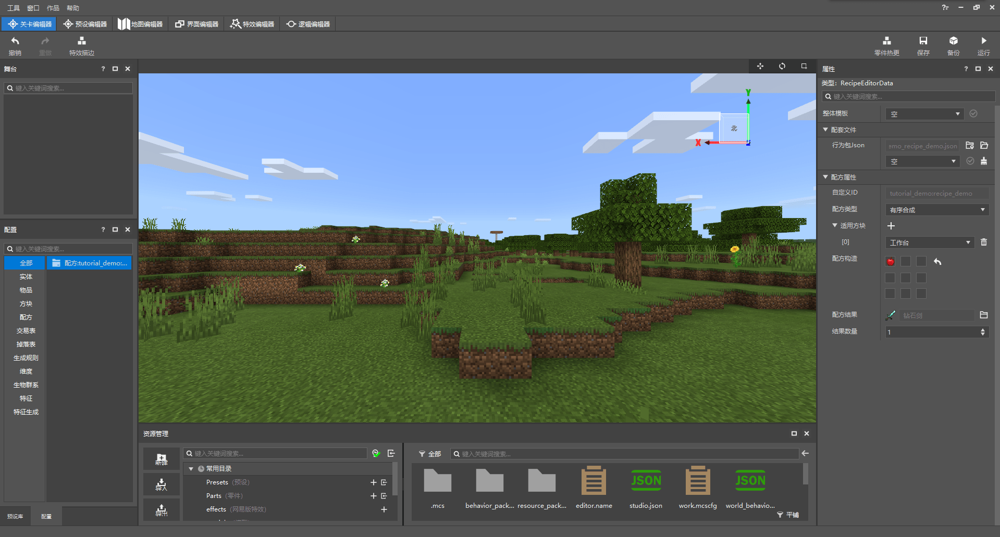

# 使用配方配置自定义新的合成配方

接下来我们使用关卡编辑器来添加一个自定义配方。不过在在此之前，我们首先需要熟悉一下编辑器的界面和编辑器的新旧之别。

## 新旧编辑器

长久以来，我的世界开发工作台都使用的编辑器都是现在被称作旧版编辑器的一款软件。在最新的版本中，我们引入了新版编辑器，该编辑器是旧版编辑器的一个重构，引入了旧版编辑器的大部分功能，同时优化了很多功能，使得模组的开发更加便捷与高效。

旧编编辑器的初始化页面：

新编编辑器的初始化页面：

### 将组件作品升级为新版编辑器作品

在上一节的末尾，我们的操作将默认打开旧版编辑器。而为了使我们的作品开发更加有效，在接下来的教程中我们将使用新版编辑器进行讲解。所以我们需要把我们的作品升级为新版编辑器作品。我们首先切换到“**最近**”标签页，如图所示，这里有我们刚刚创建的组件作品。

点击“**编辑**”按钮，点击“**升级作品**”，并在弹出的对话框中点击“**确定**”。之后开发工作台会自动创建一个同名的新版作品，并打开该作品。之后，你便可以使用新版编辑器进行作品编辑了！

在返回到“最近”标签页时，你可以看到新版作品的周围带有绿色边框，并标注有“新版”字样。

## 命名空间

接下来我们希望添加一个自定义配方。但是在添加配方之前，我们有一个不得不需要理解的概念，那就是**命名空间**（**Namespace**）。每个模组都具有且必须具有至少一个命名空间。命名空间就像一个身份证号一样，他保证了模组与模组之间就算有重名的项目出现，也可以互不干扰，互相可以分辨得开。

你也可以把命名空间比作文件夹。不同的文件夹中就算出现同名的文件，他们依旧可以共存。但是如果没有了文件夹，那么相同命名的文件之间就会出现冲突，出现要么只能保留一个，要么就要有一个文件妥协而改名的尴尬处境。因此，给自己的模组一个合适的命名空间是非常必要的。

### 更改命名空间

我的世界开发工作台的编辑器提供了一个快速更改命名空间的功能。打开新版编辑器，在编辑器顶部的导航栏点击：作品 -> 命名空间，即可打开更改命名空间的对话框。

命名空间实质上是一个标记你所创作的内容所有权的标识符，所以在给你的命名空间起名字时，我们建议使用英语单词配合下划线的方式进行命名。在本教程中，为了行文统一，我们使用`tutorial_demo`作为命名空间。如果你正在跟随本教程进行实践操作，不必拘泥，请尽情地使用你自己想用的命名空间。只需记住一点，命名空间要尽可能的独特和唯一，只有这样才能把你的作品和其他人的作品更好地区分开来。

## 配置

在新版编辑器中，我们引入了**配置**（**Configuration**）功能。它默认在关卡编辑器窗口的左下角。

但此时配置是空的，因为我们还没有创建过任何配置。因此我们需要在“**资源管理**”窗口内通过“**新建**”功能来创建新的配置。

一个配置是一系列有关某个功能的文件的集合。通过对配置的修改，可以实现相关文件的自动修改和自动匹配。这使得复杂的文件变得可视化和有序化。我们在“新建文件向导”对话框中选中“**配置**”选项卡。然后选择一个你想要创建的配置，即可通过向导完成一个配置的创建。

### 创建新的合成配方

我们回归到本节的正题，通过配置功能创建一个自定义合成**配方**（**Recipe**）。我们只需要在上图窗口中选择“配方”配置，即可进入新建自定义配方的向导。我们可以看到，这里有两个功能，第一个是选择**数据模板**（**Data Template**）。数据模板是编辑器内置的已经有一些初始数据的配置，如果选择数据模板，即意味着你可以在一个已经设置了一些属性的配置的基础上继续进行操作。我们选择“**空**”，即创建一个完全空白的配方配置。第二个功能是给配方**命名**（**Naming**）。如同刚才所述的命名空间代表着模组的唯一标识，这里的名字代表着该配方的唯一标识。给它起一个好名字有助于之后再次看到它时能够迅速回忆起其内容，也有助于避免配方之间的冲突。谨记，命名只能使用英文、数字和下划线，且对大小写不敏感，因此`Aa`和`aa`本质上是相同的名字，所以建议所有的字母都采用小写。这里我们使用`recipe_demo`来代表这个演示用的配方。你可以根据自己的喜好与习惯对其赋予任意的命名。

我们可以看到，配置会为我们自动创建一个叫做`<命名空间>_<配方名>.json`的文件，这是该配置所对应的数据文件。命名空间的存在使其有效避免了与其他模组的同名配方的冲突。

在创建配方配置后，我们便可以在“配置”窗口和“属性”窗口下看到我们刚创建的配方了。如果你成功地看到了如下界面，那么恭喜你，你已经成功创建了一个空白的自定义配方！现在我们只需要把该配方稍加完善即可得到我们想要的结果！

### 给配方添加属性

目光转移到屏幕右侧，我们看到了配方的属性栏。在此我们可以更改我们刚才新创建的配方的属性。

**配方类型**代表着配方的适用情况。

- **有序合成**是类工作台配方的一种。对于这种类型的配方，玩家必须摆出和配方的形状一模一样的物品组合时，才会合成出对应物品。在原版中只适用于工作台。
- **无序合成**也是类工作台配方的一种，但是只要合成网格中对应的物品及其数目满足要求即可合成出对应的结果，无需形状如何。在原版中，除了工作台，这种配方还适用于制图台和切石机等方块。
- **熔炉配方**代表着类熔炉配方，熔炉、高炉、营火、烟熏炉等都适用于此类配方。

**配方构造**中的网格代表配方的输入物品和形状，点击网格中的槽位，即可弹出一个可视化物品选择器。通过浏览和搜索，你可以选择任意的原版方块和在我的世界开发工作台中自定义的方块作为槽位物品。这对开发者非常有帮助。

**配方结果**代表着配方的输出物品。你依旧可以通过点击其右侧文件夹形状的图标来进入物品选择器，从而选取对应的配方结果。**结果数量**即对配方进行一次合成产出的物品数目。

### 示例：可合成的命名牌

我们将配方属性调整至如下所示：

即可在游戏中获得一个可合成的命名牌。

恭喜你！你已经熟练掌握了自定义合成配方的制作！但是，这还不代表着万无一失。你还没有保存和在游戏内进行测试。下一节我们将一起学习如何保存并自测玩法组件。