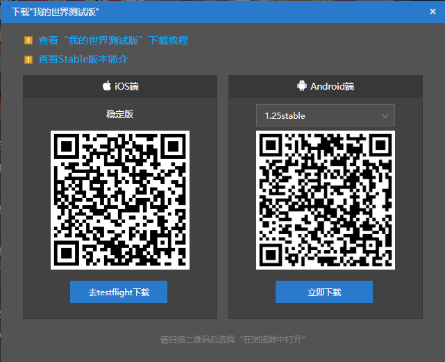

# 保存并运行玩法

及时保存玩法是开发过程中非常重要的一环。只有养成及时保存的习惯才能避免自己的心血成果因各种不确定因素而丢失的情形发生。而在保存之后，我们也需要通过实机测试来确保自己的玩法真正有效地加入了游戏。

## 保存玩法

我们在编辑器的右上角，可以看到有几个全局按钮。我们只需点击“**保存**”按钮，便可以启动组件的保存程序。

如果见到如下提示弹窗，说明你已经保存成功了。你可以安心地继续你的创作，或者稍微暂停离开椅子休息一下了。

## 运行和自测

只在编辑器中进行操作，终归不是真实的游戏体验。在你的作品分发到千千万万玩家手中之前，确保玩法不会出现纰漏最好的办法就是打开游戏进行实测。我的世界开发工作台便提供了这一功能。

### 电脑开发版自测

在我的世界开发工作台中，最简单的运行和自测方式便是使用**我的世界基岩版电脑开发版**（即**Mod PC开发包**）进行自测。你有两种进入电脑开发版的方式。

#### 编辑器内直接进入

不要退出编辑器，目光定位到右上角。我们可以看到一个“**运行**”按钮。点击运行按钮，你的玩法组件将自动保存，同时系统开启我的世界基岩版电脑开发版，自动进入一个加载着你的玩法组件的存档进行测试。

#### 从主界面进入

在我的世界开发工作台中找到“**最近**”或“**作品库**”标签页，找到你的作品。将鼠标移至“**开发测试**”按钮。

点击开发测试按钮将会弹出一个开发测试对话框。进行一定配置后点击“**开始**”按钮，即可达到和从编辑器内进入相同的效果——成功进入我的世界基岩版电脑开发版进行测试。

### 手机开发版自测

**我的世界基岩版手机开发版**自测需要我们先将组件发布至云端。之后我们便可以从手机开发版下载进行测试。我们将鼠标移动至地图或组件作品上，点击“**更多**”按钮。

之后点击“**发布**”按钮。根据发布资源的流程依次填写好相关内容，点击保存，再点击提交审核。当作品处于“审核中”的状态时，便可以在手机开发版中访问到该作品。

#### 下载和进入手机开发版启动器

在我的世界开发工作台上找到“**管理**”标签页。找到顶部“**开发者内容管理工具**”一栏中的“**测试版启动器下载**”。点击该按钮，在弹出的对话框中会出现两个二维码，分别是iOS版本和Android版本的手机开发版启动器下载链接。使用对应的手机扫码下载、安装，即可得到手机开发版启动器应用程序。

在我的世界基岩版手机开发版中打开你发布的组件，即可进入地图测试啦！