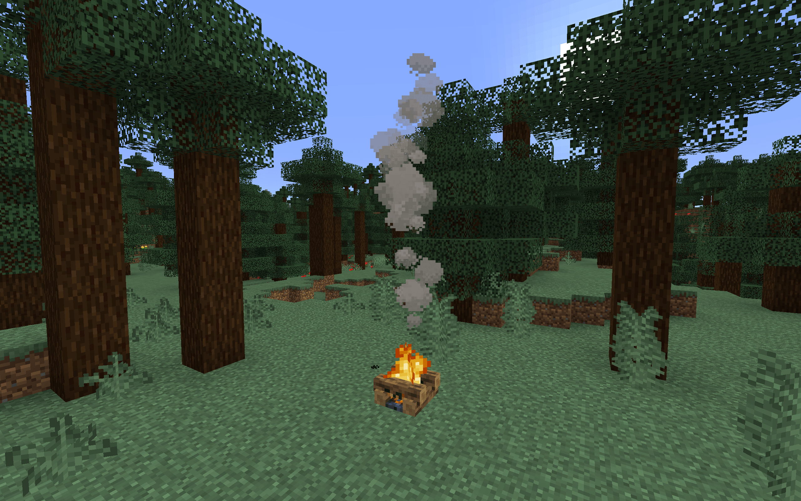

# 游戏界面和特效粒子

在本节中，我们将一起认识游戏界面，了解什么是特效和粒子。

## 游戏界面

每当我们打开我的世界游戏时，我们都能看到一个界面展现在我们面前，上面有着按钮与文字。当我们通过按钮与界面交互时，我们可能会看到弹窗或新的界面。我们进入游戏的世界后，除了眼前的立体的方块世界之外，我们也能看到屏幕下方的物品栏，如果是手机游玩，还能看到屏幕上的方向按键、跳跃键和顶部的暂停键等按钮。这些所有的按钮、文字、窗口等元素都属于游戏界面的一部分，我们统称为**UI**（**用户界面**，**User Interface**，又译作**用户接口**）。顾名思义，用户界面就是用户与机器之间交互的接口。在计算机显示屏上，用户与机器交互的接口都是图形化的，因此**GUI**（**图形用户界面**，**Graphical User Interface**）一词在游戏中与UI一词并无分别。

我的世界的UI是一套工业化的JSON控制系统，通过控件来添加屏幕元素，同时通过绑定来事先逻辑功能。我的世界工作台提供了一套简便的可视化UI编辑器，省去了繁杂的JSON数据编写的过程，为我们提供了极大地方便，我们将在下一章中介绍该功能。

## 粒子与特效

**粒子**（**Particle**）是除了UI之外另一种非常重要的可视化效果，同时也是一个玩家经常遇到但是又容易忽视的效果。但是，细心的玩家依旧能够注意到，在我的世界中处处都有着粒子的存在。粒子是一个颗粒状的始终面向玩家的平面面片贴图，根据种类不同有着不同的存在时间和运动状态。破坏方块的时候出现的碎屑、玩家从高空掉在地上是激起的扬尘、火把和熔炉燃烧时产生的火焰、一脚踏进水里溅起的水花，这些本质上都是粒子效果。基岩版内置的粒子效果在玩家客户端中并没有办法通过命令调出，这种粒子称为**旧版粒子**（**Legacy Particle**），以上我们举的例子都是旧版粒子。为了让玩家和开发者在游戏中更好地使用粒子，国际版引入了一种“新版”的粒子功能，并直接在游戏中称之为**粒子**。

### 粒子

国际版的粒子可以通过一个JSON文件来定义。按照国际版的[粒子JSON的文件格式](https://docs.microsoft.com/en-us/minecraft/creator/reference/content/particlesreference/)便可以定义出一个粒子。这种粒子本质上是一个**粒子发射器**（**Particle Emitter**），是一种可以在世界中移动的能够根据预先设置好的规则源源不断地发射出单个粒子的虚拟物体。最终展现给玩家的效果只有其发射出的粒子，玩家本身是看不到粒子发射器的。因此，粒子发射器可以实现比单纯召唤出一个粒子更多的功能，这也给了开发者们进行创作时更多的可能。

### 特效

中国版的**特效**（**Effect**）是中国版开发组在旧版粒子系统的基础上独立于国际版的粒子而创做出的新的粒子系统。通过与骨骼模型的配合，开发者甚至可以快速地将其挂接到骨骼模型上，实现模型和粒子效果的紧密结合。

中国版的特效分为**粒子特效（Particle Effect）**和**序列帧特效（Frame Effect）**。粒子特效本质上也是一个粒子发射器，通过不断发射多个不同大小规模的单个粒子，来达到一种特定的效果。序列帧特效也是在游戏中展现一个平面面片贴图，但是其允许纹理贴图具备动态效果，也就是在贴图上播放序列帧动画，使其成为“动态的粒子效果”。因此，序列帧特效往往更加具备开发价值，也能使模组的模型或内容展现得更加丰富。

到此为止，我们在本章中对于我的世界概念的学习就先告一段落。如果有些内容并没有看懂，也并不用担心。因为，我们后面还会讲到这些内容的制作。届时，我们将能够通过各种操作和代码进一步加深这些概念的理解！