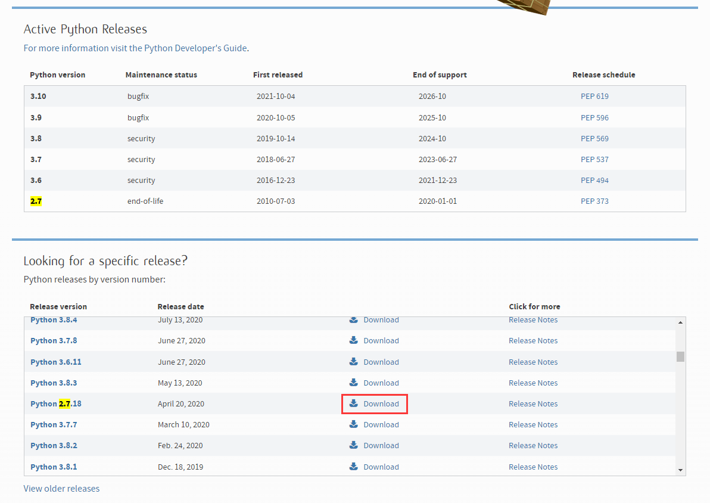

# 了解模组SDK框架的使用方法

我们前面一起学习了数据驱动JSON文件的写法、功能。通过学习，我们可以看到数据驱动文件具有非常重要的作用，它们可以定义游戏玩法，通过基于游戏中的实体各种各样的组件，为我们的游戏赋予各种玩法的基础属性。但是，数据驱动也有明显的缺点，其中最大的缺点就是无法定义复杂的逻辑。即使某些数据驱动定义可以定义一些事件，这些事件也只能在某些特定的限制下执行相应的逻辑，比如只能去执行特定的有限的功能，调用预先设定好的属性，而且不能将各个属性通过灵活的逻辑连接起来。最终只能得到一个线性的事件响应网。这种事件系统被我们认为是一种伪事件系统。

为了实现真正的事件系统，我们需要更灵活的编写方法和标准。所以，我们引入了**脚本**（**Script**）系统。中国版的脚本系统使用Python语言来编写，通过脚本使能的组件灵活地响应事件，将回调函数绑定到游戏运行时的对应位点上，赋予游戏更灵活的逻辑。中国版的这套脚本系统提供的Python脚本接口叫做**模组API**（**Mod API**），而中国版为带有以模组API为标准的脚本的附加包提供的开发包称为**模组SDK**（**Mod SDK**）。

## 配置开发环境

在开始进行模组SDK开发之前，我们需要配置Python环境。否则，我们将无法正常进行编写和调试。注意，中国版的模组SDK使用的是Python2环境。Python2和Python3之间具有较大的代码差异，我们无需使用Python3的相关语法。

### 安装Python2

我们进入[Python官网](https://www.python.org/downloads/)下载最新的Python2版本。由于Python2已停止维护，我们搜索最新版本2.7并在下面的往期版本中下载。



**安装时请务必选择安装环境变量**，这样可以方便我们快速在命令行中输入Python的程序可执行文件名。

### 安装IDE

我们推荐PyCharm作为Python的集成开发环境（IDE）。我们在[JetBrains官网](https://www.jetbrains.com/pycharm/download/)上下载PyCharm并安装。如果你没有PyCharm许可证，则请下载社区版（Community）。如果你欲购买许可证或具备学生身份，可以申请许可证并下载专业版（Professional）。


### 安装补全库

为了使我们的代码具备自动补全和定义查询功能，我们需要安装模组SDK的补全库。我们可以使用编辑器来安装补全库。


打开编辑器，在菜单栏的“工具”下拉菜单中选择你要安装补全库的版本。你可以根据面向的版本和规划来选择安装稳定版补全库或测试版补全库。


开始安装后将提示一个命令行。如果之前安装过旧版本补全库，将先卸载旧版本再安装新版本。


安装成功后将弹出一个提示窗口，提示你安装完成。当然，你也可以像提示窗口中所说的那样，通过命令提示符手动安装补全库。

### 查看示例包

至此，我们做好了所有准备工作。我们打开文档配套的<a href="../../../mcguide/20-玩法开发/13-模组SDK编程/60-Demo示例.html" rel="noopenner"> 示例包 </a>，找到TutorialMod演示模组。我们可以在附加包中找到`tutorialScripts`文件夹。这里是便是该模组的一个脚本Python模块文件夹。如果你对Python较为熟悉，可以注意到`__init__.py`，这代表着这是一个Python模块。事实上，一个包中可以有多个脚本文件夹。但每个文件夹都必须是一个模块，也就是具备一个`__init__.py`文件。


## 什么是系统

我们打开`modMain.py`文件，这个文件是Python脚本的入口文件。基岩脚本的引擎将寻找入口文件作为一个Python模块的初始执行文件。目前我们无法自定义入口文件的文件名，因此我们需要保证入口文件的文件名为`modMain.py`。我们一起来查看这个入口文件。

```python
# -*- coding: utf-8 -*-
# 上面这行是让这个文件按utf-8进行编码，这样就可以在注释中写中文了

# 这行是import到MOD的绑定类Mod，用于绑定类和函数
from mod.common.mod import Mod
# 这行import到的是引擎服务端的API模块
import mod.server.extraServerApi as serverApi
# 这行import到的是引擎客户端的API模块
import mod.client.extraClientApi as clientApi

# 用Mod.Binding来绑定MOD的类，引擎从而能够识别这个类是MOD的入口类
@Mod.Binding(name = "TutorialMod", version = "0.0.1")
class TutorialMod(object):

    # 类的初始化函数
    def __init__(self):
        print "===== init tutorial mod ====="

    # InitServer绑定的函数作为服务端脚本初始化的入口函数，通常是用来注册服务端系统system和组件component
    @Mod.InitServer()
    def TutorialServerInit(self):
        print "===== init tutorial server ====="
        # 函数可以将System注册到服务端引擎中，实例的创建和销毁交给引擎处理。第一个参数是MOD名称，第二个是System名称，第三个是自定义MOD System类的路径
        # 取名名称尽量个性化，不能与其他人的MOD冲突，可以使用英文、拼音、下划线这三种。
        serverApi.RegisterSystem("TutorialMod", "TutorialServerSystem", "tutorialScripts.tutorialServerSystem.TutorialServerSystem")

    # DestroyServer绑定的函数作为服务端脚本退出的时候执行的析构函数，通常用来反注册一些内容,可为空
    @Mod.DestroyServer()
    def TutorialServerDestroy(self):
        print "===== destroy tutorial server ====="

    # InitClient绑定的函数作为客户端脚本初始化的入口函数，通常用来注册客户端系统system和组件component
    @Mod.InitClient()
    def TutorialClientInit(self):
        print "===== init hugo fps client ====="
        # 函数可以将System注册到客户端引擎中，实例的创建和销毁交给引擎处理。第一个参数是MOD名称，第二个是System名称，第三个是自定义MOD System类的路径
        # 取名名称尽量个性化，不能与其他人的MOD冲突，可以使用英文、拼音、下划线这三种。
        clientApi.RegisterSystem("TutorialMod", "TutorialClientSystem", "tutorialScripts.tutorialClientSystem.TutorialClientSystem")

    # DestroyClient绑定的函数作为客户端脚本退出的时候执行的析构函数，通常用来反注册一些内容,可为空
    @Mod.DestroyClient()
    def TutorialClientDestroy(self):
        print "===== destroy hugo fps client ====="

```

在入口文件中，我们看到了我们的Python模组作为一个类而定义，而类中除了`__init__`方法之外定义了四个基本方法。分别为`TutorialServerInit`、`TutorialServerDestroy`、`TutorialClientInit`和`TutorialClientDestroy`。这四个方法的作用便是用于注册和销毁**系统**（**System**）。

我们的模组是分为服务端和客户端分别执行的，这是因为我的世界游戏是分为服务端和客户端两部分互联互通运行的。试想，如果我们不分服务端和客户端，执行一个操作时会出现什么样的结果。在一个服务器中，一个玩家触发了一定的逻辑，逻辑的结果是在世界(0, 64, 0)处放置一个特定的方块。如果我们的服务端和客户端时分开执行的，那么所有的玩家的客户端都将开始执行这一逻辑。但是我们先前知道，玩家在同一时刻只可能在某一个维度的世界中。所以客户端是分辨不出这个放置方块的指示是应该位于哪一维度的。虽然我们只希望在主世界中放置方块，但是处于下界和末地的客户端也将“模拟地”在这两个维度的对应位置放置一个方块。这个方块事实上在服务端中的下界和末地中并未放置，因此将出现客户端和服务端不同步的严重问题。所以，我们的脚本也需要和游戏的基本逻辑一样，分别在服务端和客户端同时设置一个系统，分别执行不同的逻辑，同时通过一定的功能互相通讯，保持同步。

那么，系统是什么呢？在模组API中，我们在每个端都可以设置一个或多个系统。系统将负责宏观工作，例如定义和反定义事件、注册和反注册事件的监听、广播或通知一个事件，进行各种更新操作。而通过系统进行事件的广播和监听，执行逻辑的过程便称为**事件驱动**。

事实上，所有的系统都是一个继承自系统基类的类。这个系统的基类为`mod.common.system.baseSystem`。