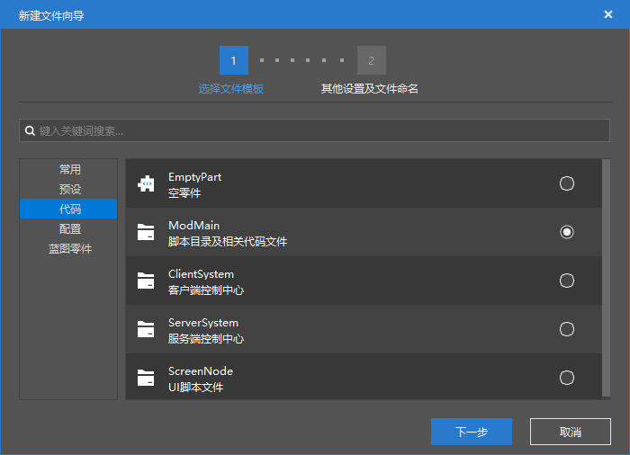
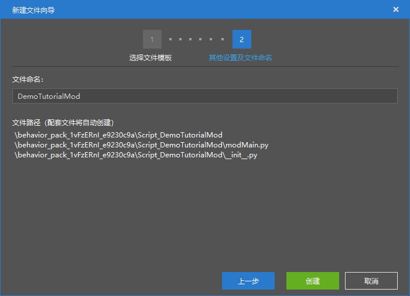
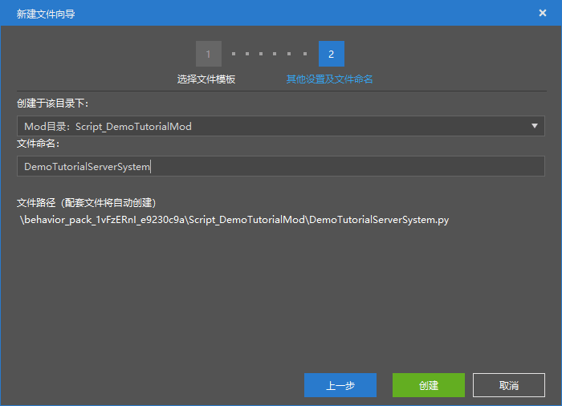

# 在快捷入口新建服务端系统文件

本节中，我们一起学习如何在新版编辑器中创建脚本文件。

## 使用资源管理器快捷新建脚本系统

我们打开编辑器，点击“**资源管理**”窗格的“**新建**”按钮。



在“**代码**”选项卡中找到**ModMain**。这个选项将可以帮助我们快速创建一个模组API文件夹，其中包括一个代表该文件夹是一个模块的`__init__.py`和一个入口文件`modMain.py`。



我们在这里给文件命名，实际上就是在给模组命名。我们模组类的装饰器`@Mod.Binding(name = "ModName", version = "0.0.1")`中的`ModName`处便代表我们的模组名。这里的名字将自动填充至模组入口文件中模组类的装饰器中。同时，脚本文件夹名和模组的类名也将会使用我们这里的模组名，所以请谨慎填写一个不会和其他开发者的模组中的模组名重名的名称，否则将有可能造成加载冲突。

接下来我们就可以分别给我们的模组创建服务端文件和客户端文件了！我们以服务端文件为例。


还是在“**代码**”选项卡中，我们选择**ServerSystem**。这个选项可以用于创建服务端系统文件`xxxxServerSystem.py`。



我们在第一个下拉菜单中选择我们刚才创建的脚本文件夹目录。如果一个附加包中存在多个脚本文件夹，我们就需要进行在下拉菜单中选择正确的我们想要创建的脚本目录。文件名便是将会自动使用到服务端系统的类名上的名称。


我们可以看到，服务端系统文件也创建了。同时，编辑器还创建了一个`Part`文件夹，这是新版编辑器自动创建的文件。如果我们的脚本不是用于零件脚本，那么这个文件夹可以忽略。

我们来查看自动创建的`modMain.py`：

```python
# -*- coding: utf-8 -*-

from common.mod import Mod


@Mod.Binding(name="DemoTutorialMod", version="0.0.1")
class DemoTutorialMod(object):

    def __init__(self):
        pass

    @Mod.InitServer()
    def DemoTutorialModServerInit(self):
        pass

    @Mod.DestroyServer()
    def DemoTutorialModServerDestroy(self):
        pass

    @Mod.InitClient()
    def DemoTutorialModClientInit(self):
        pass

    @Mod.DestroyClient()
    def DemoTutorialModClientDestroy(self):
        pass

```

和`DemoTutorialServerSystem.py`：

```python
# -*- coding: utf-8 -*-

import server.extraServerApi as serverApi
ServerSystem = serverApi.GetServerSystemCls()


class DemoTutorialServerSystem(ServerSystem):
    def __init__(self, namespace, systemName):
        ServerSystem.__init__(self, namespace, systemName)

    # ScriptTickServerEvent的回调函数，会在引擎tick的时候调用，1秒30帧（被调用30次）
    def OnTickServer(self):
        """
        Driven by event, One tick way
        """
        pass

    # 这个Update函数是基类的方法，同样会在引擎tick的时候被调用，1秒30帧（被调用30次）
    def Update(self):
        """
        Driven by system manager, Two tick way
        """
        pass

    def Destroy(self):
        pass

```

我们可以看到，自动创建时并不会在模组类中注册我们的系统，所以我们的系统注册代码需要手动输入。同时，自动创建给我们的服务端系统类写入了两个函数，分别是脚本刻的**滴答**（**Tick**）函数和系统类的**更新**（**Update**）函数，这两个函数分别通过事件响应回调和重载超类方法的形式实现每秒运行30次的代码。这样运行一次的时间我们称为一个**脚本刻**（**Script Tick**）。