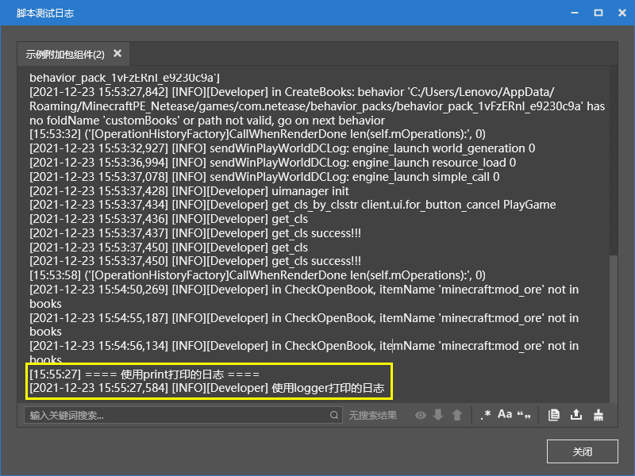

# 打印信息并运调试运行

懂得如何将信息打印到控制台上是一个合格的开发者必须具备的本领。在本节中我们将学习如何打印信息并调试运行。

## 学会打印日志并查看控制台

每次打开电脑开发版，我的世界开发工作台便会创建一个“**脚本测试日志**”窗口，这边是我们的脚本调试控制台。

在模组中，我们可以在任何位置凭借自己的意愿将任何模组中的上下文信息打印到控制台上。我们有两种打印方式。

### `print`

我们可以使用原生的`print`函数来打印信息。比如，这边是一个`print`函数的打印示例，它将在初始化模组服务端注册之前打印开始初始化的消息。

```python
@Mod.InitServer()
def DemoTutorialModServerInit(self):
    print "===== init tutorial server ====="
    serverApi.RegisterSystem("DemoTutorialMod", "Server", "Script_DemoTutorialMod.DemoTutorialServerSystem.DemoTutorialServerSystem")

```

### `mod_log`

我们还可以通过`mod_log`模块来打印信息。下面的示例中通过导入并执行`logger.info`打印了一个信息。

```python
from mod_log import logger
logger.info("print log: %s", "OK")
```

### 两者的不同

我们以下面代码为示例可以看到两种打印方式在控制台表现的不同。

```python
def OnActorHurtServer(self, args):
    print "==== 使用print打印的日志 ==== "
    logger.info("使用logger打印的日志")
    comp = serverApi.GetEngineCompFactory().CreateAction(args["entityId"])
    comp.SetMobKnockback(0.1, 0.1, 10.0, 1.0, 1.0)
```



## 使用热更新快速修复问题

我们的Python代码在游戏中支持热更新调试。在电脑开发版的游戏运行中时，我们修改Python代码将导致文件在开发版中的重载。自动热更新主要用于修改函数内实现，比如我可以修改击退威力，使其增加为20，那么我在游戏中就可以在下一次攻击时延长击退的距离。但是热更新对全局变量、新增类或文件无效。因为这些都是在Python代码运行一开始便初始化的内容，热更新文件不会使其再次初始化，所以可能会导致无效。


我们将击退为例从10更改为20，可以在控制台中看到热更新的信息。灵活掌握代码的热更新，将有效大幅度减少开启关闭游戏的次数，使调试更加方便。