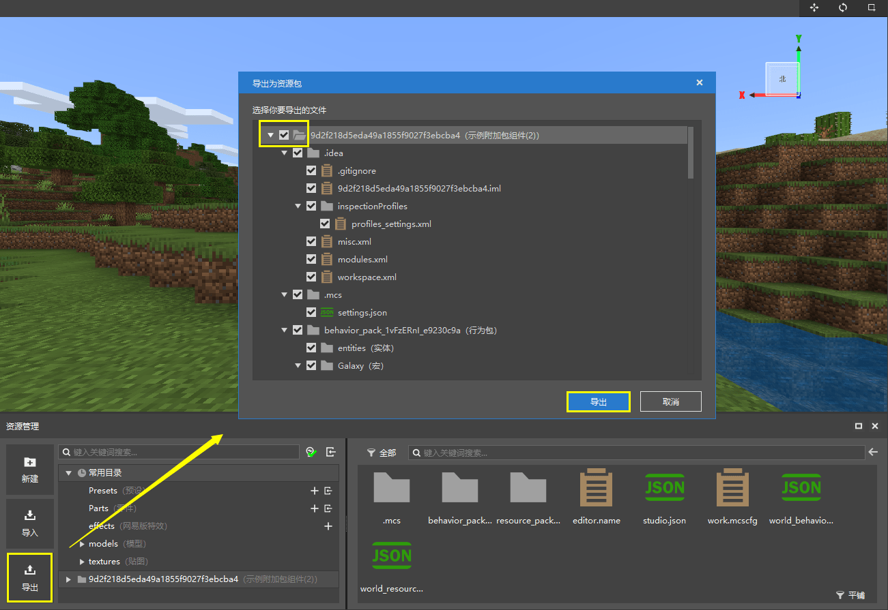

# 从编辑器里导出组件

导出组件也是开发者应该学会的开发中必不可少的一环。我们有多种组件导出方法。

## 导出为资源包

打开编辑器，点击“资源管理”窗格中的“导出”可以将组件导出为资源包，文件格式为`.mep`。

通过这种方式导出的资源包可以在另一个附加包组件中通过同一位置的“导入”功能合并导入。

## 整体导出

在我的世界开发工作台中找到作品。右键或点击“更多”按钮，在展开的菜单中点击“导出”或“导出(含编辑信息)”。

这种方式可以使整个包导出为一个`.zip`文件。通过这种方式导出的文件可以在我的世界开发工作台中通过“本地导入”功能重新导入为一个组件。