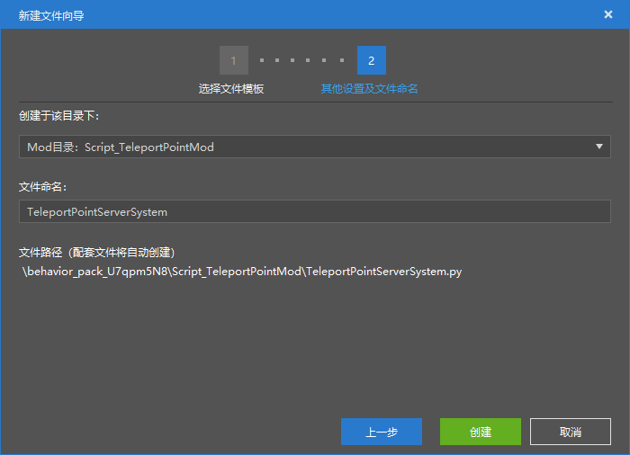
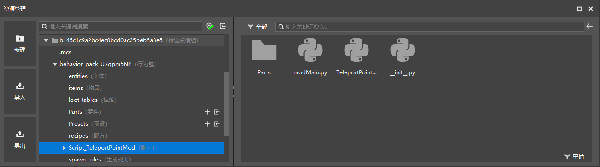
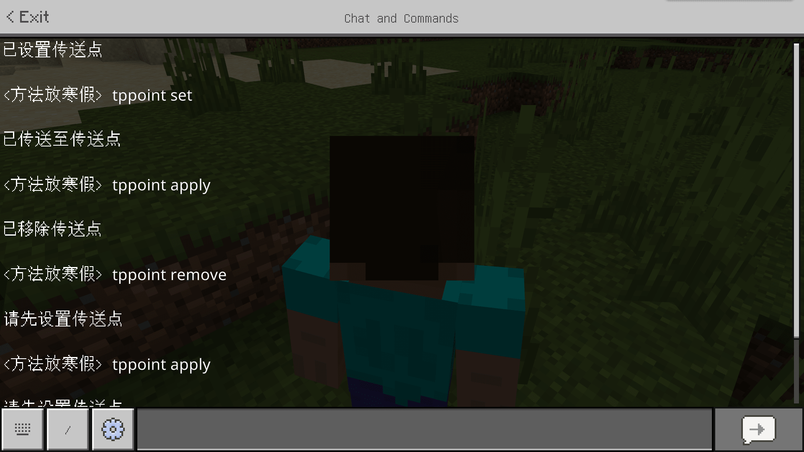

# 挑战：自定义传送点

在本节中，我们一起来制作一个传送点模组。我们知道，在我的世界中，地形可以近似认为是无限广阔的，所以，我们在探索的过程中可能经常迷失方向，找不到回到据点的路。因此，我们可以自定义一个传送点模组。通过保存一个传送点来做到在迷路时快速回到传送点所指定的位置。

下面，我们一起使用模组SDK来制作一个传送点模组。

## 创建项目

我们在我的世界开发工作台中创建一个“传送点模组”的组件，然后使用编辑器“资源管理”窗格中“创建”按钮来快速创建一个Python模组模块，将其命名为`TeleportPointMod`。



由于我们知道，只有服务端才能获取和控制每个玩家的位置，所以我们只需创建一个服务端系统，将其命名为`TeleportPointServerSystem`。对于每个玩家来说，客户端一般只负责屏幕的渲染和本地的一些计算，是无法直接改变玩家处于整个世界中的位置的，所以我们无需使服务端与客户端交互。因此我们无需创建客户端系统。



创建结束后，我们可以在“资源管理”窗格中看到如图的文件排布。我们将整个行为包文件夹在Python的IDE中打开，以便之后的代码编写。此时的Python文件内容如下。

`modMain.py`：

```python
# -*- coding: utf-8 -*-

from common.mod import Mod


@Mod.Binding(name="TeleportPointMod", version="0.0.1")
class TeleportPointMod(object):

    def __init__(self):
        pass

    @Mod.InitServer()
    def TeleportPointModServerInit(self):
        pass

    @Mod.DestroyServer()
    def TeleportPointModServerDestroy(self):
        pass

    @Mod.InitClient()
    def TeleportPointModClientInit(self):
        pass

    @Mod.DestroyClient()
    def TeleportPointModClientDestroy(self):
        pass

```

`TeleportPointServerSystem.py`

```python
# -*- coding: utf-8 -*-

import server.extraServerApi as serverApi
ServerSystem = serverApi.GetServerSystemCls()


class TeleportPointServerSystem(ServerSystem):
    def __init__(self, namespace, systemName):
        ServerSystem.__init__(self, namespace, systemName)

    # ScriptTickServerEvent的回调函数，会在引擎tick的时候调用，1秒30帧（被调用30次）
    def OnTickServer(self):
        """
        Driven by event, One tick way
        """
        pass

    # 这个Update函数是基类的方法，同样会在引擎tick的时候被调用，1秒30帧（被调用30次）
    def Update(self):
        """
        Driven by system manager, Two tick way
        """
        pass

    def Destroy(self):
        pass

```

## 注册服务端系统

我们知道，单纯创建了服务端系统文件是无法在主模组文件中同时将其注册的。我们手动将我们的服务端系统注册。我们在`TeleportPointModServerInit`函数中输入注册系统的方法：

```python
    @Mod.InitServer()
    def TeleportPointModServerInit(self):
        serverApi.RegisterSystem('TeleportPointMod', 'TeleportPointServerSystem', 'Script_TeleportPointMod.TeleportPointServerSystem.TeleportPointServerSystem')

```

其中`Script_TeleportPointMod.TeleportPointServerSystem.TeleportPointServerSystem`对应着`Script_TeleportPointMod`文件夹中`TeleportPointServerSystem.py`文件的`TeleportPointServerSystem`类。这样，我们便成功注册了系统。

## 制作传送点模组的主体

传送点模组的主体部分应该都位于服务单系统中，我们只需要考虑实现的逻辑即可。

我们可以允许玩家使用多种方式来触发传送。最简单的一种便是使用聊天栏触发。我们不妨就采取这种方式来制作模组。我们可以设置一些关键词，用于传送点的设置、传送和移除，比如`tppoint set`、`tppoint apply`、`tppoint remove`。而每个玩家为其使用一个变量来保存其设置的传送点坐标的数据。为了方便保存，我们可以使用一个字典来做到这一点。字典中的键为玩家的ID，而值为玩家保存的传送点坐标。当玩家执行传送时，我们主需要检索该玩家的ID，获取字典保存的值，然后将玩家的坐标设定为这个值即可。

我们依次来实现这个逻辑。

### 监听玩家的聊天栏消息

我们通过查阅文档可知，服务端的`ServerChatEvent`事件可以做到响应玩家发送聊天栏信息，于是我们为其设置事件监听。

```python
def __init__(self, namespace, systemName):
    ServerSystem.__init__(self, namespace, systemName)
    self.ListenForEvent(serverApi.GetEngineNamespace(), serverApi.GetEngineSystemName(), "ServerChatEvent", self, self.on_chat)

```

同时加入一个`on_chat`方法，用于充当回调函数。

```python
def on_chat(self, event):
    pass
```

### 记录传说点

下面我们按照我们刚才的设想开始写入基本逻辑。我们读取事件数据中的`playerId`和`message`。它们分别是发送消息的玩家ID和所发送的消息。我们使用字符串的`startswith`方法来判定消息是否以`tppoint set`开头。如果消息以`tppoint set`开头，那么就通过玩家ID创建一个`pos`引擎组件。`pos`引擎组件具备`GetFootPos`方法、`GetPos`方法和`SetPos`方法。我们可以使用`GetFootPos`方法来获取玩家脚步坐标并存入一个字典，我们不妨起名为`player_tp_cache`。`player_tp_cache`字典变量由于是需要在整个类中实现的，所以我们将其放在类的初始化方法里。

```python
class TeleportPointServerSystem(ServerSystem):
    def __init__(self, namespace, systemName):
        ServerSystem.__init__(self, namespace, systemName)
        self.ListenForEvent(serverApi.GetEngineNamespace(), serverApi.GetEngineSystemName(), "ServerChatEvent", self, self.on_chat)
        # 用来暂时缓存玩家的传送点信息，在每次重新开启一次游戏后会被重置
        self.player_tp_cache = {}

    def on_chat(self, event):
        # 获取玩家ID
        player_id = event['playerId']
        # 获取聊天消息
        message = event['message']
        if message.startswith('tppoint set'):
            pos_comp = serverApi.GetEngineCompFactory().CreatePos(player_id)
            teleport_pos = pos_comp.GetFootPos()
            # 保存玩家的当前坐标至字典缓存中
            self.player_tp_cache[player_id] = teleport_pos
            print '已设置玩家传送点'

```

### 删除传送点

依据同样的原理，我们使用字典的`pop`方法来移除一个玩家的键值对。我们加入删除传送点的逻辑。

```python
def on_chat(self, event):
    # 获取玩家ID
    player_id = event['playerId']
    # 获取聊天消息
    message = event['message']
    if message.startswith('tppoint set'):
        pos_comp = serverApi.GetEngineCompFactory().CreatePos(player_id)
        teleport_pos = pos_comp.GetFootPos()
        # 保存玩家的当前坐标至字典缓存中
        self.player_tp_cache[player_id] = teleport_pos
        print '已设置玩家传送点'
    if message.startswith('tppoint remove'):
        # 判断该玩家是否存有数据
        if player_id in self.player_tp_cache:
            # 弹出字典中的玩家数据
            self.player_tp_cache.pop(player_id)
            print '已移除玩家传送点'
        else:
            print '该玩家没有设置传送点'

```

### 传送至传送点

最后，我们使用`pos`引擎组件的`SetPos`方法来实现传送逻辑。

```python
def on_chat(self, event):
    # 获取玩家ID
    player_id = event['playerId']
    # 获取聊天消息
    message = event['message']
    if message.startswith('tppoint set'):
        pos_comp = serverApi.GetEngineCompFactory().CreatePos(player_id)
        teleport_pos = pos_comp.GetFootPos()
        # 保存玩家的当前坐标至字典缓存中
        self.player_tp_cache[player_id] = teleport_pos
        print '已设置玩家传送点'
    if message.startswith('tppoint remove'):
        # 判断该玩家是否存有数据
        if player_id in self.player_tp_cache:
            # 弹出字典中的玩家数据
            self.player_tp_cache.pop(player_id)
            print '已移除玩家传送点'
        else:
            print '该玩家没有设置传送点'
    if message.startswith('tppoint apply'):
        pos_comp = serverApi.GetEngineCompFactory().CreatePos(player_id)
        # 判断该玩家是否存有数据
        if player_id in self.player_tp_cache:
            teleport_pos = self.player_tp_cache[player_id]
            # 传送玩家
            pos_comp.SetPos(teleport_pos)
            print '已应用玩家传送点'
        else:
            print '该玩家没有设置传送点'

```

这样，我们便完成了传送逻辑的编写。额外地，我们还可以通过`msg`组件来为玩家显示消息提示，展示设置、传送或移除成功的提示。我们可以修改如下：

```python
def on_chat(self, event):
    # 获取玩家ID
    player_id = event['playerId']
    # 获取聊天消息
    message = event['message']
    if message.startswith('tppoint set'):
        pos_comp = serverApi.GetEngineCompFactory().CreatePos(player_id)
        teleport_pos = pos_comp.GetFootPos()
        # 保存玩家的当前坐标至字典缓存中
        self.player_tp_cache[player_id] = teleport_pos
        msg_comp = serverApi.GetEngineCompFactory().CreateMsg(player_id)
        msg_comp.NotifyOneMessage(player_id, "已设置传送点")
        print '已设置玩家传送点'
    if message.startswith('tppoint remove'):
        # 判断该玩家是否存有数据
        if player_id in self.player_tp_cache:
            # 弹出字典中的玩家数据
            self.player_tp_cache.pop(player_id)
            msg_comp = serverApi.GetEngineCompFactory().CreateMsg(player_id)
            msg_comp.NotifyOneMessage(player_id, "已移除传送点")
            print '已移除玩家传送点'
        else:
            msg_comp = serverApi.GetEngineCompFactory().CreateMsg(player_id)
            msg_comp.NotifyOneMessage(player_id, "请先设置传送点")
            print '该玩家没有设置传送点'
    if message.startswith('tppoint apply'):
        pos_comp = serverApi.GetEngineCompFactory().CreatePos(player_id)
        # 判断该玩家是否存有数据
        if player_id in self.player_tp_cache:
            teleport_pos = self.player_tp_cache[player_id]
            # 传送玩家
            pos_comp.SetPos(teleport_pos)
            msg_comp = serverApi.GetEngineCompFactory().CreateMsg(player_id)
            msg_comp.NotifyOneMessage(player_id, "已传送至传送点")
            print '已应用玩家传送点'
        else:
            msg_comp = serverApi.GetEngineCompFactory().CreateMsg(player_id)
            msg_comp.NotifyOneMessage(player_id, "请先设置传送点")
            print '该玩家没有设置传送点'

```

我们可以进入游戏查看传送和消息提示情况。



我们可以看到，传送和消息都和我们所设置的一样正常运作！

我们最后放出完整的代码供大家参考，`modMain.py`如下：

```python
# -*- coding: utf-8 -*-

from mod.common.mod import Mod
import mod.server.extraServerApi as serverApi


@Mod.Binding(name="TeleportPointMod", version="0.0.1")
class TeleportPointMod(object):

    def __init__(self):
        pass

    @Mod.InitServer()
    def TeleportPointModServerInit(self):
        serverApi.RegisterSystem('TeleportPointMod', 'TeleportPointServerSystem', 'Script_TeleportPointMod.TeleportPointServerSystem.TeleportPointServerSystem')

    @Mod.DestroyServer()
    def TeleportPointModServerDestroy(self):
        pass

    @Mod.InitClient()
    def TeleportPointModClientInit(self):
        pass

    @Mod.DestroyClient()
    def TeleportPointModClientDestroy(self):
        pass

```

`TeleportPointServerSystem.py`如下：

```python
# -*- coding: utf-8 -*-

import mod.server.extraServerApi as serverApi
from mod.server.system.serverSystem import ServerSystem
ServerSystem = serverApi.GetServerSystemCls()


class TeleportPointServerSystem(ServerSystem):
    def __init__(self, namespace, systemName):
        ServerSystem.__init__(self, namespace, systemName)
        self.ListenForEvent(serverApi.GetEngineNamespace(), serverApi.GetEngineSystemName(), "ServerChatEvent", self, self.on_chat)
        # 用来暂时缓存玩家的传送点信息，在每次重新开启一次游戏后会被重置
        self.player_tp_cache = {}

    def on_chat(self, event):
        # 获取玩家ID
        player_id = event['playerId']
        # 获取聊天消息
        message = event['message']
        if message.startswith('tppoint set'):
            pos_comp = serverApi.GetEngineCompFactory().CreatePos(player_id)
            teleport_pos = pos_comp.GetFootPos()
            # 保存玩家的当前坐标至字典缓存中
            self.player_tp_cache[player_id] = teleport_pos
            msg_comp = serverApi.GetEngineCompFactory().CreateMsg(player_id)
            msg_comp.NotifyOneMessage(player_id, "已设置传送点")
            print '已设置玩家传送点'
        if message.startswith('tppoint remove'):
            # 判断该玩家是否存有数据
            if player_id in self.player_tp_cache:
                # 弹出字典中的玩家数据
                self.player_tp_cache.pop(player_id)
                msg_comp = serverApi.GetEngineCompFactory().CreateMsg(player_id)
                msg_comp.NotifyOneMessage(player_id, "已移除传送点")
                print '已移除玩家传送点'
            else:
                msg_comp = serverApi.GetEngineCompFactory().CreateMsg(player_id)
                msg_comp.NotifyOneMessage(player_id, "请先设置传送点")
                print '该玩家没有设置传送点'
        if message.startswith('tppoint apply'):
            pos_comp = serverApi.GetEngineCompFactory().CreatePos(player_id)
            # 判断该玩家是否存有数据
            if player_id in self.player_tp_cache:
                teleport_pos = self.player_tp_cache[player_id]
                # 传送玩家
                pos_comp.SetPos(teleport_pos)
                msg_comp = serverApi.GetEngineCompFactory().CreateMsg(player_id)
                msg_comp.NotifyOneMessage(player_id, "已传送至传送点")
                print '已应用玩家传送点'
            else:
                msg_comp = serverApi.GetEngineCompFactory().CreateMsg(player_id)
                msg_comp.NotifyOneMessage(player_id, "请先设置传送点")
                print '该玩家没有设置传送点'

    def Destroy(self):
        pass

```
