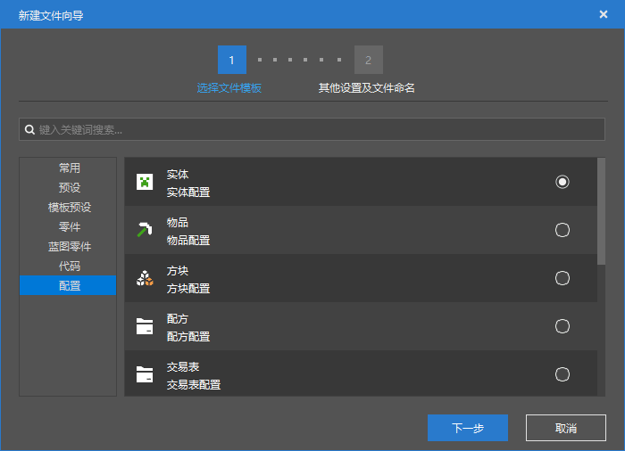
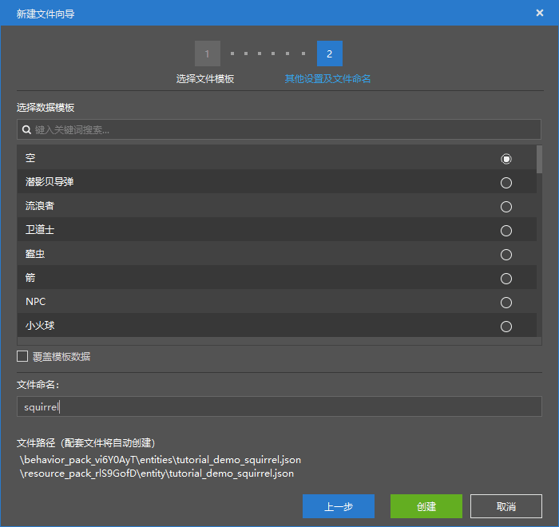

# 使用配置功能创建基础实体

在接下来的几个小节中，我们将一起制作一个松鼠的演示实体。我们将一起通过松鼠实体的制作来学习Molang的各种高级功能。

## 使用配置创建松鼠实体

我们打开编辑器，创建一个新的AddOn组件，将其命名为“松鼠演示实体”。然后打开编辑器，将命名空间更改为`tutorial_demo`。预备工作完成后，我们开始使用配置功能新建实体。





我们为松鼠进行命名，然后点击“创建”，便可以成功创建松鼠实体。创建结束后，我们可以打开松鼠的行为包和资源包定义文件来查看效果。

资源包定义文件：

```json
{
  "format_version": "1.8.0",
  "minecraft:client_entity": {
    "description": {
      "identifier": "tutorial_demo:squirrel"
    }
  }
}
```

行为包定义文件：

```json
{
  "format_version": "1.12.0",
  "minecraft:entity": {
    "description": {
      "identifier": "tutorial_demo:squirrel",
      "is_experimental": false,
      "is_spawnable": true,
      "is_summonable": true
    },
    "component_groups": {

    },
    "components": {
      "minecraft:persistent": {

      }
    },
    "events": {

    }
  }
}
```

我们可以看到，由于我们使用的是空白数据模板，所以这两个文件内容较为“干瘪”。

我们对资源包定义文件稍加补充，以便我们之后添加资源：

```json
{
  "format_version": "1.8.0",
  "minecraft:client_entity": {
    "description": {
      "identifier": "tutorial_demo:squirrel",/*
      "materials": {

      },
      "textures": {

      },
      "geometry": {

      },
      "animations": {

      },
      "animation_controllers": [

      ],
      "render_controllers": [

      ],
      "spawn_egg": {

      }*/
    }
  }
}
```

由于编辑器自动创建的是`1.8.0`的格式版本，所以动画和动画控制器是分开定义的。我们也为其创建`animation_controllers`数组，以便定义动画控制器。与`1.10.0`的格式版本不同，`1.8.0`的格式版本无法进行条件控制的动画播放，即没有`scripts/animate`字段。不过这不要紧，因为在`1.8.0`格式版本下，虽然动画本身不能直接通过实体的资源包定义文件播放，但是所有的动画控制器都是自动开始播放，我们只需要通过动画控制器来控制动画即可。

我们为松鼠添加一个默认的材质。因为我们希望松鼠的各方便表现得和兔子差不多，自然也希望松鼠像兔子一样渲染，所以我们为松鼠添加原版兔子默认的材质。

```json
"materials": {
  "default": "rabbit"
}
```

这样，我们便创建了一个新的尚未添加模型和行为的实体，我们将在下面两节中集中完成这些工作。
