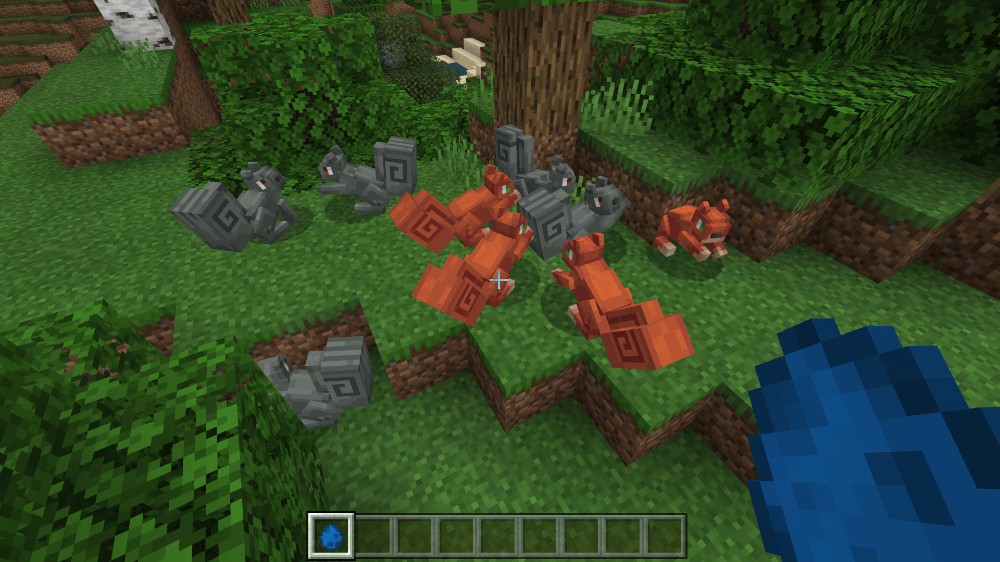
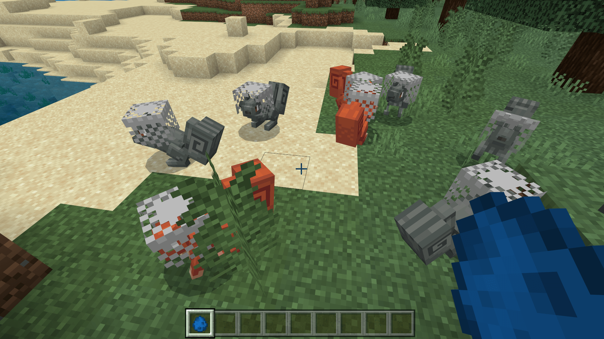

# 自定义松鼠实体行为

下面，我们一起来制作松鼠的行为。我们打开松鼠的行为包定义文件，依次向其中加入一些必要的行为组件。

```json
{
  "format_version": "1.12.0",
  "minecraft:entity": {
    "description": {
      "identifier": "tutorial_demo:squirrel",
      "is_experimental": false,
      "is_spawnable": true,
      "is_summonable": true
    },
    "component_groups": {

    },
    "components": {
      "minecraft:persistent": {

      }
    },
    "events": {

    }
  }
}
```

我们可以看到，已经有一个组件随着编辑器创建而加入了，即`minecraft:persistent`。`minecraft:persistent`组件用于控制生物是否是**宿存的**（**Persistent**，***持久化保存***）。宿存的生物不会因距离过远而被引擎销毁。事实上，我们是不需要这个组件的。因为这不是类似于画之类的必须宿存的实体，因而其存在只会徒增引擎负担，所以我们将其删去。

## 添加组件

下面我们开始添加一系列组件。在这里，我们仅仅为了演示，所以并不打算介绍所有的组件，也不欲纠结于一个生物的组件搭配是否非常完美。

### 添加常规组件

```json
{
  "format_version": "1.12.0",
  "minecraft:entity": {
    "description": {
      "identifier": "tutorial_demo:squirrel",
      "is_experimental": false,
      "is_spawnable": true,
      "is_summonable": true
    },
    "component_groups": {

    },
    "components": {
      "minecraft:hurt_on_condition": {
        "damage_conditions": [
          {
            "filters": {
              "test": "in_lava",
              "subject": "self",
              "operator": "==",
              "value": true
            },
            "cause": "lava",
            "damage_per_tick": 4
          }
        ]
      },
      "minecraft:pushable": {
        "is_pushable": true,
        "is_pushable_by_piston": true
      },
      "minecraft:experience_reward": {
        "on_death": "query.last_hit_by_player ? Math.Random(0,1) : 0"
      },
      "minecraft:breathable": {
        "total_supply": 15,
        "suffocate_time": 0
      },
      "minecraft:physics": {}
    },
    "events": {

    }
  }
}
```

我们添加一些大部分生物都应该具有的组件。`minecraft:hurt_on_condition`是依照条件收到伤害，这里我们设置为在熔岩中会受到伤害。我们知道在熔岩中我们会同时受到两种伤害，一个是火焰灼伤，一个是熔岩灼伤，这里便控制着熔岩的灼伤。`minecraft:pushable`代表着我们的实体是否会被推动。我们把被实体推动和被活塞推动全部设置为`true`。`minecraft:experience_reward`代表击杀时掉落的经验奖励，Molang表达式用于计算掉落的经验值。`minecraft:breathable`为实体在水中的可呼吸性。`minecraft:physics`代表该实体受到物理引擎的影响。

### 添加导航组件

```json
{
  "format_version": "1.12.0",
  "minecraft:entity": {
    "description": {
      "identifier": "tutorial_demo:squirrel",
      "is_experimental": false,
      "is_spawnable": true,
      "is_summonable": true
    },
    "component_groups": {

    },
    "components": {
      // ...
      "minecraft:breathable": {
        "total_supply": 15,
        "suffocate_time": 0
      },
      "minecraft:physics": {},
      "minecraft:navigation.walk": {
        "can_path_over_water": true,
        "avoid_water": true
      }
    },
    "events": {

    }
  }
}
```

我们加入一个`navigation.`前缀的组件，这类组件被称为导航组件。每个实体都必须有一个导航组件才能正常运行其寻路算法。不同的导航组件将执行不同的寻路逻辑。实体不可以拥有多个导航组件，即每个实体只能拥有一种导航组件。这里的`minecraft:navigation.walk`组件意味着实体使用“步行”的寻路算法。

### 添加移动组件

```json
{
  "format_version": "1.12.0",
  "minecraft:entity": {
    "description": {
      "identifier": "tutorial_demo:squirrel",
      "is_experimental": false,
      "is_spawnable": true,
      "is_summonable": true
    },
    "component_groups": {

    },
    "components": {
      // ...
      "minecraft:physics": {},
      "minecraft:navigation.walk": {
        "can_path_over_water": true,
        "avoid_water": true
      },
      "minecraft:movement.skip": {}
    },
    "events": {

    }
  }
}
```

我们接着添加一个`movement.`前缀的组件，这类组件称为移动组件。移动组件控制着实体“如何进行移动”。这里的移动并不是指如何寻路，而是如何“沿着寻路算法给出的路径到达目的地”。说白了，就是实体“走路”的方式，只不过这里的“走路”不一定真的指代行走。当然，如果实体缺失了该类型的组件，它将不具备移动的能力。这里我们期待松鼠采用兔子一样边走边跳跃的方式来“走路”，即“跳着走”。所以我们使用了`minecraft:movement.skip`。注意，史莱姆和岩浆怪采用了另一种移动方式组件，被称为`minecraft:movement.jump`，这代表只用跳跃来走路，和兔子的“蹿行”的跳跃方式是不同的。

### 添加跳跃组件

```json
{
  "format_version": "1.12.0",
  "minecraft:entity": {
    "description": {
      "identifier": "tutorial_demo:squirrel",
      "is_experimental": false,
      "is_spawnable": true,
      "is_summonable": true
    },
    "component_groups": {

    },
    "components": {
      // ...
      "minecraft:navigation.walk": {
        "can_path_over_water": true,
        "avoid_water": true
      },
      "minecraft:movement.skip": {},
      "minecraft:jump.static": {}
    },
    "events": {

    }
  }
}
```

还有一种组件是以`jump.`为前缀的组件，我们称为跳跃组件。跳跃组件即控制实体跳跃的方式。注意，这种组件仅仅是控制实体跳跃的方式，并不控制实体何时跳跃，也不控制实体是否在跳跃。但是，如果缺失该组件，实体将不具备跳跃的能力。目前只有两种跳跃组件，一种是静态跳跃`minecraft:jump.static`，代表每次跃起都保持完全一致，另一种是动态跳跃`minecraft:jump.dynamic`，代表每次跃起可能会根据实体的速度修饰符进行改变，比如跃起的高度将随速度发生变化。

### 添加AI意向组件

```json
{
  "format_version": "1.12.0",
  "minecraft:entity": {
    "description": {
      "identifier": "tutorial_demo:squirrel",
      "is_experimental": false,
      "is_spawnable": true,
      "is_summonable": true
    },
    "component_groups": {

    },
    "components": {
      // ...
      "minecraft:movement.skip": {},
      "minecraft:jump.static": {},
      "minecraft:behavior.float": {
        "priority": 0
      },
      "minecraft:behavior.hurt_by_target": {
        "priority": 1
      },
      "minecraft:behavior.random_stroll": {
        "priority": 6,
        "speed_multiplier": 0.8,
        "xz_dist": 2,
        "y_dist": 1
      },
      "minecraft:behavior.random_look_around": {
        "priority": 9
      },
      "minecraft:behavior.look_at_player": {
        "priority": 11
      }
    },
    "events": {

    }
  }
}
```

接下来，我们添加实体的**AI意向**（**AI Goal**）。实体的AI意向全都以`behavior.`为前缀，代表实体对某种类型的动作的“钟意”程度。每种AI意向都有一个**优先级**（**Priority**），优先级是一个整数。当意向之间发生冲突时，优先级的值越低的AI意向越可能优先执行，即**优先级的值越低代表着优先级越高**。我们为这个实体加入了一个优先级最高的浮动意向`minecraft:behavior.float`，这代表只要实体在水中，一定会优先在水面上浮动。然后是一个由伤害锁定目标的意向`minecraft:behavior.hurt_by_target`，这意味着只要有实体对松鼠造成伤害，松鼠就会将其锁定为自己的目标。然后添加了一个优先级并不那么高的随意漫步的意向`minecraft:behavior.random_stroll`。接着添加了一个`minecraft:behavior.random_look_around`用于随机向四周看。最后添加了一个优先级最低的`minecraft:behavior.look_at_player`，用于看向玩家。

### 添加属性组件

**属性**（**Property**）组件是一种特殊的组件，一般用于控制一个实体实例的属性，往往和实体在内存中存在的结构体中的一些属性相对应，代表着一个实体具备的“能力”或“性质”。

```json
{
  "format_version": "1.12.0",
  "minecraft:entity": {
    "description": {
      "identifier": "tutorial_demo:squirrel",
      "is_experimental": false,
      "is_spawnable": true,
      "is_summonable": true
    },
    "component_groups": {

    },
    "components": {
      // ...
      "minecraft:behavior.random_look_around": {
        "priority": 9
      },
      "minecraft:behavior.look_at_player": {
        "priority": 11
      },
      "minecraft:type_family": {
        "family":["squirrel", "mob"]
      },
      "minecraft:can_climb": {},
      "minecraft:collision_box": {
        "width": 0.7,
        "height": 0.7
      }
    },
    "events": {

    }
  }
}
```

属性组件一般没有特殊的前缀，所以不易与常规组件区分。我们添加了三个属性组件。`minecraft:type_family`代表该实体的类型的族的属性，常常和命令相配合。`minecraft:can_climb`代表该实体具备攀爬属性，遇到梯子时该实体能够登梯而上。`minecraft:collision_box`定义了该实体的碰撞箱属性，用于支持该实体的碰撞。

### 添加特性组件

**特性**（**Attribute**）组件是另一种特殊的组件，往往用于指定实体所具备的特定性质的或进行特定操作时该操作的“数值”，比如攻击数值、生命值、具备的护甲值等。特性是和实体NBT中的`Attributes`列表相绑定的，定义的特性组件最终都会作用到这个实体的`Attributes`列表中定义的特性中。

```json
{
  "format_version": "1.12.0",
  "minecraft:entity": {
    "description": {
      "identifier": "tutorial_demo:squirrel",
      "is_experimental": false,
      "is_spawnable": true,
      "is_summonable": true
    },
    "component_groups": {

    },
    "components": {
      // ...
      "minecraft:can_climb": {},
      "minecraft:collision_box": {
        "width": 0.7,
        "height": 0.7
      },
      "minecraft:movement": {
        "value": 0.3
      },
      "minecraft:health": {
        "value": 30,
        "max": 30
      }
    },
    "events": {

    }
  }
}
```

特性组件一般也没有特殊的前缀。这里我们添加了两个特性组件`minecraft:movement`和`minecraft:health`，分别用于定义实体的基础移动速度的值、基础和最大的生命值。

至此，我们便完成了松鼠的组件定义，我们可以进入游戏查看我们的行为效果。


### 使用组件组和事件来制作变体

到此为止，我们已经为松鼠添加了组件。事实上，这时候的松鼠已经可以正常表现了。但是，我们依然记得我们曾经为松鼠绘制了灰色的纹理贴图。我们现在使用组件组和事件来控制灰色纹理变体。

#### 添加变体组件组

```json
{
  "format_version": "1.12.0",
  "minecraft:entity": {
    "description": {
      "identifier": "tutorial_demo:squirrel",
      "is_experimental": false,
      "is_spawnable": true,
      "is_summonable": true
    },
    "component_groups": {
      "tutorial_demo:color_red": {
        "minecraft:variant": {
          "value": 0
        }
      },
      "tutorial_demo:color_gray": {
        "minecraft:variant": {
          "value": 1
        }
      }
    },
    "components": {
      // ...
    },
    "events": {

    }
  }
}
```

我们使用`minecraft:variant`组件来添加变体组件组。`minecraft:variant`组件是一个专门用于控制变体的组件。在游戏中，它定义的值可以同步到客户端，因此，我们可以在客户端用`query.variant`获取到它的值。

我们定义两个组件组，一个`  tutorial_demo:color_red`，变体ID为0；另一个`  tutorial_demo:color_gray`，变体ID为1。不管哪个组件组，当它被加入到全局组件中时都会带入一个`minecraft:variant`组件，用于确定`query.variant`获取到的值。

#### 定义变体生成事件

我们希望定义内置事件`minecraft:entity_spawned`。这个事件会在松鼠自然生成或者刷怪蛋生成时被引擎自主触发。因此我们在这个事件中分别定义生成两种变体的几率。

```json
{
  "format_version": "1.12.0",
  "minecraft:entity": {
    "description": {
      "identifier": "tutorial_demo:squirrel",
      "is_experimental": false,
      "is_spawnable": true,
      "is_summonable": true
    },
    "component_groups": {
      "minecraft:color_red": {
        "minecraft:variant": {
          "value": 0
        }
      },
      "minecraft:color_gray": {
        "minecraft:variant": {
          "value": 1
        }
      }
    },
    "components": {
      // ...
    },
    "events": {
      "minecraft:entity_spawned": {
        "sequence": [
          {
            "randomize": [
              {
                "weight": 1,
                "add": {
                  "component_groups": [
                    "  tutorial_demo:color_red"
                  ]
                }
              },
              {
                "weight": 1,
                "add": {
                  "component_groups": [
                    "  tutorial_demo:color_gray"
                  ]
                }
              }
            ]
          }
        ]
      }
    }
  }
}
```

我们将两种松鼠的权重全部设为1，这样可以做到两种松鼠1:1生成。



## 增加松鼠的自然生成

我们自定义了新生物之后，就需要为其写入除了刷怪蛋生成之外新的自然生成机制。否则，玩家在生存模式下边无法体验到实体的生成。自然生成机制需要使用我们的生成规则定义文件来制作。我们在行为包中新建一个`spawn_rules`文件夹并在其中新建一个`squirrel.json`文件，作为我们的生成规则定义文件。

```json
{
  "format_version": "1.8.0",
  "minecraft:spawn_rules": {
    "description": {
      "identifier": "tutorial_demo:squirrel",
      "population_control": "animal"
    },
    "conditions": [
      {
        "minecraft:spawns_on_surface": {},
        "minecraft:brightness_filter": {
          "min": 0,
          "max": 15,
          "adjust_for_weather": true
        },
        "minecraft:weight": {
          "default": 12
        },
        "minecraft:herd": {
          "min_size": 8,
          "max_size": 12
        },

        "minecraft:biome_filter": [
		  {"test": "has_biome_tag", "operator":"==", "value": "giant"}
        ]
      }
    ]
  }
}
```

我们希望其生成于带有`giant`标签的生物群系的地表，并且成兽群生成，以`animal`的方式控制种群数目，并根据天气调整生成比率。我们便可以编写上述内容，然后将其写入到我们的生成规则定义文件中。

## 添加装备组件

还记得我们之前为我们的松鼠开启了附着物么？我们现在为松鼠添加一个头盔装备。为此，我们需要在行为包中使用`minecraft:equipment`组件。`minecraft:equipment`组件接受一个战利品表，为此，我们需要制作一个只有头盔的战利品表。我们不妨制作一个只有锁链头盔的战利品表。

在行为包中找到`loot_tables`文件夹并在其中新建一个`entities`文件夹，然后在其中创建`squirrel_equipment.json`文件，作为我们战利品表。我们向其中写入如下内容以代表只有一个锁链头盔。

```json
{
  "pools": [
    {
      "rolls": 1,
      "entries": [
        {
          "type": "item",
          "name": "minecraft:chainmail_helmet",
          "weight": 1
        }
      ]
    }
  ]
}
```

然后，我们在实体行为包定义中加入`minecraft:equipment`。`minecraft:equipment`是一个属性组件，我们将其和`minecraft:type_family`、`minecraft:can_climb`与`minecraft:collision_box`放置在一起，方便我们之后调试。

```json
{
  "format_version": "1.12.0",
  "minecraft:entity": {
    "description": {
      "identifier": "tutorial_demo:squirrel",
      "is_experimental": false,
      "is_spawnable": true,
      "is_summonable": true
    },
    "component_groups": {
      // ...
    },
    "components": {
      // ...
      "minecraft:behavior.look_at_player": {
        "priority": 11
      },
      "minecraft:equipment": {
        "table": "loot_tables/entities/squirrel_equipment.json"
      },
      "minecraft:type_family": {
        "family":["squirrel", "mob"]
      },
      "minecraft:can_climb": {},
      "minecraft:collision_box": {
        "width": 0.7,
        "height": 0.7
      },
      "minecraft:movement": {
        "value": 0.3
      }
      // ...
    },
    "events": {
      // ...
    }
  }
}
```

这些都完成以后，我们便可以进入游戏自测了。



可以看到，我们的松鼠现在都带有一个头盔了！当然，头盔有点“不合身”，不过这不要紧，这只是一个演示。在实际操作中，我们可以通过自定义附着物的方式自定义一个头盔。在第九章的挑战中，我们就制作过自定义盔甲。参考那个步骤，稍微调整模型的大小，便可以依据松鼠的“头型”打造出量身定制的头盔了。作为练习，这一要点就交给开发者们自行操作了。

最后，我们将截止到目前我们已经在行为包定义文件中编写的内容做一个展示，方便开发者们宏观地感受一个带有相对完整的组件、组件组和事件的实体：

```json
{
  "format_version": "1.12.0",
  "minecraft:entity": {
    "description": {
      "identifier": "tutorial_demo:squirrel",
      "is_experimental": false,
      "is_spawnable": true,
      "is_summonable": true
    },
    "component_groups": {
      "minecraft:color_red": {
        "minecraft:variant": {
          "value": 0
        }
      },
      "minecraft:color_gray": {
        "minecraft:variant": {
          "value": 1
        }
      }
    },
    "components": {
      "minecraft:hurt_on_condition": {
        "damage_conditions": [
          {
            "filters": {
              "test": "in_lava",
              "subject": "self",
              "operator": "==",
              "value": true
            },
            "cause": "lava",
            "damage_per_tick": 4
          }
        ]
      },
      "minecraft:pushable": {
        "is_pushable": true,
        "is_pushable_by_piston": true
      },
      "minecraft:experience_reward": {
        "on_death": "query.last_hit_by_player ? Math.Random(0,1) : 0"
      },
      "minecraft:breathable": {
        "total_supply": 15,
        "suffocate_time": 0
      },
      "minecraft:physics": {},
	  "minecraft:navigation.walk": {
        "can_path_over_water": true,
        "avoid_water": true
      },
      "minecraft:movement.skip": {},
      "minecraft:jump.static": {},
      "minecraft:behavior.float": {
        "priority": 0
      },
      "minecraft:behavior.hurt_by_target": {
        "priority": 1
      },
      "minecraft:behavior.random_stroll": {
        "priority": 6,
        "speed_multiplier": 0.8,
        "xz_dist": 2,
        "y_dist": 1
      },
      "minecraft:behavior.random_look_around": {
        "priority": 9
      },
      "minecraft:behavior.look_at_player": {
        "priority": 11
      },
      "minecraft:equipment": {
        "table": "loot_tables/entities/squirrel_equipment.json"
      },
      "minecraft:type_family": {
        "family":["squirrel", "mob"]
      },
      "minecraft:can_climb": {},
      "minecraft:collision_box": {
        "width": 0.7,
        "height": 0.7
      },
      "minecraft:movement": {
        "value": 0.3
      },
      "minecraft:health": {
        "value": 30,
        "max": 30
      }
    },
    "events": {
      "minecraft:entity_spawned": {
        "sequence": [
          {
            "randomize": [
              {
                "weight": 1,
                "add": {
                  "component_groups": [
                    "minecraft:color_red"
                  ]
                }
              },
              {
                "weight": 1,
                "add": {
                  "component_groups": [
                    "minecraft:color_gray"
                  ]
                }
              }
            ]
          }
        ]
      }
    }
  }
}
```