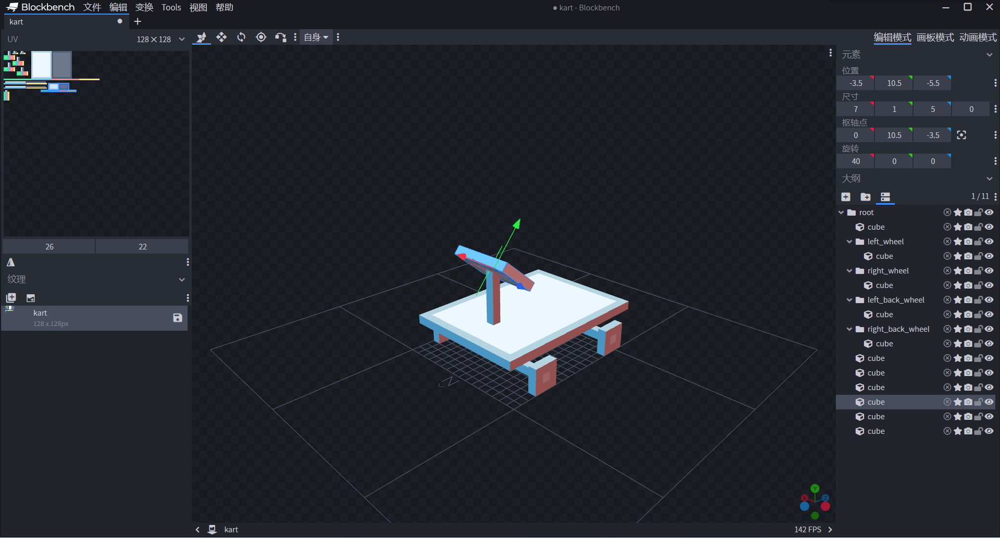
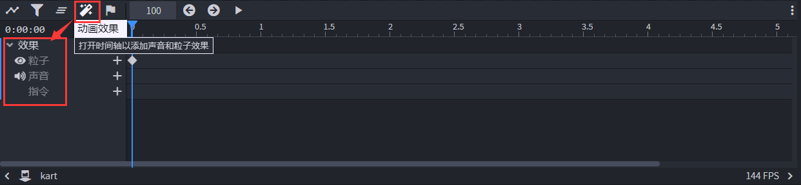

# 挑战：制作一辆卡丁车

在本节中，我们一起来制作一个卡丁车。这次的挑战主要是针对Molang的复习和更多复杂应用的学习，所以卡丁车本身模型的精细便置为次要目标，同时我们将精力全部放在Molang相关的表达式的编写过程上。

## 准备模型


我们粗略地绘制一个卡丁车的模型，重点突出了卡丁车的四个轮胎骨骼，同时将所有的骨骼全部放在一个根组里。这样能够方便我们的后续操作。




我们通过新建纹理贴图的“填充”功能为其快速上色。之后，我们便可以关注卡丁车的动画了。这也是我们本节挑战的重中之重。

## 设计移动、拐弯和起伏动画

我们将关注点移动到车轮上。通过对现实的观察，我们可以得知，当一个卡丁车移动时，轮胎会旋转，而车身则相对不动。当一个卡丁车拐弯时，前轮的旋转角度将会相对于车身更加地大。当卡丁车在空中飞起或下降时，车身会整体后仰或前倾。我们根据实际卡丁车的这些效果来制作我们游戏中卡丁车的动画。

### 移动动画

对于移动动画来说，我们只需要关注四个车轮的旋转即可。我们只需要车轮随着前进的距离进行旋转。


通过查阅文档，我们可以得知`query.modified_distance_moved`查询函数可以用于返回一个实体从进入世界到当前时间移动的总距离。我们可以使用这个查询来进行车轮向前移动的动画。我们更改$yOz$面的转角，即X轴向所代表的字段，比如，将其设置为`50 * query.modified_distance_moved`。我们将四个轮胎设置为同样的值，这样可以保证四个轮子转速一致。

### 拐弯动画

在拐弯时，我们需要改变前轮的转角。我们继续关注前轮的旋转通道。


我们通过查阅文档得知，当实体在左右移动时，实体会具备一个**偏航角**（**Yaw**）速度，这个速度可以通过`query.yaw_speed`查询函数得到。我们可以利用这一点来做到车轮的左右偏转。我们将Y轴向的值改为例如`math.clamp(query.yaw_speed * 35, -35, 35)`，这样可以在使其旋转的同时不要转得过于离谱。`math.clamp`可以用于**钳制**（**Clamp**）一个值到指定的区间中。

### 起伏动画

接下来我们制作起伏动画。我们对于一个卡丁车在下落时一般都具有这种直观：随着卡丁车在空中滑行时落得越来越快，车头会越来越靠下。因此，我们对卡丁车的`root`骨骼，也就是控制着整体的骨骼的旋转通道来进行操作，使其随着竖直速度的变化而旋转。


通过查阅文档我们可以得知，实体的竖直速度可以用`query.vertical_speed`查询函数来获得。因此，我们可以在整体骨骼的X轴向上使用类似于`math.clamp(query.vertical_speed * -7, -35, 35)`的表达式来做到控制起伏。不过值得注意的是，`query.vertical_speed`的方向与世界坐标的Y轴方向一致。也就是说，当卡丁车下落时，竖直速度的方向是向下的。为了使我们的骨骼向前转，我们需要对其乘一个负数。

这样，我们就完成了卡丁车基本动画的制作。接下来，我们并不着急导出动画。我们在这个基础上为其添加粒子效果。

## 添加尾气和胎痕粒子

我们准备好尾气粒子和胎痕粒子，假设他们的短名称分别为`gas`和`mark`。为了把他们挂接到实体上，我们需要为他们设置**定位器**（**Locator**）。定位器是模型中一个单点元素，代表模型中一个固定的位置。有了定位器，我们就可以将其他的一些小部件例如粒子挂接到模型的特定位置上。


我们回到“编辑”模式，在右侧的“大纲”窗格上选中我们想加入定位器的骨骼，右键点击“**添加定位器**”。


像其他元素一样，我们可以通过拖动预览窗中的坐标轴来改变定位器的位置。这里我们将其放在车轮的底部，代表胎痕粒子的起始位置。


很快，我们为四个车轮和尾气管的位置添加了定位器。现在，我们便可以为其添加粒子动画了。回到“动画”模式，我们将着眼于下方的时间轴窗格。



点击“动画效果”按钮，我们可以在时间轴中看到一个除了骨骼之外的额外的动画主体，那便是包含了粒子、声音和命令的效果主体。我们点击“粒子”通道右侧的“+”按钮，为其添加一个`0.0`的关键帧。

### 尾气粒子

我们点击关键帧，可以在左侧的“关键帧”窗格中看到除了“脚本”之外，多出了“效果”和“定位器”两个属性。


其中，定位器可以通过下拉菜单选择的方式来选取。


我们将为其粒子的短名称挂接到`pipe`定位器上，这样只差尾气粒子在实体定义文件中的短名称定义，就完成尾气粒子的添加了。

### 胎痕粒子

我们点击“关键帧”窗格右侧的“+”按钮，在同一个关键帧处添加多个效果。


通过重复上述过程，即可将四个轮胎的胎痕粒子也挂接完毕。现在，我们可以到处几何、纹理和动画文件了，接下来，我们将这些资源挂接到实体客户端定义文件上。

## 挂接卡丁车实体资源

我们在我的世界开发工作台中创建一个AddOn组件，然后通过配置创建一个`tutorial_demo:kart`实体。我们将我们在Blockbench项目中的几何、纹理和动画全部导出到我们的AddOn组件的文件夹中。

我们将实体客户端定义文件补全：

```json
{
  "format_version": "1.8.0",
  "minecraft:client_entity": {
    "description": {
      "identifier": "tutorial_demo:kart",
      "materials": {
        "default": "entity_alphatest"
      },
      "textures": {
        "default": "textures/entity/kart/kart"
      },
      "geometry": {
        "default": "geometry.kart"
      },
      "animations": {
        "move": "animation.kart.move"
      },
      "animation_controllers": [
        { "move": "controller.animation.kart.move" }
      ],
      "render_controllers": [
        "controller.render.kart"
      ],
	  "particle_effects": {
		  "mark": "tutorial_demo:mark",
		  "gas": "tutorial_demo:gas"
	  }
    }
  }
}
```

除此之外，我们需要单独制作一个动画控制器用于播放`move`动画：

```json
{
  "format_version" : "1.10.0",
  "animation_controllers" : {
    "controller.animation.kart.move" : {
      "initial_state" : "default",
      "states" : {
        "default" : {
          "animations" : [
            "move"
          ]
        }
      }
    }
  }
}
```

还需制作一个基础的渲染控制器用于使实体正常渲染：

```json
{
  "format_version": "1.8.0",
  "render_controllers": {
    "controller.render.kart": {
      "geometry": "Geometry.default",
      "materials": [ { "*": "Material.default" } ],
      "textures": [
        "Texture.default"
      ]
    }
  }
}
```

除此之外，我们也需要检查一下导出的资源文件，避免挂接失败。首先是几何文件：

```json
{
  "format_version": "1.12.0",
  "minecraft:geometry": [
    {
      "description": {
        "identifier": "geometry.kart",
        "texture_width": 128,
        "texture_height": 128,
        "visible_bounds_width": 3,
        "visible_bounds_height": 2.5,
        "visible_bounds_offset": [0, 0.75, 0]
      },
      "bones": [
        {
          "name": "root",
          "pivot": [0, 1.5, -3.5],
          "cubes": [
            {"origin": [-7, 1, -4], "size": [14, 1, 1], "uv": [0, 24]},
            {"origin": [-7, 1, 7], "size": [14, 1, 1], "uv": [0, 21]},
            {"origin": [-7, 3.5, -7.5], "size": [14, 1, 19], "uv": [0, 0]},
            {"origin": [-0.5, 4.5, -3.5], "size": [1, 6, 1], "uv": [0, 27]},
            {"origin": [-3.5, 10.5, -5.5], "size": [7, 1, 5], "pivot": [0, 10.5, -3.5], "rotation": [-40, 0, 0], "uv": [26, 22]},
            {"origin": [-0.5, 2, -4], "size": [1, 1.5, 1], "uv": [11, 0]},
            {"origin": [-1, 2, 7], "size": [1, 1.5, 1], "uv": [6, 0]}
          ],
          "locators": {
            "pipe": [-2, 4, 11]
          }
        },
        {
          "name": "left_wheel",
          "parent": "root",
          "pivot": [7.5, 1.5, -3.5],
          "cubes": [
            {"origin": [7, 0, -5], "size": [1, 3, 3], "uv": [9, 11]}
          ],
          "locators": {
            "left_front": [7.5, 0, -3.5]
          }
        },
        {
          "name": "right_wheel",
          "parent": "root",
          "pivot": [-8, 1.5, -3.5],
          "cubes": [
            {"origin": [-8, 0, -5], "size": [1, 3, 3], "uv": [0, 8]}
          ],
          "locators": {
            "right_front": [-7.5, 0, -3.5]
          }
        },
        {
          "name": "left_back_wheel",
          "parent": "root",
          "pivot": [7.5, 1.5, 7.5],
          "cubes": [
            {"origin": [7, 0, 6], "size": [1, 3, 3], "uv": [6, 4]}
          ],
          "locators": {
            "left_back": [7.5, 0, 7.5]
          }
        },
        {
          "name": "right_back_wheel",
          "parent": "root",
          "pivot": [-7.5, 1.5, 7.5],
          "cubes": [
            {"origin": [-8, 0, 6], "size": [1, 3, 3], "uv": [0, 0]}
          ],
          "locators": {
            "right_back": [-7.5, 0, 7.5]
          }
        }
      ]
    }
  ]
}
```

然后是动画文件：

```json
{
  "format_version": "1.8.0",
  "animations": {
    "animation.kart.move": {
      "loop": true,
      "bones": {
        "left_wheel": {
          "rotation": ["50 * query.modified_distance_moved", "math.clamp(query.yaw_speed * 35, -35, 35)", 0]
        },
        "right_wheel": {
          "rotation": ["50 * query.modified_distance_moved", "math.clamp(query.yaw_speed * 35, -35, 35)", 0]
        },
        "root": {
          "rotation": ["math.clamp(query.vertical_speed * -7, -35, 35)", 0, 0]
        },
        "left_back_wheel": {
          "rotation": ["50 * query.modified_distance_moved", 0, 0]
        },
        "right_back_wheel": {
          "rotation": ["50 * query.modified_distance_moved", 0, 0]
        }
      },
      "particle_effects": {
        "0.0": [
          {
            "effect": "gas",
            "locator": "pipe"
          },
          {
            "effect": "mark",
            "locator": "left_front"
          },
          {
            "effect": "mark",
            "locator": "right_front"
          },
          {
            "effect": "mark",
            "locator": "left_back"
          },
          {
            "effect": "mark",
            "locator": "right_back"
          }
        ]
      }
    }
  }
}
```

最后是两个粒子：

```json
{
	"format_version": "1.10.0",
	"particle_effect": {
		"description": {
			"identifier": "tutorial_demo:mark",
			"basic_render_parameters": {
				"material": "particles_alpha",
				"texture": "textures/particle/particles"
			}
		},
		"curves": {
			"variable.psize": {
				"type": "catmull_rom",
				"input": "variable.particle_age",
				"horizontal_range": "variable.particle_lifetime",
				"nodes": [1, 1, 0.83, 0, 0]
			}
		},
		"components": {
			"minecraft:emitter_initialization": {
				"creation_expression": "variable.radius = 2.5;"
			},
			"minecraft:emitter_rate_instant": {
				"num_particles": 1
			},
			"minecraft:emitter_lifetime_looping": {
				"active_time": 2
			},
			"minecraft:emitter_shape_point": {},
			"minecraft:particle_lifetime_expression": {
				"max_lifetime": 1.5
			},
			"minecraft:particle_appearance_billboard": {
				"size": ["0.12 * variable.psize", "0.12 * variable.psize"],
				"facing_camera_mode": "emitter_transform_xz",
				"uv": {
					"texture_width": 128,
					"texture_height": 128,
					"uv": [56, 0],
					"uv_size": [8, 8]
				}
			},
			"minecraft:particle_appearance_tinting": {
				"color": [0.01176, 0.01176, 0.01176, 0.9098]
			}
		}
	}
}
```

```json
{
	"format_version": "1.10.0",
	"particle_effect": {
		"description": {
			"identifier": "tutorial_demo:gas",
			"basic_render_parameters": {
				"material": "particles_alpha",
				"texture": "textures/particle/particles"
			}
		},
		"curves": {
			"variable.psize": {
				"type": "catmull_rom",
				"input": "variable.particle_age",
				"horizontal_range": "variable.particle_lifetime",
				"nodes": [1, 1, 0.83, 0, 0]
			}
		},
		"components": {
			"minecraft:emitter_initialization": {
				"creation_expression": "variable.radius = 2.5;"
			},
			"minecraft:emitter_rate_instant": {
				"num_particles": 1
			},
			"minecraft:emitter_lifetime_looping": {
				"active_time": 2
			},
			"minecraft:emitter_shape_point": {},
			"minecraft:particle_lifetime_expression": {
				"max_lifetime": 1.5
			},
			"minecraft:particle_appearance_billboard": {
				"size": ["0.12 * variable.psize", "0.12 * variable.psize"],
				"facing_camera_mode": "lookat_xyz",
				"uv": {
					"texture_width": 128,
					"texture_height": 128,
					"uv": [56, 0],
					"uv_size": [8, 8]
				}
			},
			"minecraft:particle_appearance_tinting": {
				"color": [0.01176, 0.01176, 0.01176, 0.9098]
			}
		}
	}
}
```

这样，就可以保证我们的卡丁车的渲染不会出现任何问题了。接下来，我们为卡丁车添加实体行为组件。

## 制作卡丁车实体行为

我们接下来为卡丁车添加行为。比较重要的行为便是可以使其受到物理引擎作用的`minecraft:physics`，使其可被骑乘的`minecraft:rideable`。添加行为如下：

```json
{
  "format_version": "1.12.0",
  "minecraft:entity": {
    "description": {
      "identifier": "tutorial_demo:kart",
      "is_experimental": false,
      "is_spawnable": false,
      "is_summonable": true
    },
    "component_groups": {

    },
    "components": {
      "minecraft:persistent": {},
      "minecraft:physics": {},
      "minecraft:rideable": {
        "seat_count": 1,
        "crouching_skip_interact": true,
        "interact_text": "action.interact.ride.kart",
        "family_types": [
          "player"
        ],
        "seats": [
          {
            "position": [
              0,
              0.2,
              -0.3
            ],
            "min_rider_count": 1,
            "max_rider_count": 1
          }
        ]
      },
      "minecraft:pushable": {
        "is_pushable": false,
        "is_pushable_by_piston": true
      },
      "minecraft:movement.basic": {},
      "minecraft:jump.static": {},
      "minecraft:input_ground_controlled": {},
      "minecraft:collision_box": {
        "width": 1,
        "height": 1
      },
      "minecraft:type_family": {
        "family": [
          "kart",
          "inanimate"
        ]
      },
      "minecraft:health": {
        "value": 50
      },
      "minecraft:knockback_resistance": {
        "value": 1,
        "max": 1
      },
      "minecraft:movement": {
        "value": 0.5
      }
    },
    "events": {

    }
  }
}
```


我们可以看到，卡丁车的各个部分的行为和动画皆按照我们预想的那样进行，这说明我们的成功添加了一个卡丁车实体！