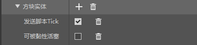

# 了解方块实体

在第十章中，我们曾一起了解了自定义方块，通过各种示例学会了如何自定义一个基本方块。其中，我们学会了如何给予一个方块自定义模型，也学会了如何使用各种组件控制方块的行为。但是，通过这种方式定义的方块还有着种种不足。这是因为普通的方块存在一些固有缺陷。

众所周知，普通的方块或者说是常规的方块都是以如下这些机制在世界中运作的。首先，方块具备各种**方块状态**（**Block State**），而每种方块状态拥有一个或多个允许的值，世界中每一个该类型的方块都是所有方块状态各赋予一个允许值中的值产生的。换句话说，世界中每种方块的实例都是其方块状态的排列组合。在旧版中，我们知道方块具有一种被称为特殊值、数据值、损坏值或**附加值**（**Aux Value**）的属性，这其实是和现在的方块状态系统等价的。每种附加值都对应一种方块状态的组合。各方块状态的一种组合称为方块的一个**置换**（或**排列**，**Permutation**）。这种由方块状态组成方块置换的模式只能存储布尔值或整数等基本值的组合，却无法将字符串等更高级的值存储在一个方块中，因此具备存储上的局限性。比如，如果我想将一个物品标识符存储在一个方块中，这只靠常规方块的定义是做不到的。

第二种机制是方块滴答机制。这里的**滴答**（**Tick**）可以大致理解为更新，但实际上指的是一种可以随着游戏的系统主滴答循环的有序推进而进行的一种更新。常规的方块都无法保证自己的每游戏刻（即每次系统主滴答循环）都能滴答。液体方块的两个方块中动态的那一个是例外，但是即使是例外，也不能长期地保证每刻的更新性，那是因为动态液体一旦停止流动，它将转换为静态液体。常规的方块只有在自己的**毗邻**（**Neighbor**）发生变化或者发生**随机滴答**（**Random Tick**，又称**随机刻**）事件时才能进行一次滴答或将自身加入**挂起滴答队列**（**Pending Tick Queue**）中，用社区的说法为进入了**计划刻**。而计划刻内的方块会在每次系统主滴答循环顺序中的指定时刻位置处集中进行滴答，这是一种性能缓冲机制。总而言之，常规方块几乎不可以“自主地”进行滴答或更新，也无法侦测到除了自身毗邻之外的其他方块或实体发生的变化。这是常规方块的一个重大缺陷。

第三种缺陷就是无法像实体那样使模型播放动画。常规定义的方块的模型几乎都是静态的，定义之后便不会再进行变动，至多存在随着方块状态的改变稍微改变一下模型的朝向或部分骨骼的显示等，但无法完成复杂的动画。为了使模型具备动画，我们必须另寻高法。

所以，和附着物与物品的关系类似，我们拥有了一种可以将客户端实体作为一种“资源控制器”的容器挂接到方块上的功能，这种挂接到方块上的仅仅具备客户端实体定义的实体便被称为**方块实体**（**Block Entity**，又称**Tile Entity**）。方块实体可以帮助我们存储大规模数据、自主地进行滴答和播放模型动画。原版游戏中的箱子、告示牌、熔炉、信标、附魔台、床、钟、活塞臂等都具备方块实体。

## 定义方块实体

了解了这么多理论机制，我们如何实际定义一个方块实体呢？我们可以在方块的服务端定义文件中通过`netease:block_entity`组件定义方块实体。我们在编辑器中新建一个方块，并在服务端组件中添加“**方块实体**”组件。



我们可以看到其对应的JSON组件字段

```json
"netease:block_entity": {
  "tick": true,
  "movable": false
}
```

`tick`字段决定了方块实体是否会每刻向脚本发送一个`ServerBlockEntityTickEvent`事件，通过配合脚本可以做到每刻执行滴答逻辑。`movable`字段决定了该方块是否可以被粘性活塞拉回。

一旦定义好了`netease:block_entity`组件，一个方块便算是拥有了一个基础的方块实体。接下来，我们就需要配合模组SDK来添加方块实体的逻辑了。

## 连接模组SDK

我们可以在模组SDK中通过一系列接口操纵方块实体。

### 引擎组件

我们可以通过在服务端创建`blockEntityData`组件来修改方块实体的**额外数据**（**Extra Data**）。额外数据是中国版自定义方块实体的一个存储器，存储着开发者可以自定义的各种数据。我们可以通过该组件的<a href="../../../mcdocs/1-ModAPI/接口/方块/方块实体.html#getblockentitydata" rel="noopenner"> `GetBlockEntityData` </a>方法得到额外数据的引用，然后直接读取额外数据或在这个引用上修改额外数据的值。

### 事件

<a href="../../../mcdocs/1-ModAPI/事件/方块.html#serverplaceblockentityevent" rel="noopenner"> `ServerPlaceBlockEntityEvent` </a>事件可以用于在方块实体被放置时触发。<a href="../../../mcdocs/1-ModAPI/事件/世界.html#chunkgeneratedserverevent" rel="noopenner"> `ChunkGeneratedServerEvent` </a>事件可以在区块结束生成是触发，数据中包含一个方块实体列表。<a href="../../../mcdocs/1-ModAPI/事件/方块.html#serverblockentitytickevent" rel="noopenner"> `ServerBlockEntityTickEvent` </a>事件可以在开启了每刻滴答的方块实体进行滴答时触发。这三个事件都位于服务端。

在文档中还有更多的方块实体相关的模组SDK接口等待我们发现和使用。有效利用各种接口将使我们的方块实体拥有各种丰富的逻辑与功能！
