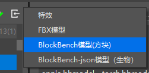

# 制作一个加速火把

本节中，我们将通过制作一个加速火把的过程来学习方块实体方块的制作。

## 使用Blockbench准备火把模型

我们的加速火把不需要骨骼动画或资源控制，只需要一个静态的火把模型即可。所以我们在Blockbench中绘制一个火把模型。


## 使用编辑器导入模型并配置火把方块



我们在编辑器中使用导入方块模型的功能导入我们的火把模型。


然后新建一个火把方块，在“基础属性”中配置模型，这等价于我们在`blocks.json`中配置`netease_model`字段。


然后为我们的火把加上“方块实体”的组件。与此同时，我们为了使火把正常渲染，将其调整为可寻路、透明材质和非固体，同时设置好其碰撞箱。

我们也可以在JSON文件中进行编辑。方块的服务端定义如下：

```json
{
  "format_version": "1.16.0",
  "minecraft:block": {
    "description": {
      "identifier": "design:custom_torch"
    },
    "components": {
      "minecraft:block_light_absorption": 0,
      "minecraft:block_light_emission": 1.0,
      "minecraft:destroy_time": 1.0,
      "netease:render_layer": {
        "value": "alpha"
      },
      "netease:aabb": {
        "collision": {
          "min": [0.4375, 0.0, 0.4375],
          "max": [0.5625, 0.6875, 0.5625]
        },
        "clip": {
          "min": [0.4375, 0.0, 0.4375],
          "max": [0.5625, 0.6875, 0.5625]
        }
      },
      "netease:solid": {
        "value": false
      },
      "netease:pathable": {
        "value": true
      },
      "netease:block_entity": {
        "tick": true,
        "movable": false
      }
    }
  }
}
```

客户端定义如下：

```json
{
  "format_version": [ 1, 1, 0 ],
  "design:custom_torch": {
    "netease_model": "design:custom_torch",
    "sound": "wood"
  }
}
```

同时我们也可以查看已经导入的火把模型文件：

```json
{
  "format_version": "1.13.0",
  "netease:block_geometry": {
    "description": {
      "identifier": "design:custom_torch",
      "textures": ["torch_on"],
      "use_ao": false
    },
    "bones": [{
      "name": "root",
      "pivot": [0, 0, 0],
      "rotation": [0, 0, 0],
      "cubes": [{
        "origin": [-9, 0, 7],
        "pivot": [-8, 0, 8],
        "rotation": [0, 0, 0],
        "size": [2, 11, 2],
        "uv": {
          "down": {
            "texture": 0,
            "uv": [7, 14],
            "uv_size": [2, 2]
          },
          "east": {
            "texture": 0,
            "uv": [7, 6],
            "uv_size": [2, 10]
          },
          "north": {
            "texture": 0,
            "uv": [7, 6],
            "uv_size": [2, 10]
          },
          "south": {
            "texture": 0,
            "uv": [7, 6],
            "uv_size": [2, 10]
          },
          "up": {
            "texture": 0,
            "uv": [9, 8],
            "uv_size": [-2, -2]
          },
          "west": {
            "texture": 0,
            "uv": [7, 6],
            "uv_size": [2, 10]
          }
        }
      }]
    }]
  }
}
```

## 监听事件并催熟作物

接下来我们制作脚本部分。我们可以通过`ServerBlockEntityTickEvent`事件来监听滴答。我们通过编辑器在行为包中创建一个主模组目录和一个服务端控制中心，并在主模组文件中注册服务端系统：

```python
# -*- coding: UTF-8 -*-
from mod.common.mod import Mod
import mod.server.extraServerApi as serverApi


@Mod.Binding(name="CustomTorch", version="0.1")
class CustomTorch(object):

    def __init__(self):
        pass

    @Mod.InitClient()
    def initClient(self):
        pass

    @Mod.InitServer()
    def initServer(self):
        serverApi.RegisterSystem("CustomTorch", "CustomTorchServer", "CustomTorchScripts.ServerMgr.Main")

    @Mod.DestroyClient()
    def destroyClient(self):
        pass

    @Mod.DestroyServer()
    def destroyServer(self):
        pass

```

然后我们在`ServerMgr.py`文件中写入服务端系统：

```python
# -*- coding: UTF-8 -*-
from mod.server.system.serverSystem import ServerSystem
import mod.server.extraServerApi as serverApi


class Main(ServerSystem):

    def __init__(self, namespace, system_name):
        ServerSystem.__init__(self, namespace, system_name)
        namespace, system = serverApi.GetEngineNamespace(), serverApi.GetEngineSystemName()
        self.ListenForEvent(namespace, system, "ServerBlockEntityTickEvent", self, self.on_torch_grow)  # 监听ServerBlockEntityTickEvent事件

    def on_torch_grow(self, event):
        x = event['posX']  # 获取坐标X
        y = event['posY']  # 获取坐标Y
        z = event['posZ']  # 获取坐标Z
        dim_id = event['dimension']  # 获取维度ID
        block_comp = serverApi.GetEngineCompFactory().CreateBlockInfo(serverApi.GetLevelId())
        block_state_comp = serverApi.GetEngineCompFactory().CreateBlockState(serverApi.GetLevelId())
        block_entity_comp = serverApi.GetEngineCompFactory().CreateBlockEntityData(serverApi.GetLevelId())
        block_entity_data = block_entity_comp.GetBlockEntityData(dim_id, (x, y, z))  # 获取方块数据
        tick = block_entity_data['tick']  # 获取方块滴答次数
        if not tick:
            tick = 0  # 如果额外数据中没有tick属性便创建tick的值
        tick += 1  # 加速火把方块会在每一刻自增一次滴答次数
        block_entity_data['tick'] = tick  # 应用回tick属性
        if tick % 20 != 0:  # 1秒=20刻，当刷新次数与20求模为0时，即过了一秒钟
            return
        # 运用列表推导式，获得[(x - 1, y, z - 1), (x, y, z - 1), (x + 1, y, z - 1), (x + 1, y, z + 1), (x, y, z),
        # (x - 1, y, z + 1), (x, y, z + 1), (x - 1, y, z), (x + 1, y, z)]的坐标列表
        grow_poses = [(x + x_offset, y, z + z_offset) for x_offset in xrange(-1, 2) for z_offset in xrange(-1, 2)]
        grow_poses.remove((x, y, z))  # 由于坐标(x, y, z)是加速火把，所以移除这个坐标
        for grow_pos in grow_poses:
            block = block_comp.GetBlockNew(grow_pos, dim_id)
            if block and block['name'] == 'minecraft:wheat':  # 如果是小麦
                block_state = block_state_comp.GetBlockStates(grow_pos, dim_id)
                if block_state['growth'] < 7:  # 且小麦还未成熟，即成长值小于7
                    block_state['growth'] += 1  # 增加一级成长值
                    block_state_comp.SetBlockStates(grow_pos, block_state, dim_id)

```

这样，我们便完成了可以为小麦加速的加速火把的制作，每秒将为小麦加速一个成长阶段。我们进入游戏查看效果。


可以看到，我们的加速火把如期加速了周围的小麦！