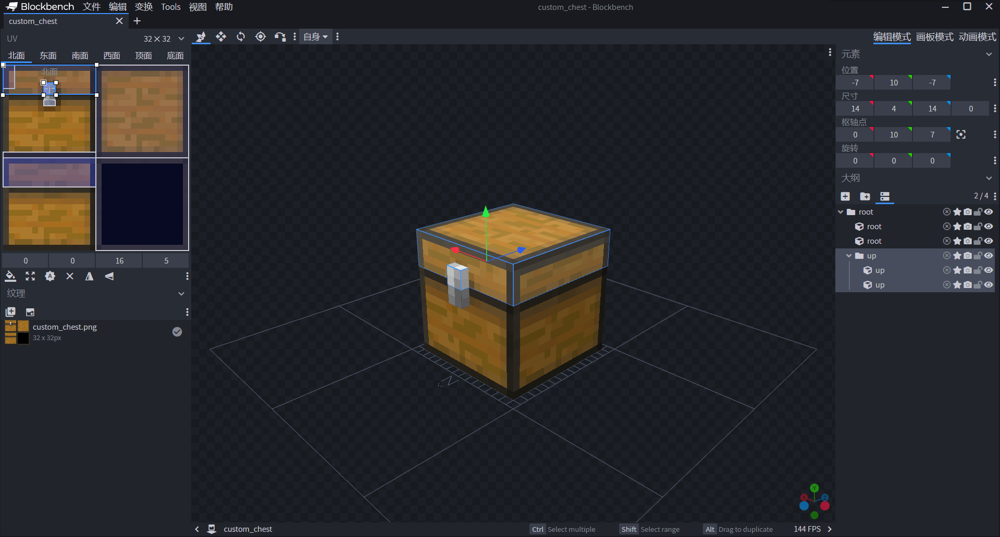
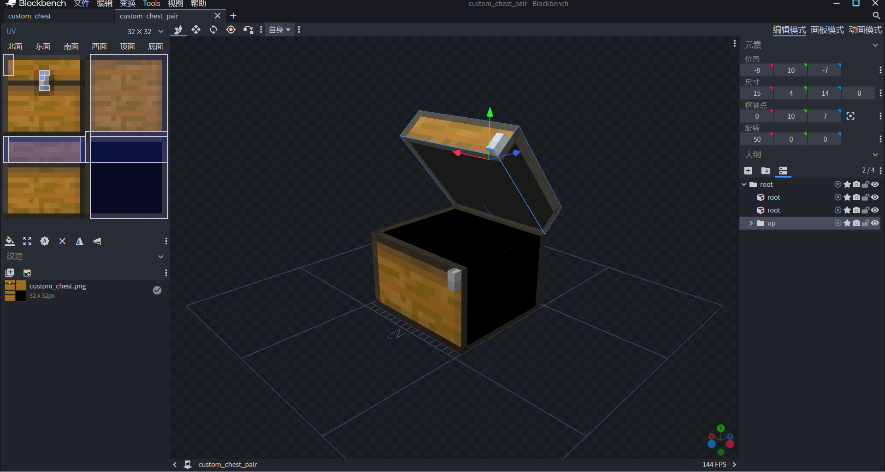
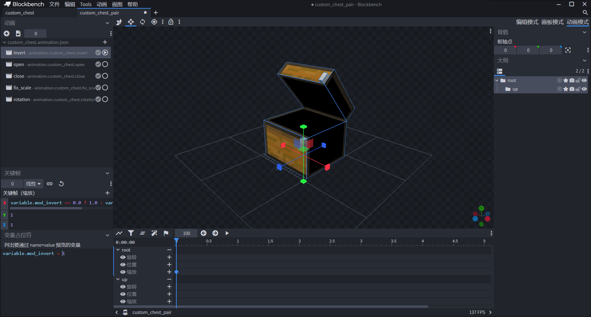
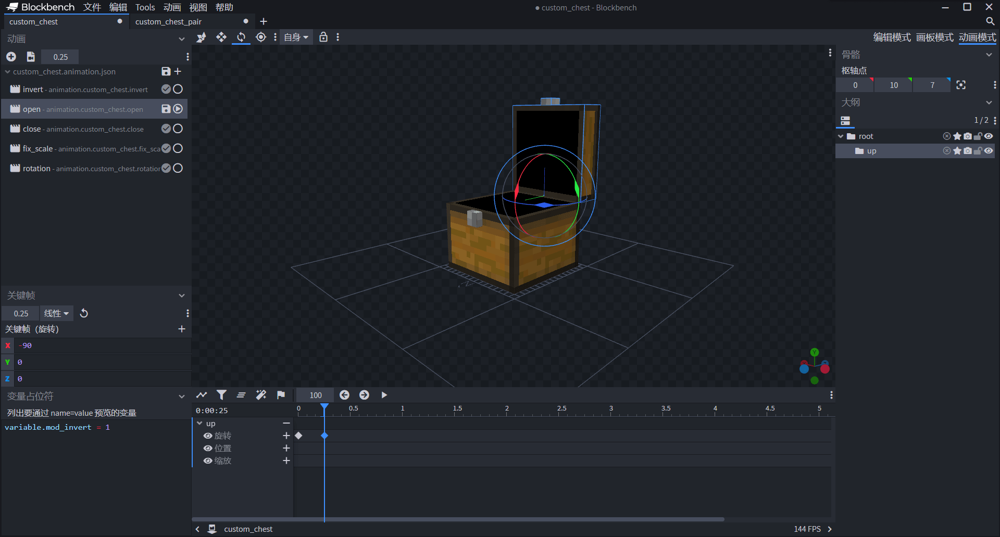

# 挑战：制作一个自定义箱子（无法储藏版）

在本节中，我们一起来完成一个挑战，使用方块实体和模组API配合来完成一个自定义箱子。不过，由于我们还没有讲解UI的制作，我们当前阶段先不制作箱子的存储功能。可以点击链接：[箱子Demo](https://g79.gdl.netease.com/addonguide-customChest.zip)下载到完整包体。

## 准备客户端实体及其资源

我们希望我们的箱子使用一个客户端实体作为其模型和动画的载体。我们手动在资源包的`entity`文件夹中创建一个客户端实体定义文件。

```json
{
  "format_version": "1.10.0",
  "minecraft:client_entity": {
    "description": {
      "identifier": "tutorial_demo:custom_chest"
    }
  }
}
```

### 准备资源

接下来我们依次准备模型、动画、控制器等资源。

#### 准备模型



我们使用Blockbench按照正常实体的做法制作一个箱子模型。注意，我们希望箱子是可以打开的，所以箱子的上半部分和下半部分需要分成两个骨骼来做。模型的纹理我们直接使用原版纹理。开发者们如果有需求可以任意更改纹理。

```json
{
  "format_version": "1.12.0",
  "minecraft:geometry": [
    {
      "description": {
        "identifier": "geometry.custom_chest",
        "texture_width": 32,
        "texture_height": 32,
        "visible_bounds_width": 3,
        "visible_bounds_height": 3.5,
        "visible_bounds_offset": [0, 1.25, 0]
      },
      "bones": [
        {
          "name": "root",
          "pivot": [0, 0, 0],
          "cubes": [
            {
              "origin": [-7, 0, -7],
              "size": [14, 10, 14],
              "uv": {
                "north": {"uv": [0, 21], "uv_size": [16, 11]},
                "east": {"uv": [0, 21], "uv_size": [16, 11]},
                "south": {"uv": [0, 21], "uv_size": [16, 11]},
                "west": {"uv": [0, 21], "uv_size": [16, 11]},
                "up": {"uv": [32, 32], "uv_size": [-16, -16]},
                "down": {"uv": [32, 16], "uv_size": [-16, -16]}
              }
            },
            {
              "origin": [-1, 8, -8],
              "size": [2, 2, 1],
              "uv": {
                "north": {"uv": [7, 5], "uv_size": [2, 2]},
                "east": {"uv": [7, 5], "uv_size": [1, 2]},
                "south": {"uv": [0, 0], "uv_size": [2, 4]},
                "west": {"uv": [7, 5], "uv_size": [1, 2]},
                "up": {"uv": [9, 6], "uv_size": [-2, -1]},
                "down": {"uv": [9, 7], "uv_size": [-2, -1]}
              }
            }
          ]
        },
        {
          "name": "up",
          "parent": "root",
          "pivot": [0, 10, 7],
          "cubes": [
            {
              "origin": [-7, 10, -7],
              "size": [14, 4, 14],
              "uv": {
                "north": {"uv": [0, 0], "uv_size": [16, 5]},
                "east": {"uv": [0, 16], "uv_size": [16, 5]},
                "south": {"uv": [0, 16], "uv_size": [16, 5]},
                "west": {"uv": [0, 15], "uv_size": [16, 6]},
                "up": {"uv": [32, 16], "uv_size": [-16, -16]},
                "down": {"uv": [32, 32], "uv_size": [-16, -16]}
              }
            },
            {
              "origin": [-1, 10, -8],
              "size": [2, 2, 1],
              "uv": {
                "north": {"uv": [7, 3], "uv_size": [2, 2]},
                "east": {"uv": [7, 3], "uv_size": [1, 2]},
                "south": {"uv": [0, 0], "uv_size": [2, 4]},
                "west": {"uv": [7, 3], "uv_size": [1, 2]},
                "up": {"uv": [9, 4], "uv_size": [-2, -1]},
                "down": {"uv": [9, 7], "uv_size": [-2, -1]}
              }
            }
          ]
        }
      ]
    }
  ]
}
```



同时，为了准备大箱子的模型，我们再准备一个大箱子的一半样貌的模型。

```json
{
  "format_version": "1.12.0",
  "minecraft:geometry": [
    {
      "description": {
        "identifier": "geometry.custom_chest_pair",
        "texture_width": 32,
        "texture_height": 32,
        "visible_bounds_width": 3,
        "visible_bounds_height": 3.5,
        "visible_bounds_offset": [0, 1.25, 0]
      },
      "bones": [
        {
          "name": "root",
          "pivot": [0, 0, 0],
          "cubes": [
            {
              "origin": [-7, 0, -7],
              "size": [15, 10, 14],
              "uv": {
                "north": {"uv": [0, 21], "uv_size": [15, 11]},
                "east": {"uv": [0, 21], "uv_size": [16, 11]},
                "south": {"uv": [1, 21], "uv_size": [15, 11]},
                "west": {"uv": [16, 17], "uv_size": [16, 15]},
                "up": {"uv": [32, 32], "uv_size": [-15, -16]},
                "down": {"uv": [32, 16], "uv_size": [-16, -16]}
              }
            },
            {
              "origin": [7, 8, -8],
              "size": [1, 2, 1],
              "uv": {
                "north": {"uv": [7, 5], "uv_size": [1, 2]},
                "east": {"uv": [7, 5], "uv_size": [1, 2]},
                "south": {"uv": [0, 0], "uv_size": [2, 4]},
                "west": {"uv": [7, 5], "uv_size": [1, 2]},
                "up": {"uv": [9, 6], "uv_size": [-2, -1]},
                "down": {"uv": [9, 7], "uv_size": [-2, -1]}
              }
            }
          ]
        },
        {
          "name": "up",
          "parent": "root",
          "pivot": [0, 10, 7],
          "rotation": [-50, 0, 0],
          "cubes": [
            {
              "origin": [-7, 10, -7],
              "size": [15, 4, 14],
              "uv": {
                "north": {"uv": [0, 16], "uv_size": [15, 5]},
                "east": {"uv": [0, 16], "uv_size": [16, 5]},
                "south": {"uv": [1, 16], "uv_size": [15, 5]},
                "west": {"uv": [16, 15], "uv_size": [16, 6]},
                "up": {"uv": [32, 16], "uv_size": [-15, -16]},
                "down": {"uv": [32, 32], "uv_size": [-15, -16]}
              }
            },
            {
              "origin": [7, 10, -8],
              "size": [1, 2, 1],
              "uv": {
                "north": {"uv": [7, 3], "uv_size": [1, 2]},
                "east": {"uv": [7, 3], "uv_size": [1, 2]},
                "south": {"uv": [0, 0], "uv_size": [2, 4]},
                "west": {"uv": [7, 3], "uv_size": [1, 2]},
                "up": {"uv": [9, 4], "uv_size": [-2, -1]},
                "down": {"uv": [9, 7], "uv_size": [-2, -1]}
              }
            }
          ]
        }
      ]
    }
  ]
}
```

#### 准备动画




我们希望大箱子的一半的模型具备朝左和朝右两种姿态，这样我们才能将其拼在一起。因此我们制作`invert`动画，其中`variable.mod_invert`在实体定义文件中定义。




我们希望箱子具备打开和关闭动画，因此制作`open`和`close`动画。


我们知道方块模型必须进行一个(-8, 0, 8)的位移才能正常渲染，因此我们制作`fix_scale`动画。


我们的箱子可以面向任何一面，我们为此制作一个`rotation`动画，其中`variable.mod_rotation`在实体定义文件中定义。虽然我们也可以在方块的行为包组件中使用`netease:face_directional`来完成多面向，但是为了后续制作方便，我们依旧可以采取直接在模型实体中加入一个面向的动画，同时使其受到实体定义中自定义的一个Molang变量的控制的功能。

```json
{
  "format_version": "1.8.0",
  "animations": {
    "animation.custom_chest.invert": {
      "loop": true,
      "bones": {
        "root": {
          "scale": ["variable.mod_invert == 0.0 ? 1.0 : variable.mod_invert", 1.0, 1.0]
        }
      }
    },
    "animation.custom_chest.open": {
      "loop": "hold_on_last_frame",
      "animation_length": 0.25,
      "bones": {
        "up": {
          "rotation": {
            "0.0": [0, 0, 0],
            "0.25": [-90, 0, 0]
          }
        }
      }
    },
    "animation.custom_chest.close": {
      "loop": "hold_on_last_frame",
      "animation_length": 0.25,
      "bones": {
        "up": {
          "rotation": {
            "0.0": [-90, 0, 0],
            "0.25": [0, 0, 0]
          }
        }
      }
    },
    "animation.custom_chest.fix_scale": {
      "loop": true,
      "bones": {
        "root": {
          "position": [-8, 0, 8]
        }
      }
    },
    "animation.custom_chest.rotation": {
      "loop": true,
      "bones": {
        "root": {
          "rotation": [0, "variable.mod_rotation * 90", 0]
        }
      }
    }
  }
}
```

#### 准备动画控制器

我们手动新建一个动画控制器文件，用于控制箱子的开关。

```json
{
  "format_version": "1.10.0",
  "animation_controllers": {
    "controller.animation.custom_chest.general": {
      "initial_state": "default",
      "states": {
        "default": {
          "transitions": [
            {
              "open": "variable.mod_states"
            }
          ]
        },
        "open": {
          "animations": [
            "open"
          ],
          "transitions": [
            {
              "close": "!variable.mod_states"
            }
          ]
        },
        "close": {
          "animations": [
            "close"
          ],
          "transitions": [
            {
              "default": "query.any_animation_finished"
            }
          ]
        }
      }
    }
  }
}
```

其中`variable.mod_states`用于控制箱子的开闭，我们可以在实体定义文件中定义它，并在模组SDK中控制它。

#### 准备渲染控制器

我们主要是希望渲染控制器用于控制实体应该使用普通箱子模型还是大箱子模型，因此我们着眼于控制器中的`geometry`字段。

```json
{
  "format_version": "1.8.0",
  "render_controllers": {
    "controller.render.chest_pair": {
      "geometry": "variable.mod_invert == 0.0 ? Geometry.default : Geometry.pair",
      "materials": [{"*": "Material.default"}],
      "textures": ["Texture.default"]
    }
  }
}
```

其中`variable.mod_invert`和我们动画中的是同一个变量，由实体定义文件定义并由模组SDK控制。我们希望`variable.mod_invert`等于0时为正常箱子，等于1或-1时为正的或反的大箱子。

### 挂接资源

我们接下来将资源全部挂接到实体定义文件上。

```json
{
  "format_version": "1.10.0",
  "minecraft:client_entity": {
    "description": {
      "identifier": "tutorial_demo:custom_chest",
      "materials": {
        "default": "entity_alphatest"
      },
      "geometry": {
        "default": "geometry.custom_chest",
        "pair": "geometry.custom_chest_pair"
      },
      "textures": {
        "default": "textures/entity/custom_chest/custom_chest"
      },
      "animations": {
        "open": "animation.custom_chest.open",
        "close": "animation.custom_chest.close",
        "fix_scale": "animation.custom_chest.fix_scale",
        "rotation": "animation.custom_chest.rotation",
        "pair_invert": "animation.custom_chest.invert",
        "controller.general": "controller.animation.custom_chest.general"
      },
      "scripts": {
        "initialize": [
          "variable.mod_states = 0.0;",
          "variable.mod_invert = 0.0;",
          "variable.mod_rotation = 0.0;"
        ],
        "animate": [
          "fix_scale",
          "pair_invert",
          "rotation",
          "controller.general"
        ]
      },
      "render_controllers": [
        "controller.render.chest_pair"
      ]
    }
  }
}
```

同时我们在`scripts/initialize`中定义变量，这代表实体初始化时将会初始化这些变量。注意，这里的表达式是一个赋值表达式，所以带有等号，而带有等号的表达式会被认为是一个复杂表达式，所以必须以`;`结尾。这样，我们便准备好了一个箱子实体。我们接下来只需要将该箱子实体挂接到方块上，并使用模组SDK来控制上述三个变量的值即可实现箱子各种动画的变动。

## 创建方块

我们在我的世界开发工作台中新建一个AddOn组件，不妨命名为“自定义箱子模组”。我们通过配置新建一个方块。我们先来关注其资源包定义文件，我们为其挂接我们上面刚刚做好的实体。我们打开资源包根目录的`blocks.json`文件。

```json
{
  "format_version": [1, 1, 0],
  "tutorial_demo:custom_chest": {
  "sound": "stone",
  "client_entity": {
    "identifier": "tutorial_demo:custom_chest",
    "hand_model_use_client_entity": true
  }
  }
}
```

我们将实体客户端文件挂接在方块客户端文件的`client_entity`字段中。这样我们的方块就拥有了一个方块实体模型。当然，为了使方块真正拥有方块实体，我们还需要在方块行为包定义中使用对应的组件来激活方块实体。

```json
{
  "format_version": "1.10.0",
  "minecraft:block": {
    "description": {
      "identifier": "tutorial_demo:custom_chest"
    },
    "components": {
      "netease:listen_block_remove": {
        "value": true
      },
      "netease:solid": {
        "value": false
      },
      "netease:block_entity": {
        "tick": false,
        "movable": false
      },
      "netease:aabb": {
        "collision": {
          "min": [
            0.0625,
            0,
            0.0625
          ],
          "max": [
            0.9375,
            0.875,
            0.9375
          ]
        },
        "clip": {
          "min": [
            0.0625,
            0,
            0.0625
          ],
          "max": [
            0.9375,
            0.875,
            0.9375
          ]
        }
      },
      "minecraft:block_light_absorption": 0,
      "minecraft:destroy_time": 0.1
    }
  }
}
```

其中`netease:block_entity`用于开启方块实体。`netease:listen_block_remove`用于在模组SDK中启用该方块的移除监听。试想，我们当破坏一个大箱子的其中一边时，我们应该需要及时更改另一边的模型使其回归到普通箱子的样貌。因此，我们需要在模组SDK中启用方块移除监听。

目前，我们已经定义了方块的资源文件和行为文件，但是，这样的方块在世界中并没有什么功能，既不能随着玩家放置的方向不同而转向，又不能自动检测周围的方块来判断合并成大箱子，也不能打开和关闭。这些功能都需要模组SDK的配合来实现。接下来，我们便通过模组SDK来制作这些功能。

## 编写模组SDK脚本

我们手动创建Python脚本文件，我们创建一个`BlockEntityScripts`文件夹。在其中除了`__init__.py`和`modMain.py`之外分别创建`ServerSystem.py`和`ClientSystem.py`文件，并分别在其中创建`Main`类。

我们在`modMain.py`中注册两个系统供之后使用：

```python
# -*- coding: UTF-8 -*-
from mod.common.mod import Mod
import mod.server.extraServerApi as serverApi
import mod.client.extraClientApi as clientApi


@Mod.Binding(name="LostWorld", version="0.2")
class TileEntityChest(object):

    def __init__(self):
        pass

    @Mod.InitClient()
    def initClient(self):
        clientApi.RegisterSystem('tutorial_demo', 'BlockEntityClient', 'BlockEntityScripts.ClientSystem.Main')

    @Mod.InitServer()
    def initServer(self):
        serverApi.RegisterSystem('tutorial_demo', 'BlockEntityServer', 'BlockEntityScripts.ServerSystem.Main')

    @Mod.DestroyClient()
    def destroyClient(self):
        pass

    @Mod.DestroyServer()
    def destroyServer(self):
        pass

```

### 制作箱子转向功能

我们知道，原版的箱子会在放置时根据玩家的朝向而改变放置的面向。对于我们的箱子，我们试图在大脑中模拟这一过程的实现方式：

> 箱子的朝向信息必须是存储在服务端的，因为如果只存储在客户端，那么其他的客户端将获取不到相关信息，从而造成玩家之间视图不同步的现象。因此，我们可以将箱子的朝向信息存储在箱子在服务端的方块实体数据中。
>
> 当玩家试图放置方块时，我们可以检测此时的上下文信息，只有当玩家是朝着一个非箱子的上表面放置时我们才允许箱子的放置。在玩家刚刚放置完成箱子的这一时刻，我们针对玩家目前的朝向计算出箱子应该具有的朝向，然后将箱子用于储存朝向的那个方块实体数据改变为正确的朝向。这一切都应该在服务端进行，因为这些运算都涉及到方块本身的状态，而方块本身的状态是存储在服务端的，客户端只是实时同步这些数据并渲染。说到这里，我们便知道了最后一步：通知客户端，请求客户端修改变量`variable.mod_rotation`的值，用于调整箱子的渲染情况。

我们在服务端系统中写入代码如下：

```python
# -*- coding: UTF-8 -*-
from mod.server.system.serverSystem import ServerSystem
from mod.common.minecraftEnum import Facing
import mod.server.extraServerApi as serverApi


class Main(ServerSystem):

    def __init__(self, namespace, system_name):
        ServerSystem.__init__(self, namespace, system_name)
        namespace = serverApi.GetEngineNamespace()
        system_name = serverApi.GetEngineSystemName()
        # 监听引擎系统的ServerEntityTryPlaceBlockEvent事件，玩家尝试放置时就会触发，用于阻止一些我们不需要的放置情形，绑定on_try_placed回调
        self.ListenForEvent(namespace, system_name, 'ServerEntityTryPlaceBlockEvent', self, self.on_try_placed)
        # 监听引擎系统的EntityPlaceBlockAfterServerEvent事件，方块放置后立马触发，用于在方块被放置后迅速更新方块的各种状态，绑定on_placed回调
        self.ListenForEvent(namespace, system_name, 'EntityPlaceBlockAfterServerEvent', self, self.on_placed)

    def on_try_placed(self, event):
        # 获取XYZ坐标
        x = event['x']
        y = event['y']
        z = event['z']
        # 获取玩家欲放置的方块ID
        block_name = event['fullName']
        # 获取维度ID
        dimension_id = event['dimensionId']
        # 获取玩家所指的方块此时的面
        face = event['face']
        # 如果玩家指着上表面而且手里的方块就是我们的箱子
        if face == Facing.Up and block_name == 'tutorial_demo:custom_chest':
            # 我们就打算放置它，但是这种情况下我们要排除一个例外，那便是我们不希望将箱子放在箱子上。我们使用blockInfo引擎组件获取往下一格的坐标处的方块
            block_data = serverApi.GetEngineCompFactory().CreateBlockInfo(serverApi.GetLevelId()).GetBlockNew((x, y - 1, z), dimension_id)
            # 如果这个方块也是箱子
            if block_data['name'] == block_name:
                # 取消放置
                event['cancel'] = True

    def on_placed(self, event):
        # 获取维度ID
        dimension_id = event['dimensionId']
        # 获取XYZ坐标
        x = event['x']
        y = event['y']
        z = event['z']
        # 获取已经放置了的这个方块的ID
        block_name = event['fullName']
        # 获取要防止方块的实体ID，也就是我们的玩家ID
        player_id = event['entityId']
        # 如果已经放置的是我们的自定义箱子
        if block_name == 'tutorial_demo:custom_chest':
            # 通过rot引擎组件获取玩家的视角，为下面根据玩家的偏航角数值设置箱子的朝向做准备
            player_rot = serverApi.GetEngineCompFactory().CreateRot(player_id).GetRot()
            # 通过blockEntityData引擎组件获取已经放置的这个箱子的方块实体数据
            block_data_comp = serverApi.GetEngineCompFactory().CreateBlockEntityData(serverApi.GetLevelId())
            block_data = block_data_comp.GetBlockEntityData(dimension_id, (x, y, z))
            # 如果获取到方块实体数据了
            if block_data:
                # 我们用一个自定义函数get_block_facing来获取箱子应该朝向哪儿，设置到方块实体数据中。自定义函数在脚本最下面定义
                block_data['rotation'] = self.get_block_facing(player_rot)
                # 此时默认箱子是小箱子，设置到方块实体数据中
                block_data['states'] = 0
                # 此时默认箱子没有反向，设置到方块实体数据中
                block_data['invert'] = 0
                # 我们在最后希望告知客户端箱子的各种状态的数据，以便客户端更新方块实体的Molang变量，完成渲染工作。我们这里准备一个字典用于储存这些需要张贴的数据
                post_data = {}
                # 通过extraData引擎组件获取整个存档的额外数据，我们想把目前世界中存在的方块实体都存到整个存档的额外数据中，方便下次打开存档时能够复原当前箱子的各种状态
                level_data_comp = serverApi.GetEngineCompFactory().CreateExtraData(serverApi.GetLevelId())
                data = level_data_comp.GetExtraData(block_name)
                # 如果当前不存在以该方块ID为键名的数据，那就创建一个新的
                if not data:
                    data = {}
                # 向最终要张贴的数据的字典存储方块的各种状态
                post_data['{0},{1},{2}'.format(x, y, z)] = {'rotation': block_data['rotation'], 'invert': block_data['invert']}
                # 向最终要设置到世界的额外数据中的字典存储方块的各种状态
                data['{0},{1},{2}'.format(x, y, z)] = {'rotation': block_data['rotation'], 'invert': block_data['invert']}
                # 设置世界的额外数据
                level_data_comp.SetExtraData(block_name, data)
                # 将张贴的数据广播到各个客户端，以事件名InitChestRotation
                self.BroadcastToAllClient('InitChestRotation', post_data)

    def get_block_facing(self, rot):
        # 这是我们依据玩家的偏航角返回箱子的朝向的函数。我们知道，玩家的偏航角是垂直于y轴的姿态角，在zOx平面上转动，因此z轴正方向也就是南面为0°，向x轴正方向旋转也就是逆时针旋转为正向。而我们的箱子默认面北，正好是共轭的方向，此时variable.mod_rotation应该为0。因此我们使用如下的判断即可完成玩家朝向到方块朝向的转换
        if 135.0 < rot[1] <= 180.0:
            return 2.0
        elif 45.0 < rot[1] <= 135.0:
            return 1.0
        elif -45.0 < rot[1] <= 45.0:
            return 0.0
        elif -135.0 < rot[1] <= -45.0:
            return 3.0
        elif -180.0 < rot[1] <= -135.0:
            return 2.0
        else:
            return 0.0

```

我们在客户端中写入代码如下：

```python
# -*- coding: UTF-8 -*-
from mod.client.system.clientSystem import ClientSystem
import mod.client.extraClientApi as clientApi
import time


class Main(ClientSystem):

    def __init__(self, namespace, system_name):
        ClientSystem.__init__(self, namespace, system_name)
        # 我们监听我们本模组服务端的事件InitChestRotation，绑定chest_rotation作为回调
        self.ListenForEvent('tutorial_demo', 'BlockEntityServer', 'InitChestRotation', self, self.chest_rotation)
        # 一个队列，下面会用到
        self.rotation_queue = []

    def chest_rotation(self, event):
        # 将event重新构造成易读的形式
        new_event = {tuple(map(int, k.split(','))): v for k, v in event.items()}
        # 准备blockInfo引擎组件
        block_comp = clientApi.GetEngineCompFactory().CreateBlockInfo(clientApi.GetLevelId())
        # 自定义一个函数。之所以自定义这个函数，是因为事件触发时，可能会出现此时方块在客户端渲染完成，但无法设置方块的Molang的情况。因此我们试图将更新这个方块的Molang这一响应直接放到Update函数里，每脚本刻更新一次，直至至少更新2次。我们通过一个队列将这个函数传到Update里，也就是上面定义的rotation_queue，然后等到至少更新两次后再把这个函数弹出队列
        def rotate_chest():
            index = 0
            count = len(new_event.items())
            # 对当前事件响应传入的全部方块
            for pos, data in new_event.items():
                # 获取其ID和数据值
                block_data = block_comp.GetBlock(pos)
                # 如果ID就是我们的箱子
                if block_data[0] == 'tutorial_demo:custom_chest':
                    # 设置各个Molang变量的值
                    block_comp.SetBlockEntityMolangValue(pos, "variable.mod_rotation", data['rotation'])
                    block_comp.SetBlockEntityMolangValue(pos, "variable.mod_invert", float(data['invert']) if data['invert'] != 0 else 0.0)
                    index += 1
                    if index == count:
                        return True
            else:
                return False
        # 如果传入的数据里面是有方块的
        if new_event:
            # 把我们的更新函数放到队列里
            self.rotation_queue.append([rotate_chest, 0])

    def Update(self):
        # 记录即将完成设置朝向任务的函数所处在列表的下标值
        _die = []
        # 对队列里每一个函数
        for index, value in enumerate(self.rotation_queue):
            # 将其反复执行，直至满足两次
            if value[0]():
                value[1] += 1
                if value[1] == 2:
                    _die.append(index)
        # 将完成任务的函数所在的元素设置为None
        for i in _die:
            self.rotation_queue[i] = None
        # 过滤掉用None占位的列表元素
        if self.rotation_queue:
            self.rotation_queue = filter(None, self.rotation_queue)
```

这样就完成了箱子的转向功能。


### 制作箱子连接功能

箱子的连接功能即两个小箱子如果朝向相同且并排放置时，会自动合成一个大箱子的功能。我们应该注意到两点。第一点是第二个箱子放置时触发的合并逻辑，第二点是第二个箱子被破坏时触发的第一个箱子的复原逻辑。

> 这些逻辑依旧是需要先在服务端中运行，然后告知客户端来更新Molang变量的值。我们只需要根据箱子是东西放置的还是南北放置的来判断箱子的左右两侧有无同朝向的箱子即可。如果有，那就将自己和对方的`variable.mod_invert`分别设为1和-1，然后将这一消息告知客户端使其在视觉上真正地连起来。

我们在服务端系统中补充代码如下：

```python
# -*- coding: UTF-8 -*-
from mod.server.system.serverSystem import ServerSystem
from mod.common.minecraftEnum import Facing
import mod.server.extraServerApi as serverApi


class Main(ServerSystem):

    def __init__(self, namespace, system_name):
        ServerSystem.__init__(self, namespace, system_name)
        namespace = serverApi.GetEngineNamespace()
        system_name = serverApi.GetEngineSystemName()
        self.ListenForEvent(namespace, system_name, 'ServerEntityTryPlaceBlockEvent', self, self.on_try_placed)
        self.ListenForEvent(namespace, system_name, 'EntityPlaceBlockAfterServerEvent', self, self.on_placed)
        # 监听引擎系统的BlockRemoveServerEvent事件，方块被移除时触发，用于大箱子被破坏了一个方块时将剩余的那个箱子复原，绑定block_removed回调
        self.ListenForEvent(namespace, system_name, 'BlockRemoveServerEvent', self, self.block_removed)

    def on_try_placed(self, event):
        x = event['x']
        y = event['y']
        z = event['z']
        dimension_id = event['dimensionId']
        face = event['face']
        if face == Facing.Up and block_name == 'tutorial_demo:custom_chest':
            block_data = serverApi.GetEngineCompFactory().CreateBlockInfo(serverApi.GetLevelId()).GetBlockNew((x, y - 1, z), dimension_id)
            if block_data['name'] == block_name:
                event['cancel'] = True

    def on_placed(self, event):
        # 获取维度ID
        dimension_id = event['dimensionId']
        # 获取XYZ坐标
        x = event['x']
        y = event['y']
        z = event['z']
        # 获取已经放置了的这个方块的ID
        block_name = event['fullName']
        # 获取要防止方块的实体ID，也就是我们的玩家ID
        player_id = event['entityId']
        # 如果已经放置的是我们的自定义箱子
        if block_name == 'tutorial_demo:custom_chest':
            player_rot = serverApi.GetEngineCompFactory().CreateRot(player_id).GetRot()
            # 通过blockEntityData引擎组件获取已经放置的这个箱子的方块实体数据
            block_data_comp = serverApi.GetEngineCompFactory().CreateBlockEntityData(serverApi.GetLevelId())
            block_data = block_data_comp.GetBlockEntityData(dimension_id, (x, y, z))
            # 如果获取到方块实体数据了
            if block_data:
                block_data['rotation'] = self.get_block_facing(player_rot)
                block_data['states'] = 0
                block_data['invert'] = 0
                # 准备blockInfo引擎组件
                block_info_comp = serverApi.GetEngineCompFactory().CreateBlockInfo(serverApi.GetLevelId())
                # 创建需要张贴的数据
                post_data = {}
                # 如果箱子是东西放置的，即面向南北的
                if block_data['rotation'] % 2 == 0.0:
                    # 在-1和1中取
                    for i in range(-1, 2, 2):
                        # 通过blockInfo引擎组件获取x坐标±1的方块，即东西两侧方块的信息
                        block_info_data = block_info_comp.GetBlockNew(
                            (x + i, y, z),
                            dimension_id
                        )
                        # 如果也是箱子
                        if block_info_data['name'] == 'tutorial_demo:custom_chest':
                            # 通过blockEntityData引擎组件获取其方块实体数据
                            connect_block_data = block_data_comp.GetBlockEntityData(dimension_id, (x + i, y, z))
                            # 如果invert是0，也就是同样是小箱子
                            if connect_block_data['invert'] == 0 and connect_block_data['rotation'] == block_data['rotation']:
                                # 给他整成大箱子的一半，同时自己也变成另一半
                                block_data['invert'] = i * int(block_data['rotation'] - 1)
                                connect_block_data['invert'] = -i * int(block_data['rotation'] - 1)
                                # 把这个箱子也加入需要张贴的数据中，以供等一会传入客户端更新Molang变量
                                post_data['{0},{1},{2}'.format(x + i, y, z)] = {'rotation': connect_block_data['rotation'], 'invert': connect_block_data['invert']}
                                break
                # 如果箱子是南北放置的，即面向东西的，同理
                if block_data['rotation'] % 2 == 1.0:
                    for i in range(-1, 2, 2):
                        block_info_data = block_info_comp.GetBlockNew(
                            (x, y, z + i),
                            dimension_id
                        )
                        if block_info_data['name'] == 'tutorial_demo:custom_chest':
                            connect_block_data = block_data_comp.GetBlockEntityData(dimension_id, (x, y, z + i))
                            if connect_block_data['invert'] == 0 and connect_block_data['rotation'] == block_data['rotation']:
                                block_data['invert'] = i * int(block_data['rotation'] - 2)
                                connect_block_data['invert'] = -i * int(block_data['rotation'] - 2)
                                post_data['{0},{1},{2}'.format(x, y, z + i)] = {'rotation': connect_block_data['rotation'], 'invert': connect_block_data['invert']}
                                break
                level_data_comp = serverApi.GetEngineCompFactory().CreateExtraData(serverApi.GetLevelId())
                data = level_data_comp.GetExtraData(block_name)
                if not data:
                    data = {}
                post_data['{0},{1},{2}'.format(x, y, z)] = {'rotation': block_data['rotation'], 'invert': block_data['invert']}
                data['{0},{1},{2}'.format(x, y, z)] = {'rotation': block_data['rotation'], 'invert': block_data['invert']}
                # 用需要张贴的数据中的值更新需要存储搭配世界的额外数据中的值
                data.update(post_data)
                level_data_comp.SetExtraData(block_name, data)
                self.BroadcastToAllClient('InitChestRotation', post_data)

    def block_removed(self, event):
        # 获取被移除的方块ID
        block_name = event['fullName']
        # 获取XYZ坐标
        x = event['x']
        y = event['y']
        z = event['z']
        # 获取维度ID
        dimension_id = event['dimension']
        # 如果移除的是我们的箱子
        if block_name == 'tutorial_demo:custom_chest':
            # 通过blockEntityData引擎组件获取其方块实体数据
            block_data_comp = serverApi.GetEngineCompFactory().CreateBlockEntityData(serverApi.GetLevelId())
            block_entity_data = block_data_comp.GetBlockEntityData(0, (x, y, z))
            # 通过extraData引擎组件获取存档的额外数据中我们箱子的键值对存储的值，放在data里
            level_data_comp = serverApi.GetEngineCompFactory().CreateExtraData(serverApi.GetLevelId())
            data = level_data_comp.GetExtraData(block_name)
            # 定义一个空的需要在最后给客户端广播事件时张贴的数据
            post_data = {}
            # 如果该方块原本是大箱子
            if block_entity_data['invert'] != 0:
                # 准备blockInfo引擎组件
                block_info_comp = serverApi.GetEngineCompFactory().CreateBlockInfo(serverApi.GetLevelId())
                # 如果箱子原本是东西放置的，即面向南北的
                if block_entity_data['rotation'] % 2 == 0.0:
                    # 检测左右两边是哪一边有方块连着
                    for i in range(-1, 2, 2):
                        block_info_data = block_info_comp.GetBlockNew(
                            (x + i, y, z),
                            dimension_id
                        )
                        if block_info_data['name'] == 'tutorial_demo:custom_chest':
                            # 获取他的方块实体数据
                            connect_block_data = block_data_comp.GetBlockEntityData(dimension_id, (x + i, y, z))
                            # 如果就是和他连着的那个方块
                            if connect_block_data['invert'] != 0 and connect_block_data['rotation'] == block_entity_data['rotation']:
                                # 改回小箱子
                                connect_block_data['invert'] = 0
                                # 更新世界的额外数据中的值
                                data['{0},{1},{2}'.format(x + i, y, z)] = {'rotation': connect_block_data['rotation'], 'invert': connect_block_data['invert']}
                                # 加入到张贴的数据中
                                post_data['{0},{1},{2}'.format(x + i, y, z)] = {'rotation': connect_block_data['rotation'], 'invert': connect_block_data['invert']}
                # 同理
                if block_entity_data['rotation'] % 2 == 1.0:
                    for i in range(-1, 2, 2):
                        block_info_data = block_info_comp.GetBlockNew(
                            (x, y, z + i),
                            dimension_id
                        )
                        if block_info_data['name'] == 'tutorial_demo:custom_chest':
                            connect_block_data = block_data_comp.GetBlockEntityData(dimension_id, (x, y, z + i))
                            if connect_block_data['invert'] != 0 and connect_block_data['rotation'] == block_entity_data['rotation']:
                                connect_block_data['invert'] = 0
                                data['{0},{1},{2}'.format(x, y, z + i)] = {'rotation': connect_block_data['rotation'], 'invert': connect_block_data['invert']}
                                post_data['{0},{1},{2}'.format(x, y, z + i)] = {'rotation': connect_block_data['rotation'], 'invert': connect_block_data['invert']}
            # 把自己在世界中额外数据的值也更新了，但是无需将自己也加入张贴的数据了，因为自己已经被破坏了
            data = data.pop('{0},{1},{2}'.format(x, y, z), data)
            level_data_comp.SetExtraData(block_name, data)
            # 告诉客户端更新Molang变量
            self.BroadcastToAllClient('InitChestRotation', post_data)

    def get_block_facing(self, rot):
        if 135.0 < rot[1] <= 180.0:
            return 2.0
        elif 45.0 < rot[1] <= 135.0:
            return 1.0
        elif -45.0 < rot[1] <= 45.0:
            return 0.0
        elif -135.0 < rot[1] <= -45.0:
            return 3.0
        elif -180.0 < rot[1] <= -135.0:
            return 2.0
        else:
            return 0.0

```

客户端无需做任何更改即可。这样，我们便完成了连接功能的制作。


### 制作箱子开闭功能

最后，我们来看看如何制作箱子开闭功能。我们依旧先进行“颅内”设想。

> 我们首先希望玩家操作箱子不要太过频繁，不然动画的播放会不连贯。因此我们应该在玩家对箱子使用“使用键”时设置一个时间阈值，这个逻辑应该在客户端执行。紧接着客户端告知服务端玩家请求打开箱子，服务端用来检测到底能不能真的能打开。服务端检测上方是否为空气，我们认为只有上方是空气才允许箱子打开。如果能打开，在服务端更新箱子的方块实体数据。如果是大箱子，还要顺便更新与之相连的另外半个箱子的数据。在这之后，再告知客户端哪些数据更新了，客户端便可以更新Molang变量，使渲染正确进行。同时如果我们有UI，客户端还要负责打开UI，不过目前我们先不考虑这一功能。

我们在客户端中补充如下内容：

```python
# -*- coding: UTF-8 -*-
from mod.client.system.clientSystem import ClientSystem
import mod.client.extraClientApi as clientApi
import time


class Main(ClientSystem):

    def __init__(self, namespace, system_name):
        ClientSystem.__init__(self, namespace, system_name)
        # 监听引擎系统的ClientBlockUseEvent事件，玩家与方块交互时触发，即客户端玩家打开箱子时，绑定block_used回调
        self.ListenForEvent(namespace, system_name, 'ClientBlockUseEvent', self, self.block_used)
        # 我们监听我们本模组服务端的事件OpenChestFinished，作为最后更新Molang的事件监听，绑定chest_opened作为回调
        self.ListenForEvent('tutorial_demo', 'BlockEntityServer', 'OpenChestFinished', self, self.chest_opened)
        self.ListenForEvent('tutorial_demo', 'BlockEntityServer', 'InitChestRotation', self, self.chest_rotation)
        # 定义一个变量作为箱子交互的冷却时间
        self.block_interact_cooldown = {}
        self.rotation_queue = []

    def block_used(self, event):
        # 获取玩家ID
        player_id = event['playerId']
        # 获取被交互的方块
        block_name = event['blockName']
        # 获取XYZ坐标
        x = event['x']
        y = event['y']
        z = event['z']
        # 如果被交互的使我们的箱子
        if block_name == 'tutorial_demo:custom_chest':
            # 玩家不在冷却中
            if player_id not in self.block_interact_cooldown:
                # 给玩家加个冷却
                self.block_interact_cooldown[player_id] = time.time()
            # 否则如果玩家与上一次记录的时间相差过短
            elif time.time() - self.block_interact_cooldown[player_id] < 0.15:
                # 就放弃本次交互
                return
            # 否则，即已经与上次交互记录的时间拉得足够长时
            else:
                # 更新冷却里记录的时间戳
                self.block_interact_cooldown[player_id] = time.time()
            # 使用game引擎组件获取当前维度ID
            game_comp = clientApi.GetEngineCompFactory().CreateGame(clientApi.GetLevelId())
            dimension_id = game_comp.GetCurrentDimension()
            # 告知服务端在这个维度里有一个玩家要与一个坐标处的方块交互
            self.NotifyToServer('TryOpenChest', {'dimensionId': dimension_id, 'pos': [x, y, z]})

    def chest_opened(self, event):
        # 获取事件数据中传给该响应的张贴的数据，此时已经交互完成，需要更新Molang变量的值
        data = event['data']
        # 准备blockInfo引擎组件
        block_comp = clientApi.GetEngineCompFactory().CreateBlockInfo(clientApi.GetLevelId())
        # 循环data中的方块
        for block_data in data:
            # 获取当前循环方块的坐标
            block_pos = tuple(block_data['pos'])
            # 通过blockInfo引擎组件设置该方块的Molang变量
            block_comp.SetBlockEntityMolangValue(block_pos, "variable.mod_states", float(block_data['states']))

    def chest_rotation(self, event):
        new_event = {tuple(map(int, k.split(','))): v for k, v in event.items()}
        block_comp = clientApi.GetEngineCompFactory().CreateBlockInfo(clientApi.GetLevelId())
        def rotate_chest():
            index = 0
            count = len(new_event.items())
            for pos, data in new_event.items():
                block_data = block_comp.GetBlock(pos)
                if block_data[0] == 'tutorial_demo:custom_chest':
                    block_comp.SetBlockEntityMolangValue(pos, "variable.mod_rotation", data['rotation'])
                    block_comp.SetBlockEntityMolangValue(pos, "variable.mod_invert", float(data['invert']) if data['invert'] != 0 else 0.0)
                    index += 1
                    if index == count:
                        return True
            else:
                return False
        if new_event:
            self.rotation_queue.append([rotate_chest, 0])

    def Update(self):
        _die = []
        for index, value in enumerate(self.rotation_queue):
            if value[0]():
                value[1] += 1
                if value[1] == 2:
                    _die.append(index)
        for i in _die:
            self.rotation_queue[i] = None
        if self.rotation_queue:
            self.rotation_queue = filter(None, self.rotation_queue)
```

然后我们补充服务端内容：

```python
# -*- coding: UTF-8 -*-
from mod.server.system.serverSystem import ServerSystem
from mod.common.minecraftEnum import Facing
import mod.server.extraServerApi as serverApi


class Main(ServerSystem):

    def __init__(self, namespace, system_name):
        ServerSystem.__init__(self, namespace, system_name)
        namespace = serverApi.GetEngineNamespace()
        system_name = serverApi.GetEngineSystemName()
        self.ListenForEvent(namespace, system_name, 'ServerEntityTryPlaceBlockEvent', self, self.on_try_placed)
        self.ListenForEvent(namespace, system_name, 'EntityPlaceBlockAfterServerEvent', self, self.on_placed)
        self.ListenForEvent(namespace, system_name, 'BlockRemoveServerEvent', self, self.block_removed)
        # 监听本模组客户端的TryOpenChest事件，绑定try_open_chest回调
        self.ListenForEvent('tutorial_demo', 'BlockEntityClient', 'TryOpenChest', self, self.try_open_chest)

    def on_try_placed(self, event):
        x = event['x']
        y = event['y']
        z = event['z']
        dimension_id = event['dimensionId']
        face = event['face']
        if face == Facing.Up and block_name == 'tutorial_demo:custom_chest':
            block_data = serverApi.GetEngineCompFactory().CreateBlockInfo(serverApi.GetLevelId()).GetBlockNew((x, y - 1, z), dimension_id)
            if block_data['name'] == block_name:
                event['cancel'] = True

    def on_placed(self, event):
        dimension_id = event['dimensionId']
        x = event['x']
        y = event['y']
        z = event['z']
        block_name = event['fullName']
        player_id = event['entityId']
        if block_name == 'tutorial_demo:custom_chest':
            player_rot = serverApi.GetEngineCompFactory().CreateRot(player_id).GetRot()
            block_data_comp = serverApi.GetEngineCompFactory().CreateBlockEntityData(serverApi.GetLevelId())
            block_data = block_data_comp.GetBlockEntityData(dimension_id, (x, y, z))
            if block_data:
                block_data['rotation'] = self.get_block_facing(player_rot)
                block_data['states'] = 0
                block_data['invert'] = 0
                block_info_comp = serverApi.GetEngineCompFactory().CreateBlockInfo(serverApi.GetLevelId())
                post_data = {}
                if block_data['rotation'] % 2 == 0.0:
                    for i in range(-1, 2, 2):
                        block_info_data = block_info_comp.GetBlockNew(
                            (x + i, y, z),
                            dimension_id
                        )
                        if block_info_data['name'] == 'tutorial_demo:custom_chest':
                            connect_block_data = block_data_comp.GetBlockEntityData(dimension_id, (x + i, y, z))
                            if connect_block_data['invert'] == 0 and connect_block_data['rotation'] == block_data['rotation']:
                                block_data['invert'] = i * int(block_data['rotation'] - 1)
                                connect_block_data['invert'] = -i * int(block_data['rotation'] - 1)
                                post_data['{0},{1},{2}'.format(x + i, y, z)] = {'rotation': connect_block_data['rotation'], 'invert': connect_block_data['invert']}
                                break
                if block_data['rotation'] % 2 == 1.0:
                    for i in range(-1, 2, 2):
                        block_info_data = block_info_comp.GetBlockNew(
                            (x, y, z + i),
                            dimension_id
                        )
                        if block_info_data['name'] == 'tutorial_demo:custom_chest':
                            connect_block_data = block_data_comp.GetBlockEntityData(dimension_id, (x, y, z + i))
                            if connect_block_data['invert'] == 0 and connect_block_data['rotation'] == block_data['rotation']:
                                block_data['invert'] = i * int(block_data['rotation'] - 2)
                                connect_block_data['invert'] = -i * int(block_data['rotation'] - 2)
                                post_data['{0},{1},{2}'.format(x, y, z + i)] = {'rotation': connect_block_data['rotation'], 'invert': connect_block_data['invert']}
                                break
                level_data_comp = serverApi.GetEngineCompFactory().CreateExtraData(serverApi.GetLevelId())
                data = level_data_comp.GetExtraData(block_name)
                if not data:
                    data = {}
                post_data['{0},{1},{2}'.format(x, y, z)] = {'rotation': block_data['rotation'], 'invert': block_data['invert']}
                data['{0},{1},{2}'.format(x, y, z)] = {'rotation': block_data['rotation'], 'invert': block_data['invert']}
                data.update(post_data)
                level_data_comp.SetExtraData(block_name, data)
                self.BroadcastToAllClient('InitChestRotation', post_data)

    def block_removed(self, event):
        block_name = event['fullName']
        x = event['x']
        y = event['y']
        z = event['z']
        dimension_id = event['dimension']
        if block_name == 'tutorial_demo:custom_chest':
            block_data_comp = serverApi.GetEngineCompFactory().CreateBlockEntityData(serverApi.GetLevelId())
            block_entity_data = block_data_comp.GetBlockEntityData(0, (x, y, z))
            level_data_comp = serverApi.GetEngineCompFactory().CreateExtraData(serverApi.GetLevelId())
            data = level_data_comp.GetExtraData(block_name)
            post_data = {}
            if block_entity_data['invert'] != 0:
                block_info_comp = serverApi.GetEngineCompFactory().CreateBlockInfo(serverApi.GetLevelId())
                if block_entity_data['rotation'] % 2 == 0.0:
                    for i in range(-1, 2, 2):
                        block_info_data = block_info_comp.GetBlockNew(
                            (x + i, y, z),
                            dimension_id
                        )
                        if block_info_data['name'] == 'tutorial_demo:custom_chest':
                            connect_block_data = block_data_comp.GetBlockEntityData(dimension_id, (x + i, y, z))
                            if connect_block_data['invert'] != 0 and connect_block_data['rotation'] == block_entity_data['rotation']:
                                connect_block_data['invert'] = 0
                                data['{0},{1},{2}'.format(x + i, y, z)] = {'rotation': connect_block_data['rotation'], 'invert': connect_block_data['invert']}
                                post_data['{0},{1},{2}'.format(x + i, y, z)] = {'rotation': connect_block_data['rotation'], 'invert': connect_block_data['invert']}
                if block_entity_data['rotation'] % 2 == 1.0:
                    for i in range(-1, 2, 2):
                        block_info_data = block_info_comp.GetBlockNew(
                            (x, y, z + i),
                            dimension_id
                        )
                        if block_info_data['name'] == 'tutorial_demo:custom_chest':
                            connect_block_data = block_data_comp.GetBlockEntityData(dimension_id, (x, y, z + i))
                            if connect_block_data['invert'] != 0 and connect_block_data['rotation'] == block_entity_data['rotation']:
                                connect_block_data['invert'] = 0
                                data['{0},{1},{2}'.format(x, y, z + i)] = {'rotation': connect_block_data['rotation'], 'invert': connect_block_data['invert']}
                                post_data['{0},{1},{2}'.format(x, y, z + i)] = {'rotation': connect_block_data['rotation'], 'invert': connect_block_data['invert']}
            data = data.pop('{0},{1},{2}'.format(x, y, z), data)
            level_data_comp.SetExtraData(block_name, data)
            self.BroadcastToAllClient('InitChestRotation', post_data)

    def try_open_chest(self, event):
        # 获取数据传来的方块坐标为一个元组
        pos = tuple(event['pos'])
        # 获取数据传来的维度ID
        dimension_id = event['dimensionId']
        # 准备blockEntityData引擎组件
        block_data_comp = serverApi.GetEngineCompFactory().CreateBlockEntityData(serverApi.GetLevelId())
        # 准备blockInfo引擎组件
        block_info_comp = serverApi.GetEngineCompFactory().CreateBlockInfo(serverApi.GetLevelId())
        # 通过blockInfo引擎组件获取该方块上方方块的数据
        up_pos = (pos[0], pos[1] + 1, pos[2])
        up_block_data = block_info_comp.GetBlockNew(up_pos, dimension_id)
        # 如果为空气
        if up_block_data['name'] != 'minecraft:air':
            # 就不打开了
            return
        # 通过blockEntityData引擎组件获取本位置方块的方块实体数据
        block_data = block_data_comp.GetBlockEntityData(dimension_id, pos)
        # 创建一个需要张贴的数据
        post_data = []
        # 如果是关着的更新为开着的，反之亦反。事实上，我们应该设定逻辑为只进行打开操作，关闭操作由关闭UI时触发，但此时我们还没有设计UI，为了其保持完整我们补充关闭的逻辑
        if not block_data['states']:
            block_data['states'] = 1
        else:
            block_data['states'] = 0
        # 向张贴的数据中加入变更的数据信息
        post_data.append({'pos': list(pos), 'dimensionId': dimension_id, 'states': block_data['states']})
        # 如果是带箱子，照顾一下与他连着的方块，并一并加入张贴的数据中
        if block_data['invert'] != 0:
            connect_pos = list(pos)
            if block_data['rotation'] % 2 == 0.0:
                connect_pos[0] += block_data['invert'] * int(block_data['rotation'] - 1)
            if block_data['rotation'] % 2 == 1.0:
                connect_pos[2] += block_data['invert'] * int(block_data['rotation'] - 2)
            block_data_comp.GetBlockEntityData(dimension_id, tuple(connect_pos))['states'] = block_data['states']
            post_data.append({'pos': connect_pos, 'dimensionId': dimension_id, 'states': block_data['states']})
        # 向所有客户端广播箱子打开完成的事件，告知它们更新Molang变量
        self.BroadcastToAllClient('OpenChestFinished', {'data': post_data})

    def get_block_facing(self, rot):
        if 135.0 < rot[1] <= 180.0:
            return 2.0
        elif 45.0 < rot[1] <= 135.0:
            return 1.0
        elif -45.0 < rot[1] <= 45.0:
            return 0.0
        elif -135.0 < rot[1] <= -45.0:
            return 3.0
        elif -180.0 < rot[1] <= -135.0:
            return 2.0
        else:
            return 0.0

```

这样，我们就完成了箱子开闭功能的制作。


最后，我们还需要考虑到存在自定义箱子的世界加载时箱子的数据更新和动画显示问题。我们这里放出加入了这一功能后的完整代码，有兴趣的开发者可以模仿学习。

服务端脚本`ServerSystem.py`：

```python
# -*- coding: UTF-8 -*-
from mod.server.system.serverSystem import ServerSystem
from mod.common.minecraftEnum import Facing
import mod.server.extraServerApi as serverApi


class Main(ServerSystem):

    def __init__(self, namespace, system_name):
        ServerSystem.__init__(self, namespace, system_name)
        namespace = serverApi.GetEngineNamespace()
        system_name = serverApi.GetEngineSystemName()
        self.ListenForEvent(namespace, system_name, 'ServerEntityTryPlaceBlockEvent', self, self.on_try_placed)
        self.ListenForEvent(namespace, system_name, 'EntityPlaceBlockAfterServerEvent', self, self.on_placed)
        self.ListenForEvent(namespace, system_name, 'BlockRemoveServerEvent', self, self.block_removed)
        self.ListenForEvent('tutorial_demo', 'BlockEntityClient', 'TryOpenChest', self, self.try_open_chest)
        self.ListenForEvent('tutorial_demo', 'BlockEntityClient', 'GetChestInit', self, self.init_chest_rotation)

    def on_try_placed(self, event):
        x = event['x']
        y = event['y']
        z = event['z']
        block_name = event['fullName']
        dimension_id = event['dimensionId']
        face = event['face']
        if face == Facing.Up and block_name == 'tutorial_demo:custom_chest':
            block_data = serverApi.GetEngineCompFactory().CreateBlockInfo(serverApi.GetLevelId()).GetBlockNew((x, y - 1, z), dimension_id)
            if block_data['name'] == block_name:
                event['cancel'] = True

    def on_placed(self, event):
        dimension_id = event['dimensionId']
        x = event['x']
        y = event['y']
        z = event['z']
        block_name = event['fullName']
        player_id = event['entityId']
        if block_name == 'tutorial_demo:custom_chest':
            player_rot = serverApi.GetEngineCompFactory().CreateRot(player_id).GetRot()
            block_data_comp = serverApi.GetEngineCompFactory().CreateBlockEntityData(serverApi.GetLevelId())
            block_data = block_data_comp.GetBlockEntityData(dimension_id, (x, y, z))
            if block_data:
                block_data['rotation'] = self.get_block_facing(player_rot)
                block_data['states'] = 0
                block_data['invert'] = 0
                block_info_comp = serverApi.GetEngineCompFactory().CreateBlockInfo(serverApi.GetLevelId())
                post_data = {}
                if block_data['rotation'] % 2 == 0.0:
                    for i in range(-1, 2, 2):
                        block_info_data = block_info_comp.GetBlockNew(
                            (x + i, y, z),
                            dimension_id
                        )
                        if block_info_data['name'] == 'tutorial_demo:custom_chest':
                            connect_block_data = block_data_comp.GetBlockEntityData(dimension_id, (x + i, y, z))
                            if connect_block_data['invert'] == 0 and connect_block_data['rotation'] == block_data['rotation']:
                                block_data['invert'] = i * int(block_data['rotation'] - 1)
                                connect_block_data['invert'] = -i * int(block_data['rotation'] - 1)
                                post_data['{0},{1},{2}'.format(x + i, y, z)] = {'rotation': connect_block_data['rotation'], 'invert': connect_block_data['invert']}
                                break
                if block_data['rotation'] % 2 == 1.0:
                    for i in range(-1, 2, 2):
                        block_info_data = block_info_comp.GetBlockNew(
                            (x, y, z + i),
                            dimension_id
                        )
                        if block_info_data['name'] == 'tutorial_demo:custom_chest':
                            connect_block_data = block_data_comp.GetBlockEntityData(dimension_id, (x, y, z + i))
                            if connect_block_data['invert'] == 0 and connect_block_data['rotation'] == block_data['rotation']:
                                block_data['invert'] = i * int(block_data['rotation'] - 2)
                                connect_block_data['invert'] = -i * int(block_data['rotation'] - 2)
                                post_data['{0},{1},{2}'.format(x, y, z + i)] = {'rotation': connect_block_data['rotation'], 'invert': connect_block_data['invert']}
                                break
                level_data_comp = serverApi.GetEngineCompFactory().CreateExtraData(serverApi.GetLevelId())
                data = level_data_comp.GetExtraData(block_name)
                if not data:
                    data = {}
                post_data['{0},{1},{2}'.format(x, y, z)] = {'rotation': block_data['rotation'], 'invert': block_data['invert']}
                data['{0},{1},{2}'.format(x, y, z)] = {'rotation': block_data['rotation'], 'invert': block_data['invert']}
                data.update(post_data)
                level_data_comp.SetExtraData(block_name, data)
                self.BroadcastToAllClient('InitChestRotation', post_data)

    def block_removed(self, event):
        block_name = event['fullName']
        x = event['x']
        y = event['y']
        z = event['z']
        dimension_id = event['dimension']
        if block_name == 'tutorial_demo:custom_chest':
            block_data_comp = serverApi.GetEngineCompFactory().CreateBlockEntityData(serverApi.GetLevelId())
            block_entity_data = block_data_comp.GetBlockEntityData(0, (x, y, z))
            level_data_comp = serverApi.GetEngineCompFactory().CreateExtraData(serverApi.GetLevelId())
            data = level_data_comp.GetExtraData(block_name)
            post_data = {}
            if block_entity_data['invert'] != 0:
                block_info_comp = serverApi.GetEngineCompFactory().CreateBlockInfo(serverApi.GetLevelId())
                if block_entity_data['rotation'] % 2 == 0.0:
                    for i in range(-1, 2, 2):
                        block_info_data = block_info_comp.GetBlockNew(
                            (x + i, y, z),
                            dimension_id
                        )
                        if block_info_data['name'] == 'tutorial_demo:custom_chest':
                            connect_block_data = block_data_comp.GetBlockEntityData(dimension_id, (x + i, y, z))
                            if connect_block_data['invert'] != 0 and connect_block_data['rotation'] == block_entity_data['rotation']:
                                connect_block_data['invert'] = 0
                                data['{0},{1},{2}'.format(x + i, y, z)] = {'rotation': connect_block_data['rotation'], 'invert': connect_block_data['invert']}
                                post_data['{0},{1},{2}'.format(x + i, y, z)] = {'rotation': connect_block_data['rotation'], 'invert': connect_block_data['invert']}
                if block_entity_data['rotation'] % 2 == 1.0:
                    for i in range(-1, 2, 2):
                        block_info_data = block_info_comp.GetBlockNew(
                            (x, y, z + i),
                            dimension_id
                        )
                        if block_info_data['name'] == 'tutorial_demo:custom_chest':
                            connect_block_data = block_data_comp.GetBlockEntityData(dimension_id, (x, y, z + i))
                            if connect_block_data['invert'] != 0 and connect_block_data['rotation'] == block_entity_data['rotation']:
                                connect_block_data['invert'] = 0
                                data['{0},{1},{2}'.format(x, y, z + i)] = {'rotation': connect_block_data['rotation'], 'invert': connect_block_data['invert']}
                                post_data['{0},{1},{2}'.format(x, y, z + i)] = {'rotation': connect_block_data['rotation'], 'invert': connect_block_data['invert']}
            data = data.pop('{0},{1},{2}'.format(x, y, z), data)
            level_data_comp.SetExtraData(block_name, data)
            self.BroadcastToAllClient('InitChestRotation', post_data)

    def init_chest_rotation(self, event):
        player_id = event['playerId']
        level_data_comp = serverApi.GetEngineCompFactory().CreateExtraData(serverApi.GetLevelId())
        data = level_data_comp.GetExtraData('tutorial_demo:custom_chest')
        if data:
            self.NotifyToClient(player_id, 'InitChestRotation', data)

    def try_open_chest(self, event):
        pos = tuple(event['pos'])
        dimension_id = event['dimensionId']
        block_data_comp = serverApi.GetEngineCompFactory().CreateBlockEntityData(serverApi.GetLevelId())
        block_info_comp = serverApi.GetEngineCompFactory().CreateBlockInfo(serverApi.GetLevelId())
        up_pos = (pos[0], pos[1] + 1, pos[2])
        up_block_data = block_info_comp.GetBlockNew(up_pos, dimension_id)
        if up_block_data['name'] != 'minecraft:air':
            return
        block_data = block_data_comp.GetBlockEntityData(dimension_id, pos)
        post_data = []
        if not block_data['states']:
            block_data['states'] = 1
        else:
            block_data['states'] = 0
        post_data.append({'pos': list(pos), 'dimensionId': dimension_id, 'states': block_data['states']})
        if block_data['invert'] != 0:
            connect_pos = list(pos)
            if block_data['rotation'] % 2 == 0.0:
                connect_pos[0] += block_data['invert'] * int(block_data['rotation'] - 1)
            if block_data['rotation'] % 2 == 1.0:
                connect_pos[2] += block_data['invert'] * int(block_data['rotation'] - 2)
            block_data_comp.GetBlockEntityData(dimension_id, tuple(connect_pos))['states'] = block_data['states']
            post_data.append({'pos': connect_pos, 'dimensionId': dimension_id, 'states': block_data['states']})
        self.BroadcastToAllClient('OpenChestFinished', {'data': post_data})

    def get_block_facing(self, rot):
        if 135.0 < rot[1] <= 180.0:
            return 2.0
        elif 45.0 < rot[1] <= 135.0:
            return 1.0
        elif -45.0 < rot[1] <= 45.0:
            return 0.0
        elif -135.0 < rot[1] <= -45.0:
            return 3.0
        elif -180.0 < rot[1] <= -135.0:
            return 2.0
        else:
            return 0.0

```

客户端脚本`ClientSystem.py`：

```python
# -*- coding: UTF-8 -*-
from mod.client.system.clientSystem import ClientSystem
import mod.client.extraClientApi as clientApi
import time


class Main(ClientSystem):

    def __init__(self, namespace, system_name):
        ClientSystem.__init__(self, namespace, system_name)
        namespace = clientApi.GetEngineNamespace()
        system_name = clientApi.GetEngineSystemName()
        self.ListenForEvent(namespace, system_name, 'ClientBlockUseEvent', self, self.block_used)
        self.ListenForEvent(namespace, system_name, 'ChunkLoadedClientEvent', self, self.chunk_first_loaded)
        self.ListenForEvent(namespace, system_name, 'UiInitFinished', self, self.chunk_first_loaded)
        self.ListenForEvent('tutorial_demo', 'BlockEntityServer', 'OpenChestFinished', self, self.chest_opened)
        self.ListenForEvent('tutorial_demo', 'BlockEntityServer', 'InitChestRotation', self, self.chest_rotation)
        self.block_interact_cooldown = {}
        self.rotation_queue = []

    def block_used(self, event):
        player_id = event['playerId']
        block_name = event['blockName']
        x = event['x']
        y = event['y']
        z = event['z']
        if block_name == 'tutorial_demo:custom_chest':
            if player_id not in self.block_interact_cooldown:
                self.block_interact_cooldown[player_id] = time.time()
            elif time.time() - self.block_interact_cooldown[player_id] < 0.15:
                return
            else:
                self.block_interact_cooldown[player_id] = time.time()
            game_comp = clientApi.GetEngineCompFactory().CreateGame(clientApi.GetLevelId())
            dimension_id = game_comp.GetCurrentDimension()
            self.NotifyToServer('TryOpenChest', {'dimensionId': dimension_id, 'pos': [x, y, z]})

    def chest_opened(self, event):
        data = event['data']
        block_comp = clientApi.GetEngineCompFactory().CreateBlockInfo(clientApi.GetLevelId())
        for block_data in data:
            block_pos = tuple(block_data['pos'])
            block_comp.SetBlockEntityMolangValue(block_pos, "variable.mod_states", float(block_data['states']))

    def chunk_first_loaded(self, event):
        self.NotifyToServer('GetChestInit', {'playerId': clientApi.GetLocalPlayerId()})

    def chest_rotation(self, event):
        print event
        new_event = {tuple(map(int, k.split(','))): v for k, v in event.items()}
        block_comp = clientApi.GetEngineCompFactory().CreateBlockInfo(clientApi.GetLevelId())

        def rotate_chest():
            index = 0
            count = len(new_event.items())
            for pos, data in new_event.items():
                block_data = block_comp.GetBlock(pos)
                if block_data[0] == 'tutorial_demo:custom_chest':
                    block_comp.SetBlockEntityMolangValue(pos, "variable.mod_rotation", data['rotation'])
                    block_comp.SetBlockEntityMolangValue(pos, "variable.mod_invert", float(data['invert']) if data['invert'] != 0 else 0.0)
                    index += 1
                    if index == count:
                        return True
            else:
                return False
        if new_event:
            self.rotation_queue.append([rotate_chest, 0])

    def Update(self):
        _die = []
        for index, value in enumerate(self.rotation_queue):
            if value[0]():
                value[1] += 1
                if value[1] == 2:
                    _die.append(index)
        for i in _die:
            self.rotation_queue[i] = None
        if self.rotation_queue:
            self.rotation_queue = filter(None, self.rotation_queue)
```
