# 为自定义箱子绘制界面

现在，我们一起为我们之前在第十三章中的自定义箱子绘制一个界面。由于篇幅限制，我们并不再在此介绍如何为该界面添加逻辑。不过，灵活使用编辑器绘制界面也是一项不可或缺的本领。因此，在本节中，我们着重介绍绘制一个复杂的UI的各种方法。在本节末，我们会介绍如何将我们的UI显示在游戏中。

## 创建UI


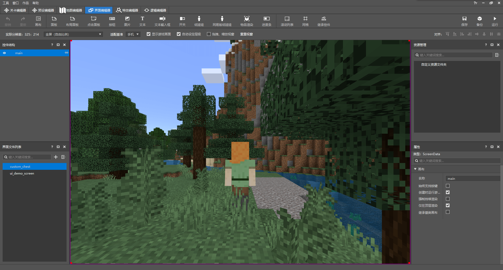

打开我们的编辑器，通过新建UI文件对话框创建一个新的UI文件，不妨命名为`custom_chest`。

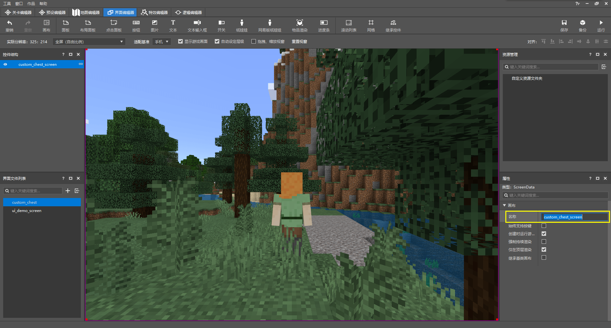

编辑器自动为我们创建一个`main`屏幕控件，我们不妨将其重命名为更加易记的名字`custom_chest_screen`。我们可以在右侧的“属性“窗格中来进行控件的重命名。

现在，我们先进行一个预期UI的设想。我们期望制作一个分为上下两部分的UI，上面一个面板用于展示箱子内容中的物品，下面一个面板用于展示玩家物品栏中的物品。中间可以使用一小段图片控件连接，就像原版的物品栏屏幕中左侧展示可合成的物品，右侧展示物品栏或合成网格， 中间用一小段图片连接一样。因此，我们的UI的主体其实是从上往下排列的三个主要部分。

## 向UI中添加控件

一般而言，一个屏幕下都存在且只存在一个面板。我们知道，面板是用来放置其他各种控件的一种技术性控件。不过，也可以轻松想到，在屏幕这种根节点上，我们其实也只需要一块面板便可以在其下放置各种控件了。因此，在没有特殊情况下，两个以上的面板便是多余的，这也是为什么我们一般都习惯于在一个屏幕下只放置一个面板，然后在这个面板上再进行各种操作或放置其他控件。

从刚才我们对UI的设想中我们可以得知，我们期望UI的各个主要部分竖向排列。因此，栈面板是我们这里首选的面板。栈面板可以是其中的控件严格横向或纵向排列，而无需单独指定他们各自的位置。

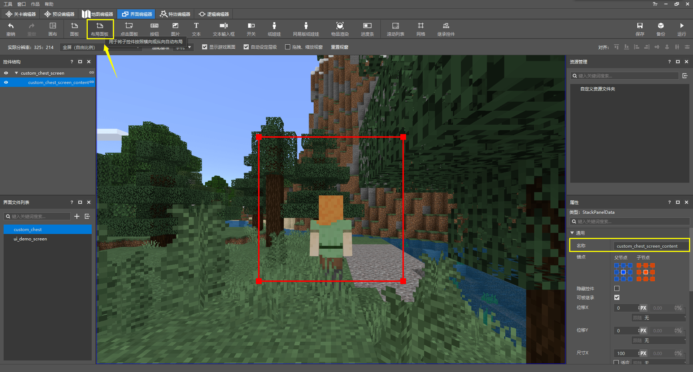

我们创建一个栈面板，并不妨将其重命名为`custom_chest_screen_content`。栈面板默认的朝向便是从上到下（垂直），所以我们无需改变其**定向**（**Orientation**），对应到JSON文件中就是无需改变其`orientation`。

### 上半部分

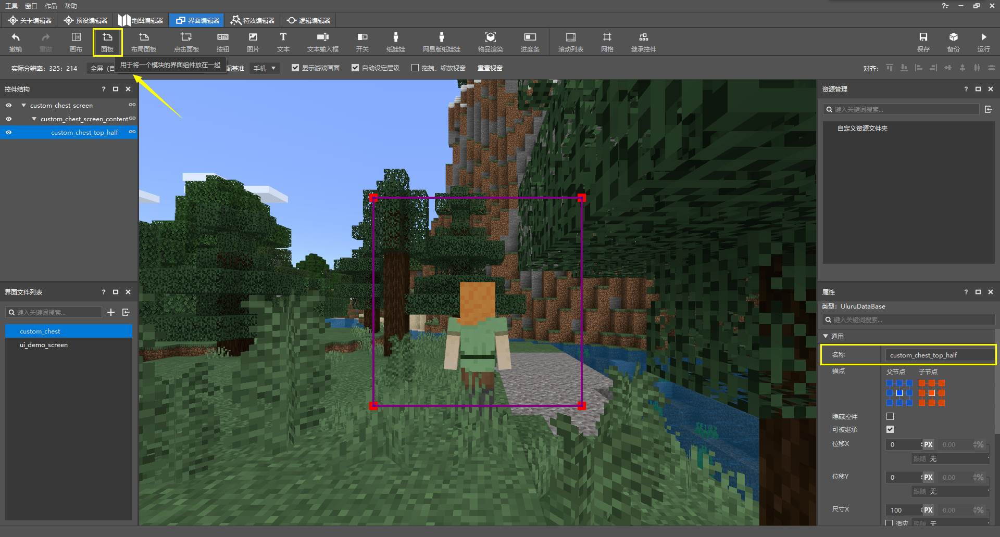

现在，我们为其加入上半主要部分的面板，这里我们使用普通面板，因为我们此时无需再使上半部分面板内部按顺序排列。不妨将其重命名为`custom_chest_top_half`。此时的面板依旧是默认尺寸，我们应为其指定尺寸。但是并不用这么着急，我们可以先将我们上半部分的背景图片制作好，然后根据背景图片的尺寸来计算并指定面板尺寸。

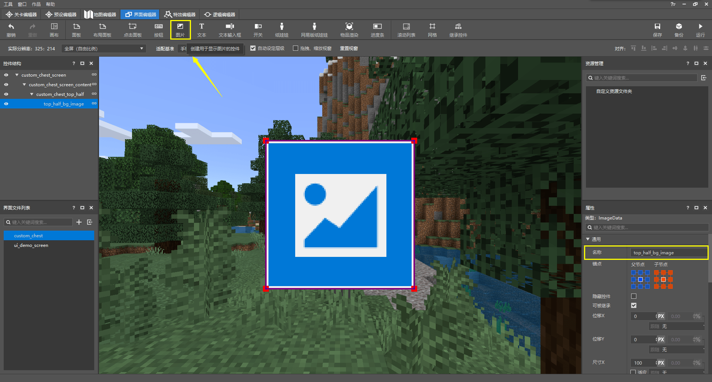

我们在该面板下加入一个图像控件，当做我们上半部分UI的背景图片，不妨重命名为`top_half_bg_image`。不过，此时该图像控件使用的的纹理图片是默认图片，我们需要对其进行更改。

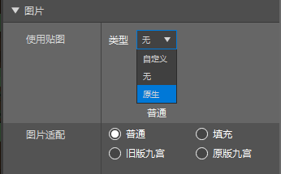

我们在“属性“窗格中下拉到底，看到“图片”部分。我们可以在这里为该图像控件添加图片。为了能够使用原版的UI纹理，我们这里可以选择“**原生**”。


我们在弹出的对话框中点击进入`texture/ui`文件夹，然后我们不妨可以选择`dialog_backgroud_hollow_3.png`作为我们的背景图片。这样，上方可以留出一部分方便我们之后加入窗口的标题。

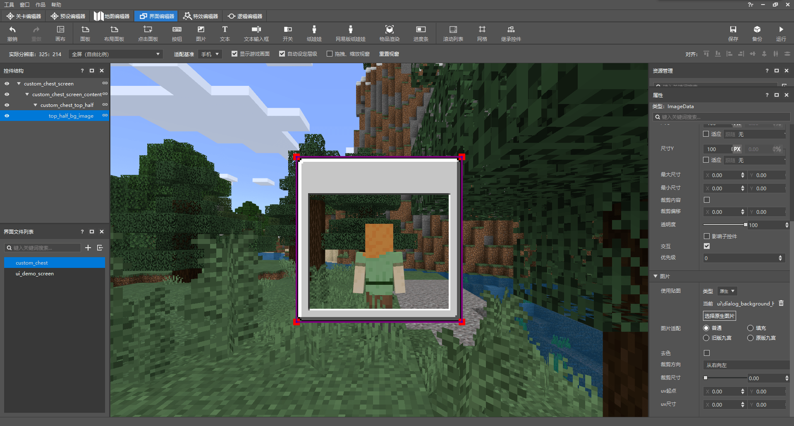

应用成功后，我们可以看到我们的UI具备了一个常规的样貌。但是此时，我们又生出了一点疑惑。从我们选择的这个纹理图片来看，其形状其实与应用之后编辑器中显示的样子很不一样。这样小的一副图片到底是怎样应用成这么大的一个背景的呢？事实上，这得已于一个被称作**纹理九切片**（**Texture Nineslice**，*纹理九宫图*）的功能。

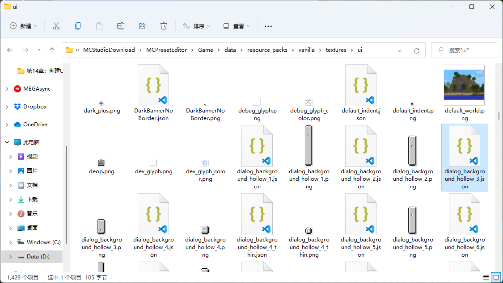

微软提供了一种原生的适配纹理九切片的数据驱动方式。我们找到该UI纹理原文件所在位置，可以看到，这里存在一个和该纹理文件名同名的JSON文件。游戏便是先自动检测纹理所在文件夹有无这样的同名JSON文件，如果有，便会使用九切片的方式来将该纹理拉伸变形，最终应用成我们看到的样子。我们打开这个`dialog_backgroud_hollow_3.json`文件：

```json
{
  "nineslice_size": [
    8,
    23,
    8,
    8
  ],
  "base_size": [
    18,
    33
  ]
}
```

可以看到，这里面有两个属性，其一是`nineslice_size`，便是九切片的尺寸；而另一个是`base_size`，直译为基尺寸，其实就是这个纹理文件本身的尺寸。`nineslice_size`是主要指定九切片需要从纹理的哪个位置开始的属性，其四个值代表着纹理在四个方向上的切片点，单位为像素（px）。其中这个例子便代表着从上方23个像素处，其余方向8个像素处进行切片。

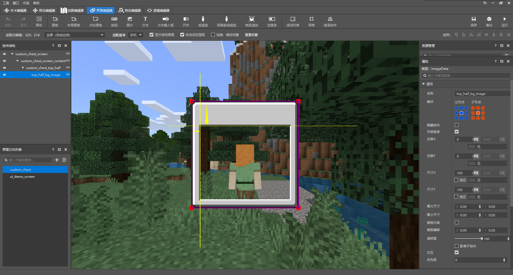

上、下、左、右、左上、右上、左下、右下四个方向皆以我们指定的像素宽度进行切片，然后拉伸剩余的部分，以适配控件的大小。于是，我们便在游戏内看到了这副模样。由于纹理九切片的存在，我们也知道了该控件除了上述八个部分外的最后一部分，中央部分，是在哪个位置开始的了。一般而言，我们可以将该面板上其余的控件放在中央位置，以求的比较美观的UI样式。那么，我们便可以使用九切片的四个尺寸来计算我们中央控件的位置与偏移。

我们现在就来计算我们的这个上半部分的面板的尺寸究竟应该为多少比较合适。我们目前并不想让箱子存储太多物品，比如，我们可以只让箱子存储九格物品，即只有一行，一共九个物品槽位。我们知道，物品本身应设置为16×16像素。然后物品的格子大小应该比物品本身大一圈，即各个方向上都大1px，那么，物品槽位本身应该是18×18像素。那么该面板的宽度应该为：
$$
x=width=8+18\cross9+8=178
$$
而该面板的高度为：
$$
y=height=23+18+8=49
$$
然而，我们希望背景图片的内框边缘的那一圈内凹质感的像素与我们处于边界的物品槽位的边缘重合，这样我们的物品槽位就不会出现从视觉上“陷得太深”的感觉。于是我们将背景图边界的计算数分别减一：
$$
x=width=7+18\cross9+7=176\\
y=height=22+18+7=47
$$
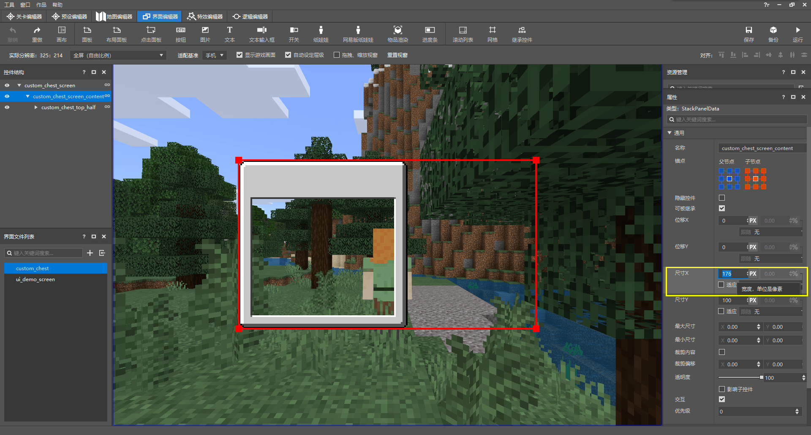

由于我们知道，我们最外层的栈面板是竖向排布的，所以整个UI的宽度是不变的，所以我们直接将176应用到我们最外层的栈面板的宽度（**尺寸X**）上。这对应JSON中的`"size" : [ 176, 100 ]`

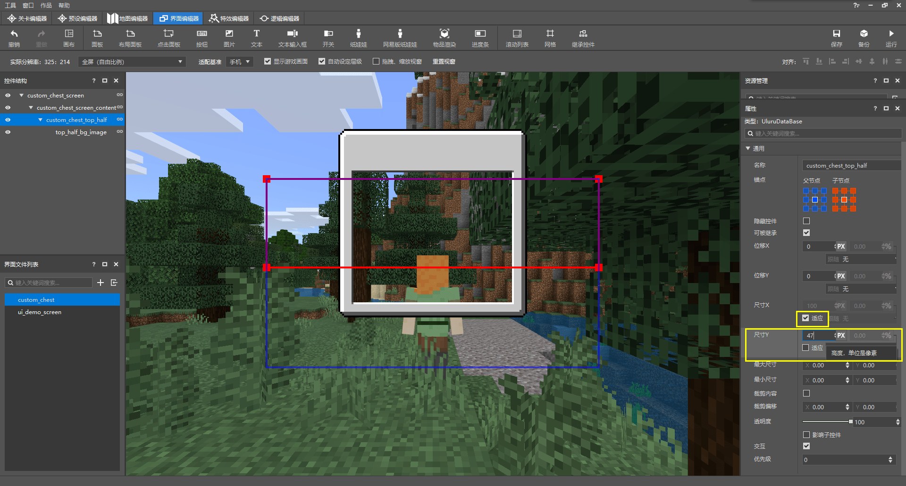

然后将我们的上半部面板的宽度设为“**适应**”，高度（尺寸Y）设置为我们计算出的高度47。这对应JSON中的`"size" : [ "default", 47 ]`。`default`对于面板、图片这一类控件而言就等价于`100%`，即继承其父控件的对应值。

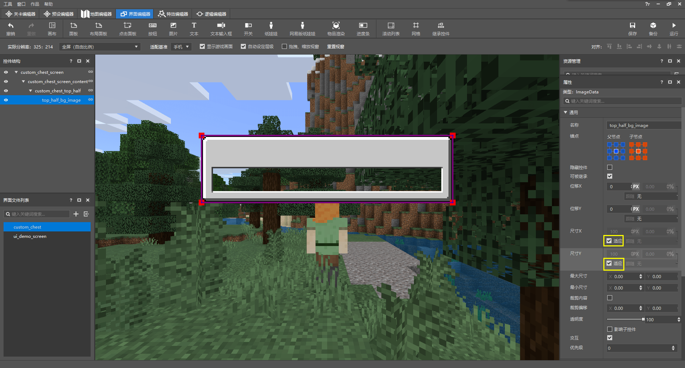

最后，我们将背景图片的图像控件的宽度和高度也皆设置为“适应”，这对应JSON中的`"size" : [ "default", "default" ]`。

现在，我们可以继续添加其他控件了。在添加物品堆叠槽位之前，我们先添加关闭按钮和标题。

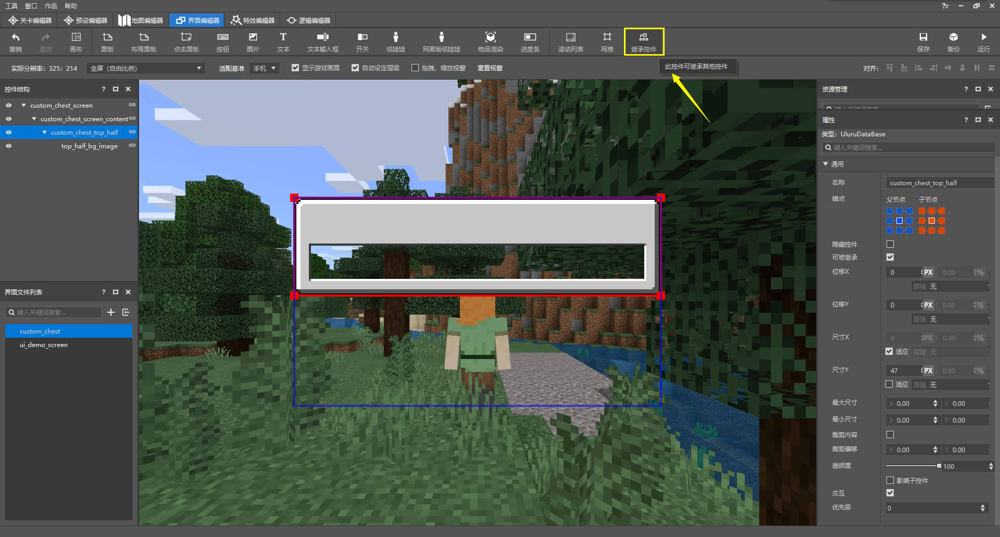

我们的关闭按钮无需自行设计，可以直接继承一个原版的关闭按钮控件。我们点击功能区中最后一个按钮，以在编辑器中加入一个继承控件。

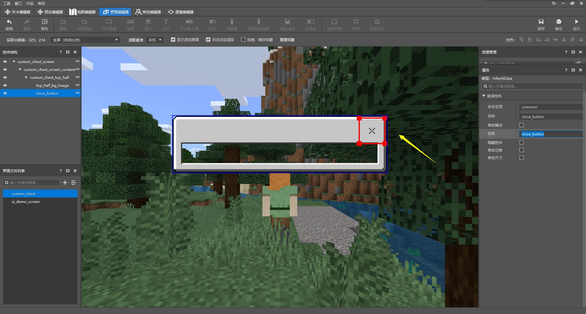

我们保持“属性”窗格中命名空间为`common`，然后将两个名称都更改为`close_button`，这相当于`close_button@common.close_button`。然后，我们可以看到一个和原版的关闭按钮一样的按钮出现在了右上角。

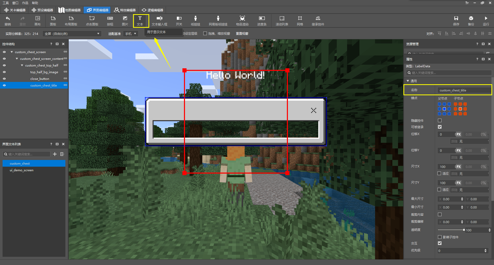

现在，我们为上半部分添加标题，不妨将其重命名为`custom_chest_title`。


我们在“属性”窗格中找到“文本”部分，将内容修改为我们想要的内容，不妨修改为“自定义箱子”。这样，我们的文本便成为了“自定义箱子”。


然后我们将该文本的位置设置到合适的位置。首先，我们将其两个轴向的尺寸都设置为“适应”，也即是`default`默认。对于文本来说，默认并不意味着适应到父级尺寸，相反，其意味着适应为自身文本的最小尺寸，就如上图那样。然后，我们通过修改**锚点**（**Anchor**）使其位置移动到面板的左上角。

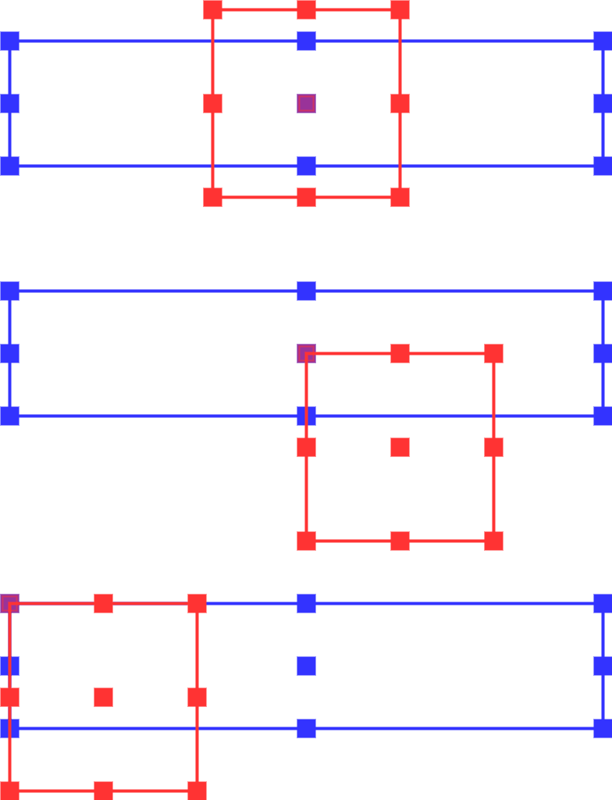

锚点是一个父控件的子控件用于将自身的合适的位置挂接到父控件的合适的位置上的一种属性。在上图中，不妨设蓝色为父控件，红色的为子控件，则他们两种控件上分别都有九个锚点，分别是一周的八个和中央的一个。默认来说，子控件的中央锚点是挂接在父控件的中央锚点上的，如第一幅图所示。如果我们将子控件左上角的锚点挂接在父控件的中央锚点上，则就会变成第二幅图的样子。最后，如果我们把子控件的左上锚点挂接在父控件的左上锚点上，就是这里第三幅图的样子，也是我们的标题文本想要挂接在面板上所采取的的方式。锚点属性对应到JSON文件有`anchor_from`和`anchor_to`两种。顾名思义，`anchor_from`即“来自的锚点”，也就是父锚点位，`anchor_to`即“挂接至的锚点”，即子锚点位。

不过，我们可以看到，我们的文本不能仅使其挂接在父控件的左上角。如果单单是挂接在左上角的话，文本就会太靠近面板的边缘。我们需要将其右移和下移，使其移动到合适的位置。如上面截图中的X、Y所示，整个UI中其实是存在坐标系的，而X轴的正方向就是从左向右，Y轴的正方向就是从上向下。那么我们想让其向右移动，就相当于增加正的X坐标；向下移动，就相当于增加正的Y坐标。所以我们将“**位移X**”和“**位移Y**”分别设置为正的8，这样，我们就成功使其向右且向下偏移了8个像素。

现在，我们开始制作箱子的物品栏。

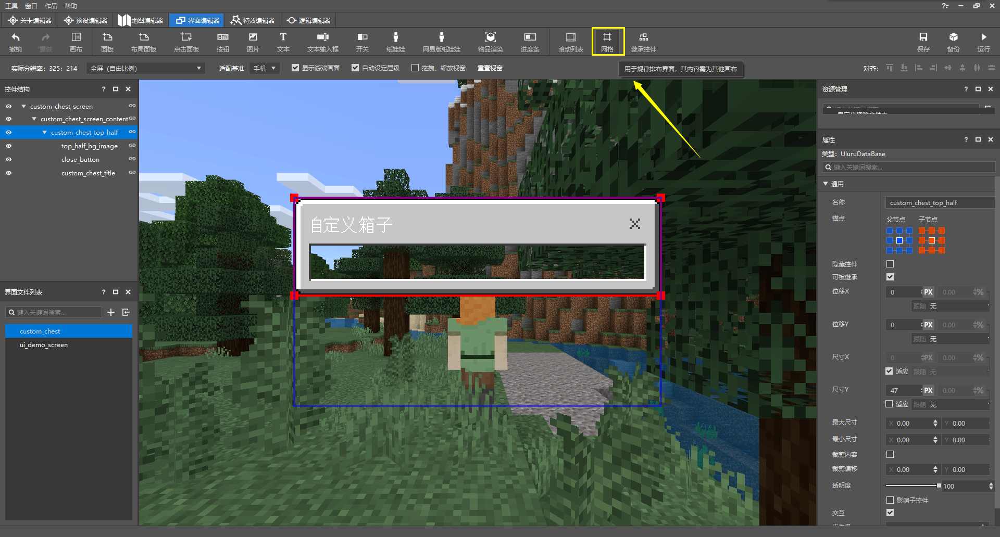

我们点击功能区中的“网格”，来创建一个网格控件。网格控件是一种可以使其模板中的元素呈现一种网格排列的控件，非常适合制作由重复的元素组成的界面。


我们不妨将其重命名为`custom_chest_slot_grid`。我们可以看到，现在的网格是四个默认图片组成的，且非常丑陋。这是因为我们还没有为其设置网格的模板。

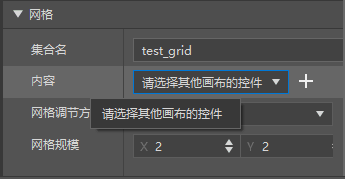

我们在右侧“属性”窗格中拉到底部，可以看到“内容”属性中显示，我们必须选择一个其他屏幕（*画布*）的控件作为该网格的模板。所以，我们再在该JSON UI中创建一个新的屏幕。一个JSON UI中可以创建多个屏幕，每个屏幕都可以单独发生作用。不过，我们这里创建的屏幕仅仅是为了使我们的模板有一个可以承载的位置（这是由于当前编辑器不支持显示落单的独立控件，只支持显示挂接在屏幕下的控件），所以我们仅仅是在创建一个“技术性屏幕”，不将其实际显示。

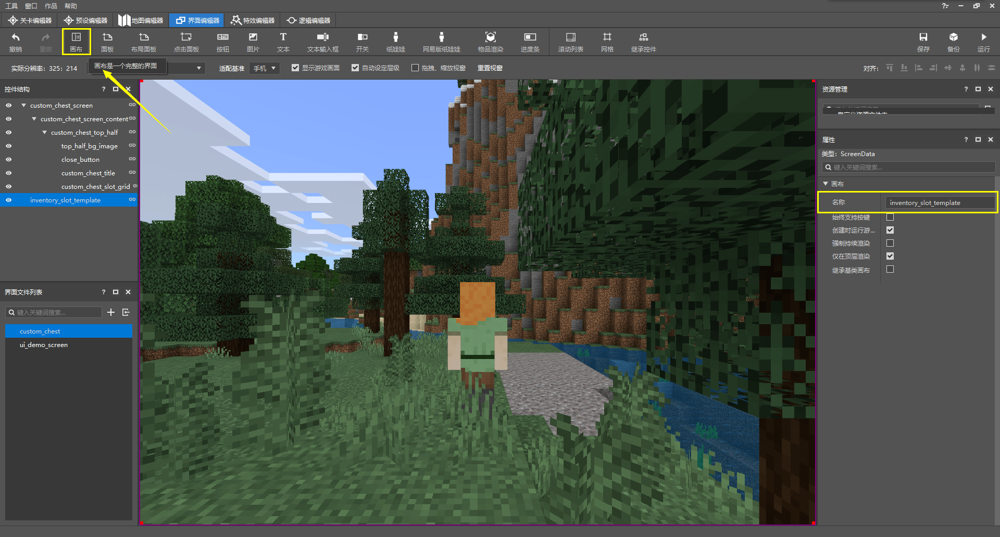

我们点击功能区中的“画布”以创建一个新的屏幕，不妨将其命名为`inventory_slot_template`。


我们在其下创建一个面板，作为我们打算最终应用到网格中充当模板的面板，不妨重命名为`inventory_slot_panel`。同时，我们将其尺寸更改为18×18。这是因为我们这一个模板便是一个物品槽位，而物品槽位我们之前已经计算过其尺寸，为18×18。

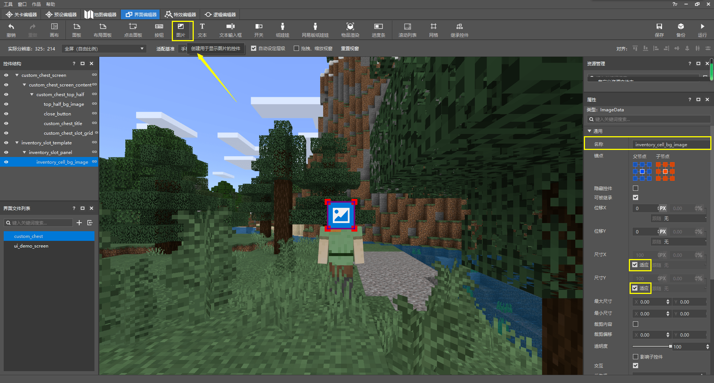

我们再在其下创建一个图像控件，重命名为`inventory_cell_bg_image`，并将其尺寸设置为“适应”。


我们选择原版资源包下的`textures/ui/cell_image.png`作为我们的纹理，其也满足九切片条件，被自动拉伸至宛如原版物品槽位的样貌。

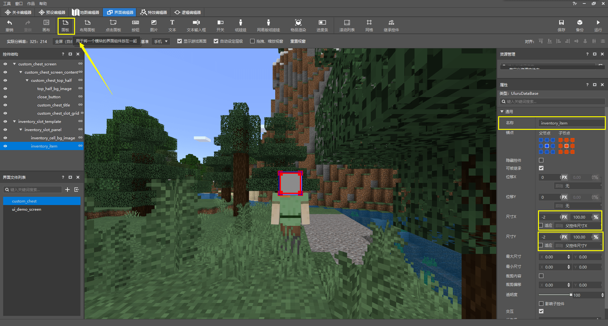

现在，我们再为其添加一个面板，该面板用于承载物品的**渲染器**（**Renderer**）和物品数量文本标签两个控件的面板。渲染器是一种只有控件类型为自定义（`custom`）时才需要的属性。说白了，就是自定义控件这种控件支持我们通过一个渲染器来自定义其上的渲染。而原版中就存在一个渲染器`inventory_item_renderer`可以用于渲染物品。

我们将该面板重命名为`inventory_item`，并将两个轴向上的尺寸调整为“跟随父控件的100%然后减少2px”，这是因为我们希望该面板的大小为16×16。这相当于在JSON文件中使用这种写法：`"size" : [ "100% - 2px", "100% - 2px" ]`，其中减号两侧的空格是可省的，甚至，你可以写成`"size" : [ "100% + -2px", "100% + -2px" ]`，同理，加号两侧的空格也是可省的。那么，这种写法是什么意义呢？事实上，控件的尺寸中是可以将**父控件**（**Parent Control**）、**兄弟控件**（**Sibling Control**）或**子控件**（**Child Control**）对应尺寸的百分比作为运算式的一部分参与运算，然后再得出一个最终值使用的。直接使用`%`得到的便是父控件的百分比，使用`%c`得到的是子控件对应方向的总尺寸的百分比，`%cm`是子控件中对应方向中尺寸最大的控件的尺寸的百分比，`%sm`是兄弟控件中对应方向中尺寸最大的控件的尺寸的百分比。这些百分比都可以在编辑器中直接操作和更改。


我们点击功能区中的“物品渲染”便能创建一个带有渲染器`inventory_item_renderer`的自定义类型控件，不妨重命名为`item_renderer`。我们将其尺寸设置为“适应”。

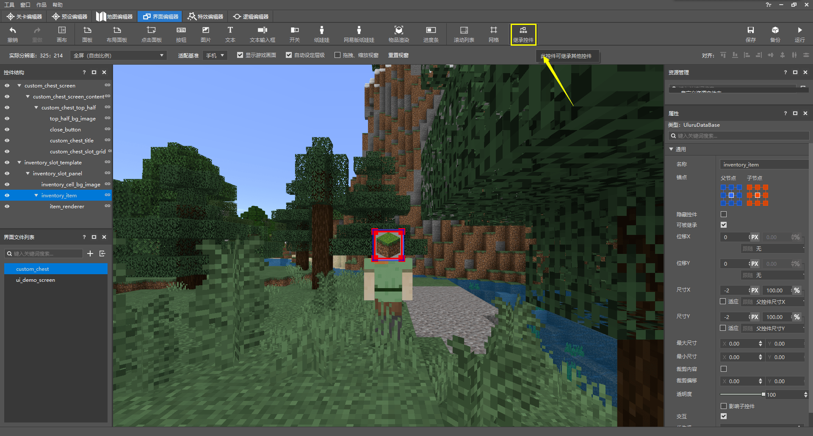

然后我们依旧打算通过继承一个原版控件来实现物品数量的文本。


我们将不妨其命名为`stack_count_label`，并继承`common.stack_count_label`。

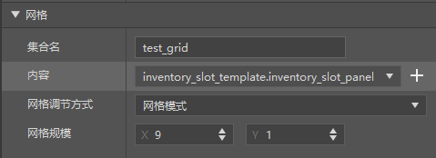

回到我们的网格控件，我们将“内容”设置为我们的面板`inventory_slot_template/inventory_slot_panel`。当然，编辑器中是用`.`显示的，这并不影响我们正确找到控件。同时，我们将网格规模设置为9×1。


最后，我们将该控件设置为从上方锚点挂接到上方锚点，然后向下偏移22个像素，同时尺寸设置为宽度为`100% - 14px`，高度设置为18。这相当于在JSON文件中写入以下属性：

```json
"anchor_from" : "top_middle",
"anchor_to" : "top_middle",
"offset" : [ 0, 22 ],
"size" : [ "100% - 14px", 18 ]
```

这样，我们就完成了上半部分的制作。

### 折页

在上半部分和下半部分之间，我们需要一个连接。我们接下来制作这个连接用的部分，不妨称之为折页。

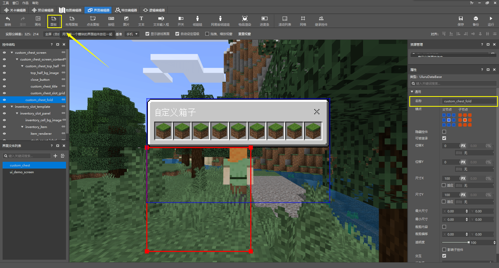

我们在我们的栈面板下新建一个面板，用于存放我们的折页，不妨命名为`custom_chest_fold`。根据栈面板的流动方式，它自然位于了我们上半部分面板的下方。


与原版物品栏屏幕上的折页对应，我们将其尺寸的宽度设置为“适应”，高度设置为4个像素。

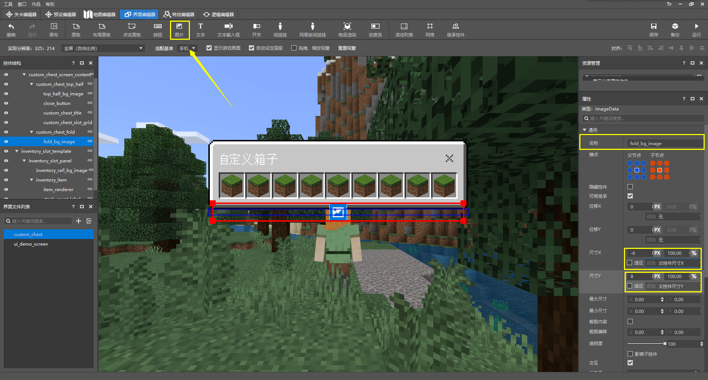

现在，我们为其添加背景图片。我们新建一个图像控件，不妨重命名为`fold_bg_image`。然后，我们将其宽度设置的少窄一些，高度比原来的更高一些。这样，我们的图片应用之后就能做到一个比较美观的连接效果。

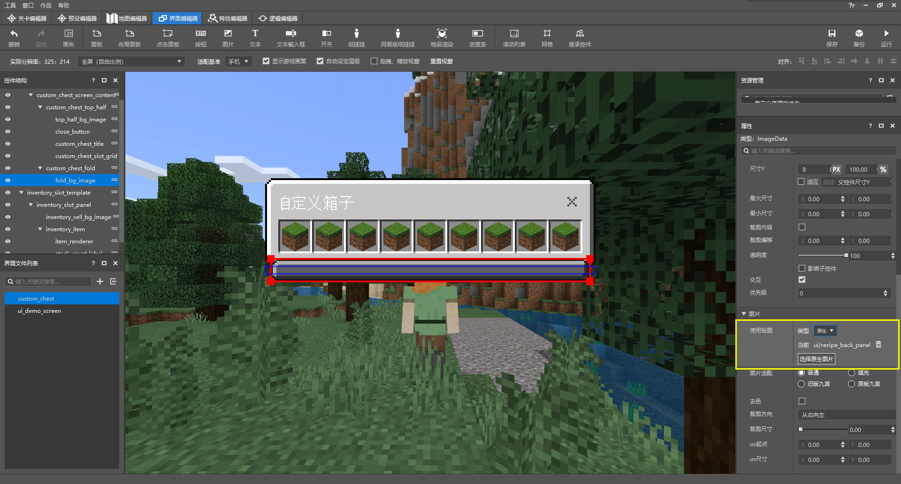

即我们应用了纹理之后便可以看到的连接效果。此时我们应用的是`textures/ui/recipe_back_panel.png`。其同样使用了九切片拉伸。


但是，我们可以看到，我们的这个控件位于上半部分控件的上方。那么，我们如何使其不遮挡上半部分控件呢？我们有两种办法，其一是取消编辑器的“自动设定层级”。默认状态下，编辑器会为我们自动设置控件的**层级**（**Layer**），一旦我们取消了自动设置层级，编辑器便会要求我们为每一个控件手动设定层级。层级代表着控件之前的遮挡关系，上层的控件会遮挡下层控件。然而，当我们还希望编辑器自动为我们代理设置这一功能时，我们便需要另辟他径。另一种方法不需要我们取消自动设置层级，那便是**裁剪**（**Clip**）功能。


我们勾选“裁剪内容”，以开启裁剪功能。然后，我们设置X和Y轴向上裁剪的宽度和高度。这里，我们只需要在Y上进行裁剪。那么我们将Y设置为4。这样，我们可以看到其进行了恰到好处的裁剪，这对应JSON中的`"allow_clipping": true, "clips_children": true, "clip_offset" : [ 0.0, 4.0 ]`。

### 下半部分

现在，我们开始制作下半部分。

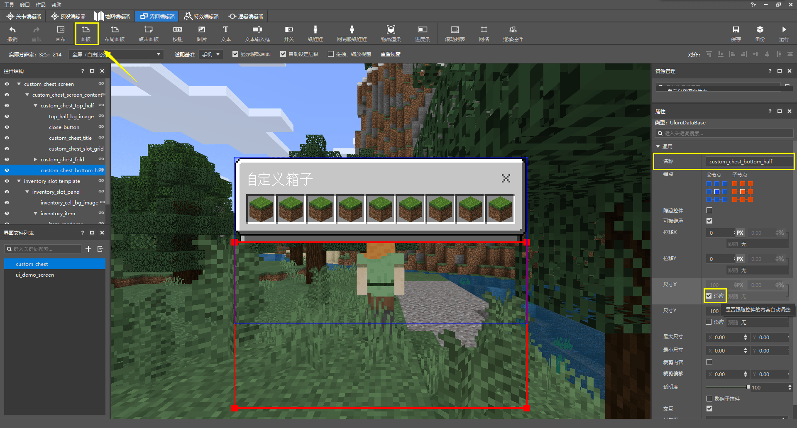

我们创建下半部分的面板，不妨命名为`custom_chest_buttom_half`。并将宽度设置为“适应”，高度稍后将通过计算得出。


我们在其下创建一个图像控件作为我们的背景图片，不妨重命名为`buttom_half_bg_image`。同样，我们将宽度和高度都设置为“适应”。

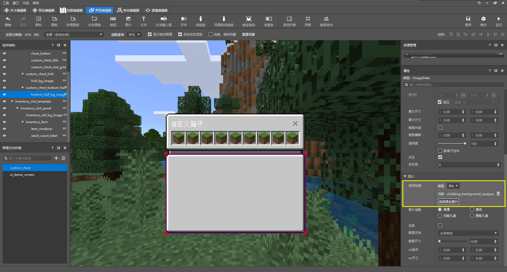

我们将`textures/ui/dialog_backgroud_opaque.png`设置为图像控件的纹理。现在，我们可以根据该文件的九切片数据计算整个下半部分的高度了。通过对应的九切片JSON文件我们可以得知，该控件上下的切片宽度都为8个像素。所以，我们通过以下算式计算高度：
$$
y=height=7+18\cross3+4+18+7=90
$$
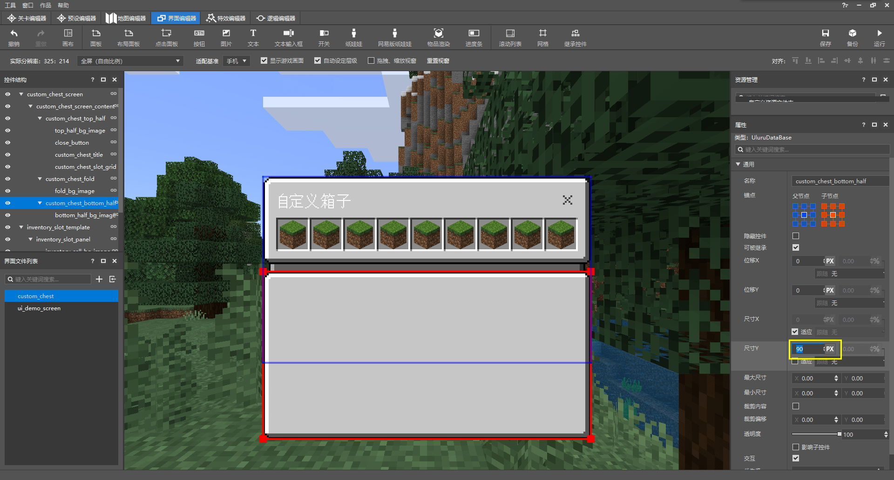

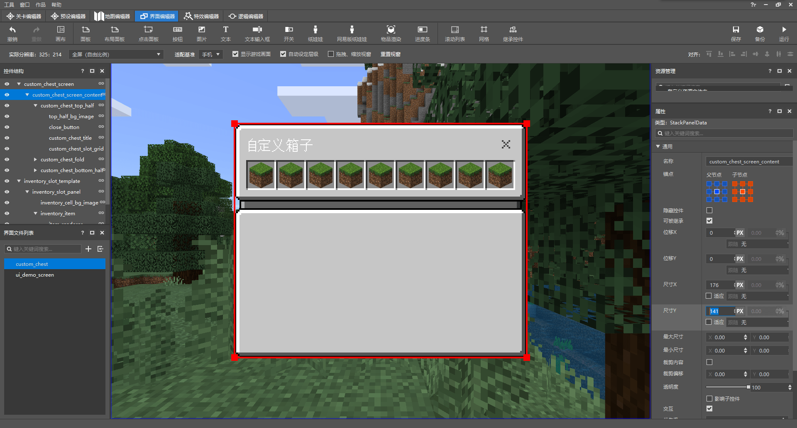

我们将下半部分面板的高度修改为90，同时将整个栈面板的高度修改为三个部分相加，即141。这样我们的整个栈面板中的元素便会竖直居中。

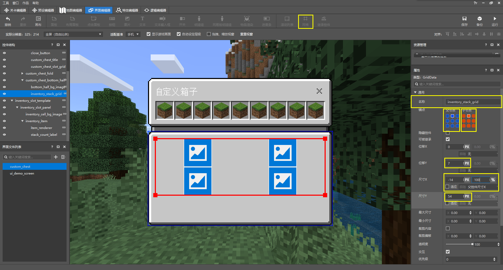

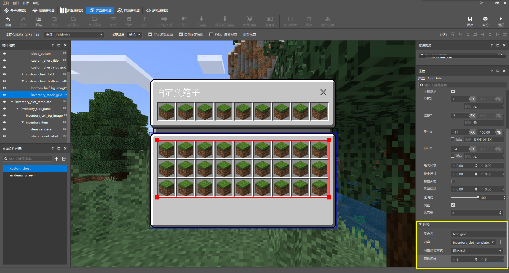

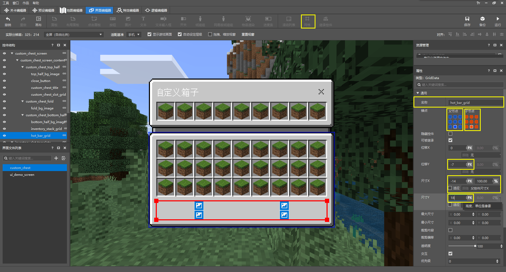

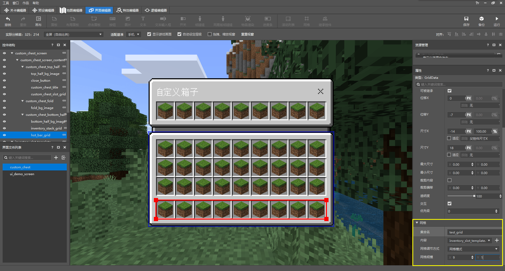

最后，就如同我们之前在上半部分加入箱子的物品栏一样，我们通过两个网格来加入玩家的物品栏和快捷栏。我们依旧可以使用我们之前的网格模板，因为他们从样式上没有任何区别。

### 检查与修饰

至此，我们基本已经完成了UI的绘制，但是，我们需要养成检查的习惯。因为在一次UI绘制过程中，我们将接触很多变量，所以可能会存在一些细小的我们看不到的不尽如人意之处。比如，我们此时便发现了我们的标题文字的颜色可以进一步更改。

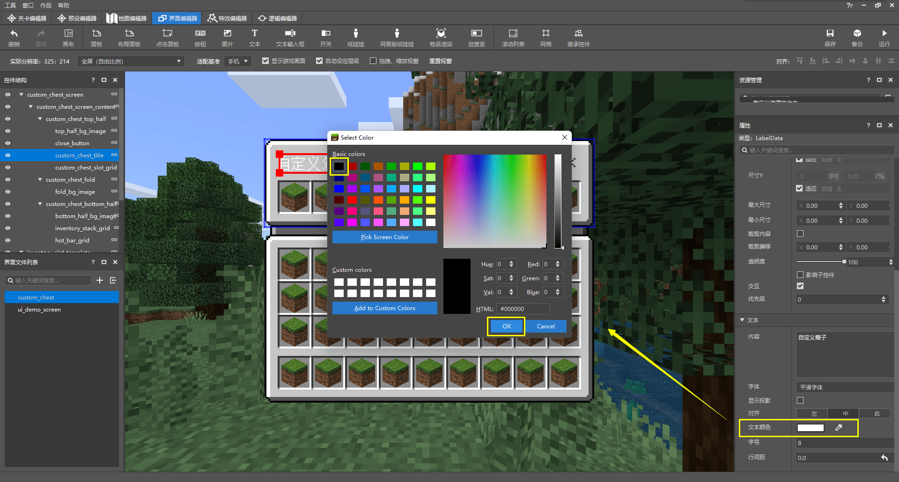

我们可以将标题改为黑色，这样它将更加显眼。

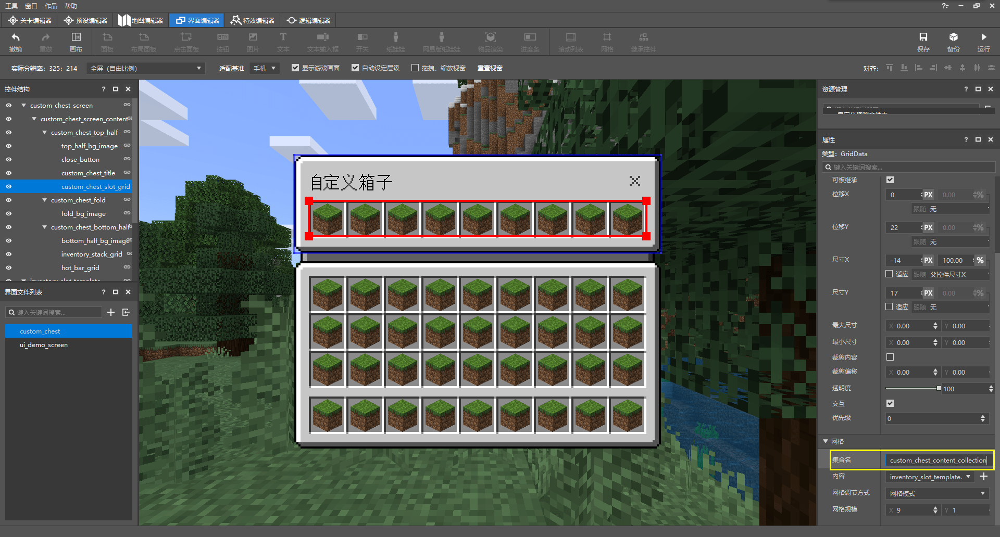

我们也可以为各个网格指定合集名，我们可以使用不同的合集名配合绑定来实现不同的网格中不同物品堆叠槽位的交互。当然，在本次示例中我们不打算完善这一过程，因此我们可以跳过这一点。

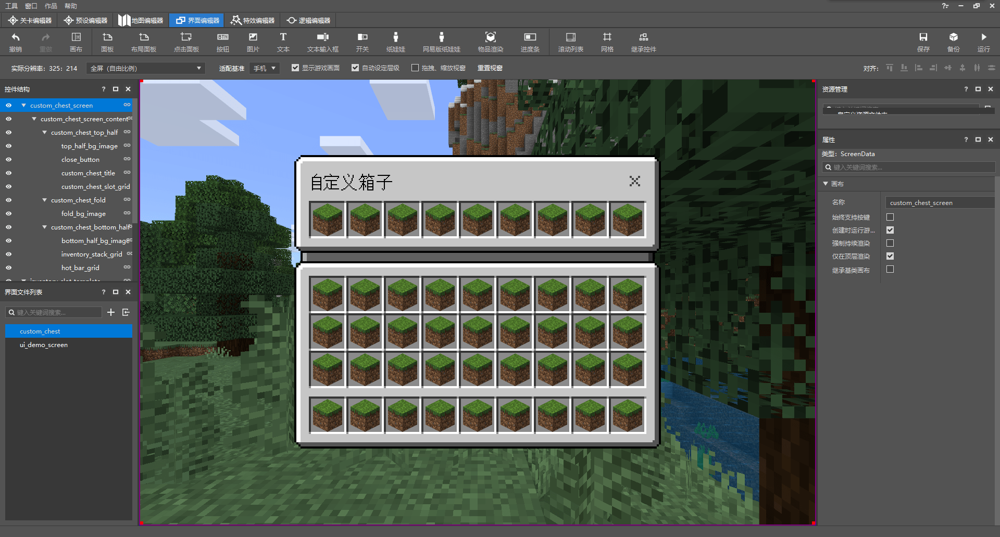

最终，我们完成了我们UI的绘制。我们可以将完成之后的JSON文件展示在此处：

```json
{
  "bottom_half_bg_image" : {
    "alpha" : 1.0,
    "anchor_from" : "center",
    "anchor_to" : "center",
    "clip_direction" : "left",
    "clip_offset" : [ 0, 0 ],
    "clip_ratio" : 0.0,
    "clips_children" : false,
    "enabled" : true,
    "fill" : false,
    "grayscale" : false,
    "is_new_nine_slice" : false,
    "keep_ratio" : true,
    "layer" : 13,
    "max_size" : [ 0, 0 ],
    "min_size" : [ 0, 0 ],
    "nine_slice_buttom" : 0,
    "nine_slice_left" : 0,
    "nine_slice_right" : 0,
    "nine_slice_top" : 0,
    "nineslice_size" : [ 0, 0, 0, 0 ],
    "offset" : [ 0, 0 ],
    "priority" : 0,
    "propagate_alpha" : false,
    "size" : [ "default", "default" ],
    "texture" : "textures/ui/dialog_background_opaque",
    "type" : "image",
    "uv" : [ 0, 0 ],
    "uv_size" : [ 0, 0 ],
    "visible" : true
  },
  "custom_chest_bottom_half" : {
    "alpha" : 1.0,
    "anchor_from" : "center",
    "anchor_to" : "center",
    "clip_offset" : [ 0, 0 ],
    "clips_children" : false,
    "controls" : [
      {
        "bottom_half_bg_image@custom_chest.bottom_half_bg_image" : {}
      },
      {
        "inventory_stack_grid@custom_chest.inventory_stack_grid" : {}
      },
      {
        "hot_bar_grid@custom_chest.hot_bar_grid" : {}
      }
    ],
    "enabled" : true,
    "layer" : 12,
    "max_size" : [ 0, 0 ],
    "min_size" : [ 0, 0 ],
    "offset" : [ 0, 0 ],
    "priority" : 0,
    "propagate_alpha" : false,
    "size" : [ "default", 90 ],
    "type" : "panel",
    "visible" : true
  },
  "custom_chest_fold" : {
    "alpha" : 1.0,
    "anchor_from" : "center",
    "anchor_to" : "center",
    "clip_offset" : [ 0, 0 ],
    "clips_children" : false,
    "controls" : [
      {
        "fold_bg_image@custom_chest.fold_bg_image" : {}
      }
    ],
    "enabled" : true,
    "layer" : 10,
    "max_size" : [ 0, 0 ],
    "min_size" : [ 0, 0 ],
    "offset" : [ 0, 0 ],
    "priority" : 0,
    "propagate_alpha" : false,
    "size" : [ "default", 4 ],
    "type" : "panel",
    "visible" : true
  },
  "custom_chest_screen" : {
    "absorbs_input" : true,
    "always_accepts_input" : false,
    "controls" : [
      {
        "custom_chest_screen_content@custom_chest.custom_chest_screen_content" : {}
      }
    ],
    "force_render_below" : false,
    "is_showing_menu" : true,
    "render_game_behind" : true,
    "render_only_when_topmost" : true,
    "should_steal_mouse" : false,
    "type" : "screen"
  },
  "custom_chest_screen_content" : {
    "alpha" : 1.0,
    "anchor_from" : "center",
    "anchor_to" : "center",
    "clip_offset" : [ 0, 0 ],
    "clips_children" : false,
    "controls" : [
      {
        "custom_chest_top_half@custom_chest.custom_chest_top_half" : {}
      },
      {
        "custom_chest_fold@custom_chest.custom_chest_fold" : {}
      },
      {
        "custom_chest_bottom_half@custom_chest.custom_chest_bottom_half" : {}
      }
    ],
    "enabled" : true,
    "layer" : 0,
    "max_size" : [ 0, 0 ],
    "min_size" : [ 0, 0 ],
    "offset" : [ 0, 0 ],
    "orientation" : "vertical",
    "priority" : 0,
    "propagate_alpha" : false,
    "size" : [ 176, 141 ],
    "type" : "stack_panel",
    "use_priority" : false,
    "visible" : true
  },
  "custom_chest_slot_grid" : {
    "alpha" : 1.0,
    "anchor_from" : "top_middle",
    "anchor_to" : "top_middle",
    "clip_offset" : [ 0, 0 ],
    "clips_children" : false,
    "collection_name" : "custom_chest_content_collection",
    "enabled" : true,
    "grid_dimensions" : [ 9.0, 1.0 ],
    "grid_item_template" : "custom_chest.inventory_slot_panel",
    "grid_rescaling_type" : "none",
    "layer" : 5,
    "max_size" : [ 0, 0 ],
    "maximum_grid_items" : 0,
    "min_size" : [ 0, 0 ],
    "offset" : [ 0, 22 ],
    "priority" : 0,
    "propagate_alpha" : true,
    "size" : [ "100.0%+-14.0px", 18 ],
    "type" : "grid",
    "visible" : true
  },
  "custom_chest_title" : {
    "alpha" : 1.0,
    "anchor_from" : "top_left",
    "anchor_to" : "top_left",
    "clip_offset" : [ 0, 0 ],
    "clips_children" : false,
    "color" : [ 0.0, 0.0, 0.0 ],
    "enabled" : true,
    "font_scale_factor" : 1.0,
    "font_size" : "normal",
    "font_type" : "smooth",
    "layer" : 4,
    "line_padding" : 0.0,
    "max_size" : [ 0, 0 ],
    "min_size" : [ 0, 0 ],
    "offset" : [ 8, 8 ],
    "priority" : 0,
    "propagate_alpha" : false,
    "shadow" : false,
    "size" : [ "default", "default" ],
    "text" : "自定义箱子",
    "text_alignment" : "center",
    "type" : "label",
    "visible" : true
  },
  "custom_chest_top_half" : {
    "alpha" : 1.0,
    "anchor_from" : "center",
    "anchor_to" : "center",
    "clip_offset" : [ 0, 0 ],
    "clips_children" : false,
    "controls" : [
      {
        "top_half_bg_image@custom_chest.top_half_bg_image" : {}
      },
      {
        "close_button@common.close_button" : {
          "layer" : 3
        }
      },
      {
        "custom_chest_title@custom_chest.custom_chest_title" : {}
      },
      {
        "custom_chest_slot_grid@custom_chest.custom_chest_slot_grid" : {}
      }
    ],
    "enabled" : true,
    "layer" : 1,
    "max_size" : [ 0, 0 ],
    "min_size" : [ 0, 0 ],
    "offset" : [ 0, 0 ],
    "priority" : 0,
    "propagate_alpha" : false,
    "size" : [ "default", 47 ],
    "type" : "panel",
    "visible" : true
  },
  "fold_bg_image" : {
    "alpha" : 1.0,
    "anchor_from" : "center",
    "anchor_to" : "center",
    "clip_direction" : "left",
    "clip_offset" : [ 0.0, 4.0 ],
    "clip_ratio" : 0.0,
    "clips_children" : true,
    "enabled" : true,
    "fill" : false,
    "grayscale" : false,
    "is_new_nine_slice" : false,
    "keep_ratio" : true,
    "layer" : 11,
    "max_size" : [ 0, 0 ],
    "min_size" : [ 0, 0 ],
    "nine_slice_buttom" : 0,
    "nine_slice_left" : 0,
    "nine_slice_right" : 0,
    "nine_slice_top" : 0,
    "nineslice_size" : [ 0, 0, 0, 0 ],
    "offset" : [ 0, 0 ],
    "priority" : 0,
    "propagate_alpha" : false,
    "size" : [ "100.0%+-6.0px", "100.0%+8.0px" ],
    "texture" : "textures/ui/recipe_back_panel",
    "type" : "image",
    "uv" : [ 0, 0 ],
    "uv_size" : [ 0, 0 ],
    "visible" : true
  },
  "hot_bar_grid" : {
    "alpha" : 1.0,
    "anchor_from" : "bottom_middle",
    "anchor_to" : "bottom_middle",
    "clip_offset" : [ 0, 0 ],
    "clips_children" : false,
    "collection_name" : "test_grid",
    "enabled" : true,
    "grid_dimensions" : [ 9.0, 1.0 ],
    "grid_item_template" : "custom_chest.inventory_slot_panel",
    "grid_rescaling_type" : "none",
    "layer" : 19,
    "max_size" : [ 0, 0 ],
    "maximum_grid_items" : 0,
    "min_size" : [ 0, 0 ],
    "offset" : [ 0, -7 ],
    "priority" : 0,
    "propagate_alpha" : true,
    "size" : [ "100.0%+-14.0px", 18 ],
    "type" : "grid",
    "visible" : true
  },
  "inventory_cell_bg_image" : {
    "alpha" : 1.0,
    "anchor_from" : "center",
    "anchor_to" : "center",
    "clip_direction" : "left",
    "clip_offset" : [ 0, 0 ],
    "clip_ratio" : 0.0,
    "clips_children" : false,
    "enabled" : true,
    "fill" : false,
    "grayscale" : false,
    "is_new_nine_slice" : false,
    "keep_ratio" : true,
    "layer" : 1,
    "max_size" : [ 0, 0 ],
    "min_size" : [ 0, 0 ],
    "nine_slice_buttom" : 0,
    "nine_slice_left" : 0,
    "nine_slice_right" : 0,
    "nine_slice_top" : 0,
    "nineslice_size" : [ 0, 0, 0, 0 ],
    "offset" : [ 0, 0 ],
    "priority" : 0,
    "propagate_alpha" : false,
    "size" : [ "default", "default" ],
    "texture" : "textures/ui/cell_image",
    "type" : "image",
    "uv" : [ 0, 0 ],
    "uv_size" : [ 0, 0 ],
    "visible" : true
  },
  "inventory_item" : {
    "alpha" : 1.0,
    "anchor_from" : "center",
    "anchor_to" : "center",
    "clip_offset" : [ 0, 0 ],
    "clips_children" : false,
    "controls" : [
      {
        "item_renderer@custom_chest.item_renderer" : {}
      },
      {
        "stack_count_label@common.stack_count_label" : {
          "layer" : 4
        }
      }
    ],
    "enabled" : true,
    "layer" : 2,
    "max_size" : [ 0, 0 ],
    "min_size" : [ 0, 0 ],
    "offset" : [ 0, 0 ],
    "priority" : 0,
    "propagate_alpha" : false,
    "size" : [ "100.0%+-2.0px", "100.0%+-2.0px" ],
    "type" : "panel",
    "visible" : true
  },
  "inventory_slot_panel" : {
    "alpha" : 1.0,
    "anchor_from" : "center",
    "anchor_to" : "center",
    "clip_offset" : [ 0, 0 ],
    "clips_children" : false,
    "controls" : [
      {
        "inventory_cell_bg_image@custom_chest.inventory_cell_bg_image" : {}
      },
      {
        "inventory_item@custom_chest.inventory_item" : {}
      }
    ],
    "enabled" : true,
    "layer" : 0,
    "max_size" : [ 0, 0 ],
    "min_size" : [ 0, 0 ],
    "offset" : [ 0, 0 ],
    "priority" : 0,
    "propagate_alpha" : false,
    "size" : [ 18, 18 ],
    "type" : "panel",
    "visible" : true
  },
  "inventory_slot_template" : {
    "absorbs_input" : true,
    "always_accepts_input" : false,
    "controls" : [
      {
        "inventory_slot_panel@custom_chest.inventory_slot_panel" : {}
      }
    ],
    "force_render_below" : false,
    "is_showing_menu" : true,
    "render_game_behind" : true,
    "render_only_when_topmost" : true,
    "should_steal_mouse" : false,
    "type" : "screen"
  },
  "inventory_stack_grid" : {
    "alpha" : 1.0,
    "anchor_from" : "top_middle",
    "anchor_to" : "top_middle",
    "clip_offset" : [ 0, 0 ],
    "clips_children" : false,
    "collection_name" : "test_grid",
    "enabled" : true,
    "grid_dimensions" : [ 9.0, 3.0 ],
    "grid_item_template" : "custom_chest.inventory_slot_panel",
    "grid_rescaling_type" : "none",
    "layer" : 14,
    "max_size" : [ 0, 0 ],
    "maximum_grid_items" : 0,
    "min_size" : [ 0, 0 ],
    "offset" : [ 0, 7 ],
    "priority" : 0,
    "propagate_alpha" : true,
    "size" : [ "100.0%+-14.0px", 54 ],
    "type" : "grid",
    "visible" : true
  },
  "item_renderer" : {
    "alpha" : 1.0,
    "anchor_from" : "center",
    "anchor_to" : "center",
    "clip_offset" : [ 0, 0 ],
    "clips_children" : false,
    "enabled" : true,
    "layer" : 3,
    "max_size" : [ 0, 0 ],
    "min_size" : [ 0, 0 ],
    "offset" : [ 0, 0 ],
    "priority" : 0,
    "propagate_alpha" : false,
    "property_bag" : {
      "#item_id_aux" : 131072
    },
    "renderer" : "inventory_item_renderer",
    "size" : [ "default", "default" ],
    "type" : "custom",
    "visible" : true
  },
  "namespace" : "custom_chest",
  "top_half_bg_image" : {
    "alpha" : 1.0,
    "anchor_from" : "center",
    "anchor_to" : "center",
    "clip_direction" : "left",
    "clip_offset" : [ 0, 0 ],
    "clip_ratio" : 0.0,
    "clips_children" : false,
    "enabled" : true,
    "fill" : false,
    "grayscale" : false,
    "is_new_nine_slice" : false,
    "keep_ratio" : true,
    "layer" : 2,
    "max_size" : [ 0, 0 ],
    "min_size" : [ 0, 0 ],
    "nine_slice_buttom" : 0,
    "nine_slice_left" : 0,
    "nine_slice_right" : 0,
    "nine_slice_top" : 0,
    "nineslice_size" : [ 0, 0, 0, 0 ],
    "offset" : [ 0, 0 ],
    "priority" : 0,
    "propagate_alpha" : false,
    "size" : [ "default", "default" ],
    "texture" : "textures/ui/dialog_background_hollow_3",
    "type" : "image",
    "uv" : [ 0, 0 ],
    "uv_size" : [ 0, 0 ],
    "visible" : true
  }
}
```

由于该文件是编辑器自动生成的，所以控件是按照字母序排序的，看起来有些乱。不过，由于我们不打算在JSON层面进行二次修改，所以我们也无需关注这一点。接下来，我们可以将其显示在游戏中。我们只需要知道，我们想要显示的屏幕控件名为`custom_chest.custom_chest_screen`。

## 在游戏中显示自定义UI

现在，以我们在第十三章中制作的自定义箱子为基础，我们一起来制作一个将该JSON UI显示在游戏内的功能。我们知道，我们之前的自定义箱子的脚本位于行为包的`BlockEntityScripts`的文件夹。为了将UI显示在游戏中，我们的自定义UI必须在Python代码中具备一个**代理类**（**Proxy Class**），用于代理该UI的各种功能。就算我们的UI不具备什么功能，它也必须需要代理类的存在才可以正确显示。

我们在该文件夹中新建一个`ChestScreenNode.py`，用于代理我们的屏幕节点。由于我们的UI不具备什么功能，我们只需在其中简单地输入如下内容：

```python
# -*- coding: utf-8 -*-
import mod.client.extraClientApi as clientApi

ScreenNode = clientApi.GetScreenNodeCls()


class Main(ScreenNode):

    def __init__(self, namespace, name, params):
        ScreenNode.__init__(self, namespace, name, params)

    def Create(self):
        pass

```

然后，我们需要在我们的系统中注册该类，使其注册为UI。在游戏中，所有的自定义UI都必须在游戏内UI全部初始化之后才能注册，所以我们此处需要用到一个引擎系统事件`UiInitFinished`。事实上，我们已经在之前制作存储箱子的方块实体数据功能（上一章挑战中最后的练习）中用到了该事件。我们基于它的回调`chunk_first_loaded`修改如下：

```python
# -*- coding: UTF-8 -*-
from mod.client.system.clientSystem import ClientSystem
import mod.client.extraClientApi as clientApi
import time


class Main(ClientSystem):

    def __init__(self, namespace, system_name):
        ClientSystem.__init__(self, namespace, system_name)
        namespace = clientApi.GetEngineNamespace()
        system_name = clientApi.GetEngineSystemName()
        self.ListenForEvent(namespace, system_name, 'ClientBlockUseEvent', self, self.block_used)
        self.ListenForEvent(namespace, system_name, 'ChunkLoadedClientEvent', self, self.chunk_first_loaded)
        self.ListenForEvent(namespace, system_name, 'UiInitFinished', self, self.chunk_first_loaded)
        self.ListenForEvent('tutorial_demo', 'BlockEntityServer', 'OpenChestFinished', self, self.chest_opened)
        self.ListenForEvent('tutorial_demo', 'BlockEntityServer', 'InitChestRotation', self, self.chest_rotation)
        self.block_interact_cooldown = {}
        self.rotation_queue = []

    def block_used(self, event):
        player_id = event['playerId']
        block_name = event['blockName']
        x = event['x']
        y = event['y']
        z = event['z']
        if block_name == 'tutorial_demo:custom_chest':
            if player_id not in self.block_interact_cooldown:
                self.block_interact_cooldown[player_id] = time.time()
            elif time.time() - self.block_interact_cooldown[player_id] < 0.15:
                return
            else:
                self.block_interact_cooldown[player_id] = time.time()
            game_comp = clientApi.GetEngineCompFactory().CreateGame(clientApi.GetLevelId())
            dimension_id = game_comp.GetCurrentDimension()
            self.NotifyToServer('TryOpenChest', {'dimensionId': dimension_id, 'pos': [x, y, z]})

    def chest_opened(self, event):
        data = event['data']
        block_comp = clientApi.GetEngineCompFactory().CreateBlockInfo(clientApi.GetLevelId())
        for block_data in data:
            block_pos = tuple(block_data['pos'])
            block_comp.SetBlockEntityMolangValue(block_pos, "variable.mod_states", float(block_data['states']))

    def chunk_first_loaded(self, event):
        self.NotifyToServer('GetChestInit', {'playerId': clientApi.GetLocalPlayerId()})
        # 注册自定义箱子的屏幕为脚本内的UI，第一个参数是注册为的UI的命名空间，第二个参数为注册为的UI的键名，即标识符，第三个参数为代理类所在路径，第四个参数为JSON UI中屏幕控件名
        clientApi.RegisterUI('tutorial_demo', 'custom_chest', 'BlockEntityScripts.ChestScreenNode.Main', 'custom_chest.custom_chest_screen')

    def chest_rotation(self, event):
        print event
        new_event = {tuple(map(int, k.split(','))): v for k, v in event.items()}
        block_comp = clientApi.GetEngineCompFactory().CreateBlockInfo(clientApi.GetLevelId())

        def rotate_chest():
            index = 0
            count = len(new_event.items())
            for pos, data in new_event.items():
                block_data = block_comp.GetBlock(pos)
                if block_data[0] == 'tutorial_demo:custom_chest':
                    block_comp.SetBlockEntityMolangValue(pos, "variable.mod_rotation", data['rotation'])
                    block_comp.SetBlockEntityMolangValue(pos, "variable.mod_invert", float(data['invert']) if data['invert'] != 0 else 0.0)
                    index += 1
                    if index == count:
                        return True
            else:
                return False
        if new_event:
            self.rotation_queue.append([rotate_chest, 0])

    def Update(self):
        _die = []
        for index, value in enumerate(self.rotation_queue):
            if value[0]():
                value[1] += 1
                if value[1] == 2:
                    _die.append(index)
        for i in _die:
            self.rotation_queue[i] = None
        if self.rotation_queue:
            self.rotation_queue = filter(None, self.rotation_queue)
```

然后，我们可以在箱子打开时将该UI使用额外API中的`PushScreen`方法压入场景栈。当然，我们也可以使用`CreateUI`来将其显示，但是后者使用的方法是将UI直接创建在当前场景栈屏幕中，并使用大层级将其显示在最上方。而`PushScreen`则是相当于在场景栈中新压入一个屏幕，二者侧重点有所不同。

```python
# -*- coding: UTF-8 -*-
from mod.client.system.clientSystem import ClientSystem
import mod.client.extraClientApi as clientApi
import time


class Main(ClientSystem):

    def __init__(self, namespace, system_name):
        ClientSystem.__init__(self, namespace, system_name)
        namespace = clientApi.GetEngineNamespace()
        system_name = clientApi.GetEngineSystemName()
        self.ListenForEvent(namespace, system_name, 'ClientBlockUseEvent', self, self.block_used)
        self.ListenForEvent(namespace, system_name, 'ChunkLoadedClientEvent', self, self.chunk_first_loaded)
        self.ListenForEvent(namespace, system_name, 'UiInitFinished', self, self.chunk_first_loaded)
        self.ListenForEvent('tutorial_demo', 'BlockEntityServer', 'OpenChestFinished', self, self.chest_opened)
        self.ListenForEvent('tutorial_demo', 'BlockEntityServer', 'InitChestRotation', self, self.chest_rotation)
        self.block_interact_cooldown = {}
        self.rotation_queue = []

    def block_used(self, event):
        player_id = event['playerId']
        block_name = event['blockName']
        x = event['x']
        y = event['y']
        z = event['z']
        if block_name == 'tutorial_demo:custom_chest':
            if player_id not in self.block_interact_cooldown:
                self.block_interact_cooldown[player_id] = time.time()
            elif time.time() - self.block_interact_cooldown[player_id] < 0.15:
                return
            else:
                self.block_interact_cooldown[player_id] = time.time()
            game_comp = clientApi.GetEngineCompFactory().CreateGame(clientApi.GetLevelId())
            dimension_id = game_comp.GetCurrentDimension()
            self.NotifyToServer('TryOpenChest', {'dimensionId': dimension_id, 'pos': [x, y, z]})

    def chest_opened(self, event):
        data = event['data']
        block_comp = clientApi.GetEngineCompFactory().CreateBlockInfo(clientApi.GetLevelId())
        for block_data in data:
            block_pos = tuple(block_data['pos'])
            block_comp.SetBlockEntityMolangValue(block_pos, "variable.mod_states", float(block_data['states']))
            # 将注册的屏幕压入场景栈，第三个参数是可以选择传入给代理类的参数，我们此处不传入任何参数
            clientApi.PushScreen('tutorial_demo', 'custom_chest', {})
            # game引擎组件的SimulateTouchWithMouse方法可以用于在PC端防止从屏幕中退出时HUD屏幕变成触控输入模式
            clientApi.GetEngineCompFactory().CreateGame(clientApi.GetLocalPlayerId()).SimulateTouchWithMouse(False)

    def chunk_first_loaded(self, event):
        self.NotifyToServer('GetChestInit', {'playerId': clientApi.GetLocalPlayerId()})
        clientApi.RegisterUI('tutorial_demo', 'custom_chest', 'BlockEntityScripts.ChestScreenNode.Main', 'custom_chest.custom_chest_screen')

    def chest_rotation(self, event):
        print event
        new_event = {tuple(map(int, k.split(','))): v for k, v in event.items()}
        block_comp = clientApi.GetEngineCompFactory().CreateBlockInfo(clientApi.GetLevelId())

        def rotate_chest():
            index = 0
            count = len(new_event.items())
            for pos, data in new_event.items():
                block_data = block_comp.GetBlock(pos)
                if block_data[0] == 'tutorial_demo:custom_chest':
                    block_comp.SetBlockEntityMolangValue(pos, "variable.mod_rotation", data['rotation'])
                    block_comp.SetBlockEntityMolangValue(pos, "variable.mod_invert", float(data['invert']) if data['invert'] != 0 else 0.0)
                    index += 1
                    if index == count:
                        return True
            else:
                return False
        if new_event:
            self.rotation_queue.append([rotate_chest, 0])

    def Update(self):
        _die = []
        for index, value in enumerate(self.rotation_queue):
            if value[0]():
                value[1] += 1
                if value[1] == 2:
                    _die.append(index)
        for i in _die:
            self.rotation_queue[i] = None
        if self.rotation_queue:
            self.rotation_queue = filter(None, self.rotation_queue)
```


我们可以看到，屏幕显示十分正常，符合预期！在下一节中，我们将以原版箱子为例为箱子添加一个箱子锁，并制作一套带有完整逻辑与功能的JSON UI和脚本。我们将使用绑定器在代理类中响应JSON UI中的绑定，并实现功能。
