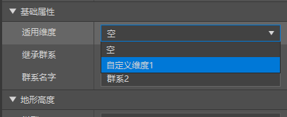
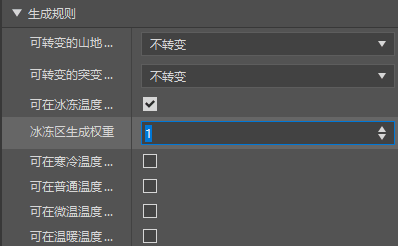

# 改变维度的生物群系

**生物群系**（**Biome**）是一个维度中用于控制地形地貌、生物植被、大气环境、遗迹结构等各种地理要素的区域。一个维度中往往有多种生物群系，一种生物群系又可以转化为多种子生物群系，这使得维度的环境变得十分丰富。

在本节中，我们一起来学习如何自定义生物群系。

## 创建生物群系

在国际版提供的功能中，我们可以开启实验性玩法来修改原版的生物群系或在主世界中自定义新的生物群系，但是，这个功能十分不稳定，而且需要实验性玩法的支持。网易的开发组在国际版生物群系接口的基础上开发了中国版的自定义生物群系系统，并且在实现上与国际版的稍有不同。目前而言，中国版的自定义生物群系是与维度绑定的。每种维度，包括原版维度和自定义维度，都必须有自己独立的一套生物群系，并且互不影响，而每套生物群系都必须只能通过修改原版的生物群系来实现。换句话说，我们目前无法在中国版的自定义生物群系中如国际版的生物群系那样增加一个完完全全崭新的生物群系，所以的生物群系都必须继承并覆盖一个原版的生物群系，而且每个原版的生物群系只能被一个新的群系继承并覆盖。说得更直白一些，中国版的一个新的自定义维度会默认复制并使用一套原版主世界的生物群系，而我们能做的就是在这套与主世界相同的生物群系的基础上修改他们的各种属性，包括各地形层方块、生成噪声参数、气候和温湿度等属性，以将其修改成为一个个看似是新生物群系的生物群系。

针对每种维度，我们都有两种方式创建它的一个生物群系。

### 使用脚本批量生成一个维度的生物群系

上面我们了解到，我们能且只能在原版生物群系种类的基础上修改生物群系的各种属性。但是，这一过程要如何进行呢？对于每个维度而言，可以修改的生物群系的所有标识符事实上已经固定了，那就是与所有原版生物群系对应的带有`dm<dimension id>_`前缀的生物群系。比如，继承了`desert`生物群系的在数字ID为1688560817的维度中的生物群系的标识符就是`dm1688560817_desert`。虽然我们也可以手动对应于每个维度建立我们需要的所有生物群系，但是那将耗费大量的工作。我们有一个可以使用脚本快速生成某个维度所有生物群系的方法。

我们找到演示示例包中的CustomBiomesMod模组，在行为包下可以发现`tools`文件夹。这个文件夹是我们用于批量生成生物群系的脚本。我们在这个文件夹下可以找到`remake.py`。我们执行该文件来自动生成一个特定维度ID的生物群系副本。比如，我们为ID为1688560817维度生成一套生物群系。

```shell
python .\remake.py dm1688560817
```

通过执行该命令即可生成一套该维度的生物群系，生物群系文件将自动被命名为`dm1688560817_`前缀，生物群系标识符也将被命名为`dm1688560817_`前缀，同时会为生物群系加上`dm1688560817`的标签。

### 使用编辑器创建生物群系


我们在配置中选择“**生物群系**”，来创建一个新的生物群系。


我们目前在新建文件向导中只能创建空的生物群系，这没关系，我们之后可以将生物群系绑定到维度上。


我们可以看到，我们在生物群系中可以修改多种属性。此时我们可以查看新创建的文件的JSON内容：

```json
{
    "format_version": "1.14.0",
    "minecraft:biome": {
        "description": {
            "identifier": "dm_desert",
            "inherits": "desert"
        },
        "components": {
            "minecraft:overworld_generation_rules": {
                "generate_for_climates": [
                    [
                        "frozen",
                        0
                    ],
                    [
                        "cold",
                        0
                    ],
                    [
                        "medium",
                        0
                    ],
                    [
                        "lukewarm",
                        0
                    ],
                    [
                        "warm",
                        0
                    ]
                ],
                "hills_transformation": "dm_desert",
                "mutate_transformation": "dm_desert"
            },
            "minecraft:overworld_height": {
                "noise_type": "default"
            },
            "minecraft:surface_parameters": {
                "foundation_material": "minecraft:iron_block",
                "mid_material": "minecraft:gold_block",
                "sea_floor_depth": 7,
                "sea_floor_material": "minecraft:emerald_block",
                "sea_material": "minecraft:water",
                "top_material": "minecraft:diamond_block"
            },
            "dm": {}
        }
    }
}
```

此时，我们的群系并没有绑定特定的维度，所有的`dm<dimension id>_`前缀都以`dm_`的形式出现。我们在编辑器中选择我们的维度绑定。



我们在“**基础属性**”的“**适用维度**”选择我们需要绑定的维度。然后编辑器便会自动修改我们的维度文件，同时创建一个如同我们用脚本方法创建出一样的一套原版维度。


这套维度会随着我们自定义的生物群系的绑定与否自动增删，其对应的那个生物群系文件也会随着我们使用编辑器对外面根目录的这个文件的更改而同步更改。我们来看看此时的JSON文件内容：

```json
{
  "format_version": "1.14.0",
  "minecraft:biome": {
    "description": {
      "identifier": "dm1688560817_desert",
      "inherits": "desert"
    },
    "components": {
      "minecraft:overworld_generation_rules": {
        "generate_for_climates": [
          [
            "frozen",
            0
          ],
          [
            "cold",
            0
          ],
          [
            "medium",
            0
          ],
          [
            "lukewarm",
            0
          ],
          [
            "warm",
            0
          ]
        ],
        "hills_transformation": "dm1688560817_desert",
        "mutate_transformation": "dm1688560817_desert"
      },
      "minecraft:overworld_height": {
        "noise_type": "default"
      },
      "minecraft:surface_parameters": {
        "foundation_material": "minecraft:iron_block",
        "mid_material": "minecraft:gold_block",
        "sea_floor_depth": 7,
        "sea_floor_material": "minecraft:emerald_block",
        "sea_material": "minecraft:water",
        "top_material": "minecraft:diamond_block"
      },
      "dm1688560817": {}
    }
  }
}
```

此时，我们的生物群系文件便完成创建了，之后，我们只需要在编辑器中或者手动修改JSON文件的内容便可以做到自定义生物群系的属性。

## 修改生物群系属性

通过联合分析编辑器中的“属性”窗格和生物群系的JSON文件，我们来一起学习生物群系的写法。我们可以看到，生物群系目前使用的是`1.14.0`的格式版本，`minecraft:biome`的模式标识符。事实上，我们也可以使用旧版的`1.12.0`或`1.13.0`格式版本，但是由于版本迭代，这些格式版本的语法已经与`1.14.0`较为不同，我们不推荐使用，同时在这里也不进行介绍与学习。

### 行为包组件


“**地形高度**”属性对应的是`minecraft:overworld_height`组件，用于在主世界中修改噪声地形的高度补偿，我们可以通过修改噪声预设的值和噪声的参数来修改噪声地形的高度效果。由于我们的自定义维度是继承的主世界生物群系，因此我们可以使用该组件来控制生物群系的平均高度即高度分布。


“**地表**”对应的是`minecraft:surface_parameters`组件，用于指定海底深度和地表各地形层的**物质**（**Material**）参数。“水底方块”即`sea_floor_material`字段，用于指定**海底物质**（**Sea Floor Material**）；“水体方块”即`sea_material`字段，用于指定**海体物质**（**Sea Material**）；“浅表方块”即`top_material`字段，用于指定**顶层物质**（**Top Material**）；“中层方块”即`mid_material`字段，用于指定**中层物质**（**Middle Material**）；“深层方块”即`foundation_material`字段，用于指定**地基物质**（**Foundation Material**）。




“生成规则”对应的是`minecraft:overworld_generation_rules`组件。该组件用于定义主世界生物群系的**生成规则**（**Generation Rule**），不过，和之前所说的一样，该组件也可以在中国版的自定义维度中使用，以模仿主世界的生成规则。生成规则分为两部分，分别是**转化**（**Transformation**）规则和针对**气候**（**Climate**）的生成规则。转化是一种增加生物群系多样性的操作。我们在定义生物群系时，往往倾向于同时定义一组同类型的生物群系，其中只有一个生物群系会定义`generate_for_climates`字段，也就是针对气候的生成规则，被称为**基生物群系**（**Base Biome**）。而其他的生物群系都会根据转化规则在生成基生物群系后通过生物群系的转化得到。我们将某个基生物群系和其转化得到的生物群系统称为一个**群丛**（**Association**）。目前，我们可以定义多种转化，分别是**丘陵转化**（**Hills Transformation**）、**突变转化**（**Mutate Transformation**）、**河流转化**（**River Transformation**）和**海岸转化**（**Shore Transformation**），我们可以在编辑器中选择或者直接在JSON文件中输入对应的转化后的生物群系作为字段的值即可。比如，原版丛林的基生物群系只生成在中性气候，权重为1（只有一个的时候这意味着100%），并且会转化成丛林丘陵和丛林变种，它的JSON组件是这么写的：

```json
"minecraft:overworld_generation_rules": {
  "hills_transformation": "jungle_hills",
  "mutate_transformation": "jungle_mutated",
  "generate_for_climates": [
    [ "medium", 1 ]
  ]
}
```

丛林山丘和丛林变种不会进行其他转化，也不会作为基生物群系生成，因此不具备`minecraft:overworld_generation_rules`组件。事实上，丛林生物群系还可能硬编码地转化为丛林边缘或竹林。丛林边缘不会作为基生物群系生成，但是会转化为丛林边缘变种，它的JSON组件内容为：

```json
"minecraft:overworld_generation_rules": {
  "mutate_transformation": "jungle_edge_mutated"
}
```

竹林也不会作为基生物群系生成，但是会转化为竹林丘陵，它的JSON组件内容为：

```json
"minecraft:overworld_generation_rules": {
  "hills_transformation": "bamboo_jungle_hills"
}
```

丛林边缘变种和竹林丘陵不会再转化为其他生物群系。河流生物群系虽然可以通过JSON组件控制，但是依旧存在硬编码部分，那就是如果不指定河流转化的生物群系，则`river`生物群系会自动作为河流转换的生物群系。上述所有群系都存在一个默认的`river`河流转化。这便是整个丛林群丛的生成转化链。

除了编辑器中可以调整的参数外，我们还有许多可以自行在JSON文件中手动写入的组件，比如`minecraft:climate`组件用于指定该生物群系各气候参数的值，比如温度、降雨量、积雪量等。`minecraft:forced_features`用于生成**强制型特征**（**Forced Feature**，又译**强制型地物**）。`minecraft:ignore_automatic_features`用于忽略**自动型特征**（**Automatic Feature**，又译**自动型地物**，即非强制型特征）的生成，只生成上一个组件中指定的强制型特征。强制型特征又称**显式特征**（**Explicit Feature**，又译**显式地物**），自动型特征又称**隐式特征**（**Implicit Feature**，又译**隐式地物**）。另外，还有`minecraft:surface_material_adjustments`组件用于精细地调整地表物质，`minecraft:legacy_world_generation_rules`组件用于指定旧版的有限世界生成规则等。这些组件，包括旧格式版本的组件，都可以在[bedrock.dev上托管的生物群系文档](https://bedrock.dev/zh/b/Biomes)上找到更详细的用法。

除了这些组件之外， 中国版还存在一些独占的组件，比如`netease:no_spawn_end_dragon`用于在自定义末地的生物群系中取消生成末影龙及其相关逻辑。而且需要注意的是，如果在生物群系绑定的维度中启用了生物群系源，即`netease:biome_source`组件，则其下的生物群系均不再使用国际版原版的生物群系生成规则来生成，即生物群系的`minecraft:overworld_generation_rules`组件将失效，我们上述说明的生成过程也将无效，一切将按照维度中`netease:biome_source`组件所定义的规则进行生成。

### 生物群系标签

在生物群系的行为包定义文件中，我们除了行为包组件之外还可以定义生物群系**标签**（**Tag**）。生物群系标签是用于标记生物群系的一种功能，可以在Molang中使用`query.has_biome_tag`查询得到。我们通过在`minecraft:biome/components`对象中直接定义一个空对象的方式来定义一个标签，空对象的值就是标签的值。

比如，上述示例中，编辑器便自动为我们通过配置自定义的新生物群系添加了`dm1688560817`标签，供我们之后使用。具体代码如下

```json
{
  "format_version": "1.14.0",
  "minecraft:biome": {
    "description": {
      "identifier": "dm1688560817_desert",
      "inherits": "desert"
    },
    "components": {
      // ...
      "dm1688560817": {}
    }
  }
}
```

我们可以为一个生物群系添加多个标签，比如原版的丛林生物群系便添加了`animal`、`jungle`、`monster`、`overworld`和`rare`标签。这些标签和特征、实体的生成规则以及一些硬编码内容相配合可以做到允许动物生成、允许丛林神庙生成、允许怪物生成、允许在无限世界的主世界和有限世界中生成和作为中性气候下的稀有群系生成。

至此，我们便完成了一个生物群系的定义。开发者们可以根据自己的意愿改造更多的生物群系了！