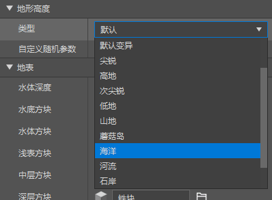
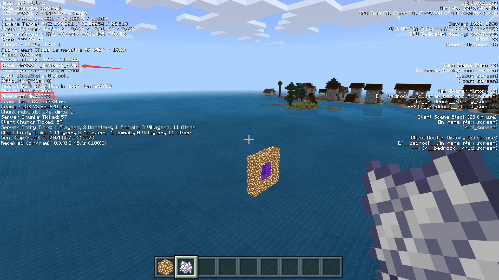

# 挑战：海洋世界

在本节中，我们一起制作一个海洋世界。海洋世界，顾名思义就是几乎全是海的世界。为了制作出这样的世界，我们有两种方案。第一种方案是将除了海洋之外其他的基生物群系的针对气候的生成规则全部关闭，即权重设为0；第二种是将所有的陆地生物群系高度都调整成与海洋一致的高度，依旧可以制作出海洋世界。我们下面演示第二种操作模式。

## 修改陆地群系高度



如果我们的生物群系是从编辑器中建立的，我们可以调整“地形高度”中的“类型”，并将其设置为“海洋”。这等价于在JSON的`minecraft:overworld_height`组件中将`noise_type`字段设置为`ocean`。

当然，除了编辑器中配置的生物群系之外，我们还有其他的默认生物群系。我们使用文本编辑器将它们全部修改成或者添加上如下的组件：

```json
"minecraft:overworld_height": {
 "noise_type": "ocean"
}
```

这样，所有的生物群系在噪声生成地形时就会像原版海洋那样生成低于海平面高度的地形。这样，我们的海洋世界就完成了。



我们进入游戏自测，可以看到除了村庄等硬编码生成在水面的特征（又译地物）以外，所有的方块都没入了水面以下。这说明我们的自定义海洋世界成功了！
