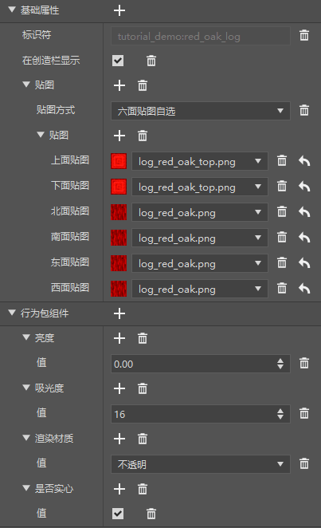
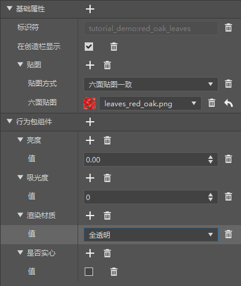
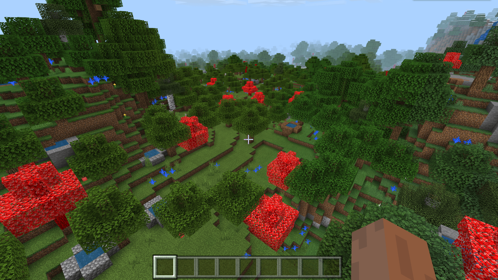

# 了解树特征规则

最后，我们来到了树特征。我们仿照原版的橡树，制作一个红色的橡树特征并将其放置在世界中。

## 使用编辑器配置自定义树桩方块



我们准备好红色橡木原木的纹理资源，在编辑器中创建，并将其设置为固体不透明。

## 使用编辑器配置自定义树叶方块



同样，我们准备好红色橡木树叶的纹理资源，在编辑器中创建，并将其设置为非实体透明。

## 使用树木特征设计自定义树木

我们手动创建`red_oak_tree_feature.json`文件，并仿照原版的`minecraft:oak_tree_feature`书写如下：

```json
{
  "format_version": "1.13.0",
  "minecraft:tree_feature": {
    "description": {
      "identifier": "tutorial_demo:red_oak_tree_feature"
    },
    "trunk": {
      "trunk_height": {
        "range_min": 4,
        "range_max": 7
      },
      "trunk_block": "tutorial_demo:red_oak_log"
    },
    "canopy": {
      "canopy_offset": {
        "min": -3,
        "max": 0
      },
      "variation_chance": [
        {
          "numerator": 1,
          "denominator": 2
        },
        {
          "numerator": 1,
          "denominator": 2
        },
        {
          "numerator": 1,
          "denominator": 2
        },
        {
          "numerator": 1,
          "denominator": 1
        }
      ],
      "leaf_block": "tutorial_demo:red_oak_leaves"
    },
    "base_block": [
      "minecraft:dirt",
      {
        "name": "minecraft:dirt",
        "states": {
          "dirt_type": "coarse"
        }
      }
    ],
    "may_grow_on": [
      "minecraft:dirt",
      "minecraft:grass",
      "minecraft:podzol",
      "minecraft:dirt_with_roots",
      "minecraft:moss_block",
      {
        "name": "minecraft:dirt",
        "states": {
          "dirt_type": "coarse"
        }
      },
      {
        "name": "minecraft:farmland",
        "states": {
          "moisturized_amount": 0
        }
      },
      {
        "name": "minecraft:farmland",
        "states": {
          "moisturized_amount": 1
        }
      },
      {
        "name": "minecraft:farmland",
        "states": {
          "moisturized_amount": 2
        }
      },
      {
        "name": "minecraft:farmland",
        "states": {
          "moisturized_amount": 3
        }
      },
      {
        "name": "minecraft:farmland",
        "states": {
          "moisturized_amount": 4
        }
      },
      {
        "name": "minecraft:farmland",
        "states": {
          "moisturized_amount": 5
        }
      },
      {
        "name": "minecraft:farmland",
        "states": {
          "moisturized_amount": 6
        }
      },
      {
        "name": "minecraft:farmland",
        "states": {
          "moisturized_amount": 7
        }
      }
    ],
    "may_replace": [
      "minecraft:air",
      {
        "name": "minecraft:leaves",
        "states": {
          "old_leaf_type": "oak"
        }
      },
      {
        "name": "minecraft:leaves",
        "states": {
          "old_leaf_type": "spruce"
        }
      },
      {
        "name": "minecraft:leaves",
        "states": {
          "old_leaf_type": "birch"
        }
      },
      {
        "name": "minecraft:leaves",
        "states": {
          "old_leaf_type": "jungle"
        }
      },
      {
        "name": "minecraft:leaves2",
        "states": {
          "new_leaf_type": "acacia"
        }
      },
      {
        "name": "minecraft:leaves2",
        "states": {
          "new_leaf_type": "dark_oak"
        }
      },
	  "tutorial_demo:red_oak_leaves"
    ],
    "may_grow_through": [
      "minecraft:dirt",
      "minecraft:grass",
      {
        "name": "minecraft:dirt",
        "states": {
          "dirt_type": "coarse"
        }
      }
    ]
  }
}
```

这意味着我们的树会以`tutorial_demo:red_oak_log`为树干，以`tutorial_demo:red_oak_leaves`为树叶，同时要求脚下必须为土或砂土，树叶生成时能够替换其他类型的树叶的位置，且树干可以在土、草或砂土上生成。

树特征会在成功生成树时判定成功，其余情况判定失败。

## 连接特征规则

我们新建一个`overworld_red_oak_tree_feature.json`文件，内容如下：

```json
{
  "format_version": "1.13.0",
  "minecraft:feature_rules": {
    "description": {
      "identifier": "tutorial_demo:overworld_red_oak_tree_feature",
      "places_feature": "tutorial_demo:red_oak_tree_feature"
    },
    "conditions": {
      "placement_pass": "surface_pass",
      "minecraft:biome_filter": [
        {
          "any_of": [
            {
              "test": "has_biome_tag",
              "operator": "==",
              "value": "overworld"
            },
            {
              "test": "has_biome_tag",
              "operator": "==",
              "value": "overworld_generation"
            }
          ]
        }
      ]
    },
    "distribution": {
      "iterations": 1,
      "x": {
        "distribution": "uniform",
        "extent": [ 0, 16 ]
      },
      "y": "query.heightmap(variable.worldx, variable.worldz)",
      "z": {
        "distribution": "uniform",
        "extent": [ 0, 16 ]
      }
    }
  }
}
```



进入游戏，可以看到正如我们期望的那样，每个区块平均生成了一个树特征！