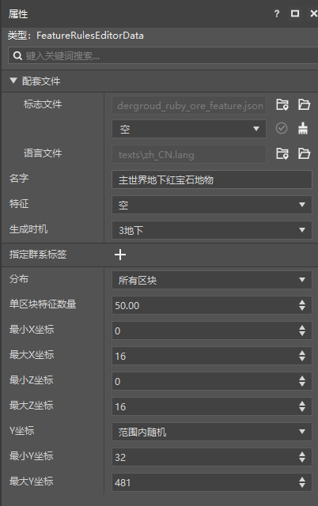

# 了解自定义矿石特征规则

矿石特征往往用来生成一种矿物的矿石或者类似于矿石那样成矿脉状生成的方块。在本节中，我们一起配置一个红宝石矿石的矿脉特征。

## 使用编辑器配置自定义红宝石方块


我们通过Photoshop等图片编辑器准备一个红宝石矿石方块纹理贴图。比如，我们可以使用修改绿宝石矿石纹理的色相来获取一个红宝石矿石纹理。


我们通过编辑器新建一个方块，并为其赋予我们的纹理。我们使用这个方块`tutorial_demo:ruby_ore`作为我们生成红宝石矿脉的基本方块。

## 设置红宝石矿石特征

我们在行为包的`netease_features`文件夹中新建一个JSON文件，并写入如下内容

```json
{
  "format_version": "1.13.0",
  "minecraft:ore_feature": {
    "description": {
      "identifier": "tutorial_demo:ruby_ore_feature"
    },
    "count": 8,
    "replace_rules": [
      {
        "places_block": "tutorial_demo:ruby_ore",
        "may_replace": [
          "minecraft:stone"
        ]
      }
    ]
  }
}
```

我们将该文件命名为`ruby_ore_feature.json`。注意，特征和特征规则文件的文件名必须和其本身不带有命名空间的标识符匹配。比如我们这里的赋命名空间标识符为`tutorial_demo:ruby_ore_feature`，那么我们的文件名就必须为`ruby_ore_feature`，否则特征可能会加载失败。

我们将`places_block`设置成我们需要放置的方块`tutorial_demo:ruby_ore`，并设置其可以替换方块为原版的石头`minecraft:stone`。这意味着该特征在放置时会**输入位置**处按照矿脉逻辑生成一个矿脉状的替换区域，并将替换区域中的石头替换成我们的红宝石矿石方块。

每个特征都存在一个**输入位置**（**Input Position**）和一个**输出位置**（**Output Position**）。我的世界中术语**位置**（**Position**，简称**Pos**）一般指一个三维的或二维的坐标元组，其中世界位置往往是一个浮点数三元组，而方块位置往往是一个整数三元组。特征的输入位置和输出位置都是方块位置，也就是各分量为整数的一组坐标。每个特征都会以其输入位置为起始点开始放置方块，以其输出位置为结束。输出位置往往是一个特征放置最后一个方块的位置。

我们的红宝石矿石特征使用了矿石特征，会在至少有一个矿石方块替换成功时**成功**（**Succeed**），在全部矿石皆放置失败时**失败**（**Fail**）。特征的成功和失败一般不会影响到玩家的游玩层面，但是可能会被一些其他的特征检查以作为放置的判定标准。

## 挂接特征规则

我们在行为包的`netease_feature_rules`文件夹中新建一个`overworld_underground_ruby_ore_feature.json`文件，然后填入如下特征规则即可完成特征到特征规则的挂接。

```json
{
  "format_version": "1.13.0",
  "minecraft:feature_rules": {
    "description": {
      "identifier": "tutorial_demo:overworld_underground_ruby_ore_feature",
      "places_feature": "tutorial_demo:ruby_ore_feature"
    },
    "conditions": {
      "placement_pass": "underground_pass",
      "minecraft:biome_filter": [
        {
          "any_of": [
            {
              "test": "has_biome_tag",
              "operator": "==",
              "value": "overworld"
            },
            {
              "test": "has_biome_tag",
              "operator": "==",
              "value": "overworld_generation"
            }
          ]
        }
      ]
    },
    "distribution": {
      "iterations": 50,
      "coordinate_eval_order": "zyx",
      "x": {
        "distribution": "uniform",
        "extent": [ 0, 16 ]
      },
      "y": {
        "distribution": "gaussian",
        "extent": [ 32, 481 ]
      },
      "z": {
        "distribution": "uniform",
        "extent": [ 0, 16 ]
      }
    }
  }
}

```

`overworld`和`overworld_generation`是主世界生物群系都有的生物群系标签。准确的说，在主世界生物群系中，每个生物群系都会具有`overworld`和`overworld_generation`的其中一个。`overworld`代表主世界地形和旧版世界地形，而`overworld_generation`代表仅主世界的地形生成。



我们还可以在编辑器中制作特征规则。但是当前阶段我们建议不要在编辑器中进行国际版提供的特征类型的挂接，这出于两点考虑，其一是当前编辑器尚不支持国际版提供的特征类型的特征挂接，其二是不仅编辑器不支持这些特征的挂接，并且还会将已经挂接了国际版特征的特征规则中的挂接关系删除。如上图，由于编辑器的打开，我们手动在JSON中进行的挂接被删除了。

但不论怎样，我们的红宝石矿石特征就制作完成了。显然，这是一个隐式特征，我们来进入世界查看效果。


可以看到，红宝石矿石如期生成！