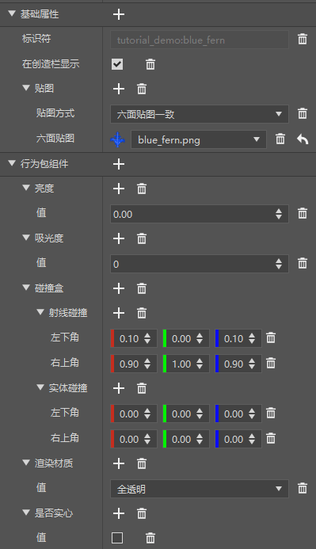
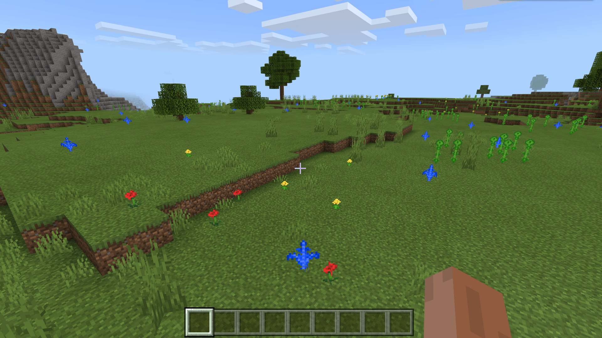

# 了解自定义单方块特征规则

在本节中，我们继续来看另外一种特征，也就是单方块特征的生成。我们制作一个蓝色蕨方块来进行演示。

## 使用编辑器配置蕨类方块



我们在编辑器中配置一个蓝色的蕨。注意，我们需要将其配置为非固体、透明且不吸收光线，同时具备一个裁剪体积却不具备碰撞体积的样子。我们将其标识符设置为`tutorial_demo:blue_fern`。

然后，为了使其具备蕨类的形状，我们需要使用原版的方块形状来做到这一点。我们在资源包的`blocks.json`中手动配置如下：

```json
{
    "format_version": [1, 1, 0],
    "tutorial_demo:blue_fern": {
        "blockshape": "cross_texture",
        "textures": "tutorial_demo:blue_fern"
    }
}
```

这样，我们就成功使用了交叉纹理的方块形状，使其具备了如原版的草和树苗等方块的交叉形状。

## 设置蕨类单方块特征

我们在特征文件夹中新建一个`blue_fern_feature.json`文件，并填充如下：

```json
{
  "format_version": "1.13.0",
  "minecraft:single_block_feature": {
    "description": {
      "identifier": "tutorial_demo:blue_fern_feature"
    },
    "places_block": "tutorial_demo:blue_fern",
    "enforce_survivability_rules": true,
    "enforce_placement_rules": true,
	"may_attach_to": {
      "auto_rotate": false,
      "min_sides_must_attach": 1,
      "bottom": [
        "minecraft:grass",
        "minecraft:dirt"
      ]
    },
    "may_replace": [
      "minecraft:air"
    ]
  }
}
```

我们希望我们的蓝色蕨只能在泥土和草方块上生成，并且只能替换空气，这是因为我们想避免其在空中、水中生成或者直接替换了其他的不该替换的方块比如树干方块，所以我们修改`may_attach_to`和`may_replace`来达到这一效果。

单方块特征的输入和输出位置为同一个坐标，同时如若方块成功放置即可判定成功，方块放置失败即为判定失败。

## 挂接特征规则

我们在特征规则文件夹中建立`overworld_first_blue_fern_feature.json`文件，然后写入：

```json
{
  "format_version": "1.13.0",
  "minecraft:feature_rules": {
    "description": {
      "identifier": "tutorial_demo:overworld_first_blue_fern_feature",
      "places_feature": "tutorial_demo:blue_fern_feature"
    },
    "conditions": {
      "placement_pass": "first_pass",
      "minecraft:biome_filter": [
        {
          "any_of": [
            {
              "test": "has_biome_tag",
              "operator": "==",
              "value": "overworld"
            },
            {
              "test": "has_biome_tag",
              "operator": "==",
              "value": "overworld_generation"
            }
          ]
        }
      ]
    },
    "distribution": {
      "iterations": 1,
      "x": {
        "distribution": "uniform",
        "extent": [ 0, 16 ]
      },
      "y": "query.heightmap(variable.worldx, variable.worldz)",
      "z": {
        "distribution": "uniform",
        "extent": [ 0, 16 ]
      }
    }
  }
}
```

习惯上我们命名特征规则时将生成的位置，比如主世界还是哪些生物群系放在最前面，然后生成的放置阶段放在中间，生成的物体名称放在阶段之后，最后和特征一样使用`feature`结尾。不过，每个开发者也有自己的命名习惯，不必拘泥于原版我的世界的命名习惯。

我们在每个区块中生成一个我们的蓝色蕨方块来试验效果。所以我们将迭代次数`iterations`设为1。



可以看到，我们的蓝色蕨确实如我们希望的那样进行生成了！