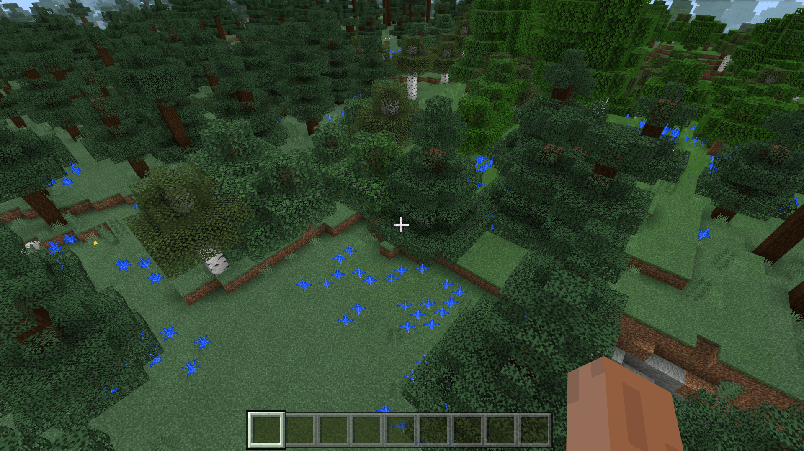

# 了解自定义散植特征规则

我们继续使用上一节的蓝色蕨方块来编写散植特征。我们希望在世界中生成更多的蓝色蕨，使其形成一个簇。

## 设置蕨类散植特征

我们在特征文件夹中建立`blue_fern_cluster_feature.json`文件。

```json
{
  "format_version": "1.13.0",
  "minecraft:scatter_feature": {
    "description": {
      "identifier": "tutorial_demo:blue_fern_cluster_feature"
    },
    "places_feature": "tutorial_demo:blue_fern_feature",
    "iterations": 10,
    "scatter_chance": 50.0,
    "x": {
      "distribution": "uniform",
      "extent": [ 0, 5 ]
    },
    "y": 0,
    "z": {
      "distribution": "uniform",
      "extent": [ 0, 5 ]
    }
  }
}
```

注意，在命名上我们习惯于将均匀分布的植物群体称为一个**簇**（**Cluster**），而高斯分布的植物群系称为一个**斑块**（**Patch**）。当然，对于游戏引擎本身来说，命名或许没那么重要，但是对于可读性而言，一个良好的命名还是必需的。

散植特征在放置时，只要至少一次迭代中的目标特征成功放置就会判定成功，全部迭代的目标特征全部失败就会判定失败。

## 挂接特征规则

我们在特征规则文件夹中新建`overworld_blue_fern_cluster_feature.json`文件。

```json
{
  "format_version": "1.13.0",
  "minecraft:feature_rules": {
    "description": {
      "identifier": "tutorial_demo:overworld_blue_fern_cluster_feature",
      "places_feature": "tutorial_demo:blue_fern_cluster_feature"
    },
    "conditions": {
      "placement_pass": "surface_pass",
      "minecraft:biome_filter": [
        {
          "any_of": [
            {
              "test": "has_biome_tag",
              "operator": "==",
              "value": "overworld"
            },
            {
              "test": "has_biome_tag",
              "operator": "==",
              "value": "overworld_generation"
            }
          ]
        }
      ]
    },
    "distribution": {
      "iterations": 5,
      "x": {
        "distribution": "uniform",
        "extent": [ 0, 16 ]
      },
      "y": "query.heightmap(variable.worldx, variable.worldz)",
      "z": {
        "distribution": "uniform",
        "extent": [ 0, 16 ]
      }
    }
  }
}
```

我们迭代5次，加之以特征本身有50%的概率放置，相当于我们平均在一个区块中放置2.5个蓝色蕨簇。



可以看到，生成符合我们的预期！