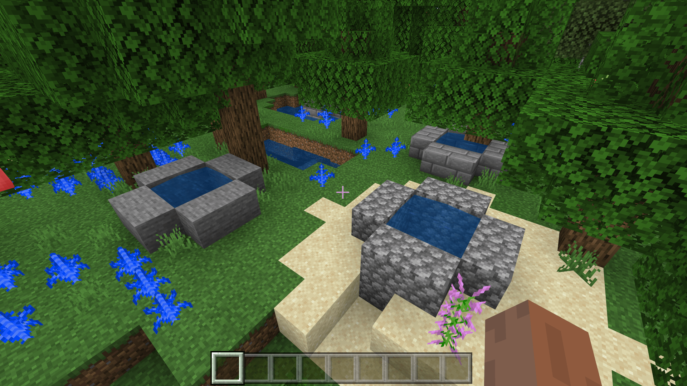

# 了解加权随机特征规则

加权随机特征可以用于按比重生成多种特征。我们使用加权随机特征来生成一些各种样式的水井。

## 使用编辑器导出多种水井结构


我们在地图编辑器中制作多种水井，并将其导出。导出的结构会自动进入行为包的`structures/<namespace>`文件夹中。这里，由于我们在编辑器中设置的命名空间为`tutorial_demo`，我们的结构会放置于`structures/tutorial_demo`文件夹中。

## 使用结构特征配置水井

我们使用中国版的结构特征来制作四种水井的特征。

```json
{
  "format_version": "1.14.0",
  "netease:structure_feature": {
    "description": {
      "identifier": "tutorial_demo:woodwell_structure_feature"
    },
    "places_structure": "tutorial_demo:woodwell"
  }
}
```

```json
{
  "format_version": "1.14.0",
  "netease:structure_feature": {
    "description": {
      "identifier": "tutorial_demo:stonewell_structure_feature"
    },
    "places_structure": "tutorial_demo:stonewell"
  }
}
```

```json
{
  "format_version": "1.14.0",
  "netease:structure_feature": {
    "description": {
      "identifier": "tutorial_demo:cobblestonewell_structure_feature"
    },
    "places_structure": "tutorial_demo:cobblestonewell"
  }
}
```

```json
{
  "format_version": "1.14.0",
  "netease:structure_feature": {
    "description": {
      "identifier": "tutorial_demo:stonebrickswell_structure_feature"
    },
    "places_structure": "tutorial_demo:stonebrickswell"
  }
}
```

由于我们的结构位于`tutorial_demo`文件夹中，因此命名空间是`tutorial_demo`。我们将其挂接到`places_structure`中，即可实现结构特征的制作。

## 使用加权随机特征分配水井权重

我们新建`random_well_feature.json`文件：

```json
{
  "format_version": "1.13.0",
  "minecraft:weighted_random_feature": {
    "description": {
      "identifier": "tutorial_demo:random_well_feature"
    },
    "features": [
      ["tutorial_demo:woodwell_structure_feature", 1],
      ["tutorial_demo:stonewell_structure_feature", 1],
      ["tutorial_demo:cobblestonewell_structure_feature", 1],
      ["tutorial_demo:stonebrickswell_structure_feature", 1]
    ]
  }
}
```

我们将所有水井的权重设置为1，这样每个水井都有$\frac{1}{1+1+1+1}=\frac{1}{4}$的概率生成。当选中的水井成功生成时该特征会判定成功，否则就会判定失败。

## 挂接特征规则

我们创建`overworld_well_structure_feature.json`文件，并写入如下：

```json
{
  "format_version": "1.13.0",
  "minecraft:feature_rules": {
    "description": {
      "identifier": "tutorial_demo:overworld_well_structure_feature",
      "places_feature": "tutorial_demo:random_well_feature"
    },
    "conditions": {
      "placement_pass": "surface_pass",
      "minecraft:biome_filter": [
        {
          "any_of": [
            {
              "test": "has_biome_tag",
              "operator": "==",
              "value": "overworld"
            },
            {
              "test": "has_biome_tag",
              "operator": "==",
              "value": "overworld_generation"
            }
          ]
        }
      ]
    },
    "distribution": {
      "iterations": 1,
      "x": {
        "distribution": "uniform",
        "extent": [
          0,
          16
        ]
      },
      "y": "query.heightmap(variable.worldx, variable.worldz)-3",
      "z": {
        "distribution": "uniform",
        "extent": [
          0,
          16
        ]
      },
      "scatter_chance": 100
    }
  }
}
```


我们可以看到，水井特征如期生成了。



当然，虽然我们的特征规则设置为了每个区块放置一次加权随机特征，但是也是有几率出现这种三联水井的情况的。这代表我们的特征放置非常成功！