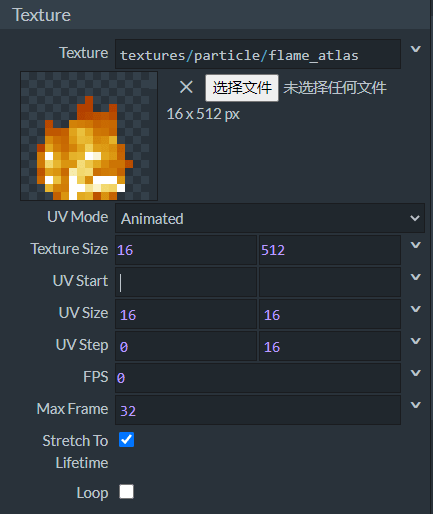
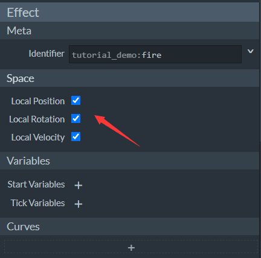
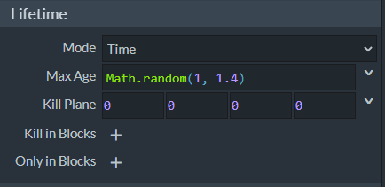
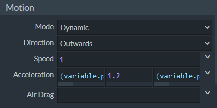

# 开始制作带有翻书动画的粒子

在Snowstorm中，我们不仅可以制作静态纹理的粒子，还可以制作带有**翻书动画**（**Flipbook Animation**）的动态纹理粒子。类似于中国版序列帧动画，翻书动画是国际版支持的一种通过帧变换进行的纹理动画模式，在方块、物品、粒子等功能中都可以得到应用。本节中，我们将一起学习如何制作一个和Snowstorm自带的原版着火粒子预设一样的着火粒子。

## 设置翻书纹理



翻书纹理需要用到一张动态精灵图作为图集，原版的`flame_atlas.png`恰好可以作为我们的图集文件。我们将**UV Mode**（**UV模式**）设置为**Animated**（**动画**），然后可以看到下面多出了一个**UV Step**（**UV步长**），我们将其设置为`flame_atlas.png`中一个精灵的尺寸，即U步长为0，V步长为16。然后我们开启**Stretch To Lifetime**（**拉伸至生命周期**），这意味着整个动画的时间将拉伸到与生命周期相同。正因如此，我们无需设置**FPS**，因为它将自动设置，我们将其保持为0即可。

## 设置局部空间



在顶部的**Space**（**空间**）栏中，我们可以为粒子设置**局部空间**（**Local Space**）属性。“局部”二字其实是形容粒子的**模拟空间**（**Simulation Space**）。我们上一节中讲了，粒子的模拟是指粒子在生成前那一刻或之后的每一帧时计算应该其具备的速度的过程。一般而言，粒子的模拟是相对于世界的，也就是绝对坐标的，因此粒子生成后会相对整个世界运动。然后，有时我们希望粒子是跟随其挂接的实体或者定位器运动，那么就要将模拟空间设置为**局部的**（**Local**）。这里的三个选项分别可以将粒子的位置模拟、旋转模拟和速度模拟分别设置为局部空间。

## 设置其他属性



我们将生命周期通过Molang设置为一个随机数。这样不同的火焰粒子实例将保持不同的燃烧速度。


我们将面向设置为**Look at XYZ**（**看向XYZ**），这意味着粒子的三个轴向将始终面向看向它的实体。



我们将粒子运动方向设置为**Outwards**（**向外**），Y轴初加速度恒定，其余两轴初加速度随机。这样能够制作出一个向外“蔓延”的效果


配置好发射器，将其设为**Dics**（**圆盘**）形状，**Radius**（**半径**）设为1.2米；循环；稳定发射。

因此我们得到了最终的JSON文件：

```json
{
  "format_version": "1.10.0",
  "particle_effect": {
    "description": {
      "identifier": "tutorial_demo:fire",
      "basic_render_parameters": {
        "material": "particles_alpha",
        "texture": "textures/particle/flame_atlas"
      }
    },
    "components": {
      "minecraft:emitter_local_space": {
        "position": true,
        "rotation": true,
        "velocity": true
      },
      "minecraft:emitter_rate_steady": {
        "spawn_rate": 20,
        "max_particles": 1000
      },
      "minecraft:emitter_lifetime_looping": {
        "active_time": 1
      },
      "minecraft:emitter_shape_disc": {
        "offset": [0, 0.4, 0],
        "radius": 1.2,
        "direction": "outwards"
      },
      "minecraft:particle_lifetime_expression": {
        "max_lifetime": "Math.random(1, 1.4)"
      },
      "minecraft:particle_initial_speed": 1,
      "minecraft:particle_motion_dynamic": {
        "linear_acceleration": ["(variable.particle_random_1-0.5)", 1.2, "(variable.particle_random_1-0.5)"]
      },
      "minecraft:particle_appearance_billboard": {
        "size": [0.4, 0.4],
        "facing_camera_mode": "lookat_xyz",
        "uv": {
          "texture_width": 16,
          "texture_height": 512,
          "flipbook": {
            "base_UV": [0, 0],
            "size_UV": [16, 16],
            "step_UV": [0, 16],
            "max_frame": 32,
            "stretch_to_lifetime": true
          }
        }
      }
    }
  }
}
```


我们在Snowstorm的预览窗中将看到最终的效果，非常理想。