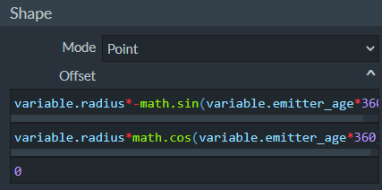
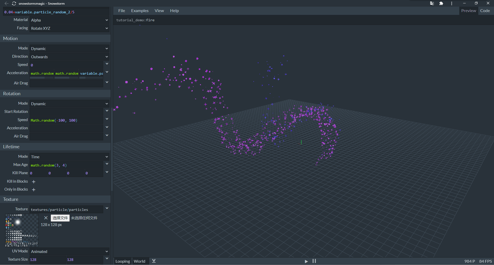
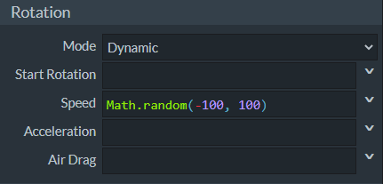

# 使用Molang增加粒子动感

在本节中，我们将通过Snowstorm自带的各种示例来学习如何在粒子中使用Molang。

## 设置变量


我们打开Loading（加载）粒子，来观察如何进行变量设置。


在左侧的**Variables**（**变量**）栏中，我们可以设置两种Molang变量，分别是**Start Variables**（**起始变量**）和**Tick Variables**（**滴答变量**）。起始变量是粒子**初始化**（**Initialize**）时便会设置的变量，只会设置一次。滴答变量是粒子每次跟随游戏滴答主循环进行设置的变量，每游戏刻都会设置一次。

这里，我们设置了两个起始变量`variable.size = 0.08`和`variable.radius = 0.6`。这在JSON中可以写为：

```json
"minecraft:emitter_initialization": {
  "creation_expression": "
    variable.size = 0.08;
    variable.radius = 0.6;
  ",
  "per_update_expression": "" // 没有设置逐更新变量，也就是滴答变量
} // 发射器初始化组件
```

## 动态设置粒子大小

粒子可以通过Molang动态设置大小，我们继续看加载粒子的示例。


这里使用了先前自定义的变量`variable.size`和一个粒子自带的原生变量`variable.particle_age`。事实上，虽然粒子是组件化的，但是粒子并不被认为是ECS框架中的一个*实体*。所以，粒子本身并不具备查询函数，粒子所有的查询函数都来自于其挂接的实体。如果粒子挂接的实体消亡，那么粒子也将无法继续使用实体的查询函数。而粒子本身自带的一些变量值皆通过`variable.`前缀来提供。也就是说，虽然粒子没有查询，但是粒子依旧拥有一些原生变量。这里的`variable.particle_age`就是一个例子，它代表粒子从生成带当前为止的时间。

这段内容通过JSON来表示便为：

```json
"minecraft:particle_appearance_billboard": {
  "size": [
    "variable.size*(1-variable.particle_age)",
    "variable.size*(1-variable.particle_age)"
  ],
  "facing_camera_mode": "rotate_xyz",
  "uv": {
    // 纹理UV的相关信息，于此处无关
  }
},
```

## 动态设置发射器位置

我们可以通过Molang动态设置发射器位置。我们继续看加载粒子。



我们在发射器的Shape（形状）栏中可以看到，这里用了另一个自定义变量`variable.radius`。这是将后面通过`math.sin`和`math.cos`构造的单位圆周运动放缩成我们想要的大小。这个圆周运动是对于粒子发射器来说的，也就是说粒子除了上面所说的外观随着粒子年龄而变小之外，还会因为发射器在做圆周运动而在圆周上周期生成。

```json
"minecraft:emitter_shape_point": {
  "offset": [
    "variable.radius*-math.sin(variable.emitter_age*360)",
    "variable.radius*math.cos(variable.emitter_age*360)",
    0
  ]
},
```

接下来，我们看另一种粒子的情况。我们来看Magic（魔法）粒子。




我们可以看到，相对于加载粒子，魔法粒子的参数更加丰富。这是因为魔法粒子使用了Disc（圆盘）形状的发射器。圆盘在数学上一般指一个二维的圆面，但是我们的粒子是发射在三维空间中的，所以这里的圆盘必须指定一个**法向**（**Normal**），有了法向我们就可以将圆盘放置在垂直于法向的平面上。法向的方向我们可以用**法向量**（**Normal Vector**）来表示。**Plane Normal**（**平面法向**）便是用于指定这个法向量三个轴向分量的属性。

可以看到，魔法粒子除了Offset（偏移）使用了Molang做圆周运动外，还在法向量上使用了相同频率的简谐振动。也就是说，圆盘所在的平面会在做简谐振动的同时做圆周运动，这两个运动的叠加组成了圆盘最终的运动。

## 动态设置粒子自旋

为了和一般的旋转运动（比如上述我们通过圆周运动进行的伪旋转）分开，我们将粒子自身围绕一个轴所做的旋转运动称为**自旋**（**Spin**）。我们继续来看魔法粒子。



我们可以看到，魔法粒子的单体实例在整体运动的同时还会做自旋运动。这里便通过Molang指定了一个随机的自旋初速度。

## 动态设置粒子线性运动

粒子单体除了自旋，也就是做棱角运动且具有角速度之外，还会做线性运动且具有线速度。我们继续来看魔法粒子。


这里我们发现，我们使用了一个`variable.particle_random_3`变量来进行了线性加速度的随机。事实上，`variable.particle_random_3`是粒子自带的一个原生变量，同样的变量还有`variable.particle_random_1`、`variable.particle_random_2`、`variable.particle_random_4`、`variable.emitter_random_1`、`variable.emitter_random_2`、`variable.emitter_random_3`、`variable.emitter_random_4`。他们分别是0至1之间不同的原生随机变量，互不相同，可以直接引用。

```json
"minecraft:particle_motion_dynamic": {
  "linear_acceleration": [
    "math.random(0, 4)",
    "math.random(0, 8)",
    "variable.particle_random_3>0.2 ? -10 : -4"
  ]
}
```

## 动态设置粒子碰撞

粒子的碰撞也可以通过Molang控制，只不过目前Snowstorm还不支持这一功能。事实上，粒子的碰撞，即粒子与世界中地形的碰撞是通过`minecraft:particle_motion_collision`组件来实现的，虽然Snowstorm的粒子中有一个**Collision**（**碰撞**）栏来支持碰撞参数的修改，但是它不支持该组件中唯一支持Molang的`enabled`字段的修改。

```json
"minecraft:particle_motion_collision": {
  "enabled": "/* Molang Expression */"
}
```

通过该字段的Molang控制，可以动态控制一个粒子是否具备碰撞特性。

## 设计粒子颜色渐变


最后，我们来通过Rainbow（彩虹）粒子来学习设置颜色渐变。


彩虹粒子在Color & Light（颜色和光照）栏中将**Color Mode**（**配色模式**）更改为了**Gradient**（**渐变**），并使用了**Interpolant**（**插值**）变量`variable.rainbow`。而可以看到，在最上部的**Curve**（**曲线**）栏中，我们定义了变量`variable.rainbow`的曲线。它使用`variable.particle_random_2`原生变量作为**Input**（**输入**）变量，通过**Catmull-Rom插值**产生了一个曲线，从而产生了预览窗中显示的彩虹效果。

至此，我们基本了解了Molang在粒子中的应用。事实上，在Snowstorm的菜单栏中，我们可以获取到所有粒子的原生Molang变量的信息，以供后续制作参考：


