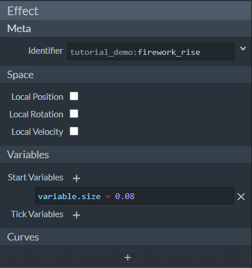
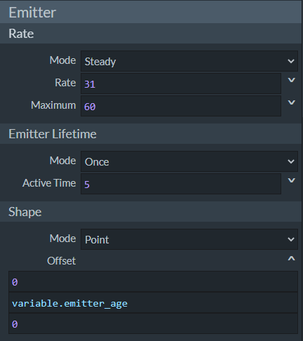
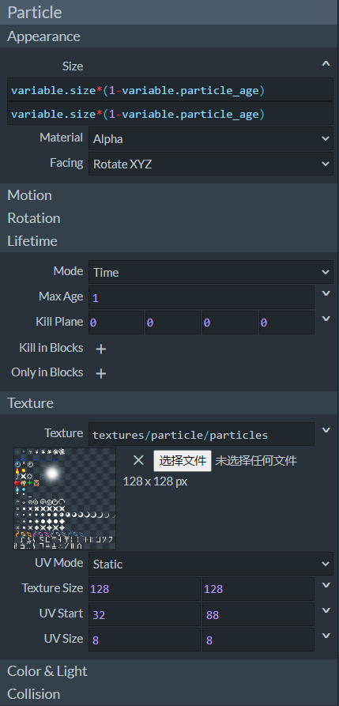
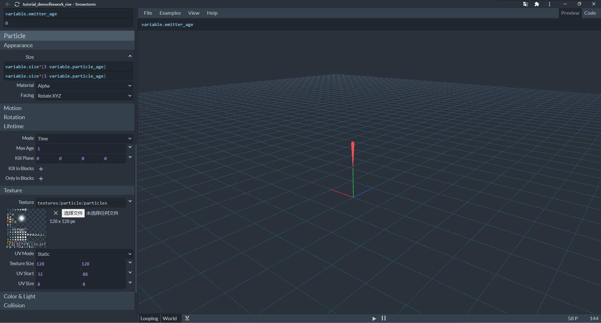
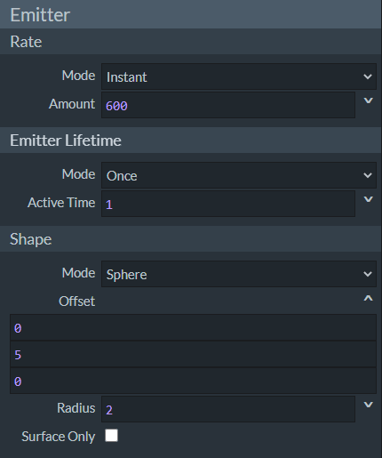
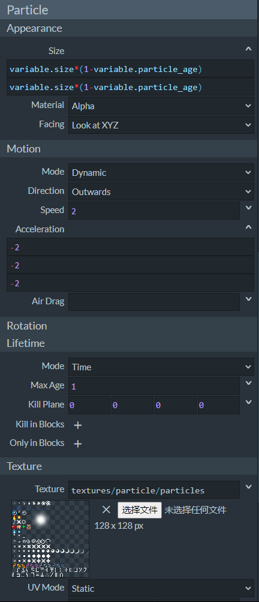
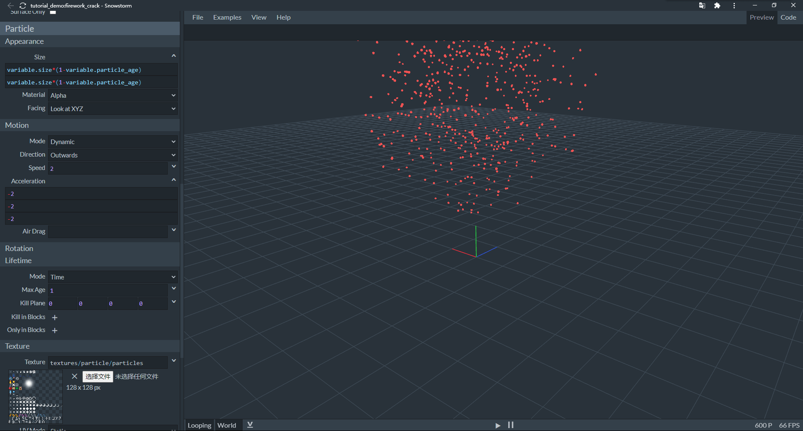

# 挑战：设计一个烟花粒子

在本节中，我们一起来制作一个烟花粒子。根据我们的生活经验，烟花的绽放一般分为升起和炸裂两部分。因此，我们分别制作升起和炸裂粒子，然后通过粒子事件将它们联系在一起。

## 制作升起粒子

我们在Snowstorm中新建一个粒子，命名为`tutorial_demo:firework_rise`。



我们模仿加载粒子，设置一个变量以代表粒子大小。



我们设置为稳定喷射粒子的模式，并将发射器生命周期改为**Once**（**单次**）。毕竟我们不像让烟花升起后“再升起一次”。激活时间设为5秒，同时形状的偏移量的纵向上设置为`variable.emitter_age`。所以我们的烟花会上升5米，速度1米/秒。



我们采用和加载粒子相同的纹理，然后每个粒子的最大年龄设置为1，并采用和加载粒子相同的粒子大小变化方式，即1秒后由大到小完全消失。最后，我们将颜色设置成红色。

因此，我们得到了如下的JSON文件：

```json
{
	"format_version": "1.10.0",
	"particle_effect": {
		"description": {
			"identifier": "tutorial_demo:firework_rise",
			"basic_render_parameters": {
				"material": "particles_alpha",
				"texture": "textures/particle/particles"
			}
		},
		"components": {
			"minecraft:emitter_initialization": {
				"creation_expression": "variable.size = 0.08;"
			},
			"minecraft:emitter_rate_steady": {
				"spawn_rate": 31,
				"max_particles": 60
			},
			"minecraft:emitter_lifetime_once": {
				"active_time": 5
			},
			"minecraft:emitter_shape_point": {
				"offset": [0, "variable.emitter_age", 0]
			},
			"minecraft:particle_lifetime_expression": {
				"max_lifetime": 1
			},
			"minecraft:particle_initial_speed": 0,
			"minecraft:particle_motion_dynamic": {},
			"minecraft:particle_appearance_billboard": {
				"size": ["variable.size*(1-variable.particle_age)", "variable.size*(1-variable.particle_age)"],
				"facing_camera_mode": "rotate_xyz",
				"uv": {
					"texture_width": 128,
					"texture_height": 128,
					"uv": [32, 88],
					"uv_size": [8, 8]
				}
			},
			"minecraft:particle_appearance_tinting": {
				"color": [0.93725, 0.32157, 0.32157, 1]
			}
		}
	}
}
```



## 制作炸裂粒子

我们在Snowstorm中新建第二个粒子，命名为`tutorial_demo:firework_crack`。


同样，我们新建一个`variable.size`变量。



我们希望很多粒子同时在某一点炸开，所以我们设置为Instant（瞬时）模式。同时发射器向上偏移5米，因为这是升起粒子的终点位置。



除了和升起粒子一样的部分外，我们设置粒子的运动模拟。我们将运动方向设置为Outwards（向外），然后加速度三个轴上皆设置为-2。

这样，我们便得到了炸裂的粒子：

```json
{
	"format_version": "1.10.0",
	"particle_effect": {
		"description": {
			"identifier": "tutorial_demo:firework_crack",
			"basic_render_parameters": {
				"material": "particles_alpha",
				"texture": "textures/particle/particles"
			}
		},
		"components": {
			"minecraft:emitter_initialization": {
				"creation_expression": "variable.size = 0.08;"
			},
			"minecraft:emitter_rate_instant": {
				"num_particles": 600
			},
			"minecraft:emitter_lifetime_once": {
				"active_time": 1
			},
			"minecraft:emitter_shape_sphere": {
				"offset": [0, 5, 0],
				"radius": 2,
				"direction": "outwards"
			},
			"minecraft:particle_lifetime_expression": {
				"max_lifetime": 1
			},
			"minecraft:particle_initial_speed": 2,
			"minecraft:particle_motion_dynamic": {
				"linear_acceleration": [-2, -2, -2]
			},
			"minecraft:particle_appearance_billboard": {
				"size": ["variable.size*(1-variable.particle_age)", "variable.size*(1-variable.particle_age)"],
				"facing_camera_mode": "lookat_xyz",
				"uv": {
					"texture_width": 128,
					"texture_height": 128,
					"uv": [32, 88],
					"uv_size": [8, 8]
				}
			},
			"minecraft:particle_appearance_tinting": {
				"color": [0.93725, 0.32157, 0.32157, 1]
			}
		}
	}
}
```



最后，我们将两个粒子拼合在一起。我们通过`minecraft:emitter_lifetime_events`组件来触发执行两个粒子的事件。我们手动创建`firework.particle.json`文件，并写入如下内容：

```json
{
	"format_version": "1.10.0",
	"particle_effect": {
		"description": {
			"identifier": "tutorial_demo:firework",
			"basic_render_parameters": {
				"material": "particles_alpha",
				"texture": "textures/particle/particles"
			}
		},
		"components": {
			"minecraft:emitter_lifetime_events": {
				"creation_event": "rise",
				"timeline": {
					"5.0": "crack"
				}
			},
			"minecraft:emitter_rate_instant": {
				"num_particles": 0
			},
			"minecraft:emitter_lifetime_once": {
				"active_time": 6
			},
			"minecraft:emitter_shape_point": {
				"offset": [0, "variable.emitter_age", 0]
			}
		},
		"events": {
			"rise": {
				"particle_effect": {
					"effect": "tutorial_demo:firework_rise",
					"type": "emitter"
				}
			},
			"crack": {
				"particle_effect": {
					"effect": "tutorial_demo:firework_crack",
					"type": "emitter"
				}
			}
		}
	}
}
```

`basic_render_parameters`是必需存在的字段，不过我们用不到它，填写默认的材质和纹理即可。重点在于`minecraft:emitter_lifetime_events`组件。我们通过`creation_event`在粒子创建时便执行`rise`事件，而`rise`事件用于生成`tutorial_demo:firework_rise`粒子。我们通过`timeline`在5.0s处触发`crack`事件，而`crack`事件则用于生成`tutorial_demo:firework_crack`粒子。这样，我们的烟花粒子就完成了。


我们可以进入游戏通过`/particle`命令来测试效果。可以看到，粒子果然如同我们设想的那样呈现了烟花的形状！