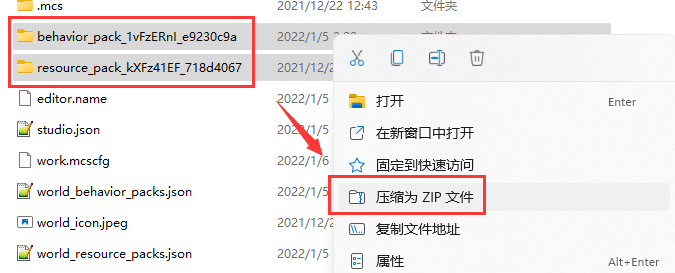

# 认识作品结构与打包

当我们的作品制作完成后，我们便希望将其发布到市场中供玩家们下载。因此我们可能需要了解如何如何才能正确地打包的我们的作品，防止出现上架失败的可能。

## 附加包

在上架过程中，我们的**附加包**（**Add-on**）被称为“**功能玩法**”。这种类型的作品具有最简单的打包方式。

一个典型的附加包一般由一个资源包和一个行为包组成，如下所示：

```json
附加包根目录
├─SomeAddonRes
└─SomeAddonBeh
```

正确的附加包打包方式为直接选中两个文件夹，将其压缩为一个压缩文件即可。



如果我们选择了他们的根目录再进行压缩，将造成打包失败从而无法上架。

## 地图

**地图**也是一种发布作品的方式，往往我们希望我们的附加包配合一张地图使用，因此我们会希望直接发布一张带有附加包的地图。

一个地图往往具备如下格式：

```shell
地图根目录
│  level.dat # 存档文件
│  level.dat_old # 旧版存档文件
│  levelname.txt # 世界名称文件
│  world_behavior_packs.json # 世界加载的行为包文件
│  world_resource_packs.json # 世界加载的资源包文件
│
├─behavior_packs # 存放的所有行为包
├─db # LevelDB文件
└─resource_packs # 存放的所有资源包
```

对于地图文件，我们需要使用地图根目录文件夹直接压缩。


比如，我们的地图根目录文件夹为`9da01770-f464-42e9-8bf4-427433b86c3b`，如图，我们将其直接压缩为压缩文件即可。

如果你在你的地图中发现了`netease_world_behavior_packs.json`和`netease_world_resource_packs.json`，你需要手动将它们的`netease_`前缀删去，并检查这两个文件中的`pack_id`字段是否和资源包和行为包中`header`头中的UUID一致。同时，带有`netease_`前缀的这两个文件通常是没有`type`字段的，你需要手动添加`type`字段并将其值设置为`Addon`。如下所示：

```json
[
	{
		"pack_id" : "eefcf409-a40a-46f7-9a48-3147960a8c39", // 保证改行的值与附加包中UUID相一致
        "type": "Addon", // 增加该行
		"version" : [ 0, 0, 1 ] // 保证该行的值与附加包中版本相一致
	}
]
```

## 纹理包与光影包

**纹理包**与**光影包**往往都只有一个资源包，不适合作为附加包上传。因此，我们需要将其直接压缩为压缩文件上传。比如我们有下图的结构。

```json
SomeRootFolder
└─TexturePack
```

然后我们直接对`TexturePack`右键，并将其压缩为压缩文件即可完成打包。

## 皮肤

基岩版虽然存在皮肤包这一种类的附加包，但是只有国际版目前使用这种类型的包，我们并不适用这种包体。要上传皮肤，请准备好带有透明通道的PNG文件，然后直接上传该文件即可。